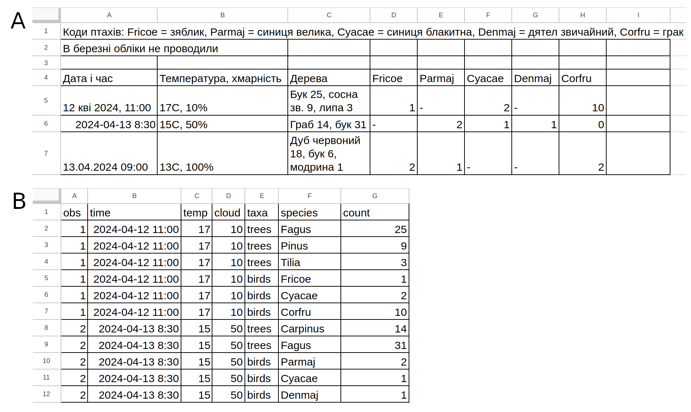
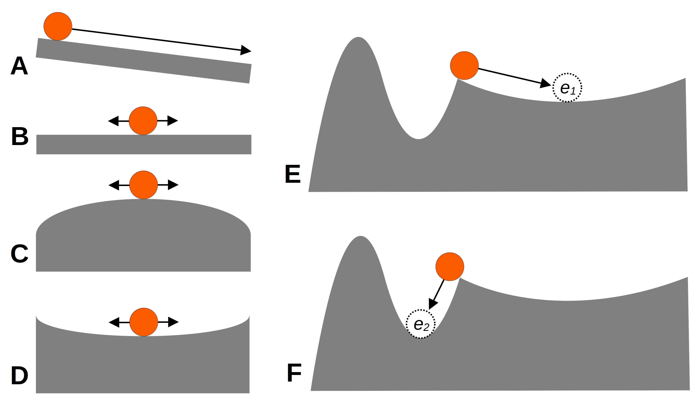
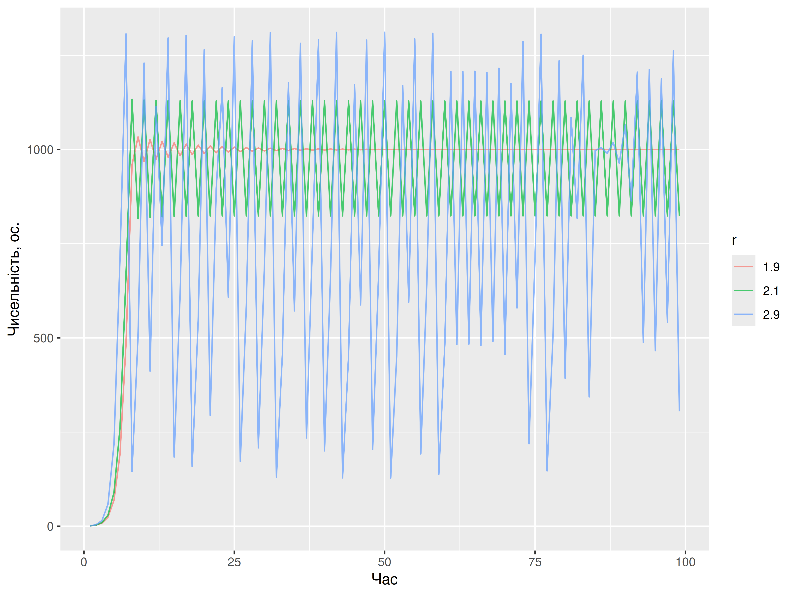
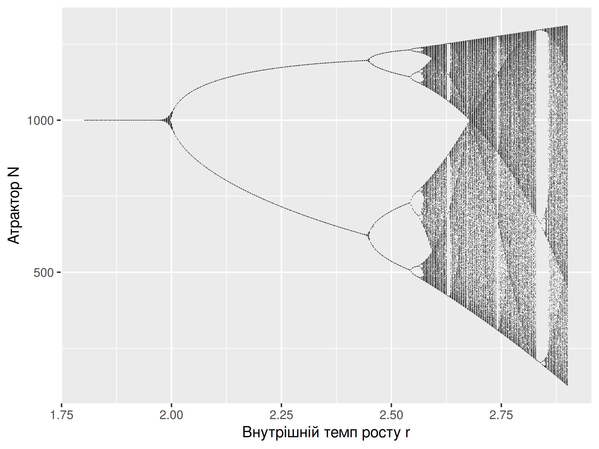
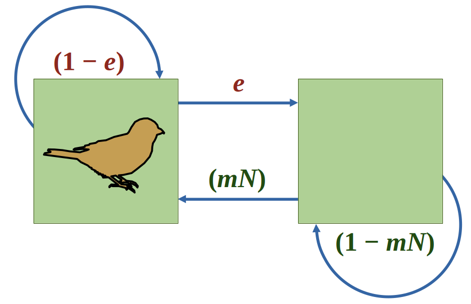
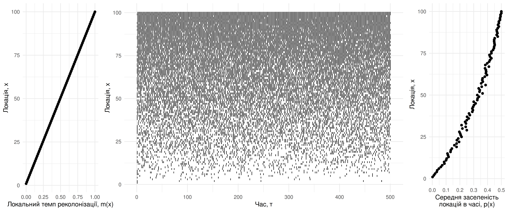
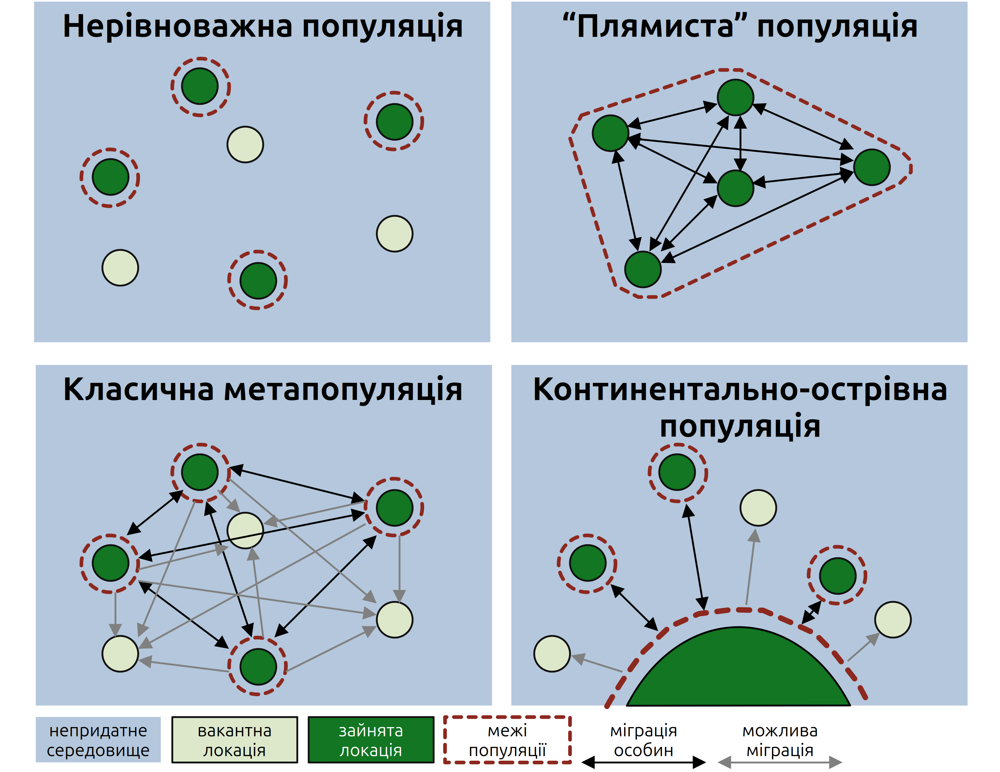

--- 
title: "Вступ до Екології Угруповань"
author: "Олексій Дубовик"
site: bookdown::bookdown_site
output:
  bookdown::gitbook:
    code_folding: hide
    includes:
      in_header: google-verification.html
  pdf_document:
    keep_tex: yes
    latex_engine: xelatex
  html_document:
    code_folding: hide
    includes:
      before_body: google-verification.html
mainfont: Tempora
fontsize: 11pt
documentclass: book
bibliography: [book.bib, packages.bib]
biblio-style: apalike
link-citations: no
github-repo: rstudio/bookdown-demo
description: "Непідручник"
---

```{r setup, include=FALSE}
knitr::opts_chunk$set(echo = T)
library(tidyverse)
library(latex2exp)
library(shape)
library(ggpubr)
library(diagram)
library(caret)
library(emo)
library(ggpubr)
library(ggfortify)
library(corrplot)
library(scales)
library(RColorBrewer)
```

# Вітання{-#intro}

<p style="float: right; width: 35%; margin: 0 0 10px 10px;">
  
</p>

**<span style="color: red;">РОБОТА КИПИТЬ, ТЕКСТ НЕ ГОТОВИЙ ДО ЧИТАННЯ, ПРИХОДЬТЕ ПІЗНІШ</span>**

> `r emo::ji("warning")` **<span style="color: #8B0000;">Відвідуєте цю сторінку вперше?</span>** `r emo::ji("warning")` Будь-ласка, відмітьтесь [***посиланням***](https://forms.gle/9PxbV4Aqzn5kU1wZ7) (4 питання, <1 хв) перед тим як продовжувати читати. Це дуже допоможе розвивати проект із врахуванням аудиторії.

Вітаю на сторінці першого україномовного майже підручника із екології угруповань. "Майже", адже він ніколи не задумувався в якості формального підручника, а радше є довідником із різних тем в сучасних дослідженнях екологічних угруповань. Звідси дещо неформальний стиль та певна недоконаність викладення матеріалу: якщо із наведеного тексту щось залишається незрозумілим, то це є лише натяком на те, що більше інформації доведеться шукати самостійно. Для зручності в тексті для цього часто будуть наведені посилання на передові наукові статті та англомовні відповідники термінів. Загалом, праця націлена на покращення розуміння математичних підходів й статистичного аналізу в екології, базових екологічних концепцій, та тем екології угруповань, як-то таксономічне / функціональне / філогенетичне різноманіття, структура угруповань, подібність угруповань, середовищне фільтрування, рарефакція/екстраполяція тощо.

Зважайте, що цей текст не проходив наукового рецензування. Всі наведені приклади і визначення залишаються на совісті автора, і в тексті ***можуть*** бути помилки. Якщо, на вашу думку, помилки кричущі -- конструктивна критика вітається. Спільними зусиллями цей довідник можна і треба покращувати.

Робота над підручником почалась в лютому 2023 року. Проміжні результати будуть публікуватись час від часу, але це також означає що варто очікувати що якісь розділи порожні (більшість із них, гг).

Текст книги перебуватиме у вільному доступі за посиланням [https://oleksiidubovyk.github.io/com-ecol-ua/](https://oleksiidubovyk.github.io/com-ecol-ua/). Вміст цього посібника охоплюється [ліцензією **CC BY-NC-ND 4.0**](https://creativecommons.org/licenses/by-nc-nd/4.0/deed.en): читачі мають право копіювати та поширювати цю працю, однак вимагається зазначення авторства, використання вмісту обмежене до некомерційного, а видозмінений продукт не може бути поширеним.

[](https://doi.org/10.5281/zenodo.14014872) [](https://github.com/OleksiiDubovyk/com-ecol-ua) [](https://oleksiidubovyk.github.io/)

[{width=100px}](https://creativecommons.org/licenses/by-nc-nd/4.0/deed.en){style="float:right"}


**Build v0.4.7 `r Sys.Date()`**

 <font size="2"> Дизайн обкладинки © Ксенія Мороз, 2025</font>

# Передмова{-#preface}

> "Сонце світить чи не світить --
  ти все одно ритмічно пукаєш."
>
> --- проф., д.б.н. Й.В. Царик із циклу лекцій з Екології і раціонального природокористування

### Трішки про автора{#about-author}

Важко сказати, з чого все почалося. Коли я вступив до біологічного факультету? Мабуть, раніше, адже на момент вступу на бакалаврат я вже був знайомий із викладачами, аспірантами, студентами, і, звісно, польовими дослідженнями. І це все було дуже захопливо, цікаво, і досі гріє мене спогадами (спитайте в зоолога що таке співати пісні коло багаття). В науковому плані ж, вже за декілька років мені почало здаватись що я досягнув стелі -- курси, котрі читались на факультеті, все частіше видавались втратою часу, а на наукові питання, котрі щоразу випливали з моєї роботи, ніхто з колег не міг надати відповіді.

Не зрозумійте мене неправильно -- я люблю свою *alma mater* і визнаю, що завдячую дуже багато в чім своїм керівникам, колегам, й викладачам. Ба навіть, я вважаю, що мені пощастило -- у всякому разі, мій університет є дуже навіть пристойним закладом і рейтинговим університетом, навіть на міжнародному рівні. Корупція? Я не можу стверджувати, що її нема, але особисто я із нею не стикався і якось мені вдалося всі сесії скласти на пристойні оцінки без хабарів. Атмосфера? Мабуть, залежить від факультету й кафедри, але мені студентські роки запам'яталися усвідомленням поваги з боку викладачів та менторів. Політика? Та теж ні. В цілому, критикувати можна що завгодно і за що завгодно (а я люблю критикувати). Але я намагатимусь бути об'єктивним.

В біологічній вищій освіті (та, мабуть, в усіх напрямках) у нас є чимало прогалин, від чого цілком можна очікувати низького рівня наукових досліджень (це не значить, втім, що у нас нема крутих дослідників!). І цілком можливо, що читач, як і я, все більше помічав ці прогалини і починав дивитись за межі вітчизняної освіти.

От і мені довелося дивитись. Точніше навіть не за межі, а за кордон. Я отримав всі ті знання й навички, що я їх міг отримати від моїх вчителів в Україні (за що їм безмежно вдячний), але цього було мало. Тож я вирішив спробувати -- а раптом пощастить -- подати заявку на програму академічних обмінів Фулбрайта. І раптом вийшло. На той час я мав пів року магістратури за плечима і рік роботи на пів ставки в одному з природних заповідників, і всі мої дослідження та спільні проекти вже тоді дали мені змогу опублікувати декілька рецензованих статей і чимало тез конференцій, тож, мабуть, це й справило враження на рецензентів.

Як би то не було, в серпні 2020 року я опинився на американщині аби почати магістерську програму із одним із відомих екологів. Хоча й відомий він як спеціаліст із [поведінкової екології кооперативних дятлів](https://youtu.be/yNjJW49qauY?si=iz2zCsNGr_RwuTLp), кар'єра його включала чималий доробок в теоретичній екології угруповань -- власне, темі, що мене так вабила і досить вабить. Водночас, університет в котрий я потрапив ще й відносно відомий в окремих колах завдяки своїй конкурентній докторантській програмі з екологічних наук. Загалом, я потрапив в рай для зацікавленого в теоретичній екології студента і почав дуже активно поглинати всю цю теорію. На цьому моменті я почав водночас усвідомлювати, наскільки таки трагічна прогалина в екологічній освіті в Україні.

### Навіщо ця робота{#whythiswork}

Мабуть, епіграф до цього вступу здається комічним, дотепним, або навіть непристойним. Як на мене, він є дещо трагічним, адже це одна із небагатьох ідей що я їх запам'ятав із лекцій з екології. Чи я запам'ятав щось із власне екології? Я не впевнений, чи нам взагалі її викладали, хоча курс із такою назвою в бакалаврській програмі був.

Зараз я усвідомлюю, що чимала частина екологічних концепцій в українській науці просто невідомі, рівно як радянські ідеї в біогеоценології / геосоціоекосистемології / консорціології абсолютно ніяк не знаходять жодного відгуку в світовій науці^[...мабуть тому що ці ідеї є ледь не очевидною псевдонауковою маячнею.]. І, як на мене, це значний недолік біологічної освіти, адже вона навіть на рівні магістратури не включає таких тем, які в світі вивчають на першому курсі бакалаврату.

Знову ж, це може звучати жахливо, але і не можна сказати, що все абсолютно безпросвітно. По-перше, мій досвід в Україні був обмеженим однією-двома установами. По-друге, я можу перелічити щонайменше декількох українських екологів, котрі проводять дуже якісні та сучасні наукові дослідження. Але всі ці знання для пересічного студента, зацікавленого екологією, залишаються важкодоступними. Це і надихнуло мене зібрати базові поняття теоретичної екології угруповань в цій роботі українською мовою: якщо ця книга стане джерелом бодай для одного дослідника чи дослідниці, то це вже буде успіхом. Я пригадую, як важко давалось мені знайти інформацію щодо певних тем, які за кордоном видаються цілком очевидними й нескладними.

### Ще трішки про автора{#more-about-author}

А тепер серйозно про мене. Очевидно, про свою скромність я можу говорити годинами.

Якщо говорити про мене як про персону, то тут варто зазначити декілька пунктів. По-перше, я люблю критикувати. По-друге, я тяжію до відволікання на деталі. По-третє, мій стиль письма занудний. Читач, мабуть, почав це вже все підозрювати до цього моменту, тому зараз, шановний читачу, я лишень підтверджу ці підозри.

Щодо наукових питань, то якщо змішати екологію птахів, екологію угруповань, математичні підходи, великі масиви даних, й охорону природи, то ця суміш стане ідеальною приманкою для мене. Я почав свої перші більш-менш самостійні кроки в науці із дослідження угруповань птахів ще до університету, хоча ані я, ані моя перша наукова керівниця не мали певного усталеного розуміння про чим, власне, те угруповання є. В університеті ж я став більш активно взаємодіяти із аспірантами зацікавленими в подібних питаннях. На цьому етапі я познайомився із індексами різноманіття, що в часі співпало із першим навколостатистичним курсом в моїй програмі і стало зрозуміло, що мене неабияк тягне до всіх цих циферок і статистичних тестів.

Невдовзі я почав розглядати, здавалось би, примітивне питання -- чи угруповання птахів на цвинтарях відрізняється від угруповань парків. Сьогодні я розумію, що з наукової точки зору відповідь на це питання має незначну цінність, однак методологія стає доволі цікавою. Тоді я, мабуть, дістав із цим питанням всіх, кого тільки міг -- викладачів, керівника, аспірантів, знайомих орнітологів, і ніхто так і не зміг мені доступно пояснити як ми можемо порівняти розподіли чисельностей видів в угрупованнях. Пізніше, щоправда, виявилось що для того існує ціла група індексів подібностей -- але нам же такого не викладали!

З часом мені запропонували роботу в заповіднику, що означало що ще більше, ніж зазвичай, часу я проводив в полі і збирав все більше даних, котрі треба було аналізувати -- ще би знати як. Як з'ясувалось пізніше, весь аналіз залежить від того, яке наукове питання поставлене і яка гіпотеза^[Гіпотеза є твердженням, котре підлягає тестуванню; в багатьох випадках, наукове питання і наукова гіпотеза майже тотожні, наприклад "чи чисельність виду А збільшується в градієнті урбанізації?" vs. "чисельність виду А вища в урбанізованих середовищах".] тестується - але і цьому нас не надто вчили.

Дослідження різноманіття птахів спровокувало постановку такого питання, яке, в результаті, визначило основну тему моїх магістерських досліджень: якщо в угрупованні існує варіація чисельностей видів, і певні види є рідкісними, то що взагалі таке рідкісність і яка її роль у функціонування екосистем? Адже можна припустити, що ефект рідкісних видів на екосистеми не є значним зважаючи на їх чисельність, відтак, навіщо хвилюватись за такі рідкісні види?

Коли спитати пересічного біолога в Україні як визначити рідкісність видів, то поширеною відповіддю буде "дивись в літературу". Наприклад, типовими є визначення на кшталт "рідкісні види є видами, занесеними до Червоної книги України / Червоного Європейського списку / Червоного списку Міжнародного союзу охорони природи". Спираючись на такі визначення, я виявив що чисельність рідкісних видів є вищою в... ні, не в заповідних зонах, а в місті ([Dubovyk et al. 2020](http://doi.org/10.15407/gb1904)).

Такий результат став доволі контрінтуїтивним, але його можна було й легко пояснити: використане визначення рідкісних видів за природоохоронними статусами не відображає ані чисельності видів^[Пригадайте цибулю ведмежу *Allium ursinum* -- наче червонокнижний вид, але скільки ж його є аби щороку наповнювати прилавки ринків?], ані їх атиповість в угрупованнях.

Отже, метою для мене стало знайти екологічно обґрунтоване визначення рідкісності видів і перевірити, чи дійсно рідкісні види птахів є більш поширеними в містах. І ось на цьому етапі я натрапив на відносно свіжу концептуальну статтю, котра пропонувала поняття функціональної рідкісності: функціонально рідкісними є такі види, котрі мають низьку чисельність і функціонально унікальні характеристики ([Violle et al. 2017](https://doi.org/10.1016/j.tree.2017.02.002)). Це і стало для мене вікном до теми функціональної екології, що на сьогодні є доволі популярною.

В своїй магістерській роботі я (розчарувався і) виявив, що функціонально рідкісні види птахів, здається, тяжіють до міст, що задає набір інших питань, передусім, "чому і як?" Власне, на цьому питанні я, в основному, й спеціалізуюсь сьогодні, і намагаюсь пояснити це через своєрідне середовищне фільтрування градієнтом урбанізації. Багато з цих термінів, втім, можуть видаватись незрозумілими аудиторії в Україні, через що я і вирішив написати цей майже посібник.

# Подяки{-#acknowledge}

Без моєї коханої Аксинії, звісно, писати що завгодно мав би набагато менше бажання, і це ще якщо не згадувати численні "а як би ти переклала це слово..?"

Звісно, наукові керівники протягом мого студентства багато в чому зумовили напрям моїх інтересів і мій професійний розвиток: Мар'яна Сеник (керівник від Малої академії наук) та Ігор Шидловський (керівник протягом бакалаврату та магістратури) із Зоологічного музею Львівського національного університету імені Івана Франка, а також Ерік Волтерс із Університету Старого Домініона (керівник протягом магістратури та аспірантури). До останнього я потрапив за неабиякої допомоги Офісу Програми Фулбрайта в Києві, зокрема, Інни Бариш.

Ганна Кузьо відіграла доволі значну роль як у моєму професійному шляху до того рівня, що я міг уявити написання цілого посібника, так і у власне його написанні включно із нагадуваннями не закидати чернетку і її вичитуванням.

Не можна недооцінити роль Збройних сил України щодо збереження життів багатьох людей, перелічених тут. Поки я мав можливість навчатись за кордоном, чимало моїх одноліток взяли зброю до рук аби зберегти країну, розвитку науки в якій я сподіваюсь посприяти цим посібником.

# Вступ{#introduction}

> "Потенційні джерела помилок в експерименті та шляхи мінімізації їх ефекту:
> (...)
> 7. Демонічні впливи -- вічна пильність, екзорцизм, людські жертвоприношення тощо."
>
> --- [С. Харлберт](https://doi.org/10.2307/1942661)

Екологія -- це наука, присвячена взаємозв'язкам біологічних організмів поміж собою та із середовищем їх існування. На перший погляд, таке визначення може здатись вичерпним та обмеженим, а сама наука -- дуже спеціалізованою дисципліною. Насправді ж, екологія охоплює дуже широкий спектр понять^[Наприклад, щорічна зустріч Екологічного Товариства Америки, або ESA, 2023 року розділена на 6 секцій, що включають 118 тем], щодо кожного із яких опубліковано тисячі рецензованих статей.

Екологія бурхливо розвивається, і на це є вагомі причини. Мабуть, основною мотивацією для розвитку цієї науки є сучасні глобальні проблеми: очевидно, що експоненційне зростання чисельності популяції людей стає причиною цілого набору несподіванок, як-то нестача ресурсів та масове вимирання ([Daily et al. 1994](https://www.jstor.org/stable/27503368)). З утилітарної точки зору, нестача ресурсів для підтримки людської популяції може видатись першочерговою проблемою, втім, можна й стверджувати, шо це лише наслідок.

Існує чималий літературний доробок, котрий свідчить про негативний антропогенний вплив на екосистеми ([McLaughlin and Mineau 1995](htpps://doi.org/10.1016/0167-8809(95)00609-V), [Vörösmarty et al. 2010](https://doi.org/10.1038/nature09440), [McKinney 2002](https://academic.oup.com/bioscience/article/52/10/883-890/354714), [Jenkins 2003](https://doi.org/10.1126/science.1088666)). Звідси нескладно побудувати зв'язок між загрозами для біорізноманіття, як-то забрудненням довкілля, інвазійними видами, змінами землекористування, глобальними змінами клімату, та надмірним споживанням ресурсів ([Mooney et al. 2005](https://www.millenniumassessment.org/)), зменшенням біорізноманіття ([Ceballos and Ehrlich 2002](https://doi.org/10.1126/science.1069349), [Ceballos et al. 2015](https://doi.org/10.1126/sciadv.1400253)), й, відтак, порушеннями у функціонування екосистем ([Galiana et al. 2014](https://doi.org/10.1111/j.1600-0706.2013.00859.x), [Green and Grosholz 2021](https://doi.org/https://doi.org/10.1002/fee.2277)), змінами в надходженні екосистемних послуг ([Ehrlich and Mooney 1983](https://doi.org/10.2307/1309037), [Kremen 2005](https://doi.org/10.1111/j.1461-0248.2005.00751.x)), що і призводить до нестачі ресурсів для людства. Однак, для розуміння механізмів таких взаємозв'язків необхідно спершу опанувати теорію поза ними, як-то що, власне, стоїть за переліченими термінами (біорізноманіття, функціонування екосистем, екосистемні послуги тощо). В більшості своїй, ця теорія й стоїть за узагальненим поняттям екології угруповань.

### Екологічне угруповання{#community-def}

Екологічне угруповання можна визначити як сукупність особин різних видів, котрі заселяють одну й ту ж локацію в певний період часу ([Begon et al. 2006](https://scholar.google.com/scholar_lookup?title=Ecology%3A%20From%20Individuals%20to%20Ecosystems&author=%20&author=%20&author=%20&publication_year=2006&book=Ecology%3A%20From%20Individuals%20to%20Ecosystems)). Таке визначення можна назвати робочим ([Mittelbach and McGill 2019](https://doi.org/10.1093/oso/9780198835851.001.0001)), однак, насправді, воно є доволі нечітким і складним для застосування. Наприклад, за визначенням, ліс є угрупованням, оскільки він містить сукупність рослин, грибів, мікроорганізмів, тварин, котрі існують в одній локації в той же час. Будь-хто із бодай базовим розумінням екології заперечить, що ліс є ближчим до екосистеми. З іншого боку, поняття на кшталт "угруповання птахів" чи "угруповання злакових", відповідно до робочого визначення, є лише особливим випадком угруповання, оскільки обмежує угруповання за таксономічною приналежністю його елементів. З огляду на використання терміну "угруповання", мабуть, доцільно було би визначити **екологічне угруповання** (*ecological community*) як сукупність організмів із певним ступенем подібності екологічних характеристик, котрі взаємодіють між собою та середовищем існування^[Таке визначення не претендує на ранг абсолютної істини, але уможливлює певну пластичність.]. Якщо керуватись цим визначенням, то ***(1)*** *сукупність організмів* передбачає множину біологічних організмів в угрупованні, ***(2)*** *певний ступінь подібності екологічних характеристик* передбачає певну варіабельність екологічних характеристик в угрупованні без необхідності залучення визначення виду^[...що не тільки створило би додаткову необхідність визначення поняття виду, але й залучало би це поняття, котре в сучасних трендах в екології може піддаватись сумнівам.], але й обмежує множину організмів в угрупованні до обґрунтованого таксономічного складу ^[Тобто це поняття не обмежує угруповання до таксономічного класу, типу, чи іншого рангу -- адже екологічна подібність в таксономічних рангах також варіює.], в той час як ***(3)*** *взаємодія між собою та середовищем існування* передбачає, що ці організми існують в певному локалітеті в певний час (що узгоджується із робочим визначенням) та між ними існують обмін енергією чи речовинами.

Історично, існували два певною мірою протилежні погляди на угруповання. З одного боку, ***холістичний підхід*** розглядав угруповання (в першу чергу, рослинні) як суперорганізми котрі розвиваються в сукцесії до стану зрілості, або клімаксичного угруповання ([Clements 1916](https://scholar.google.com/scholar_lookup?title=Plant%20Succession%3A%20Analysis%20of%20the%20Development%20of%20Vegetation&author=%20&publication_year=1916&book=Plant%20Succession%3A%20Analysis%20of%20the%20Development%20of%20Vegetation)).З іншого ж боку, ***індивідуалістичний підхід*** розглядав існування кожного окремого виду в угрупованні як функцію навколишнього середовища ([Gleason 1926](https://doi.org/10.2307/2479933)). Обидва підходи є не надто релевантними сьогодні, адже сучасна наукова думка, як то часто буває, конвергувала до компромісу, в якому визнаються як індивідуальність складових угруповань, так і їх холістична природа.

### Екологія угруповань сьогодні{#comm-ecol-today}

> "Виглядає, що ми не надто просунулись порівняно із 20 роками тому, коли Лоутон дійшов висновку що екологія угруповань -- то безлад"
>
> --- [Мункемюллер та ін.](https://doi.org/10.1111/geb.13098)

Серед усіх сучасних областей біології, саме екологія угруповань є, мабуть, найбільш математичною. Це можна пов'язати із розчаруванням, котре спіткало екологів в другій половині 20 сторіччя. Після цілого ряду фундаментальних відкриттів, котрі надали початок екології угруповань (як-то окреслення біотичних взаємодій, в першу чергу, конкуренції, розвиток поняття екологічної ніші, розвиток теорії еволюції), цілий науковий напрямок зазнав невдачі в генеруванні бодай одної робочої наукової теорії: описані міжвидові взаємодії не надавали правдоподібних передбачень структури угруповань, нульові моделі мали таку ж статистичну силу, як і альтернативні гіпотези, не було окреслено жодного загального правила формування угруповань, і до 1980-х років екологію угруповань визнали мертвою ([Mittelbach and McGill 2019](https://doi.org/10.1093/oso/9780198835851.001.0001)).

Причиною тому є природа екологічних систем, процеси в яких дуже складно передбачити. До прикладу, лабораторний експеримент, скажімо, в фізіології чи хімії, зазвичай, контролює всі змінні окрім змінної, щодо якої ставиться дослід -- відтак, результат досліду чітко дозволяє відкинути чи ні нульову гіпотезу. Натомість, в екологічних системах занадто багато шуму, що значно обмежує адекватне застосування наукового методу. Такі системи з першого погляду можуть здатися стохастичними, хоча й насправді є хаотичними комбінаціями найменших взаємодій^[Якщо читач раптом спробує, скажімо, порахувати кількість синиць в парку, то швидко виявиться, що на результат впливає чимала кількість факторів: наскільки спостерігач ефективно спостерігає за птахами, скільки видів синиць мешкає в парку, яка погода, яка пора дня, яка пора року, чи шумно навколо, чи є листя на деревах, чи вигулюють сьогодні в парку собак, чи часом не насипали корму до годівниці... і навіть якщо читач врахує всі ці фактори у статистичній моделі, то у синиці просто може бути поганий настрій для співання!]. Ці проблеми можуть бути фатальними в дослідженні окремих популяцій, а екологія угруповань має справу із сукупностями популяцій, що вносить цілий окремий рівень складності в побудування робочих моделей.

Зрештою, сьогодні екологія угруповань працює як чорна скринька, що поєднує екологічні процеси із спостережуваними екологічними взаємозв'язками, в той час як наука не здатна надати чіткої відповіді до змісту цієї чорної скриньки ([Vellend and Agrawal 2010](https://doi.org/10.1086/652373)). З одного боку, здаватиметься, що немає змісту в подальшому розвитку цієї дисципліни, адже нездатність продукувати робочі теорії ставитиме екологію угруповань в один ряд із псевдонауками. З іншого ж, є й приводи для стриманого оптимізму, адже ця дисципліна отримала друге дихання із розвитком комп'ютерних систем, обчислювальних здатностей, й статистичних підходів, а необхідність в науковому підході до збереження природи стає все більш і більш гострою. Беззаперечно, це вимоглива дисципліна, для якої часто потрібно не тільки розуміння біологічної природи угруповань, але й математичне бачення цих систем, а в екології щороку з'являється більше питань, аніж відповідей, що, принаймні, значить, що для кожного потенційного науковця існує актуальна проблема.

# Про книгу та Зміст{#about-book}

Перед тим як використовувати цей майже підручник в якості джерела інформації з теоретичної екології угруповань, читачу варто усвідомити декілька моментів щодо цієї книги.

> `r emo::ji("warning")` **<span style="color: #8B0000;">Тригер-ворнінг</span>** `r emo::ji("warning")` Ця праця використовує [оксфордську кому](https://opentalk.org.ua/langstory/zaplutana-koma/). Так, я знаю що проти правил українського правопису, але нічого не можу із собою вдіяти: якщо є перелік об'єктів з множини {a, b, c}, то я позначаю його в реченні як "{a}, {b}, і {c}", а не як "{a}, {b i c}".

> О, а ще в якості десяткового розділювача використовую крапку, а не кому. Таке позначення поширене в західній літературі та програмуванні. Отже, одна десята -- то 0.1.

### Дисклеймер{#readme}

Ця книга не є підручником чи навчальним посібником в класичному сенсі. Всяка навчальна чи наукова література повинна проходити крізь прискіпливий процес рецензування, коли незаангажовані спеціалісти в дисципліні критично переглядають працю на предмет невідповідностям найкращим науковим практикам та наявному об'єму знань з предмету. Читачеві варто розуміти, що книга представлена тут **не** проходила жодного рецензування. Відповідно, до змісту цієї книги варто підходити із обережністю.

Автор є прибічником філософії open-source. Наприклад, за кожного запуску R^[Мова програмування R буде ще одноразово згадано в цій праці.], користувач бачить наступне повідомлення: "R є безкоштовним програмним забезпеченням і надається без АБСОЛЮТНО ЖОДНОЇ ГАРАНТІЇ". Автору хотілося б, аби подібне повідомлення передувало інформації в цій книзі: текст опубліковано у вільному доступі, в обхід загальноприйнятим нормам наукового рецензування, а отже й не варто вважати (чи, ба більше, цитувати) цю працю як джерело наукової чи навчальної літератури.

Крім того, інформація, надана в цій праці, не є здобутком автора в жодному сенсі -- метою є лише поширити й популяризувати популярні сучасні концепції екології угруповань із усіма посиланнями на першоджерела. Всі обговорені тут теми описані таким чином, аби лише надати початкове, орієнтовне розуміння щодо теми. Відтак, для більш поглибленого розуміння рекомендується ознайомитись із наведеними посиланнями.

Нарешті, чимало концепцій вимагають ілюстративного матеріалу. В типових західних підручниках такі ілюстрації часто ґрунтуються на матеріалах раніше опублікованих робіт інших авторів і стилізовані відповідно до підручника, однак, такий підхід вимагає дозволу видавництва, котре опублікувало першоджерело. Звісно, видання тексту у вільному доступі передбачає нестачу (читайте, відсутність) фінансування, відтак, автор не здатен отримати авторські права на ілюстрації. Відтак, всі ілюстрації тут будуть або побудовані максимально концептуально, або ґрунтуватись на опублікованих чи неопублікованих даних самого автора, або на даних симуляцій^[Враховуючи, що ця книга написана в R, мені зараз не хочеться уявляти скільки часу займе компіляція підручника із даними симуляцій.].

### Як побудована ця книга{#how-built}

Наступний розділ нагадає читачеві щодо тих математичних понять, котрі варто пригадати для розуміння матеріалу. Цей розділ не надто обговорює статистичний аналіз, адже статистика в екології -- це тема для окремого підручника, але дещо згадує про ґрунтовні методи оцінки параметрів, котрі використовуються, зокрема, і в статистичному аналізі. Цей розділ варто лише переглянути аби знати, яка інформація є доступною, і мати можливість повернутись до нього кожного разу, коли є така необхідність.

Наступні два розділи є нагадуванням щодо біологічних основ екології угруповань, котрі є дотичними до цієї науки. До цих розділів варто приділити більше уваги, адже чимало концепцій можуть бути новими для читача, хоча вони й і є значною мірою розвинутими протягом історії екології.

Нарешті, останній розділ і є метою цієї книги, що ознайомить читача із основними поняттями екології угруповань.

### Чого чекати від цієї книги{#expect}

Як було згадано вище, ця праця описує основні поняття екології угруповань лише для ознайомлення. Очікується, що цього опису буде достатньо для розуміння факту існування певної концепції та, до певної міри, основних засад чи механізмів. Варто розуміти, що з кожної із згаданих тем можна написати окремий підручник (більше того, в більшості випадків, такі підручники навіть існують), тож читачі повинні мати на увазі, що мета цієї роботи є виключно ознайомчою.

Часто у читача може виникнути відчуття, що певні теми окреслені надмірно деталізовано, в той час як інші лише мінімально згадані. Так, це не просто відчуття, так воно і є. Знову ж, головною метою цієї книги є ознайомити із важливими темами, ця робота задумана як щось на кшталт розширеного конспекту. Певні теми автор міг вважати особливо важливими або просто цікавими, і, відтак, такі теми займають багато місця, в той час як інші теми автору могло бути просто ліньки описувати детально (ну це вже пробачайте). Особливо ця логіка стосується [розділу із математикою](#numerical-ecology).

### Чого ця книга чекає від читача{#expected}

В першу чергу, не боятись математичних підходів. В сучасній екології формулювання на кшталт "я не можу це зрозуміти бо в мене не математичний розум" не є прийнятним. Екологія -- це і є прикладна математика, котра оперує поняттями в чисельному сенсі. На скромну думку автора, ніколи не пізно заповнити прогалини в розумінні математичних підходів^[У самого автора були дуже низькі бали за шкільну алгебру і він ледве склав іспит із основ вищої математики на першому курсі; пізніше довелося наздоганяти онлайн-курсами і брати курси зі статистики й математики на рівні магістратури й аспірантури; я й досі не вважаю, що знаю математику, але цього достатньо для вирішення одного-двох диференційних рівнянь коли дуже треба.].

Як було зазначено вище, вихід із кризи в екологічній науці став можливим лише завдяки розвитку комп'ютерних технологій, котрі дозволяють оперувати значними масивами даних^[...це не про діапазон значень в Excel, а про набори даних в десятки-сотні гігабайт.]. Відповідно, наукова робота в екології неможлива без комп'ютерних підходах. Відтак, ця книга має заохотити читача розвивати свої обчислювальні навички: розуміти основи вищої математики, теорії ймовірності, статистичного аналізу, та програмування. Останнє особливо важливе. Будь-ласка, не вважайте що можна бути екологом і знати лише Excel -- звісно, в цьому ПЗ можна робити багато чого, але не завжди ефективно.

Втім, навіть якщо у читача немає таких навичок, не варто закривати цю книгу одразу -- будь-які навички можна розвинути. Книгу варто закинути в іншому випадку: якщо читач не має бажання ці навички розвивати.

### Додаткові ресурси{#resources}

Якщо читач достатньо добре розуміє англійську, тут є перелік непоганих публікацій у відкритому доступі, що можуть допомогти розвинути навички в обробці даних. Найкращою стратегією було б перечитати всі ці книги, але, звісно, ні в кого на таке нема часу. Як би то не було, варто щонайменше ознайомитись зі змістом цих посібників і мати їх собі на увазі. Автор часто заглядає в ці джерела.

- [R for Fledglings](https://www.uvm.edu/~tdonovan/RforFledglings/) -- огляд мови програмування R з точки зору недосвідченого користувача.

- [Primer of Ecology using R](https://hankstevens.github.io/Primer-of-Ecology/index.html) -- математичні концепції екології із застосуванням R.

- [R for Data Science](https://r4ds.hadley.nz/) -- короткий огляд мови програмування R і поглиблений опис пакету `tidyverse` для маніпулювання даними.

- [Applied Multivariate Statistics in R](https://uw.pressbooks.pub/appliedmultivariatestatistics/) -- лінійна алгебра, аналіз різниці груп значень, багатовимірні тести (ординація тощо), все написано для екологів.

### На що не варто розраховувати{#notexpect}

Хоча тут і є елементи програмування, статистичного аналізу, математичних підходів, всі ці теми мають бути предметом окремих підручників. Основною темою тут є екологія угруповань, тому всі інші будуть згадані побічно.

Те ж стосується загальної екології, в котрій є чимало інших тем окрім екології угруповань. Хоча тут і згадуються фундаментальні поняття екології, всі вони стосуватимуться угруповань, і не є головною тематикою книги.

## Зміст

Тут можна знайти перелік опублікованих розділів. Варто переглянути цей список перед тим як читати цілу книгу, адже раптом в ній немає того, чого ви шукаєте.

- **1** [***Вступ***](#introduction)

  - **1.0.1** [Екологічне угруповання](#community-def)
  
  - **1.0.2** [Екологія угруповань сьогодні](#comm-ecol-today)
  
- **2** [***Про книгу***](#about-book)

**<span style="color: red;">===> Ви знаходитесь тут <===</span>**

- **3** [***Базові математичні підходи в екології***](#numerical-ecology)

  - **3.1** [Математична пам’ятка](#algebra) -- коротко про дроби, математичні символи, нерівності, ступені, ряди чисел, ступені арифметичних операцій, лінійні та поліноміальні функції, логарифми, поширені математичні функції, властивості сум, властивості добутків, диференціювання, інтегрування
    
  - **3.2** [Лінійна алгебра](#matrices) -- коротко про визначення матриці, трансформації матриць, операції над матрицями, детермінант, власні вектори, та власне значення, геометричний зміст матриць
    
  - **3.3** [Ймовірність у статистиці](#stats)
  
    - **3.3.1** [Ймовірність](#prob)
    
    - **3.3.2** [Теорема Баєса](#bayes)
    
    - **3.3.3** [Правдоподібність](#mle)
    
  - **3.4** [Розподіли ймовірності](#pdf-pmf)
  
    - **3.4.1** [Функції розподілу ймовірності](#pdfs) -- тут можна поглянути визначення поширених дискретних, зокрема, нуль-упереджених моделей, та континуальних розподілів
    
    - **3.4.2** [Опис розподілу змінної (описова статистика)](#bars)
    
  - **3.5** [Тестування гіпотез](#basic-hypotheses)
  
    - **3.5.1** [Статистична гіпотеза](#hypothesis)
    
    - **3.5.2** [Нульовий розподіл](#nulldistr)
    
    - **3.5.3** [Тестування гіпотез](#pval) -- помилки першого й другого роду, p-значення
    
    - **3.5.4** [Парадигми статистичного аналізу](#paradigms) -- фреквентизм, Баєсівський аналіз й ланцюги Маркова, пермутаційний підхід
    
  - **3.6** [Експеримент і модель](#stat-models)
  
    - **3.6.1** [Експериментальний дизайн та псевдореплікація](#pseudoreplication)
    
    - **3.6.2** [Дані та проблема моделювання](#regression) -- як оформлювати зручні дані, що таке регресія та класифікація
    
    - **3.6.3** [Парсимонійна модель та вибір моделі](#aic) -- як використовувати АІС
    
    - **3.6.4** [Багатовимірна статистика](#prcomp) -- метод головних компонент, інші методи ординації
    
  - **3.7** [Передбачення, умовивід, та валідація](#infer)
  
    - **3.7.1** [Статистичний умовивід і обґрунтоване передбачення](#inference)
    
    - **3.7.2** [Крос-валідація](#crossval)
    
    - **3.7.3** [Компроміс між упередженням та варіацією](#bias-variance)
    
- **4** [***Початки популяційної екології***](#popeco)

  - **4.1** [Вид](#species) -- нарис розвитку концепції виду, взаємозв'язок між площею та кількістю видів
  
  - **4.2** [Популяція](#population) -- визначення біологічної популяції
  
  - **4.3** [Чинники, що впливають на популяції](#pop-factors) -- огляд процесів в самій популяції та ззовні популяції
  
  - **4.4** [Моделі мічення-відлову](#cmr) -- елементарний підхід до оцінки чисельності популяції
  
  - **4.5** [Внутрішньовидові взаємодії](#intraspecific) -- базові процеси між особинами в популяції
  
  - **4.6** [Динаміка та стабільність](#pop-dynamics) -- чисельність популяції та її зміна в часі; експоненційний та логістичний ріст; рівноважний стан, стабільні періодичні цикли, та хаос
  
  - **4.7** [Метапопуляція](#metapopulation) -- популяція популяцій і вступ до взаємодії із середовищем, динаміки типу джерело-дірка, екологічні пастки, передбачення щодо колапсу популяцій в охороні природи

# Базові математичні підходи в екології{#numerical-ecology}

> "Зазвичай, доволі проблематично пояснити для широкої публіки
  чим займаються статистики."
>
> --- Хоґґ, Танніс, Циммерман, "Ймовірність та Статистичний Умовивід" (9-те видання)

> "Цілком можливо, що жодна зі змінних, котрі ми маємо,
  не вносить нічого значущого до нашого розуміння
  варіації в залежній змінній.
  Нормально, це не те що ви хочете побачити
  під кінець трирічного дослідницького проекту."
>
> "Тест Коломогорова-Смірнова: люди знають його за його відоме ім'я,
  радше ніж за те що він, власне, робить."
> --- М. Кровлі, "Книга R" (1-ше видання)

Цей розділ можна розділити на три основні теми: елементи перед-вишмату (*pre-calculus*, базова математика), лінійна алгебра (теорія матриць), та початки статистики, які виявились настільки об'ємними, що їх довелося розбити на декілька секцій. 

Перед-вишмат є дуже поверхневим нагадуванням щодо основних математичних законів, котрі знаходять застосунок не тільки в екології, а й в повсякденному житті. Цю частину варто вважати швидким довідником, до якого варто звертатись лише якщо є потреба щось пригадати.

Матриці мають широке застосування в статистичному аналізі (певною мірою, будь-який набір даних є матрицею), і читач може отримати певну вигоду від ознайомлення зі специфічною термінологією, котра також застосовується і в класичних методах екології ([наприклад, тут](#Leslie-matrix)).

Нарешті, початки статистичного аналізу, мабуть, є найбільш значущими для розуміння, адже методи екології угруповань часто ґрунтуються на класичних поняттях статистики, як-то нульова гіпотеза, оцінка параметрів, випадкова змінна із певним розподілом, ймовірність. Відповідно, для розуміння екологічної складової варто мати певне уявлення щодо статистичних понять, на котрих екологія базується.

**<span style="color: #8B0000;">Зверніть увагу</span>**, щодо цілого розділу варто ще раз зазначити, що його не варто вважати самодостатнім джерелом інформації зі статистичного аналізу. Найкращим використанням цього розділу буде раз в іноді підглянути сюди коли щось забулось. Розуміння статистичного аналізу вимагає тривалої підготовки, а математичний базис для статистики -- відповідної математичної освіти. Відтак, чимало тем в цьому розділу описані лише поверхнево (екологічній статистиці варто приділити цілий окремий підручник, наприклад, [Gotelli & Ellison "A Primer of Ecological Statistics" (2012)](https://global.oup.com/academic/product/a-primer-of-ecological-statistics-9781605350646?cc=us&lang=en&)), і на всілякі питання читача "а чому так?" найдоцільнішою відповіддю буде "просто повірте на слово". Загальною порадою для цього розділу буде гуглити всі незрозумілі поняття, благо наведені англомовні відповідники.

## Математична пам'ятка{#algebra}

### Дроби

Серед дробів можна виділити наступні закономірності:

$$a+\frac{c}{d} = \frac{ad+c}{d}$$

$$\frac{a}{b}+\frac{c}{d} = \frac{ad+cb}{bd}$$

$$\frac{a}{b} - \frac{c}{d} = \frac{ad-cb}{bd}$$

$$\frac{a}{b} \cdot \frac{c}{d} = \frac{ac}{bd}$$

$$\frac{a/b}{c/d} = \frac{a}{b} \cdot \frac{d}{c}$$

$$\text{якщо } \frac{a}{b} = \frac{c}{d} \text{, то } \frac{a}{b} = \frac{c}{d} = \frac{a+b}{c+d}$$

### Математичні символи

На цьому етапі варто ввести також декілька позначень, які можуть бути маловідомими, наприклад,

- $>, \geq, <, \leq$ : більше, більше або дорівнює, менше, менше або дорівнює;
- $\subset, \not\subset$ : є або не є підмножиною;
- $\in, \notin$ : в або не в;
- $\{x : x > a\}$ : множина таких $x$, що для кожного $x$ в цій множині $x>a$;
- $A^c$ - комплемент до множини $A$, сукупність елементів які не належать до $A$: $\{x: x \notin A\}$;
- $\emptyset$ - порожня множина, в якій нічого нема.
- $(a, b) = \{x:a<x<b\}$,
- $[a, b] = \{x:a \leq x \leq b\}$;
- $\propto$ : пропорційно до;
- $\simeq$ : приблизно дорівнює;
- $\sim$ : подібно до, однак часто позначає змінну, що розподілена відповідно до певного розподілу;
- $\cup$ : об'єднання множин;
- $\cap$ : перетин множин;
- $\exists$ : існує;
- $\Rightarrow$ : відтак;
- $\iff$ : рівнозначно;
- $\forall$ : для всіх;
- $\sum\limits_{i=j}^{n}x_i$ : сума всіх елементів $x_i$ де $i = j, j+1, j+2, \cdots, n-2, n-1, n$;
- $\prod\limits_{i=j}^{n}x_i$ : добуток всіх елементів $x_i$ де $i = j, j+1, j+2, \cdots, n-2, n-1, n$;
- $a!$ є факторіалом, де $a! = 1 \cdot 2 \cdot 3 \cdot \cdots \cdot (a-2) \cdot (a-1) \cdot a$;
- $\binom{a}{b}$ є біноміальним коефіцієнтом, де $\binom{a}{b} = \frac{a!}{b!(a-b)!}$.

### Нерівності

Перелічені символи можна використати для пояснення нерівностей, зокрема,

$$a < b, c \leq d \Rightarrow \begin{cases}
a + c < b + d\\
a + c < b + c\\
a - c < b - c
\end{cases}$$

$$a < b, c > 0 \Rightarrow \begin{cases}
ac < bc\\
\frac{a}{c} < \frac{b}{c}
\end{cases}$$

$$a < b, c < 0 \Rightarrow \begin{cases}
ac > bc\\
\frac{a}{c} > \frac{b}{c}\\
-a > -b
\end{cases}$$

$$0 < a < b\Rightarrow \frac{1}{a} > \frac{1}{b} > 0$$

$$a < b\Rightarrow \begin{cases}
\frac{a+x}{b+x} > \frac{a}{b} \\
\frac{a-x}{b-x} < \frac{a}{b}
\end{cases}$$

$$a > b\Rightarrow \begin{cases}
\frac{a+x}{b+x} < \frac{a}{b} \\
\frac{a-x}{b-x} > \frac{a}{b}
\end{cases}$$

### Ступені

Класичне визначення ступеню наступне:

$$a^b = \underbrace{a \cdot a \cdot a \cdot \cdots \cdot a}_b$$
або, в нотації добутку^[Варто помітити, що хоча й індекс $і$ присутній в діапазоні добутку, значення $a$ не має індексу і залишається незмінним.],

$$a^b = \prod\limits_{i=1}^b a$$

Для ступенів властиво наступне:

$$a^0 = 1$$

$$a^1 = a$$

$$a^{-m} = \frac{1}{a^m}$$

$$a^m \times a^n = a^{m+n}$$

$$\frac{a^m}{a^n} = a^{m-n}$$

$$(a^m)^n = a^{m \cdot n}$$

$$a^n \cdot b^n = (ab)^n$$

$$\frac{a^n}{b^n} = \left( \frac{a}{b}\right)^n$$

$$a^{\frac{m}{n}} = \sqrt[\leftroot{5} \uproot{10} n]{a^m} \Rightarrow a^{1/2} = \sqrt{a}$$

$$\frac{\sqrt[\leftroot{5} \uproot{10} n]{a}}{\sqrt[\leftroot{5} \uproot{10} n]{b}} = \sqrt[\leftroot{5} \uproot{10} n]{\frac{a}{b}} \iff \frac{\sqrt[\leftroot{5} \uproot{10} n]{a}}{\sqrt[\leftroot{5} \uproot{10} n]{b}} = \frac{a^{1/n}}{b^{1/n}} = \left( \frac{a}{b} \right)^{1/n}$$

Зведення константи в змінний ступінь (експонента) іноді може позначатись дещо незвично:

$$\exp (x_i) = e^{x_i}$$

де $e$ -- число Ейлера.

В комп'ютерних системах можна також зустріти позначення на кшталт `1e-07`. В цьому випадку мається на увазі експоненціювання за основою $10$:

$$\text{1e-07} = 1 \cdot 10^{-7}$$

### Ряди чисел

Прогресії є рядами чисел, котрі підпорядковуються певним законам. Наприклад,

- ***арифметична прогресія*** має вигляд $a, a+d, a+2d, a+3d, \cdots$, де $n$-ний член має значення $T_n = a + (n-1)d$, а сума перших $n$ членів складає 

$$S_n = \sum\limits_{i=1}^n T_n = \sum\limits_{i=1}^n \left[ a + (i-1)d \right] = \frac{n}{2}[2a+(n-1)d]$$

- ***геометрична прогресія*** має вигляд $a, ar, ar^2, ar^3, \cdots$, де $n$-ний член має значення $T_n = ar^{n-1}$, а сума перших $n$ членів складає

$$S_n = \sum\limits_{i=1}^n ar^{i-1} = \begin{cases}
a \left( \frac{r^n - 1}{r-1} \right) \text{ якщо } r<1 \\
a \left( \frac{1-r^n}{1-r} \right) \text{ якщо } r>1
\end{cases}$$

Суму перших $n$ натуральних чисел можна розрахувати як

$$1+2+3+\cdots + n = \sum\limits_{i=1}^n i = \frac{n(n+1)}{2}$$

Суму квадратів перших $n$ натуральних чисел можна розрахувати як

$$1^2+2^2+3^2+\cdots + n^2 = \sum\limits_{i=1}^n i^2 = \frac{n(n+1)(2n+1)}{6}$$

Суму кубів перших $n$ натуральних чисел можна розрахувати як

$$1^3+2^3+3^3+\cdots + n^3 = \sum\limits_{i=1}^n i^3 = \left( \frac{n(n+1)}{2} \right)^2$$

### Ступені арифметичних операцій

$$(a+b)^2 = a^2 + 2ab + b^2$$

$$(a-b)^2 = a^2 - 2ab + b^2$$

$$(a+b)^3 = a^3 + 3a^2b + 3ab^2 + b^3$$

$$(a-b)^3 = a^3 - 3a^2b + 3ab^2 - b^3$$

$$a^2 - b^2 = (a^2 - b^2)(a^2 + b^2)$$

$$a^3 + b^3 = (a+b)(a^2 - ab + b^2)$$

$$a^3 - b^3 = (a-b)(a^2 + ab + b^2)$$

### Лінійні та поліноміальні функції

Лінійні рівняння мають чимале значення в популярних статистичних методах, зокрема, лінійній регресії. Найпростішу лінійну функцію можна розглядати як пряму горизонтальну лінію, котра ніяк не залежить від предиктора $x$ (Рис. \@ref(fig:fig-3-1)):

$$y = f(x) = a$$

```{r fig-3-1, fig.cap="Лінійні та поліноміальні функції $y = f(x)$ де $f(x) = a$, $f(x) = a + bx$, $f(x) = a + bx + cx^2$, $f(x) = a + bx + cx^2 + dx^3$ для $a=2, b = 3, c = -4, d = -2$.", echo = FALSE}
library(latex2exp)
par(mfrow = c(2,2))
par(mar = c(4, 5, 2, 2), new = F)
plot(x = c(-10, 10),
     y = rep(2, 2),
     xlab = TeX("$x$"),
     ylab = TeX("$y = f(x) = a$"),
     type = "l")
par(mar = c(4, 5, 2, 2), new = F)
plot(x = seq(-10, 10, 0.1),
     y = 2 + 3*seq(-10, 10, 0.1),
     xlab = TeX("$x$"),
     ylab = TeX("$y = f(x) = a + bx$"),
     type = "l")
par(mar = c(4, 5, 2, 2), new = F)
plot(x = seq(-10, 10, 0.1),
     y = 2 + 3*seq(-10, 10, 0.1) - 4*seq(-10, 10, 0.1)^2,
     xlab = TeX("$x$"),
     ylab = TeX("$y = f(x) = a + bx + cx^2$"),
     type = "l")
par(mar = c(4, 5, 2, 2), new = F)
plot(x = seq(-10, 10, 0.1),
     y = 2 + 3*seq(-10, 10, 0.1) - 4*seq(-10, 10, 0.1)^2 - 2*seq(-10, 10, 0.1)^3,
     xlab = TeX("$x$"),
     ylab = TeX("$y = f(x) = a + bx + cx^2 + dx^3$"),
     type = "l")
```

Більш поширеними є рівняння прямих ліній, які залежать від змінної $x$. Найпростішим прикладом буде лінійне рівняння вигляду 

$$y = f(x) = a + bx$$

де коефіцієнт $a$ відповідає значенню $y$ за $x = 0$ та коефіцієнт $b$ відповідає нахилу прямої, тобто відповідає на питання "на скільки одиниць змінюється $y$ за зміни $x$ на одну одиницю".

Наприклад, розгляньмо детальніше функцію $y = f(x) = a + bx$, в якій $a = 2, b = 3$ (Рис. \@ref(fig:fig-3-2)):

```{r fig-3-2, fig.cap="Зміст параметрів лінійної функції $y = f(x) = a + bx$ для $a=2, b = 3$.", echo = FALSE}
library(shape)
plot(x = seq(-1, 2, 0.1),
     y = 2 + 3*seq(-1, 2, 0.1),
     xlab = TeX("$x$", italic = T),
     ylab = TeX("$y = f(x) = a + bx$", italic = T),
     type = "l",
     lwd = 2,
     xlim = c(-3, 6), ylim = c(-1, 8))
abline(v = seq(-3, 6, 1),
       lty = 2, col = "gray")
abline(h = seq(-1, 8, 1),
       lty = 2, col = "gray")
abline(h = 0,
       lwd = 1.5, col = "darkgray")
abline(v = 0,
       lwd = 1.5, col = "darkgray")
abline(a = 2, b = 3,
       lwd = 3)
Arrows(x0 = 0, x1 = 0, y0 = 2, y1 = 0,
      col = "red", code = 3, arr.type = "triangle", arr.adj = 1)
lines(x = c(0, 1), y = c(2, 2),
      col = "blue")
Arrows(x0 = 1, x1 = 1, y0 = 2, y1 = 2+3,
      col = "blue", code = 3, arr.type = "triangle", arr.adj = 1)
text(x = 0.15, y = 1, labels = TeX("$a$", bold = T), col = "red")
text(x = 1.15, y = 3.5, labels = TeX("$b$", bold = T), col = "blue")

```

Лінійна функція є окремим випадком поліноміальної функції, в якій ми буквенні коефіцієнти ($a, b, c, \cdots$) позначимо через індексовані коефіцієнти ($\beta_0, \beta_1, \beta_2, \cdots$):

$$p(x, m) = \beta_0 + \beta_1 x + \beta_2 x^2 + \cdots + \beta_m x^m$$

де $m$ позначає ступінь полінома. Відтак, найпростіша функція перетину є поліноміальною функцією ступеню $m = 0$, де $p(x, m = 0) = \beta_0$, функція прямої є поліноміальною функцією ступеню $m = 1$, де $p(x, m = 1) = \beta_0 + \beta_1 x$, квадратична функція є поліноміальною ступеню $m = 2$, де $p(x, m = 2) = \beta_0 + \beta_1 x + \beta_2 x^2$ тощо.

Варто зазначити, що $y$ може бути не лише лінійною функцією однієї змінної, скажімо, $x$, а й комбінації $m$ змінних $(x_1, x_2, x_3, \cdots, x_m)$, наприклад,

$$y = f(x_1, x_2, \cdots, x_m) = \beta_0 + \beta_1 x_1 + \beta_2 x_2 + \cdots + \beta_m x_m$$

В статистичному методі лінійної регресії одна зі змінних може являти собою трансформовану іншу змінну. Наприклад, якщо ми визначимо $x_2$ як $x_2 = (x_1)^2$, то квадратне рівняння можна визначити як лінійну комбінацію: 

$$y = f(x_1, x_2) = \beta_0 + \beta_1 x_1 + \beta_2 x_2 = \beta_0 + \beta_1 x_1 + \beta_2 (x_1^2) = p(x_1, 2)$$

Таким чином, лінійна регресія може бути легко використана для моделювання нелінійних поліноміальних взаємозв'язків за рахунок трансформації змінних і їх використання в лінійних рівняннях.

### Логарифми{#logs}

Логарифмування є зворотним процесом то зведення в ступінь. Логарифм числа $x$ із основою $a$ є таким числом, зведення якого до ступеню $a$ поверне число $x$, тобто,

$$\log_a x = b\iff a^b = x$$

Найбільш поширеними є десятковий логарифм $\log_{10}$ та натуральний логарифм $\log_e$ де $e$ -- число Ейлера $e \approx 2.718$, константа, визначена як $e = \lim\limits_{n \rightarrow \infty} (1 + \frac{1}{n})^n$. 

В екології особливо поширений модифікований десятковий логарифм, оскільки чисельності організмів часто мають або низькі значення на кшталт $0, 1, 2$, або дуже високі значення порядку сотень та тисяч, на рівні яких можна знехтувати одиничними особами^[На рівні однієї, двох, трьох особин плюс-мінус одна особина багато чого змінює, в той час якщо є значення, скажімо, $1234$, то плюс-мінус одна особина не вносить значної інформації; порівняйте $\log_{10} 1 = 0$, $\log_{10} 2 = 0.301$, $\log_{10} 3 = 0.477$, і $\log_{10} 1233 = 3.091$, $\log_{10} 1234 = 3.091$, $\log_{10} 1235 = 3.092$.].

Модифікація логарифмічної трансформації в екології побудована таким чином, аби $0$ відповідало $0$ особин, $1$ відповідало $1$ особині, $2$ відповідало $10$ особинам, $3$ відповідало $100$ особинам, і так далі ([Anderson et al. 2006](https://doi.org/10.1111/j.1461-0248.2006.00926.x)). Такої трансформації легко досягнути використовуючи функцію котра враховує факт, що логарифмування від'ємних значень та нуля неможливе ($\log0 = -\infty$):

$$f(x) = \begin{cases}
[\log_{10}(x)+1] \times \mathbb{I}_x(x > 0)\\
0 \times \mathbb{I}_x(x = 0)
\end{cases}$$

де $\mathbb{I}_x(\cdot)$ є індикаторною функцією, котра приймає значення $1$ якщо логічна умова $(\cdot)$ (тут, що $x > 0$) справджується.

Варто мати на увазі, що, в загальному, логарифмічне трансформування чисельностей не є оптимальною практикою, адже різниця між $f(0) = 0$ та $f(1) = \log_{10}(1)+1$ така ж, як, наприклад, між $\log_{10}(1000)$ та $\log_{10}(10000)$, в той час як відсутність виду, котра призводить до отримання нульової чисельності, може передбачати набагато важливіші екологічні механізми порівняно із присутністю виду, котра призводить до не-нульової чисельності ([O'Hara and Kotze 2010](https://doi.org/10.1111/j.2041-210X.2010.00021.x)). 

Логарифми мають наступні властивості:

$$\log_a(xy) = \log_a(x) + \log_a(y)$$

$$\log_a(\frac{x}{y}) = \log_a(x) - \log_a(y)$$

$$\log_a(x^b) = b \log_a (x)$$

$$\log_a(x) = \frac{\log_b (x)}{\log_b (a)} \forall b$$

### Поширені математичні функції

Кількість найпростіших математичних функцій доволі обмежена, однак, їх використання для трансформації змінних може бути кардинально різним. Трансформація даних може знадобитись пізніше, наприклад, для задоволення передбачень певних статистичних методів. Наприклад, лінійна регресія передбачає, що змінні розподілені нормально. В разі, якщо це не відповідає дійсності, одним із варіантів подальших дій є трансформування змінних певною функцією (наприклад, логарифмічно), за чого результуюча змінна може мати ближчий до нормального розподіл. Форми таких функцій наведені на Рис. \@ref(fig:fig-3-3).

```{r fig-3-3, fig.cap="Графіки поширених функцій.", echo = FALSE}
par(mfrow = c(2, 3))

#1 quadratic
par(mar = c(4, 5, 1, 0), new = F)
plot(x = seq(0, 10, 0.1),
     y = seq(0, 10, 0.1)^2,
     xlab = TeX("$x$"),
     ylab = TeX("$y = x^2$"),
     type = "l")
#2 sqrt
par(mar = c(4, 5, 1, 0), new = F)
plot(x = seq(0, 20, 0.1),
     y = seq(0, 20, 0.1)^0.5,
     xlab = TeX("$x$"),
     ylab = TeX("$y = x^{1/2}$"),
     type = "l")
#3 1/x
par(mar = c(4, 5, 1, 0), new = F)
plot(x = seq(0, 10, 0.1),
     y = 1/seq(0, 10, 0.1),
     xlab = TeX("$x$"),
     ylab = TeX("$y = 1/x$"),
     type = "l")
#4 exp
par(mar = c(4, 5, 1, 0), new = F)
plot(x = seq(0, 8, 0.1),
     y = exp(seq(0, 8, 0.1)),
     xlab = TeX("$x$"),
     ylab = TeX("$y = e^x$"),
     type = "l")
#5 log
par(mar = c(4, 5, 1, 0), new = F)
plot(x = seq(0, 1000, 0.1),
     y = log(seq(0, 1000, 0.1)),
     xlab = TeX("$x$"),
     ylab = TeX("$y = \\log(x)$"),
     type = "l")
#6 1/sqrt(x)
par(mar = c(4, 5, 1, 0), new = F)
plot(x = seq(0, 20, 0.1),
     y = 1/seq(0, 20, 0.1)^0.5,
     xlab = TeX("$x$"),
     ylab = TeX("$y = x^{-1/2}$"),
     type = "l")
```

Варто також мати на увазі зворотні функції: 

- поліноми та корені $f(x) = x^2 \iff f^{-1}(y) = y^{1/2}$;
- експоненти та логарифми $f(x) = e^x \iff f^{-1}(y) = \log_e(y)$;
- зворотні функції $f(x) = 1/x \iff f^{-1}(y) = 1/y$.

### Властивості сум

Суму позначають як $\sum\limits_{i=m}^{n}f(x_i)$ де $i$ є індексом сумації, $x_i$ -- індексованою змінною, $m$ -- нижня межа сумації, $n$ -- верхня межа сумації. В програмуванні таку нотацію можна пояснити через цикл:

```{r eval=FALSE}
sum(for (i in m:n){
  f(x[i])
})
```

Суми мають наступні властивості

$$\sum\limits_{i=m}^{n}c\cdot f(x_i) = c \cdot \sum\limits_{i=m}^{n} f(x_i) \text{ } \forall \text{ } c : \text{const}$$

$$\sum\limits_{i=m}^{n} \left[ f(x_i) + g(x_i)\right] = \sum\limits_{i=m}^{n} f(x_i) + \sum\limits_{i=m}^{n} g(x_i)$$

$$\sum\limits_{i=m}^{n} f(x_i) = \sum\limits_{i=m}^{a} f(x_i) + \sum\limits_{i=a+1}^{n} f(x_i)$$

$$\left( \sum\limits_{i = m}^n x_i \right)\left( \sum\limits_{j = m}^n y_j \right) = \sum\limits_{i = m}^n \sum\limits_{j = m}^n (x_i y_j)$$

$$\sum \limits_{i=1}^n c = nc$$

$$\sum \limits_{i=0}^n \log i = \log n!$$

$$\sum \limits_{i=0}^n \binom{n}{i} = 2^n$$

$$\sum \limits_{i=0}^n \binom{n}{i} a^{n-i} b^i = (a+b)^n$$

### Властивості добутків

Зміст нотації добутків подібний до суми. Суму позначають як $\prod\limits_{i=m}^{n}f(x_i)$ де $i$ є індексом добутку, $x_i$ -- індексованою змінною, $m$ -- нижня межа добутку, $n$ -- верхня межа добутку. Для добутків притаманні наступні властивості:

$$\prod\limits_{i=1}^n x = x^n$$

$$\prod\limits_{i=1}^n x_i y_i = \left( \prod\limits_{i=1}^n x_i\right)\left( \prod\limits_{i=1}^n y_i\right)$$

$$\left( \prod\limits_{i=1}^n x_i \right)^a = \prod\limits_{i=1}^n x_i^a$$

$$\log_b \left[ \prod\limits_{i = m}^n f(x_i) \right] = \sum\limits_{i=m}^n \left[ \log_b f(x_i) \right]$$

$$\prod\limits_{i = m}^n [c \cdot f(x_i)] = c^{\sum_{i=m}^n f(x_i)}$$

### Диференціювання

Диференціювання функції -- це процес знаходження похідної цієї функції. Похідна функції $f(x)$ є такою функцією $f'(x)$, котра описує зміну значення $f(x)$ за зміни значення аргументу $x$. 

Наприклад, на Рис. \@ref(fig:fig-3-2) зображено функцію прямої лінії $f(x) = 2 + 3x$. В цьому випадку, приріст функції становить 3 одиниці $y$ на одну одиницю $x$, і цей приріст залишається незмінним за будь-якого значення $x$, оскільки функція є прямою. Цей приріст і є похідною, отже, $f'(x) = 3$.

А що щодо випадків, коли $f(x)$ не є лінійною, що трапляється набагато частіше? В такому випадку, приріст $f(x)$ залежить від значення $x$, тобто $f'(x)$ теж є функцією із аргументом $x$. Власне, знаходження цієї функції і є метою диференціювання. Формально, визначення похідної являє собою зміну $f(x)$ за найменшої різниці $x$.

Наприклад, визначмо функцію $f(x) = -5x + x^3$ (Рис. \@ref(fig:fig-3-4)):

```{r fig-3-4, fig.cap="Функція $f(x) = -5x + x^3$. Приріст цієї функції між $x_1$ та $x_2 = x_1 + h$ складає $\\frac{f(x_1 + h) - f(x_1)}{h}$." , echo = FALSE}
par(mar = c(4, 5, 1, 1))
plot(x = seq(-2.5, 2.5, 0.1),
     y = seq(-2.5, 2.5, 0.1)^3 - 5*seq(-2.5, 2.5, 0.1),
     xlab = TeX("$x$", italic = T),
     ylab = TeX("$y = f(x) = -5x + x^3", italic = T),
     type = "l", lwd = 2)
abline(v = seq(-3, 3, 1),
       lty = 2, col = "gray")
abline(h = seq(-4, 4, 1),
       lty = 2, col = "gray")
abline(h = 0,
       lwd = 1.5, col = "darkgray")
abline(v = 0,
       lwd = 1.5, col = "darkgray")
lines(x = c(-1.5, -1.5),
      y = c(-4.75, -1.5^3 - 5*(-1.5)), 
      col = "blue", lwd = 2)
text(x = -1.65, y = -4.25, labels = TeX("$x_1$", bold = T), col = "blue")
lines(x = c(0, 0),
      y = c(-4.75, 0), 
      col = "blue", lwd = 2)
text(x = 0.15, y = -4.25, labels = TeX("$x_2$", bold = T), col = "blue")
Arrows(x0 = -1.5, x1 = 0, y0 = -4, y1 = -4,
      col = "darkblue", code = 3, arr.type = "triangle", arr.adj = 1)
text(x = -1.5/2, y = -3.5, labels = TeX("$h = x_2 - x_1$", bold = T), col = "blue")
lines(x = c(-1.5, 1.25),
      y = rep(-1.5^3 - 5*(-1.5), 2), 
      col = "red", lwd = 2)
lines(x = c(0, 1.25),
      y = c(0, 0), 
      col = "red", lwd = 2)
Arrows(x0 = 1, x1 = 1, y0 = 0, y1 = -1.5^3 - 5*(-1.5),
      col = "darkred", code = 3, arr.type = "triangle", arr.adj = 1)
text(x = 1.5, y = 2, labels = TeX("$f(x_2) - f(x_1)$", bold = T), col = "red")
lines(x = c(-1.5, 0), y = c(4.125, 0),
      col = "green", lwd = 2)
```

Для цієї функції, похідна буде такою функцією із аргументом $x$, котра описуватиме $f(x_2) - f(x_1)$ на зміну $(x_2 - x_1)$. На Рис. \@ref(fig:fig-3-4) показано зміну $f(x)$ для $x_2 = 0, x_1 = -1.5$, тобто $h = x_2 - x_1 = 1.5$, де значення функції становить $f(x_2) = -5 \cdot 0 + 0^3 = 0$, $f(x_1) = -5 \cdot (-1.5) + (-1.5)^3 = 4.125$, отже, $f(x_2) - f(x_1) = f(x_1+h) - f(x_1) = -4.125$, а темп цієї зміни на одиницю $x$ становить $\frac{f(x_1 + h) - f(x_1)}{h} = \frac{-4.125}{1.5} = -2.75$.

На тій частині функції, котра відповідає $x_1, x_1+h$, отримане значення темпу зміни може не цілком відповідати реальній картині. Ми бачимо, що функція трішки зростає після $x_1$, потім спадає, і взагалі є нелінійною, але обчислене значення $\frac{f(x_1 + h) - f(x_1)}{h} = \frac{-4.125}{1.5} = 2.75$ відповідає ситуації, коли розглянута функція є прямою лінією (зображено зеленим). Аби відобразити справжню природу зміни значення функції, необхідно зменшити значення $h$ до найменшого можливого значення. Відтак, класичне визначення похідної -- це така функція із аргументом $x$, що описує темп зміни $\frac{f(x+h) - f(x)}{h}$ за найменшої зміни $h$: 

$$f'(x) = \frac{df(x)}{dx} = \lim\limits_{h \rightarrow 0}\frac{f(x+h) - f(x)}{h}$$

де позначення похідної через $\frac{df(x)}{dx}$ інтуїтивно вказує на її природу, якщо позначити зміну значення змінної через $d$: зміна значення $f(x)$ поділена на зміну значення $x$. Похідну варто сприймати як приріст функції, котрий буде позитивним коли функція зростає, негативним коли функція спадає, і дорівнює нулю коли функція залишається сталою (таке можливе або якщо функція є прямою горизонтальною лінією, або коли в точках перегину, коли функція перестає зростати і починає спадати або навпаки).

Похідні мають наступні властивості, котрі допомагають розрахувати їх для будь-якої неперервної функції:

$$\frac{d}{dx}a = 0$$

$$\frac{d}{dx}ax = a$$

$$\frac{d}{dx} x^a = ax^{a-1}$$

$$\frac{d}{dx} e^x = e^x$$

$$\frac{d}{dx} a^x = a^x \ln (a) \text{ } \forall \text{ } a>0$$

$$\frac{d}{dx} \ln (x) = \frac{1}{x} \text{ } \forall \text{ } x>0$$

$$\frac{d}{dx} \log_a(x) = \frac{1}{x \ln(a)}$$

В диференціюванні складних функцій (функцій, котрі складаються з інших функцій, наприклад, $f(\cdot)$ і $g(\cdot)$) керуються наступними правилами:

$$\frac{d}{dx} \left( af(x) + b g(x) \right) = a \frac{d}{dx}f(x) + b \frac{d}{dx}g(x) \iff (af(x) + bg(x))' = af'(x) + bg'(x)$$

$$\frac{d}{dx}(f(x)g(x)) = \frac{df(x)}{dx} g(x) + f(x) \frac{dg(x)}{dx} \iff (f(x)g(x))' = f'(x)g(x) + f(x)g'(x)$$

$$\frac{d}{dx} \left( \frac{f(x)}{g(x)}\right) = \frac{\frac{df(x)}{dx}g(x) - f(x) \frac{dg(x)}{dx}}{g(g(x))} \iff \left( \frac{f(x)}{g(x)} \right)' = \frac{f'(x)g(x) - f(x)g'(x)}{g^2(x)}$$

і для функції функції $f(x) = h(g(x))$,

$$\frac{df(x)}{dx} = \frac{dh(g(x))}{dg(x)} \cdot \frac{dg(x)}{dx} \iff f'(x) = h'(g(x)) \cdot g'(x)$$

Оскільки похідна є функцією сама по собі, її також можна диференціювати (тобто знайти $n$-ну похідну, або похідну $n$-ного порядку). Наприклад, для функції $f(x) = -5x + x^3$,

$$\begin{cases}
\frac{d}{dx}f(x) = -5 + 3x^2 \\
\frac{d^2}{dx}f(x) = 6x \\
\frac{d^3}{dx}f(x) = 6 \\
\frac{d^4}{dx}f(x) = 0
\end{cases}$$

```{r fig-3-5, fig.cap="Функція $f(x) = -5x + x^3$ та її похідні." , echo = FALSE}
par(mar = c(4, 5, 1, 1))
plot(x = seq(-3, 3, 0.1),
     y = seq(-3, 3, 0.1)^3 - 5*seq(-3, 3, 0.1),
     xlab = TeX("$x$", italic = T),
     ylab = TeX("$y = f(x) = -5x + x^3", italic = T),
     type = "l", lwd = 3,
     xlim = c(-2.5, 2.5), ylim = c(-10, 10))
lines(x = seq(-3, 3, 0.1),
      y = -5 + 3*seq(-3, 3, 0.1)^2, col = "#CC79A7", lwd = 2)
lines(x = seq(-3, 3, 0.1),
      y = 6*seq(-3, 3, 0.1), col = "#E69F00", lwd = 2)
lines(x = seq(-3, 3, 0.1),
      y = rep(6, length(seq(-3, 3, 0.1))), col = "#56B4E9", lwd = 2)
lines(x = seq(-3, 3, 0.1),
      y = rep(0, length(seq(-3, 3, 0.1))), col = "#009E73", lwd = 2)
text(x = -2.5, y = -6, labels = TeX("$f(x)$", bold = T), col = "black")
text(x = -1.75, y = 8, labels = TeX("$\\frac{df(x)}{dx}$", bold = T), col = "#CC79A7")
text(x = -1.75, y = -8, labels = TeX("$\\frac{d^2f(x)}{dx}$", bold = T), col = "#E69F00")
text(x = -2.5, y = 8, labels = TeX("$\\frac{d^3f(x)}{dx}$", bold = T), col = "#56B4E9")
text(x = -2.5, y = 2, labels = TeX("$\\frac{d^4f(x)}{dx}$", bold = T), col = "#009E73")
```

### Інтегрування

Інтегрування функції $f(x)$ -- це процес знаходження такої функції $F(x)$, похідна якої являє собою функцію $f(x)$:

$$\frac{d}{dx}F(x) = f(x) \iff \int f(x) dx = F(x) + C$$

де $C$ -- це будь-яка константа (оскільки похідна константи дорівнює нулю, ця константа не впливає на результат диференціювання).

Інтеграл є, певною мірою, континуальний аналог суми: якщо означення суми оперує дискретними значеннями $i: i = 1, 2, 3, \cdots, n$, то інтеграл, подібно до похідних, розраховується для найменших можливих інтервалів аргументу функції $x$.

***Невизначений інтеграл*** функції $f(x)$ $\int f(x)dx = F(x)$ має зміст як функція, похідна якої дорівнює вихідній функції $f(x)$. Водночас, ***визначений інтеграл*** $\int\limits_a^b f(x) dx = F(b) - F(a)$ часто використовується для знаходження площі під кривою $f(x)$, що обмежена значеннями $a$ і $b$. 

В разі, якщо аналітичне знаходження невизначеного інтегралу складне або неможливе, корисним може видатись Рейманівське визначення визначеного інтегралу:

$$\int\limits_a^b f(x) dx = F(a) - F(b) = \sum\limits_{i=1}^n [F(x_i) - F(x_{i-1})]$$

де $[F(x_i) - F(x_{i-1})]$ є площею прямокутника, обмеженого функцією $f(x)$ і дуже маленьким інтервалом $[x_{i-1}, x_i)$ (Рис. \@ref(fig:fig-3-6)).

```{r fig-3-6, fig.cap="Знаходження визначеного інтеграла як Рейманівську суму функції $f(x) = -5 + 3x^2$." , echo = FALSE}
par(mar = c(4, 5, 1, 1))
plot(x = seq(1, 3, 0.01),
     y = -5 + 3*seq(1, 3, 0.01)^2,
     xlab = TeX("$x$", italic = T),
     ylab = TeX("$y = f(x) = -5 + 3x^2", italic = T),
     type = "l", lwd = 3)
abline(h = 0,
       lwd = 1.5, col = "darkgray")
abline(v = 0,
       lwd = 1.5, col = "darkgray")
for (i in seq(1.5, 2.4, 0.1)){
  polygon(x = c(i, i+0.1, i+0.1, i),
          y = c(0, 0, -5+3*(i+0.05)^2, -5+3*(i+0.05)^2),
          border = rgb(0, 1, 0, 0.9),
          col = rgb(0, 1, 0, 0.3))
}
lines(x = c(1.5, 1.5), y = c(0, -5+3*1.5^2), col = "darkgreen", lwd = 3)
lines(x = c(2.5, 2.5), y = c(0, -5+3*2.5^2), col = "darkgreen", lwd = 3)
```

Якщо, наприклад, шукати площу під кривою як на Рис. \@ref(fig:fig-3-6) поділом інтервалу між $a = 1.5$, $b = 2.5$ на $10$ прямокутників (хоча їх може бути скільки завгодно), то це нескладно обчислити за допомогою R:

```{r}
f <- function(x) -5 + 3*x^2
sum(sapply(seq(1.5, 2.4, 0.1)+0.05, function(x) 0.1*f(x)))
```

Із прикладу на Рис. \@ref(fig:fig-3-5) ми знаємо, що функція $f(x) = -5 + 3x^2$ є першою похідною функції $F(x) = -5x + x^3$, яка, за визначенням, є невизначеним інтегралом $\int f(x)dx$. Відповідно, 

$$
\begin{aligned}
  \int\limits_{1.5}^{2.5}-5 + 3x^2 dx = F(2.5) - F(1.5) = \left[ -5x + x^3 \right]_{1.5}^{2.5} = \\ [-5 \cdot 2.5 + 2.5^3] - [-5 \cdot 1.5 + 1.5^3] = 3.125 - (-4.125) = 7.25 \simeq 7.2475
\end{aligned}
$$

Типові інтеграли мають наступні значення:

$$\int x^a dx = \frac{x^{a+1}}{a+1} + C \text{ } \forall \text{ } a \neq -1$$

$$\int x^{-1} dx = \int \frac{dx}{x} = \ln(|x|) + C$$

$$\int axdx = ax + C$$

$$\int \frac{1}{ax + b}dx = \frac{1}{a} \ln(|ax+b|) + C$$

$$\int \ln(x) dx = x \ln(x) -x + C$$

$$\int e^x dx = e^x + C$$

Інтегралам притаманні наступні властивості:

$$\int \limits_a^b c f(x) dx = c \int \limits_a^b f(x) dx$$

$$\int \limits_a^b f(x) + g(x) dx = \int \limits_a^b f(x) dx + \int \limits_a^b g(x) dx$$

$$\int \limits_a^a f(x)dx = 0$$

$$\int \limits_a^b f(x)dx = -\int \limits_b^a f(x)dx$$

$$\int \limits_a^c f(x)dx = \int \limits_a^b f(x)dx + \int \limits_b^c f(x)dx \text{ } \forall \text{ } a < b < c$$

Для інтегрування складних функцій використовують наступні техніки:

- інтегрування підстановкою

$$\int \limits_a^b f(g(x)) g'(x)dx = \int \limits_{g(a)}^{g(b)} f(u) du$$

де $u = g(x)$, $du = g'(x)dx$

- інтегрування частинами

$$\int u (dv) = uv - \int v (du) \iff \int f(x)g'(x)dx = f(x)g(x) - \int f'(x) g(x) dx$$

де $v = \int dv$.

В цілому, в екології рідко коли потрібно аналітично вирішити інтеграл чи похідну, однак, розуміння *змісту* цих операцій необхідне для подальшого розуміння статистичних підходів. В рідкісних випадках, коли необхідно вирішити певний інтеграл, має сенс скористатися онлайн-сервісами на кшталт [integral-calculator.com](https://www.integral-calculator.com/) або розрахувати значення визначеного інтегралу ітеративно за допомогою Рейманівської суми, як показано вище. Варто також мати на увазі, що деякі функції неможливо або дуже складно аналітично проінтегрувати.

## Лінійна алгебра {#matrices}

### Визначення матриці

Матриця є двовимірним набором значень, що позначається як 

$$\textbf{A} = \begin{bmatrix}
a_{1, 1} & a_{1,2} & \cdots & a_{1, n}\\
a_{2, 1} & a_{2,2} & \cdots & a_{2, n}\\
\vdots & \vdots & a_{i,j} & \vdots \\
a_{m, 1} & a_{m,2} & \cdots & a_{m, n}
\end{bmatrix}$$

в якій $i: 1, 2, \cdots, m-1, m$ позначає індекс рядка елементу і $j: 1, 2, \cdots, n-1, n$ позначає індекс колонки елементу $a_{i, j}$. В цій книзі матриці як об'єкти позначатимуться жирними великими літерами і визначатимуться як матриці в квадратних дужках, але варто мати на увазі, що позначення іноді варіюють в різних джерелах.

Розмірність матриці визначається кількістю рядків $m$ та кількістю колонок $n$. Якщо один із цих вимірів дорівнює одиниці, матриця являє собою ***вектор*** -- послідовність значень. Поняття вектору важливе для розуміння оперування даними, адже спостереження (рядки) та параметри (колонки) в масиві даних є векторами розмірністю $m \times 1$ або $1 \times n$. Вектори позначаються як $\vec{a}$.

В подальшому матриці визначені як жирні літери (напр., $\mathbf{A}$), а елементи матриці -- як індексовані літери $a_{i,j}$, або $[\mathbf{A}]_{i,j}$.

### Трансформації матриць

***Додавання матриць***, якщо обидві матриці мають ідентичну розмірність, є доволі очевидним, адже додаються елементи із ідентичними індексами. Наприклад, $\mathbf{A}+\mathbf{B} = a_{i,j}+b_{i, j}$.

Наприклад, якщо

$$\mathbf{A} = \begin{bmatrix}
a_{1, 1} & a_{1,2} & \cdots & a_{1, n}\\
a_{2, 1} & a_{2,2} & \cdots & a_{2, n}\\
\vdots & \vdots & a_{i,j} & \vdots \\
a_{m, 1} & a_{m,2} & \cdots & a_{m, n}
\end{bmatrix},
\mathbf{B} = \begin{bmatrix}
b_{1, 1} & b_{1,2} & \cdots & b_{1, n}\\
b_{2, 1} & b_{2,2} & \cdots & b_{2, n}\\
\vdots & \vdots & b_{i,j} & \vdots \\
b_{m, 1} & b_{m,2} & \cdots & b_{m, n}
\end{bmatrix}$$

тоді

$$\mathbf{A} + \mathbf{B} = \begin{bmatrix}
a_{1, 1}+b_{1, 1} & a_{1,2}+b_{1,2} & \cdots & a_{1, n}+b_{1, n}\\
a_{2, 1}+b_{2, 1} & a_{2,2}+b_{2,2} & \cdots & a_{2, n}+b_{2, n}\\
\vdots & \vdots & a_{i,j}+b_{i,j} & \vdots \\
a_{m, 1}+b_{m, 1} & a_{m,2}+b_{m,2} & \cdots & a_{m, n}+b_{m, n}
\end{bmatrix}$$

Подібно до додавання, ***скалярне множення*** матриць полягає в отриманні добутку константи із кожним елементом матриці:

$$c \cdot \mathbf{A} = c \cdot a_{i, j} = \begin{bmatrix}
c \cdot a_{1, 1} & c \cdot a_{1,2} & \cdots & c \cdot a_{1, n}\\
c \cdot a_{2, 1} & c \cdot  a_{2,2} & \cdots & c \cdot a_{2, n}\\
\vdots & \vdots & c \cdot a_{i,j} & \vdots \\
c \cdot a_{m, 1} & c \cdot a_{m,2} & \cdots & c \cdot a_{m, n}
\end{bmatrix}$$

Нарешті, ***транспонування*** матриці полягає в заміні індексування рядків та колонки і навпаки, $i \rightarrow j, j \rightarrow i$, тобто,

$$\mathbf{A'} = \mathbf{A^T} = a'_{j, i} \text{ } \forall \text{ } \mathbf{A} = a_{i, j}$$

### Операції над матрицями

***Множення матриць*** є дещо складнішим, і загальним правилом є те, що для матриць $A$ розміром $m \times n$ і $B$ розміром $n \times p$ добуток складатиме матрицю розміром $m \times p$ (відповідно, *кількість колонок в першій матриці повинна дорівнювати кількості рядків в другій матриці*) із елементами, що відповідають сумі добутків рядків $A$ та колонок $B$, тобто елемент добутку матриць із індексами $i, j$ складатиме ([Bogacki 2019](https://books.google.com/books/about/Linear_Algebra.html?id=P8BZzAEACAAJ)) (Рис. \@ref(fig:fig-3-7))

$$[\mathbf{AB}]_{i, j} = \sum \limits_{r=1}^n (a_{i,r} b_{r, j}) = a_{i,1} b_{1, j} + a_{i, 2}b_{2, j} + \cdots + a_{i, n}b_{n, j}$$

```{r fig-3-7, fig.cap="Знаходження значення елементу добутку матриць $\\mathbf{A}$ і $\\mathbf{B}$.", echo = FALSE}
knitr::include_graphics("images/matrices.png")
```

За додавання матриць завжди потрібно враховувати розмірність матриць. Якщо матриця $\mathbf{A}$ має розмір $m \times n$, друга матриця $\mathbf{B}$ має розмір $n \times p$, то їх добуток $\mathbf{AB}$ матиме розмір $m \times p$. Відтак, для множення матриць необхідно, аби кількість колонок першої матриці дорівнювала кількості рядків другої матриці. 

Для добутків матриць властиво, що

$$\mathbf{AB} \neq \mathbf{BA}$$

$$(\mathbf{AB})\mathbf{C} = \mathbf{A}(\mathbf{BC})$$

$$(\mathbf{A+B})\mathbf{C} = \mathbf{AC} + \mathbf{BC}$$

$$\mathbf{C}(\mathbf{A+B}) = \mathbf{CA} + \mathbf{CB}$$

Очевидно, що якщо множення матриць можливе, то можливо також і звести матрицю в ступінь, наприклад,

$$\mathbf{A}^3 = (\mathbf{AA})\mathbf{A}$$

Уявімо квадратну ***одиничну матрицю*** $\mathbf{I}_n$ розміром $n \times n$, де

$$\mathbf{I}_n = \begin{bmatrix}
1 & 0 & 0 & \cdots & 0\\
0 & 1 & 0 & \cdots & 0\\
0 & 0 & 1 & \cdots & 0\\
\vdots & \vdots & \vdots & \ddots  &\vdots \\
0 & 0 & 0 & \cdots & 1
\end{bmatrix}$$

тобто всі, крім діагональних, елементи матриці дорівнюють нулю. Тоді

$$\mathbf{AB} = \mathbf{I}_n = \mathbf{BA}$$

отже, $\mathbf{B}$ є ***оберненою матрицею*** $\mathbf{A}$:

$$\mathbf{B} = \mathbf{A}^{-1}$$

$$\mathbf{AA^{-1}} = \mathbf{I}_n$$

$$\mathbf{A}^0 = \mathbf{I}_n$$

**Не** для будь-якої матриці може існувати обернена матриця.

Подібно до математичних функцій, ***лінійні трансформації*** можуть приймати вектори чи матриці в якості аргументу:

$$F: \mathbb{R}^n \rightarrow \mathbb{R}^m \text{ якщо}$$

$$F(\vec{u} + \vec{v}) = F(\vec{u}) + F(\vec{v}) \text{ } \forall \text{ } \vec{u}, \vec{v}$$

$$F(c \vec{u}) = c F(\vec{u}) \text{ } \forall \text{ } \vec{u}, c$$

$$F(c_1 \vec{u_1} + \cdots + c_k \vec{u_k}) = c_1 F(\vec{u_1}) + \cdots + c_k F(\vec{u_k})$$

$$F: \mathbb{R}^n \rightarrow \mathbb{R}^m \iff \exists \mathbf{A}: F(\vec{v}) = \mathbf{A} \vec{v}, \mathbf{A} = a_{i, j}, 1 < i<m, 1 < j < n$$

### Детермінант, власні вектори, та власне значення

***Детермінант*** визначається ([Bogacki 2019](https://books.google.com/books/about/Linear_Algebra.html?id=P8BZzAEACAAJ)) для матриці $1 \times 1$ $\mathbf{A} = [a_{1, 1}]$ як

$$\det \mathbf{A} = a_{1, 1}$$

і для більших квадратних матриць розміром $n \times n$ рекурсивно

$$\det \mathbf{A} = \sum \limits_{j=1}^n (-1)^{1+j} a_{1, j} \det \mathbf{M}_{1,j}$$

де $\mathbf{M}_{i,j}$ є підматрицею від $\mathbf{A}$ розміром $(n - 1) \times (m - 1)$ із видаленими рядком $i$ і колонкою $j$, тобто,

$$\det \mathbf{A} = a_{1,1} \det \mathbf{M}_{1,1} - a_{1,2} \det \mathbf{M}_{1,2} + a_{1,3} \det \mathbf{M}_{1,3} - \cdots + (-1)^{1+n} a_{1, n} \det \mathbf{M}_{1,n}$$

Для матриці $\mathbf{A}$ розміром $2 \times 2$, наприклад,

$$\det \mathbf{A} = \det \begin{bmatrix}
a_{1, 1} & a_{1, 2} \\
a_{2, 1} & a_{2, 2}
\end{bmatrix} = a_{1, 1} \cdot a_{2, 2} - a_{1, 2} \cdot a_{2, 1}$$

### Геометричний зміст матриць{#matrices_art}

Технічні визначення операцій над матрицями можуть видаватись надмірно деталізованими і неінтуїтивними правилами, котрі просто необхідно завчити. Однак, всі ці правила мають очевидний геометричний зміст, котрий рідко використовують в поясненнях базової теорії матриць [3Blue1Brown 2023](https://youtube.com/playlist?list=PLZHQObOWTQDPD3MizzM2xVFitgF8hE_ab).

В першу чергу, необхідно зрозуміти поняття вектора. В багатьох чисельних методах і, зокрема, в програмному середовищі R, векторами звуться скінченні ряди чисел, наприклад, змінна в наборі даних. Однак, зі шкільної програми математики можна пригадати, що векторами є і спрямовані відрізки. Наприклад, якщо позначити вектор $\vec{a}$ як $\vec{a} = (1, 2)$, то ряд чисел $(1, 2)$ можна зобразити як такий вектор, що починається з координат $(x_0 = 0, y_0 = 0)$ і закінчується координатами $(x_1 = 1, y_1 = 2)$.

Уявімо простір таких векторів. З попереднього параграфу можна помітити, що хоча й, формально, вектор має дві точки (в двовимірному просторі це $(x_0, y_0)$ та $(x_1, y_1)$), для кожного вектору одна з точок буде однаковою: $(x_0 = 0, y_0 = 0)$. Відтак, ми не втратимо ніякої інформації, якщо для багатьох векторів ми забудемо про початкові точки і визначимо лише кінцеві точки. У двовимірному просторі можна визначити скільки завгодно векторів/точок $\vec{v_1} = (x_{1, 1}, y_{1, 1}), \vec{v_2} = (x_{1, 2}, y_{1, 2}), \cdots, \vec{v_i} = (x_{1, i}, y_{1, i})$, але, звісно, це справджуватиметься і для одного виміру ($\vec{v_1} = (x_{1, 1}), \vec{v_2} = (x_{1, 2}), \cdots, \vec{v_i} = (x_{1, i})$), і для трьох вимірів ($\vec{v_1} = (x_{1, 1}, y_{1, 1}, z_{1, 1}), \vec{v_2} = (x_{1, 2}, y_{1, 2}, z_{1, 2}), \cdots, \vec{v_i} = (x_{1, i}, y_{1, i}, z_{1, i})$), і для будь-якої скінченної кількості вимірів. В структурі даних, відтак, хоча й ряди чисел є векторами, ми можемо уявити кожне спостереження як точку у просторі параметрів цього спостереження (т. зв. точка даних, або data point, що ж еквівалентним одиночному спостереженню).

Для простору векторів, матриця є лінійною трансформацією. Тобто, якщо помножити координати точки (або вектору, що є тим самим) на матрицю, то на виході ми отримаємо інший лінійний вектор. Подібно до математичної функції, ми можемо застосувати лінійну трансформацію до всього простору, і отримаємо інший простір, в котрому точки знаходяться та пропорційній до вихідного простору відстані одна від одної, а прямі між точками залишаються прямими^[Очевидно, ці дві умови не завжди можуть справджуватися, у випадку чого трансформація не є лінійною.].

Пригадаймо правила множення матриць. Для цього потрібно кожен вектор уявити у вигляді матриці. Наприклад, для вектору $$\vec{a} = (x_1 = 1, y_1 = 2) = \begin{bmatrix} 
x_1 = 1 \\ 
y_1 = 2 \end{bmatrix} = \begin{bmatrix}
1 \\
2 \end{bmatrix}$$

застосуймо матрицю

$$\mathbf{A} = \begin{bmatrix}
1 & 2 \\
3 & 4
\end{bmatrix}$$

$$
\mathbf{A} \vec{a} = \begin{bmatrix}
1 & 2 \\
3 & 4
\end{bmatrix} \cdot \begin{bmatrix}
1 \\ 2 
\end{bmatrix}= \begin{bmatrix}
1 \cdot 1 + 2 \cdot 2 \\
1 \cdot 3 + 2 \cdot 4
\end{bmatrix} = \begin{bmatrix}
5 \\ 11
\end{bmatrix}
$$

Тобто після застосування лінійної трансформації до вектору ми отримуємо вектор такої ж розмірності, при чому ця лінійна трансформація може бути застосована для будь-якого вектору такої розмірності. Тож матриця $\mathbf{A}$ відповідає лінійній трансформації, зображеній на Рис. \@ref(fig:fig-3-8).

```{r fig-3-8, fig.cap="Матриця $\\mathbf{A} = \\begin{bmatrix} 1 & 2 \\\\ 3 & 4 \\end{bmatrix}$ як лінійна трансформація простору. Вектор $\\vec{a} = \\begin{bmatrix} 1 \\\\ 2 \\end{bmatrix}$ є лише частиною цього простору.", echo = FALSE}
par(mfrow = c(1, 2))
plot(expand.grid(seq(-5, 5, 1), seq(-5, 5, 1))$Var1, 
     expand.grid(seq(-5, 5, 1), seq(-5, 5, 1))$Var2, 
     pch = 16, cex = 0.25, 
     xlab = "x", ylab = "y")
Arrows(x0 = 0, x1 = 1, y0 = 0, y1 = 2,
      col = "darkblue", code = 2, arr.type = "triangle", arr.adj = 1)
plot(apply(expand.grid(seq(-5, 5, 1), seq(-5, 5, 1)), 1, function(x) matrix(c(1, 2, 3, 4), ncol = 2, nrow = 2, byrow = T) %*% matrix(x, ncol = 1, nrow = 2))[1,], 
     apply(expand.grid(seq(-5, 5, 1), seq(-5, 5, 1)), 1, function(x) matrix(c(1, 2, 3, 4), ncol = 2, nrow = 2, byrow = T) %*% matrix(x, ncol = 1, nrow = 2))[2,], 
     pch = 16, cex = 0.25, 
     xlab = "L(x)", ylab = "L(y)")
Arrows(x0 = 0, x1 = 5, y0 = 0, y1 = 11,
      col = "darkblue", code = 2, arr.type = "triangle", arr.adj = 1)
```

Загалом, для всякого двовимірного простору можна уявити два незалежні базові вектори: $\hat{i} = \begin{bmatrix} 1 \\ 0 \end{bmatrix}$ й $\hat{j} = \begin{bmatrix} 0 \\ 1 \end{bmatrix}$. Тоді будь-який вектор $\vec{v}$ є сумою векторів, що відображають добутки певної константи $a$ та $\hat{i}$ й $b$ та $\hat{j}$: $\vec{v} = a \hat{i} + b \hat{j}$, а, відтак, всяку лінійну трансформацію $L(\cdot)$ можна виразити у вигляді $$L(\vec{v}) = a L(\hat{i}) + b L(\hat{j})$$

відтак, лінійна трансформація вектору $\begin{bmatrix} x \\ y \end{bmatrix} \rightarrow L \left( \begin{bmatrix} x \\ y \end{bmatrix} \right)$ є тотожною лінійній трансформації базових векторів, шкалованих на певні константи для базових векторів: 

$$L \left( \begin{bmatrix} x \\ y \end{bmatrix} \right) = x[L (\hat{i})] + y[L(\hat{j})] = \begin{bmatrix} x L(1) & xL(0) \\ y L(0) & y L(1) \end{bmatrix}$$ 

Тобто сутність квадратної матриці як репрезентації лінійної трансформації -- це сукупність координат, на які припадають базові вектори після лінійної трансформації. Для попереднього прикладу $\mathbf{A} = \begin{bmatrix} 1 & 2 \\ 3 & 4 \end{bmatrix}$, зокрема, $L(\hat{i})$ матиме координати $(1, 3)$, а $L(\hat{j})$ -- $(2, 4)$.

Якщо розглядати матрицю як носій інформації про лінійну трансформацію, то множення матриць є нічим іншим, як застосуванням лінійної трансформації до лінійної трансформації. Тобто, якщо уявити дві лінійні трансформації $L_1$ та $L_2$ такі що 

$$L_2 \left( L_1 \left( \begin{bmatrix} 
x \\ 
y 
\end{bmatrix} \right) \right) = 
\begin{bmatrix} 
a & c \\ 
b & d
\end{bmatrix}
\left( 
\begin{bmatrix} 
e & g \\ 
f & h
\end{bmatrix}
\begin{bmatrix} 
x \\ 
y 
\end{bmatrix}
\right) = 
\left( 
\begin{bmatrix} 
a & c \\ 
b & d
\end{bmatrix}
\begin{bmatrix} 
e & g \\ 
f & h
\end{bmatrix}
\right)
\begin{bmatrix} 
x \\ 
y 
\end{bmatrix} = 
\begin{bmatrix} 
ae + bg & af + bh \\ 
ce + dg & cf + dh
\end{bmatrix}
\begin{bmatrix} 
x \\ 
y 
\end{bmatrix}$$

Із рисунку \@ref(fig:fig-3-8) можна помітити, що площа фігур в просторі змінюється в результаті лінійної трансформації. Детермінант матриці відображає зміну площі квадрата зі сторонами $\hat{i}$ та $\hat{j}$ таким чином, що $A[L(\hat{i} \times \hat{j})] = c \cdot A[(\hat{i} \times \hat{j})]$. Якщо $c = 0$, то матриця з таким детермінантом позначає лінійну трансформацію, що призводить до зменшення розмірності вектора, а якщо $c<0$, то (подібно до того, як від'ємна площа має сенс в інтегруванні) змінюється орієнтація $\hat{i}$ відносно $\hat{j}$.

Іншим поширеним застосуванням матриць є вирішення квадратних рівнянь. Наприклад, систему вигляду 

$$\begin{cases}
a_1 x + b_1 y + c_1 z = d_1 \\
a_2 x + b_2 y + c_2 z = d_2 \\
a_3 x + b_3 y + c_3 z = d_3
\end{cases}$$

можна зобразити у вигляді матриць:

$$\begin{bmatrix}
a_1 & b_1 & c_1 \\
a_2 & b_2 & c_2 \\
a_3 & b_3 & c_3
\end{bmatrix}
\begin{bmatrix}
x \\
y \\
z
\end{bmatrix} = 
\begin{bmatrix}
d_1 \\
d_2 \\
d_3
\end{bmatrix} \iff \mathbf{A} \vec{x} = \vec{v}$$

і систему можна вирішити, якщо існує така $\mathbf{A^{-1}}$, що $(\mathbf{AA^{-1}}) \vec{w} = \vec{w}$ (тобто добуток цих двох матриць відображає таку лінійну трансформацію, яка не змінює вихідні вектори -- таку трансформацію і кодує одинична матриця). Тоді $\mathbf{A^{-1} A} \vec{x} = \mathbf{A^{-1}} \vec{v}$, отже, $\vec{x} = \mathbf{A^{-1}} \vec{v}$.

## Ймовірність у статистиці{#stats}

Наступні розділи не стосуватимуться різноманітних статистичних тестів, адже їх існує безліч. Варто розуміти, що не існує універсального рецепту до статистичного аналізу даних, а формулювання на кшталт "зробити якусь статистику для моїх даних" є ґрунтовно помилковим. Підходи до статистичного аналізу завжди випливають від дослідницького питання і адекватно поставлених гіпотез, а недалеким від правди є твердження, що для кожного дослідження є свій аналіз.

Критичним є розуміння понять, котрими оперує статистичний аналіз і котрі використовують всілякі статистичні тести. В наступних розділах буде описано ймовірність як підґрунтя статистичного аналізу (цей розділ), [розподіли ймовірності](#pdf-pmf), [тестування гіпотез](#basic-hypotheses), [поняття статистичних моделей](#stat-models), та [використання статистики для умовиводу та передбачення](#infer).

### Ймовірність {#prob}

Теорія ймовірності може видатись інтуїтивно зрозумілою до певної міри. Центральним поняттям її є, звісно, **ймовірність** (*probability*), для розуміння котрої необхідно окреслити поняття **випадкового експерименту** (*trial*) і **випадкової події** (*event*).

Випадковий експеримент є передмовою випадкової події. Наприклад, аби випав аверс, монету необхідно підкинути. Підкидання монети є випадковим експериментом, котрий може призвести до однієї із двох можливих випадкових подій: **(1)** випадає аверс, або **(2)** випадає реверс. Якщо ж монету не підкинути, то не станеться й випадкова подія.

Приклад монети завжди є доволі зручним, адже він інтуїтивний, простий, і зрозумілий. Очевидно, випадкові експерименти можуть бути набагато складнішими, а кількість альтернативних результуючих подій може бути незліченною.

У прикладі із монетою питання полягає в тому, яка є ймовірність події **(1)**, тобто випадання аверсу, або події **(2)**, себто випадання реверсу. Інтуїтивною відповіддю буде "50-на-50", але це не є правильною відповіддю, адже ми не можемо знати це непевне. Що, наприклад, якщо вага монети незбалансована? Аби знайти відповідь на це питання, найпростішим підходом буде підкинути монетку безкінечну кількість разів і порахувати частоту випадання, скажімо, аверсу. Ця частота і буде ймовірністю.

Звісно, в реальності неможливо підкинути монету безліч разів, тому таке чисельне визначення ймовірності є суто теоретичним. Однак, якщо провести експеримент багато разів, це дозволить знайти приблизне значення шуканої ймовірності. Скоріш за все, воно буде близьким до $P(аверс) \approx 0.5$. А якщо читач має добре підґрунтя в статистиці, то навіть знайдеться тест для перевірки чесності монети: звісно, що після багатьох підкидань спостережена частота аверсу може відрізнятись від $0.5$ і становити, скажімо, $0.498$. Так от, різниця $0.5 - 0.498 = 0.002$ за певного розміру вибірки буде значущою (тобто монета нечесна) або ні.

Очевидно, що ймовірність не може бути від'ємною, а найменше її значення становить $0$. В такому випадку ($P = 0$), випадкова подія не станеться навіть якщо випадковий експеримент буде відтворено безкінечну кількість разів. З іншого боку, ймовірність $1$ вказує на те, що випадкова подія станеться за кожного експерименту. Зазвичай, значення ймовірності знаходиться десь в інтервалі між цими двома екстремальними значеннями.

В багатьох випадках, не потрібно мати монету в руках аби зрозуміти ймовірності подій. Щоправда, системи таких подій часто є набагато складнішими. Наприклад, що якщо є дві монетки? Простір можливих подій тоді стає більшим, адже тепер може випасти два аверса, два реверса, або аверс і реверс. Якими є ймовірності цих подій, якщо підкидання монети є незалежним від підкидання іншої монети, і обидві монети є чесними (тобто очікувана ймовірність випадіння аверсу дорівнює $0.5$)? 

Оскільки монет є дві, існує декілька сценаріїв розвитку подій: **(1)** монета 1 випадає на аверс і монета 2 випадає на аверс, **(2)** монета 1 випадає на аверс і монета 2 випадає на реверс, **(3)** монета 1 випадає на реверс і монета 2 випадає на аверс, або **(4)** монета 1 випадає на реверс і монета 2 випадає на реверс. То якими є ймовірності трьох (аверс-аверс, реверс-реверс, аверс-реверс) випадкових подій згаданих вище?^[Позначимо ймовірність випадання аверсу (A) або реверсу (R) на першій монеті як $P(C_1 = A) = P(C_1 = R) = 0.5$ і на другій монеті як $P(C_2 = A) = P(C_2 = R) = 0.5$. Тоді $P(A, A) = P(C_1 = A) \cdot P(C_2 =  A) = 0.5 \cdot 0.5 = 0.25$, $P(R, R) = P(C_1 = R) \cdot P(C_2 =  R) = 0.5 \cdot 0.5 = 0.25$, і $P(A, R) = P(C_1 = A) \cdot P(C_2 = R) + P(C_1 = R) \cdot P(C_2 = A) = 0.25 + 0.25 = 0.5$.]

Ми бачимо як проста монетка може генерувати доволі складні ймовірнісні ситуації -- а що ж тоді буде зі звичайними гральними кубиками? А якщо ми візьмемо до уваги щось складніше на кшталт набору кубиків до Підземелля й Драконів із їх 4-, 6-, 10-, 12-, і 20-гранними костями? В таких випадках *простори ймовірності* стають дедалі складнішими. І всі ці випадки є *дискретними* (*discrete*), в яких будь-яку подію можна описати неподільним одиничним значенням (з підкидання монетки може випасти або аверс, або реверс -- ми маємо тільки два можливих значення), на відміну від *неперевних, або континуальних* (*continuous*) змінних (які можна описати дійсними числами).

Що таке ймовірнісний простір? Строго кажучи, **ймовірнісний простір** (*probability space*) -- це формальна модель випадкового експерименту. У випадку з одним підкиданням монетки, його можна поділити на наступні елементи:

- **простір елементарних подій** ($\Omega$, *sample space*) -- множина, яка описує всі можливі варіанти випадкової події: $\{аверс, реверс\}$;

- асоційована *сигма-алгебра* ($\sigma$, *event space*) -- якщо простими словами, то це така множина, яка включає в себе всі можливі підмножини $\Omega$;

- **ймовірності подій** ($P$, *probability*) -- визначені для елементарних подій значення ймовірностей, наприклад: $P(аверс) = 0.5, P(реверс) = 0.5$. 

Для прикладу з монеткою асоційована сигма-алгебра $\sigma = \{\{аверс\}, \{реверс\}, \{аверс, реверс\}, \{\emptyset\}\}$, і в повному вигляді ймовірності подій складатимуть $P(аверс) = 0.5, P(реверс) = 0.5, P({аверс, реверс}) = 0, P(\emptyset) = 0$. 

***Аксіоматично***, ймовірність можна визначити наступним чином: для простору елементарних подій $S$ й асоційованої сигма-алгебри множин $\mathbb{B}$, функція ймовірності $P$ із доменом $\mathbb{B}$ задовільняє наступні вимоги

  1. $P(A) \geq 0 \text{ } \forall \text{ } A \in \mathbb{B}$ (тобто ймовірність будь-якої події $A$ в просторі елементарних подій більше або дорівнює нулю),

  2. $P(S) = 1$ (тобто ймовірність цілого простору подій дорівнює одиниці),

  3. якщо cкінченні події $A_1, A_2, A_3, \cdots \in \mathbb{B}$ є взаємовиключними ($A_i \cap A_j = \emptyset \forall i \neq j$), тоді $P(\cup_{i=1}^{\infty} A_i) = \sum_{i=1}^{\infty} P(A_i)$ (тобто ймовірність всіх цих подій дорівнює сумі ймовірностей цих окремих подій).

В такому випадку, уявімо наступне: (1) $S = \{S_1, S_2, \cdots, \S_n\}$, (2) $\mathbb{B}$ -- асоційована із $S$ сигма-алгебра, (3) $p_1, p_2, \cdots, p_n$ -- не-негативні числа із сумою $\sum_{i=1}^n p_i = 1$, і (4) для всякої події $A \in \mathbb{B}$ визначимо $P(A) = \sum_{i:S_i \in A}(p_i)$. Тоді $P$ можна назвати ймовірнісною функцією визначеною в $\mathbb{B}$ якщо вона відповідає вимогам аксіоматичного визначення ймовірності (див. вище). Із такого визначення випливають наступні наслідки:

  1. $P(\emptyset) = 0$: ймовірність нульової множини (тобто відсутності події) становить нуль, якщо монетку вже підкинуто, то станеться або аверс, або реверс;
  2. $P(A) \leq 1$: ймовірність події не може бути більшою за одиницю;
  3. $P(A^c) = 1 - P(A) \Leftrightarrow P(A) + P(A^c) = 1 \Leftrightarrow A \cup A^c = S$: ймовірність комплементу події зворотно пов'язана із ймовірністю цієї події (якщо ймовірність викинути аверс становить $0.3$, то ймовірність комплементу -- тобто не викинути аверс -- становить $1-0.3$);
  4. $P(B \cap A^c) = P(B) - P(B\cap A)$ (з цього моменту пояснювати вербально стає складніше, читачу варто побавитись із колами Ейлера аби уявити про що йдеться);
  5. $P(B \cup A) = P(B) + P(A) - P(B\cap A)$;
  6. $A \subset B$, $P(A) \leq P(B)$;
  7. $P(B \cap A) \geq P(B) + P(A) - 1$.
  
Коли йдеться про ймовірності, дуже важливим моментом є **незалежність подій** (*independence*) і пов'язані поняття. Дві події, $A$ і $B$, вважаються незалежними якщо $P(A \cap B) = P(A) P(B)$. Якщо $A \cap B = \emptyset$, тобто ці події не мають жодних спільних елементів в просторі елементарних подій, то такі події можна описати як **взаємовиключні** (*mutually exclusive*; наприклад, одне підкидання монетки). Скінченна множина подій є **попарно незалежною** (*pairwise independence*) якщо для всіх пар справджується наступне: $P(A_i \cap A_j) = P(A_i)P(A_j)$. Якщо ж кожна подія в множині незалежна від будь-яких перетинів всіх інших подій: $P(\cap_{j=1}^k A_{i_j}) = \prod_{j=1}^k P(A_{i_j})$, тоді такі події можна назвати **взаємонезалежними** (*mutually independent*). 

### Теорема Баєса {#bayes}

Уявімо дві події, $A$ і $B$, котрі належать до $S$ ($\{A, B\} \in S$), і, скажімо, $P(B) > 0$. Тоді ми можемо означити **умовну ймовірність** (*conditional probability*) події $A$ за того, що подія $B$ відбулась: $P(A|B) = \frac{P(A \cap B)}{P(B)}$. Це доволі нескладно осягнути інтуїтивно. Скажімо, ми підкидаємо дві чесні монетки по черзі: $B$ позначає випадіння аверса з першою монеткою, $A$ позначає другий аверс. В цілому експерименті може статись чотири різні варіанти: аверс-аверс, аверс-реверс, реверс-аверс, і реверс-реверс. Ймовірність пари "аверс-аверс" складає $P(A \cap B) = 1/4$. Ймовірність просто викинути реверс із першою монеткою становить $P(B) = 1/2$. Тоді якщо ми припустимо, що перша монетка поверне аверс, ймовірність того що й друга монетка випаде на аверс становить $P(A | B) = \frac{1/4}{1/2} = 1/2$.

Якщо ми знаємо, що $P(A)>0$, тоді можна побачити що $P(B|A) = \frac{P(B \cap A)}{P(A)} = \frac{P(A | B)P(B)}{P(A)}$. Отже, $P(B|A)P(A)=P(A|B)P(B)=P(A \cap B)$. Якщо продовжувати бавитись із підстановками в цих рівняннях, то вийде що $P(A|B) = \frac{P(A \cap B)}{P(B)} = \frac{P(B|A) P(A)}{P(B)} = \frac{P(B|A)P(A}{P(B \cap A) + P(B \cap A^c)} = \frac{P(B|A)P(A)}{P(B|A) P(A) + P(B|A^c)P(A^c)}$, що зветься Баєсівським правилом умовних ймовірностей і призводить до **теореми Баєса** (*Bayes theorem*).

Уявімо що $\{A_1, A_2, A_3, \cdots\}$ є поділом простору $S$ ($A_i \cap A_j = \emptyset \forall i \neq j$, $\cup_{k=1}^{\infty} A_k = S$). Уявіть будь-яку множину $B$. Тоді

$$P(A_i|B) = \frac{P(B|A_i)P(A_i)}{\sum_{k=1}^{\infty}[P(B|A_k)P(A_k)]}$$

Певною мірою, цю теорему нескладно зрозуміти інтуїтивно, але іноді може видаватись навпаки. Для простого прикладу, уявімо що ми маємо список студентів з двох різних груп. В групі $A$ сумарно 80 студентів: 60 жінок і 20 чоловіків; в групі $B$ -- 20 студентів, десятеро жінок і десятеро чоловіків. Ви обираєте випадкову особу із цих двох груп і бачите, що це чоловік. Які ймовірності того, що цей студент походить із певної групи? Ми бачимо що ймовірність обрати чоловіка з групи $A$ складає $P(male|A) =  20/(60+20) = 1/4$, в той час як в групі $B$ -- $P(male|B) = 10/(20+20) = 1/2$. Але в той же час ймовірність обрати випадкову особу із групи $A$ становить $P(A) = 80/(80+20) = 4/5$, в той час як з групи $B$ -- $P(B) = 20/(80+20) = 1/5$, і ми маємо врахувати ці ймовірності коли оцінюємо шукану ймовірність того, що наш студент походить із групи $A$. Так, в цій групі небагато чоловіків, але й розмір групи великий, тож випадкова особа набагато ймовірніше потрапила із групи $A$! Але навіть без оцінки всіх цих дрібних ймовірностей, у цілій вибірці сумарно $30$ чоловіків: $20$ походять із групи $A$, $10$ -- із групи $B$. Отже, ймовірність обрати чоловіка із групи $A$ становитиме $20/30$, із групи $B$ -- $10/30$. Ймовірності так само співпадають, наприклад, $P(A|male) = \frac{P(male|A)P(A)}{P(male|A)P(A) + P(male|B)P(B)} = \frac{(20/80) \cdot (80/100)}{(20/80) \cdot (80/100) + (10/20) \cdot (20/100)} = \frac{0.2}{0.2+0.1}=2/3$.

Хоча й ця теорема не здається надто складною, вона надає цікавий погляд на процеси пізнання світу й [статистичний умовивід](#paradigms). Одним із знаменитих прикладів є наступний уявний експеримент. Пацієнт здав кров на аналіз на якусь відносно непоширену хворобу (на неї хворіють, скажімо, $1\%$ популяції), і, на жаль, отримав позитивний результат. Чи це означає що наш пацієнт дійсно хворий на цю хворобу? Адже тести можуть помилятися. Відповідь, звісно, залежить від конкретних чисел, але, в цілому, нашому пацієнтові рано хнюпити носа. Скажімо, наш тест має точність $95\%$ в позитивних випадках (тобто із $20$ хворих пацієнтів один отримає негативний тест -- отже, частота хибно-негативних результатів складає $5\%$). Мало того, зрідка тест може помилятись і з негативними пацієнтами: наприклад, кожен десятий здоровий пацієнт отримає хибно-позитивний результат (частота хибно-позитивних результатів становить $10\%$). Відтак, як би ситуація погано не виглядала для нашого пацієнта, яка ситуація є більш ймовірною: ***(1)*** пацієнт належить до $1\%$ всієї популяції і дійсно хворіє, тож тест надав істинний результат (ймовірність якого $95\%$), або ***(2)*** пацієнт належить до $99\%$ популяції і є здоровим, а тест надав хибний результат (ймовірність чого $10\%$)? Спробуйте застосувати теорему Баєса для оцінки цих постеріорних^[Поширеними термінами в цій сфері є **пріорна, або апріорна, ймовірність** $P(A)$ (*prior*) -- така, яку можна спостерігати до оновлення нашого знання (все одно які результати тесту, ми і так знаємо скільки хворих в популяції), та **постеріорна, або апостеріорна, ймовірність** $P(A|B)$ (*posterior*) -- оновлена ймовірність події за умови нашого пріорного знання.] ймовірностей цих двох сценаріїв. (Іноді мені й самому потрібно задуматись із тим, куди у формулі підставляти котрі числа, тож, мабуть, вирішення подібних задач вимагає практики). А життєвий урок із цієї задачі наступний: якою б не видавалась ймовірність події, потрібно завжди враховувати наявне пріорне знання.

Розберемо теорему на запчастини із цим прикладом. Уявімо весь наш простір ймовірностей, який представляє велику популяцію пацієнтів (наприклад, $10000$ людей). У ньому апріорна ймовірність того, що випадковий пацієнт здоровий, складає $P(\text{здоровий}) = 0.99$, й, відповідно, $P(\text{хворий}) = 0.01$. Із опису якості тесту на захворювання ми знаємо, що із сотні хворих людей п'ятеро отримають хибно-негативний результат: $P(\text{негативний|хворий}) = 0.05 \Leftrightarrow P(\text{позитивний|хворий}) = 0.95$. Водночас, коли ми перевіряємо здорових людей із цим не надто якісним тестом, то $P(\text{негативний|здоровий}) = 0.9 \Leftrightarrow P(\text{позитивний|здоровий}) = 0.1$. Ми можемо прикинути розподіл пацієнтів за класами в такій десятитисячній популяції:

- $10000 \times P(\text{здоровий}) = 10000 \times 0.99 = 9900$ здорових людей, з яких

  - $9900 \times P(\text{позитивний|здоровий}) = 9900 \times 0.1 = 990$ отримало позитивний тест,
  
  - $9900 \times P(\text{негативний|здоровий}) = 9900 \times 0.9 = 8910$ отримало негативний тест,

- $10000 \times P(\text{хворий}) = 10000 \times 0.01 = 100$ хворих людей, з яких

  - $100 \times P(\text{позитивний|хворий}) = 100 \times 0.95 = 95$ отримало позитивний тест,
  
  - $100 \times P(\text{негативний|хворий}) = 100 \times 0.05 = 5$ отримало негативний тест.
  
В цій популяції $990 + 95 = 1080$ отримало позитивний тест, але ми явно бачимо що із людей з позитивним тестом більше здорових, аніж хворих! Отож і нашому пацієнту є над чим задуматись коли навіть із позитивним тестом він набагато ймовірніше є здоровим, аніж хворим.

Отже, яка ймовірність того, що пацієнт із позитивним тестом є хворим? Запросто, $95/1080 \approx 0.088$, в той час ймовірність що він здоровий становить $990/1080 \approx 0.912$. Як бачимо, набагато простіше оперувати одиницями пацієнтів, хоча із канонічним застосуванням Баєсівської формули вийде ідентичний результат, ніби пацієнти поскорочувались в рівняннях. Наприклад,

$$
\begin{aligned}
  P(\text{здоровий|позитивний}) = \\ 
  \frac{[P(позитивний|здоровий)] P(здоровий)}{[P(позитивний|здоровий) P(здоровий) + P(позитивний|хворий) P(хворий)]} = \\
  \frac{[0.1] \cdot 0.99}{[0.1 \cdot 0.99 + 0.95 \cdot 0.01]} = 0.099/0.1085 \approx 0.912
\end{aligned}
$$

### Правдоподібність {#mle}

Іноді Баєсівське правило уявляють наступним чином:

$$\text{(постеріорна ймовірність)} = \frac{\text{[правдоподібність]} \times \text{(пріорна ймовірність)}}{\text{[свідчення]}}$$
З попереднього розділу можна здогадатись що **постеріорна ймовірність** (*posterior*) -- це ота шукана ймовірність події за наявного **пріорного** (*prior*) знання. В прикладі із попереднього підрозділу пріорною ймовірністю була ймовірність того, що пацієнт здоровий. Ця ймовірність відображала об'єктивну реальність незалежно від результатів тесту. **Свідчення** ще називають відособленою правдоподібністю (*marginal likelihood*^[Переклад українською суто з Вікіпедії, мені загалом не звучить.]), і воно відповідає оцьому дивному значенню $0.1085$ із попереднього прикладу -- найпростіший шлях то думати про це як про якесь нормалізуюче значення яке просто *треба*. У відображенні того прикладу із кількостями людей же те значення відповідало $1080$-тьом нещасним, котрі отримали позитивний результат тесту. Але що таке **правдоподібність** (*likelihood*)?

В попередньому прикладі на питання "отримав позитивний тест, чи пора вмирать?" можна відповісти без повного вирішення через Баєсівське рівняння. В ситуації **(1)** можна просто перемножити $P(\text{позитивний|здоровий})P(\text{здоровий}) = 0.1 \cdot 0.99 = 0.099$, а в **(2)** -- $P(\text{позитивний|хворий})P(\text{хворий}) = 0.95 \cdot 0.01 = 0.0095$. Оці два результуючі значення є правдоподібностями, які відповідають певним ситуаціям. В технічному сенсі, правдоподібність є ймовірністю, але ця ймовірність має зміст лише у визначених обмежених підпросторах події, тож про правдоподібність простіше думати як про якесь безрозмірне значення яке пропорційне ймовірності якоїсь події. У цьому прикладі, $0.099 > 0.0095$, отже, ситуація **(1)** майже вдесятеро більш правдоподібна за ситуацію **(2)**. Отже, шановний пацієнте, ні, ваш результат тесту за даного контексту ще не кінець світу.

Поняття правдоподібності дуже корисне в підборі параметрів моделі. Зазвичай, в статистиці задача аналізу вибірки полягає в оцінці якогось параметру, однак на цю задачу можна дивитись і з протилежного боку: як оцінити наскільки вибірка правдоподібна за певного параметру? Наприклад, уявіть результат багаторазового (скажімо, $n = 10$) підкидання монетки як якийсь вектор (наприклад, $X = \{H, T, H, T, T, T, H, H, T, T\}$, або ж якщо випадіння аверсу позначити як одиницю, то $X = \{1, 0, 1, 0, 0, 0, 1, 1, 0, 0\}$). Окреме випадіння аверсу є подією із розподілу Бернулі (див. [наступний розділ](#pdfs)), яке описується ймовірністю одиночної події $p$ (у нашому випадку -- яка ймовірність випадіння аверсу за одного підкидання?). Приймемо функцію розподілу ймовірності (знову ж, дивись нижче що то таке) за $f(x) = p^x (1-p)^{1-x}$ ($x \in X$, тобто тут ми позначаємо окреме спостереження як $x$ і вибірку як $X$), тоді функція правдоподібності відповідатиме виразу

$$\mathcal{L}(p|X) = \prod \limits_{i = 1}^n p^{x_i} (1 - p)^{1-x_i}$$
Очевидно, що ця функція приймає на вхід якусь фіксовану вибірку $X$ і пробігає по всіх можливим значенням параметру $p$. Помічаєте як змінився підхід? Параметр вибірки не виглядає як якесь фіксоване значення, а радше як рухома ціль. Наше ж завдання -- це знайти таке значення $p$, $\hat{p}$, за якого функція правдоподібності буде мати найбільше значення. Тоді ми можемо вважати оцінку (*estimate*) $\hat{p}$ такою, за якої отримати нашу вибірку $X$ видається най-*правдоподібніше*. Це іноді може бути непростим завданням для вирішення рівнянь, й до того ж значення правдоподібності дуже маленькі, особливо для малих вибірок (тому що ми множимо якісь значення ймовірностей $p \leq 1$ знову і знову). Тут можна використати один простий трюк: взяти логарифм цілої функції. Це несуттєво вплине на пошук максимального значення функції, адже приріст логарифмованої функції завжди відбувається в тому ж напрямку, що й вихідної функції. І отож, ми можемо визначити функцію лог-правдоподібності:

$$\ln \mathcal{L}(p|X) = \ln \left( \prod \limits_{i = 1}^n p^{x_i} (1 - p)^{1-x_i} \right) = \ln p \sum \limits_{i=1}^n x_i + \ln (1-p) \sum \limits_{i=1}^n (1 - x_i)$$

Аби знайти максимум цієї функції, можна спробувати знайти таке значення, за якого похідна функції лог-правдоподібності становитиме нуль (тобто відсутність приросту функції -- це має бути або її максимум, або її мінімум). Наразі немає необхідності влазити в подальші деталі розрахунків^[...але якщо дуже треба, то похідну можна знайти як $\frac{d \ln \mathcal{L} (p)}{d p} = \frac{\sum_{i=1}^n x_i}{p} - \frac{\sum_{i=1}^n (1 - x_i)}{1-p}$, яку прирівнюємо до нуля і розв'язуємо для $p$: $\frac{\sum_{i=1}^n x_i}{\hat{p}} = \frac{\sum_{i=1}^n (1 - x_i)}{1-\hat{p}}$ $\Rightarrow$ $\frac{\hat{p}}{1 - p} = \frac{\sum_{i=1}^n x_i}{\sum_{i=1}^n (1 - x_i)}$ $\Rightarrow$ $\hat{p} = (1 - \hat{p}) \frac{\sum_{i=1}^n x_i}{n - \sum_{i=1}^n x_i}$ $\Rightarrow$ $\hat{p} (n - \sum_{i=1}^n x_i) = (1 - \hat{p}) \sum_{i=1}^n x_i = \sum_{i=1}^n x_i - \hat{p} \sum_{i=1}^n x_i$ $\Rightarrow$ $\hat{p} (n - \sum_{i=1}^n x_i) + \hat{p} \sum_{i=1}^n x_i = \sum_{i=1}^n x_i$ $\Rightarrow$ $n\hat{p} = \sum_{i=1}^n x_i$, $\hat{p} = \frac{\sum_{i=1}^n x_i}{n}$. Краса та й годі!], але після прирівняння похідної до нуля можна перебудувати рівняння таким чином, аби з одного боку рівняння було лише $p$. Це рівняння відповідатиме оцінці максимальної правдоподібності, у нашому випадку, 

$$\hat{p} = \frac{1}{n} \sum \limits_{i=1}^n x_i$$

Іронічно, у випадку розподілу Бернулі оцінка максимальної правдоподібності дорівнює середньому арифметичному, тож $\hat{p} = 0.4$ для нашої вибірки $X = \{1, 0, 1, 0, 0, 0, 1, 1, 0, 0\}$.

Найпростіше застосування методу пошуку оцінщика (*estimator*) максимальної правдоподібності застосовується в подібних ситуаціях, коли існує припущення щодо функції розподілу ймовірності вибірки, який дозволяє розписати функцію правдоподібності і шукати її максимум. В таких випадках моделлю є вибірка, і ми шукаємо параметр розподілу, за якого ця вибірка є найбільш правдоподібною. В складніших ситуаціях моделлю може бути власне щось, що ми розуміємо під поняттям [математичної моделі](#stat-models), на кшталт регресії, а параметрів моделі може бути більш ніж один -- і метод максимальної правдоподібності все одно працює... принаймні до моменту поки не вдасться знайти математика, котрий зможе аналітично знайти функцію лог-правдоподібності, взяти її похідну, і так далі.

Чи є правдоподібність ймовірністю? І так, і ні, і, скоріше, ні аніж так. Правдоподібність є *пропорційною* до ймовірності спостерігати змінну за певного значення параметру і є функцією цього параметру. Одна із вимог аксіоматичного визначення ймовірності каже, що інтеграл функції ймовірності повинен дорівнювати одиниці; у випадку правдоподібності як функції певного параметру, інтегрування цієї функції не завжди дорівнюватиме одиниці, відтак, за визначенням правдоподібність не є ймовірністю в таких випадках.

## Розподіли ймовірності{#pdf-pmf}

### Функції розподілу ймовірності {#pdfs}

У прикладі із підкиданням монетки можливі два варіанти розвитку подій (іншими словами, із чого складається простір елементарних подій): аверс чи реверс. Відповідно, існує дві ймовірності, асоційовані із цими варіантами. Ці дві ймовірності утворюють **розподіл ймовірності** (*probability distribution*): певну функцію $f$ від кожного елементу $x$ простору елементарних подій ($\Omega$, який виступає в якості домену функції $f$ -- в цьому підрозділі $\Omega$ позначимо як $\mathcal{X}$), яка повертає значення ймовірності. Коли уявити підкидання монетки як випадковий експеримент Бернулі, де $1$ відповідає випадінню аверсу (отже, $\mathcal{X} = \{0, 1\}$), то функцію розподілу ймовірності можна розписати як $f(x) = p^x (1-p)^{1-x}$, що легко скорочується в $f(1) = p$ і $f(0) = 1 - p$.

Покликання функцій розподілу ймовірності -- це фундаментальний опис ідеальних випадкових змінних $X$ за $n \rightarrow \infty$. Очевидно, існує чимало розподілів окрім Бернулі, в яких змінні можна поділити на дискретні й континуальні. Фізичний зміст функції розподілу ймовірності дещо відрізняється в цих двох випадках.

- **Дискретний розподіл** описує змінну, яка може набувати лише дискретних значень: наприклад, $x \in \mathcal{X}: \mathcal{X} = \{0, 1, 2, 3, \cdots\}$, й, відповідно, функція розподілу ймовірності обчислюється як ймовірність випадково повернути конкретне значення у випадковій змінній. Функції розподілу ймовірності для дискретних змінних називають **функціями маси ймовірності** (*probability mass function*, **pmf**). Прикладами таких змінних може виступати кількість особин, кількість подій тощо (скільки не старатись, а уявити $1.26$ людей важко - це завжди має бути $1$, $2$, або якесь інше ціле число). Відтак, pmf повертає ймовірність того, що випадкове значення із випадкової змінної $X$ дорівнюватиме певному значенню $x$: $P(X = x) = f(x)$.

- **Неперервний, або континуальний розподіл** описує неперервні змінні (вага, зріст тощо). Особливістю таких змінних є те, що їх точність завжди не є кінечною. Наприклад, якщо пацієнт зважується і отримує результат 70 кг, то чи це значить що вага становить рівно 70,000 г? Можливо, можна взяти точніший зважувальний апарат, який покаже вагу 70,130 г. Але і цей показник неточний: що якщо справжня вага дорівнює $70131.76378 \ldots$ г? І це ми ще не враховуємо калібрування та похибку інструментів. Подібно до цього прикладу, в неперервній змінній $X$ ймовірність повернути будь-яке конкретне значення неможливо оцінити точно, адже воно наближається до нуля (яка ймовірність обрати людину із багатомільярдного населення планети, вага якої становитиме рівно 70,131.76378 г? Мабуть, що ця ймовірність нікчемна). Відповідно, для опису розподілів таких змінних має зміст описувати радше ймовірність отримати випадкове значення, що менше або дорівнює до певного значення: а отже, яка частка значень із випадкової змінної $X$ менше або дорівнює певному значенню $x$? В цих випадках **функції густини ймовірності** (*probability density function*, **pdf**) мають вигляд неперервних кривих, а шукані ймовірності знаходять інтегруванням (тобто шуканням площі під кривою) цих функцій: $P(X \leq x) = \int \limits_{-\infty}^x f(x) dx$.

В обох випадках для всякої випадкової змінної $X$ можна визначити функцію розподілу ймовірності як **функцію кумулятивного розподілу** (*cumulative distribution function*, **cdf**) $F(x) = P(X \leq x) \forall x$. Цікавою особливістю cdf є те, що її можна визначити навіть для $x \not\subset \mathcal{X}$: наприклад, для випадку із процесом Бернулі pmf може оцінити *тільки* ймовірність того, що $x = 0$ або $x = 1$. Яка ймовірність того, що випаде $0.7$? Доволі абсурдне питання, адже монетка не може випасти на $70\%$ аверсу і $30\%$ реверсу. Відтак, pmf неможливо визначити, однак cdf цілком можна: $P (X \leq 0.7) = 1-p$ (за віссю значення змінної $X$ кумулятивна ймовірність становитиме $0$ до моменту поки не $X = 0$; $(1-p)$ до моменту поки не $X = 1$; з того ж моменту, всяке значення $x \geq 1$ матиме ймовірність того що $X \leq x$ становитиме $(1 - p) + p = 1$) (Рис. \@ref(fig:fig-3-9).). Функція $F(x)$ є cmf якщо вона відповідає наступним вимогам:

- $\lim \limits_{x \rightarrow - \infty} F(x) = 0$, $\lim \limits_{x \rightarrow  \infty} F(x) = 1$,

- приріст $F(x)$ не зменшується із $x$ (тобто для всяких $u > v$ $F(u) \geq F(v)$),

- $F(x)$ є право-неперервною, тобто $\lim \limits_{h \downarrow 0} F(x + h) = F(x)$.

```{r fig-3-9, fig.cap="Функція маси ймовірності і функція кумулятивного розподілу для процесу Бернулі із $p = 0.7$: елементарного підкидання монетки із $70 \\%$ ймовірністю випадіння аверсу.", echo = FALSE, fig.width = 11, fig.height = 6}
par(mfrow = c(1, 2))

plot(x = c(0, 1), y = c(0.3, 0.7), type = "h",
     xlab = "Значення x", 
     ylab = "Ймовірність P(X = x)",
     lwd = 2,
     xlim = c(-1, 2), ylim = c(-0.2, 1.2)
     )
text(x = 0, y = 0.4, labels = "Реверс", col = "grey")
text(x = 1, y = 0.8, labels = "Аверс", col = "grey")
text(x = 0.5, y = 0.15, labels = TeX("$P(X = 0) = 0.3$", italic = T))
text(x = 1.5, y = 0.35, labels = TeX("$P(X = 1) = 0.7$", italic = T))
abline(h = 0)

plot(x = c(-2, 0, 1, 2), y = c(0, 0, 0.3, 1), type = "S",
     xlab = "Значення x", 
     ylab = "Кумулятивна ймовірність P(X ≤ x)",
     lwd = 2,
     xlim = c(-0.5, 1.5), ylim = c(-0.2, 1.2)
     )
text(x = -0.25, y = 0.1, labels = TeX("$P(x < 0) = 0$", italic = T))
text(x = 0.5, y = 0.4, labels = TeX("$P(0 \\leq x < 1) = 0.3$", italic = T))
text(x = 1.25, y = 1.1, labels = TeX("$P(1 < x) = 1$", italic = T))
Arrows(x0 = 0.05, x1 = 0.05, y0 = 0, y1 = 0.3,
      col = "gray", code = 3, arr.type = "triangle", arr.adj = 1)
text(x = 0.15, y = 0.15, labels = "0.3", col = "gray")
Arrows(x0 = 1.05, x1 = 1.05, y0 = 0.3, y1 = 1,
      col = "gray", code = 3, arr.type = "triangle", arr.adj = 1)
text(x = 1.15, y = 0.65, labels = "0.7", col = "gray")
```

Для дискретних змінних, pmf задана як $f(x) = P(X = x) \forall x$ і $P(X = u) = 0$ якщо $u \notin \mathcal{X}$. Для трансформації pmf в cdf можна обчислити $F(x) = P(X \leq x) = \sum \limits_{u: u \leq x} P(X = u) = \sum \limits_{u: u \leq x} f(u)$, а для протилежної трансформації cdf в pmf можна обчислити $f(x) = F(u) - \lim \limits_{h \downarrow 0} F(u - h)$. Для неперервної ж змінної, $f(u) = F(X = u) - \lim \limits_{h \downarrow 0} F(u - h) = 0$, адже $P(X = u) = 0 \forall u$; cdf можна перевести в pdf як $f(x) = \frac{d F(x)}{d x}$, і зворотньо pdf у cdf як $F(x) = \int \limits_{u: u \leq x} f(u) du$.

Важливим параметром для опису будь-якої функції розподілу ймовірності є **математичне очікування, або математичне сподівання** (*expectation*). Для всякої функції $f(x)$, математичне очікування можна знайти як середнє усіх можливих значень $x: x \in \mathcal{X}$ зважене за ймовірністю цих значень $f(x)$: відтак, для дискретних розподілів $X$ математичне очікування змінної оцінюється як $\mathbb{E}[X] = \sum \limits_{x \in \mathcal{X}} x f(x)$, а для неперервних -- як $\mathbb{E}[X] = \int \limits_{x \in \mathcal{X}} x f(x) dx$. Подібно до очікування змінної, можна шукати й очікування функції змінної $g(x)$: $\mathbb{E}[g(X)] = \sum \limits_{x \in \mathcal{X}} g(x) f(x)$ або $\mathbb{E}[g(X)] = \int \limits_{x \in \mathcal{X}} g(x) f(x) dx$. Якщо очікування існує (є такі функції, для яких неможливо аналітично вирішити суми чи інтеграли), воно матиме наступні властивості:

- якщо $c$ константа, то $\mathbb{E}[c] = c$,

- якщо $c$ константа і $g()$ -- функція, то $\mathbb{E}[c g(X)] = c \mathbb{E} [g(X)]$,

- якщо $c_1$ та $c_2$ є константами і $g_1()$, $g_2()$ -- функціями, то $\mathbb{E}[c_1 g_1 (X) + c_2 g_2(X)] = c_1 \mathbb{E}[g_1(X)] + c_2 \mathbb{E}[g_2(X)]$.

Математичне очікування змінної $\mathbb{E}[X]$ ще часто називають **середнім** (не плутати із середнім арифметичним, яке є середнім для нормального розподілу і деяких інших розподілів). Іншим важливим окремим випадком математичного очікування функції розподілу її ймовірності є її **варіація** $Var[X]$ -- очікування середньоквадратичного відхилення випадкової змінної від її середнього: 

$$
\begin{aligned}
  Var[X] = \mathbb{E} \left[ (X - \mathbb{E}[X])^2 \right] = \mathbb{E} \left[ X^2 - 2X \mathbb{E} [X] + (\mathbb{E} [X])^2 \right] = \\
  \mathbb{E} [X^2] - 2 \mathbb{E}[X] \mathbb{E}[X] + (\mathbb{E}[X])^2 = \mathbb{E} [X^2] - 2 \mathbb{E}[X] \mathbb{E}[X] + \mathbb{E}[X] \mathbb{E}[X] = \\
  \mathbb{E}[X^2] - \mathbb{E}[X] \mathbb{E}[X] = \mathbb{E}[X^2] - (\mathbb{E}[X])^2
\end{aligned}
$$

Функції розподілу ймовірності можуть приймати будь-який вигляд^[...особливо pdf: часто значення функції перевищує одиницю, що викликає справедливе питання "а як ймовірність може бути більша за одиницю?". Не може, але й ця функція не повертає ймовірність. Її *інтеграл* повертає ймовірність.]. Розгляньмо окремі випадки поширених розподілів ймовірності. В усіх випадках ми кажемо що випадкова змінна $X$ походить із певного розподілу $f(x)$ позначенням $X \sim \mathcal{A}(\theta, \cdots)$ де $\theta$ є параметром розподілу $\mathcal{A}$.

Нижче наведено формули розподілів ймовірності і, якщо доцільно, кумулятивних розподілів для окремих поширених статистичних розподілів. Також наведено значення середнього та варіації цих розподілів з точки зору параметрів і наявні шляхи обчислення *оцінки* параметрів (позначені як $\hat{\theta}$ для параметру $\theta$) для вибірки $x_i \in X$ розміром $n$ ^[Варто зауважити, що формули оцінщиків взяті із відкритих джерел, включно із постами блогів. Кожен розподіл має своєрідну ситуацію із оцінщиками, і виведення оцінщиків не завжди проводиться методом максимальної правдоподібності чи за допомогою момент-генеруючих функцій (ми не торкаємось цього методу), ба того, такі оцінщики іноді є упередженими (biased). Використовувати оцінщики параметрів необхідно із застереженнями!].

#### Дискретні розподіли

##### Розподіл Бернулі

Розподіл Бернулі описує дискретну змінну із лише двома класами, відтак, яку можна представити як бінарну змінну: $x \in \mathcal{X}: \mathcal{X} = \{0, 1\}$. Прикладом слугує підкидання монетки.

- Позначення: $X \sim \mathcal{Bernoulli}(p)$

- pmf: $f(x) = P(X = x) = p^x (1-p)^{x-1}$,

- cdf: $F(x) = P(X \leq x) = 0 \mathbb{I}_x(x < 0)$, $P(X \leq x) = (1 - p) \mathbb{I}_x(0 \leq x < 1)$, $P(X \leq x) = 1 \mathbb{I}_x(1 < x)$.

- середнє $\mathbb{E} [X] = \frac{N+1}{2} = p$,

- варіація $Var[X] = p(1 - p)$,

- оцінщик $\hat{p} = \frac{1}{n} \sum \limits_{i=1}^{n}x_i$.

##### Дискретний рівномірний розподіл

Дискретний рівномірний розподіл описує ситуацію, в якій кожна із дискретних величин ($\mathcal{X} = \{1, 2, 3, \cdots, N\}$) має однакову ймовірність потрапити у вибірку. Прикладом можуть слугувати гральні кісточки.

- Позначення: $X \sim \mathcal{DU}(N)$ або $X \sim \mathcal{DU}(a, b)$ де $N = b - a + 1 \text { } \forall b \geq a$,

- pmf: $f(x) = P(X = x) = \frac{1}{N} \mathbb{I}_x (x \in \{0, 1, 2, 3, \cdots, N\})$,

- cdf: $F(x) = P(X \leq x) = \frac{x - a + 1}{N}$,

- середнє $\mathbb{E} [X] = \frac{N+1}{2} = \frac{a+b}{2}$,

- варіація $Var[X] = \frac{N^2 - 1}{12}$,

- оцінщик $\hat{N} = \frac{n+1}{n} \max (x_i)$.

##### Біноміальний розподіл

Проведіть $n$ незалежних випадкових експериментів Бернулі: $X \sim \mathcal{Bernoulli}(p)$. Якщо позначити $y$ як кількість успішних експериментів в $X$ із $n$ спроб, то $Y$ описуватиметься біноміальним розподілом.

- Позначення: $Y \sim \mathcal{Binomial}(n, p)$,

- pmf: $f(Y) = P(Y = y) = \binom{n}{y} p^y (1-p)^{n - y} \mathbb{I}_y (y \in \{0, 1, 2, \cdots, n\})$^[...cdf біноміального розподілу існує, але його складно вивести і він все одно мало що скаже; варіацію біноміального розподілу також шукати відносно непросто.],

- середнє $\mathbb{E} [Y] = np$ ^[Обчислення очікування із біноміальними коефіцієнтами включає розкладання біному: $(a + b)^n = \sum \limits_{x = 0}^n \binom{n}{x} a^x b^{n - x}$.],

- варіація $Var[Y] = np(1-p)$,

- оцінщик $\hat{p} = \frac{y}{n}$.

##### Геометричний розподіл

Уявіть повторення випадкового експерименту Бернулі із параметром $p$ до того, поки не випаде перший успіх. В такому випадку, можна розрахувати кількість безуспішних спроб $x$ до першого успіху та кількість спроб $y$ потрібних для першого успіху. Обидві змінні описуються геометричним розподілом.

- pmf:

$$f(x) = P(X = x) = p(1 - p)^x \mathbb{I}_x (0, 1, 2, \cdots, \infty)$$

$$f(y) = P(Y = y) = p(1-p)^{y-1} \mathbb{I}_y (0, 1, 2, \cdots, \infty)$$

- середні 

$$\mathbb{E} [X] = \frac{1-p}{p}$$

$$\mathbb{E} [Y] = \frac{1}{p}$$

- варіації 

$$Var[X] = \frac{1-p}{p^2}$$

$$Var[Y] = \frac{1-p}{p^2}$$

- оцінщик $\hat{p} = \frac{1}{x}$.

##### Негативний біноміальний розподіл

Негативний біноміальний розподіл описує $X$ як кількість невдач перед $r$-тим успіхом в серії випадкових експериментів Бернулі із параметром $p$.

- Позначення: $X \sim \mathcal{NBinom} (r, p)$,

- pmf: $f(x) = P(X = x) = \binom{\text{спроби}}{\text{успіхи} + x \text{ невдач}} \cdot \text{невдачі} \cdot \text{успіхи} = \binom{x + r - 1}{r-1} (1-p) ^x p^r$,

- середнє $\mathbb{E} [X] = \frac{r(1-p)}{p}$,

- варіація $Var[X] = \frac{r(1-p)}{p^2}$,

- оцінщик $\hat{p} = \frac{r-1}{r + x - 1}$.

Примітно, що геометричний розподіл є окремим випадком негативного біноміального розподілу. Якщо $Y$ -- кількість спроб для отримання $r$ успіхів, то $Y = X + r$, $P(Y = y) = \binom{y-1}{r-1} (1-p)^{y-r} p^r$. $\mathbb{E}[Y] = \mathbb{E}[X] + r$, $Var[Y] = Var[X]$.

##### Розподіл Пуасона

Мабуть, один із найменш інтуїтивно зрозумілих але найбільш поширених розподілів. Він описує кількість подій, які відбуваються протягом визначеного вікна в просторі, при тому що всі події є незалежними один від одного. Існує чимало прикладів процесів Пуасона, наприклад, кількість людей на платформі залізничної станції в момент часу чи кількість особин популяції зареєстрованих на ділянці.

- Позначення: $X \sim \mathcal{Poisson}(\lambda)$

- pmf: $f(x) = P(X = x) = e^{-\lambda} \frac{\lambda^x}{x!}$, де $x \in \{0, 1, 2, 3, \cdots, \infty \}$, $\lambda > 0$,

- середнє $\mathbb{E} [X] = \lambda$,

- варіація $Var[X] = \lambda$,

- оцінщик $\hat{\lambda} = \frac{1}{n} \sum \limits_{i=1}^{n}x_i$.

Цікаво, що $Y \sim \mathcal{Binomial}(n, p)$ із не-екстремальним значенням $(np)$ та дуже значним $n$ може бути апроксимована до розподілу Пуасона із $\lambda \approx np$.

##### Гіпергеометричний розподіл

Уявіть зліченну популяцію розміром $N$ із об'єктів, що належать до різних класів, зокрема, в якій існує $K: K \leq N$ об'єктів із певною характеристикою (наприклад, особини виду, в якому ми зацікавлені, в угрупованні різних видів^[Застосування гіпергеометричного розподілу в реальних задачах екології угруповань може бути складним, адже чисельності видів можуть сягати сотень і тисяч, й обчислення біноміальних коефіцієнтів видасть дуже великі числа -- іноді настільки великі, що комп'ютер не може їх обчислити і зве безкінечністю. Аби обійти обмеження стандартної комп'ютерної архітектури в нагоді можуть стати функції із бібліотеки `gmp` для R.]). Тоді можна очікувати, що вибірка розміром $n$ із цілої популяції міститиме $x$ об'єктів із шуканого класу.

- Позначення: $X \sim \mathcal{HyperGeom}(N, K, n)$,

- pmf: $f(x) = P(X = x) = \frac{\binom{N}{K} \binom{N-K}{n - x}}{\binom{N}{n}}$,

- середнє $\mathbb{E} [X] = n \frac{K}{N}$,

- оцінщик для [випадків апроксимації до розподілу Пуасона](https://math.stackexchange.com/questions/40319/maximum-likelihood-estimate-of-hypergeometric-distribution-parameter) де $K/N << 1, n >> 1$: $\hat{m} = \frac{N \sum \limits_i^T x_i}{Tn}$ для вибірки $x_i \in X$ розміром $T$.

##### Нуль-упереджені моделі

Доволі цікавою родиною розподілів, котрі часто застосовують в екологічних дослідженнях, є "нуль-упереджені", або "нуль-надуті" моделі (zero-inflated models). Такі моделі описують розподіли, в котрих значна частка спостережених значень припадає на нулі. Такі розподіли можуть описувати спостережені чисельності виду у вибірці спостережень якщо, зазвичай, ми не спостерігаємо вид (відповідно, чисельність дорівнює нулю), але якщо спостерігаємо, то чисельність відповідає якомусь позитивному цілому значенню. Відтак, якщо ігнорувати всі нульові спостереження, то чисельність описуватиметься якимось симпатичним дискретним розподілом, однак, нульові спостереження не можна просто так ігнорувати.

Насправді, нуль-упереджені моделі є комбінацією двох розподілів: один генерує нулі, в той час як інший генерує позитивні дискретні значення. Найбільш поширеним розподілом в цій родині є нуль-упереджений розподіл Пуасона (zero-inflated Poisson, ZIP): нуль-генеруюча частина цього процесу визначає чи випадкове значення дорівнюватиме нулю, і якщо ні, тоді випадкове значення отримується із звичайного розподілу Пуасона (який також може генерувати нулі, але набагато менше). Відтак, ZIP матиме два параметри: (1) ймовірність того, що нуль-генеруюча функція поверне нуль ($p$), та (2) параметр розподілу Пуасона ($\lambda$). Математично, такий розподіл можна визначити як $X \sim \mathcal{ZIP}(p, \lambda)$

$$
P(X = x_i) = 
\begin{cases}
P(X = 0) = p + (1-p)e^{-\lambda}\\
P(X = x_i) = (1 - p) \frac{\lambda^{x_i} e^{-\lambda}}{x_i!} \text{ } \forall \text{ } x_i = \{1, 2, 3, \cdots\}
\end{cases}
$$

- середнє $\mathbb{E} [X] = (1-p) \lambda$,

- варіація $Var[X] = (1-p)\lambda \cdot (1+p \lambda)$,

- оцінщики $\hat{\lambda} = \frac{s^2 + \bar{x}^2}{\bar{x}} - 1$, $\hat{p} = \frac{s^2 - \bar{x}}{s^2 + \bar{x}^2 - \bar{x}}$ де $\bar{x} = \frac{1}{n} \sum x_i$, $s^2 = \frac{1}{n - 1} \sum (x_i - \bar{x})^2$.

#### Континуальні розподіли

##### Рівномірний розподіл

Рівномірний розподіл описує ситуацію, коли будь-яке значення $x$ між $a$ і $b$ має рівну ймовірність: $P(a \leq X \leq b) = 1$.

- Позначення: $X \sim \mathcal{U}(a, b)$,

- pdf: $f(x) = \frac{1}{b-a} \mathbb{I}_x (a \leq x \leq b)$ (примітно, що функція є константою),

- cdf: $F(x) = P(X \leq x) = \frac{x-a}{b-a} \text { } \forall (a \leq x \leq b)$, але $F(X) = 0 \mathbb{I}_x(x < 0)$ і $F(X) = 1 \mathbb{I}_x (1 < x)$,

- середнє $\mathbb{E} [X] = \frac{a+b}{2}$,

- варіація $Var[X] = \frac{(b-a)^2}{12}$,

- оцінщики $\hat{a} = \min(x_i), \hat{b} = \max(x_i)$.

##### Бета-розподіл

Доволі різноманітна родина розподілів із формою функції, яка контролюється двома параметрами, $a$ і $b$. Щодо цього розподілу, мабуть, варто просто знати про його існування. Його іноді застосовують в популяційній генетиці [(Balding & Nichols 1995)](https://doi.org/10.1007%2FBF01441146) та Баєсівському аналізі [(Jøsang 2016)](https://doi.org/10.1109/MFI.2016.7849531).

- Позначення: $X \sim \mathcal{Beta}(a, b)$,

- pdf: $f(x) \propto x^{a - 1} (1-x)^{b-1} \mathbb{I}_x(0 < x < 1)$, $f(x) = \frac{\Gamma (a + b)}{\Gamma (a) \Gamma (b)} x^{a - 1} (1 - x)^{b - 1}$, де $\Gamma()$ - гамма-функція $\Gamma(\alpha) = \int \limits_0^{\infty} u^{\alpha - 1} e^{-u} du$.

- середнє $\mathbb{E} [X] = \frac{a}{a + b}$,

- варіація $Var[X] = \frac{ab}{(a+b)^2 (a+b+1)}$.

##### Експоненційний розподіл

Експоненційний розподіл є своєрідним неперервним аналогом геометричного розподілу і описує відстань між незалежними неперервними подіями, які відбуваються із постійним темпом. Розподіл темпів смертності в природних популяціях нагадує експоненційний [(Abernethy 1979)](https://doi.org/10.1016/0022-5193(79)90098-5).

- Позначення: $X \sim \mathcal{Exp}(\lambda)$,

- pdf: $f(x) = \frac{1}{\lambda} e^{-\frac{x}{\lambda}} \mathbb{I}_x (0 \leq x \leq \infty)$,

- cdf: $F(x) = 1 - e^{-\frac{x}{\lambda}}$,

- середнє $\mathbb{E} [X] = \lambda$,

- варіація $Var[X] = \lambda^2$,

- оцінщик $\hat{(\frac{1}{\lambda})} = \frac{1}{n} \sum x_i$ із упередженням, або $\hat{(\frac{1}{\lambda})} = \frac{n-2}{\sum x_i}$.

Цікавою властивістю експоненційного процесу є відсутність пам'яті: ймовірність вижити в наступний момент часу за умови виживання до цього моменту дорівнює ймовірності вижити в будь-який момент часу ($P(X > (s+t)|X > s) = P(X > t)$).

Особливим випадком експоненційного розподілу є двопараметричний **зміщений експоненційний розподіл**: $f(x) = \frac{1}{\lambda} e^{-\frac{x - \mu}{\lambda}} \mathbb{I}_x (\mu \leq x \leq \infty)$, для якого середнє дорівнює $\mathbb{E}[X] = \mu + \lambda$.

##### Нормальний розподіл {#norm-dirstr}

Мабуть, найбільш знаменитий розподіл, яким можна описати чимало змінних в біології: розміри листків рослин, зріст людей певного віку тощо. Його логіка доволі проста і каже що змінна $X$ матиме значення $x$, які концентруються навколо якогось середнього значення $\bar{x}$, і чим сильніше $x$ відрізняються від $\bar{x}$, тим менш поширеними вони будуть. Цьому розподілу варто приділити дещо більше уваги, аніж іншим.

- Позначення: $X \sim \mathcal{N}(\mu, \sigma^2)$, де параметр $\mu: \{-\infty \leq \mu \leq \infty\}$ відповідає середньому значенню (а також ***медіані*** ^[**Медіана** -- значення в сортованій послідовності випадкової змінної $X$, яке розділяє цю послідовність на дві частини однакового розміру; медіана тісно пов'язана із поняттями **перцентилів** $x_{\alpha}$ -- такими значеннями $x$, які більше за частку $\alpha$ випадкової змінної $X$ (наприклад, перцентиль $x_{\alpha = 0.95}$ -- це таке значення, що в змінній $X$ $95 \%$ значень менше або дорівнюють $x_{\alpha = 0.95}$). Медіана відповідає перцентилю із $\alpha = 0.5$.] та ***моді*** ^[**Мода** -- найбільш поширене значення у вибірці.]), а параметр $\sigma^2: \sigma > 0$ відповідає варіації в розподілі, що виражається в ширині характерної куполоподібної кривої.

- pdf: $f(x) = \frac{1}{\sqrt{2 \pi} \sigma} e^{-\left[ \frac{(x - \mu)^2}{2 \sigma^2} \right]}$,

- середнє $\mathbb{E} [X] = \mu$,

- варіація $Var[X] = \sigma^2$.

Хорошою демонстрацією методу [максимальної правдоподібності](#mle) є пошук параметрів із такої вибірки $X$ що $X \sim \mathcal{N}(\mu, \sigma^2)$. Знайдемо функцію правдоподібності:

$$\mathcal{L}(X | \mu, \sigma^2) = \prod \limits_{i=1}^n f(x_i| \mu, \sigma^2) = \prod \limits_{i=1}^n \frac{1}{\sqrt{2 \pi} \sigma} e^{-\left[ \frac{(x - \mu)^2}{2 \sigma^2} \right]} = \left( \frac{1}{\sqrt{2 \pi \sigma^2}} \right)^n \exp \left[ - \frac{\sum \limits_{i=1}^n (x_i - \mu)}{2 \sigma^2} \right]$$

Оскільки бавитись з такою формулою виглядає тією ще задачею, візьмемо логарифм правдоподібності:

$$\ln \mathcal{L}(X | \mu, \sigma^2) = - \frac{n}{2} \ln{(2 \pi \sigma^2)} - \frac{\sum \limits_{i=1}^n (x_i - \mu)}{2 \sigma^2}$$

Знайдемо оцінщик $\hat{\mu}$ першим. Для цього потрібно продиференціювати попередній вираз відносно $\mu$ і прирівняти його до нуля:

$$\frac{\partial \ln \mathcal{L}(X | \mu, \sigma^2)}{\partial \mu} = \frac{\sum \limits_{i=1}^n (x_i - \mu)}{\sigma^2} = 0$$
Відтак, рішення

$$\sum \limits_{i=1}^n (x_i - \mu) = 0 \Rightarrow \sum \limits_{i=1}^n x_i - n \mu = 0 \Rightarrow \hat{\mu} = \frac{\sum \limits_{i=1}^n x_i}{n}$$
Що ніщо інше як середнє арифметичне. Щодо іншого параметру, $\sigma^2$,

$$\frac{\partial \ln \mathcal{L}(X | \mu, \sigma^2)}{\partial \sigma^2} = - \frac{n}{2} \cdot \frac{2 \pi}{2 \pi \sigma^2} + \frac{\sum \limits_{i=1}^n (x_i - \mu)^2}{2 (\sigma^2)^2} = 0 \Rightarrow -n \sigma^2 + \sum \limits_{i=1}^n (x_i - \mu)^2 = 0$$

Можна підставити $\hat{\mu} = \frac{1}{n} \sum \limits_{i=1}^n x_i = \bar{x}$ і отримати

$$\hat{\sigma^2} = \frac{1}{n} \sum \limits_{i=1}^n (x_i - \bar{x})^2$$

Якщо читач дещо обізнаний в базовій статистиці, то можна помітити що цією формулою *не* користуються для оцінки дисперсії у вибірках із нормального розподілу. Все через те, що такий оцінщик не проходить перевірку на упередженість (bias: оцінщик вважається неупередженим якщо $\mathbb{E}[\hat{\theta}] = \theta$): якщо переформулювати (подано без покрокових обчислень, можна перевірити якщо пам'ятати що $\frac{1}{n} \sum \limits_{i=1}^n x_i \equiv \bar{x}$)

$$\hat{\sigma^2} = \frac{1}{n} \sum \limits_{i=1}^n (x_i - \bar{x})^2 = \frac{1}{n} \sum \limits_{i=1}^n x_i^2 - (\bar{x})^2$$

Тоді (пам'ятаючи що $\sigma^2 = Var[X] = \mathbb{E} [X^2] - (\mathbb{E} [X])^2 = \mathbb{E} [X^2] - \mu^2$)

$$
\begin{aligned}
  \mathbb{E} [\hat{\sigma^2}] = \mathbb{E} \left[ \frac{1}{n} \sum \limits_{i=1}^n x_i^2 - (\bar{x})^2 \right] = \frac{1}{n} \sum \limits_{i = 1}^n \mathbb{E} [x_i^2] - \mathbb{E} [\bar{x}^2] = \\
  \frac{1}{n}  \sum \limits_{i = 1}^n (\sigma^2 + \mu^2) - (\frac{\sigma^2}{n} + \mu^2) = (1 - \frac{1}{n}) \sigma^2 \neq \sigma^2
\end{aligned}
$$

Натомість, неупередженим оцінщиком $\hat{\sigma^2}$ є щось, що називають **дисперсією вибірки**: $\hat{\sigma^2} = s^2 = \frac{1}{n-1} \sum \limits_{i=1}^n (x_i - \bar{x})^2$. Аби уникнути термінологічної плутанини (а вона чомусь завжди наявна в оцінках варіації), варто визначити наступні дескриптори варіації, що часто застосовуються до вибірок із нормальним розподілом (використовуйте тест Шапіро-Вілка (Shapiro-Wilk test) для перевірки нормальності вибірки; $p > 0.05$, на відміну від більшості статистичних тестів, є підставою вважати вибірку нормально розподіленою):

- **дисперсія** (*sample variance*) є неупередженим оцінщиком параметру $\sigma^2$ нормального розподілу у вибірці: $s^2 = \frac{1}{n-1} \sum \limits_{i=1}^n (x_i - \bar{x})^2$, якому в R відповідає функція `var()`,

- **середньоквадратичне відхилення** описує варіацію вибірки незалежно від її розподілу: $v^2 = \frac{1}{n} \sum \limits_{i=1}^n (x_i - \bar{x})^2$; однак набагато частіше під цим терміном (як і будемо ми) розуміють кориговане **стандартне відхилення** (*standard deviation*, ***SD***): $s = \sqrt{\frac{1}{n-1} \sum \limits_{i=1}^n (x_i - \bar{x})^2}$, якому в R відповідає функція `sd()`,

- **стандартна помилка** (*standard error*, ***SE***) описує відхилення вибіркового середнього $\bar{x}$: $\frac{s}{\sqrt{n}}$,

- **коефіцієнт варіації** (*coefficient of variation*, ***CV***) нормалізує стандартне відхилення на середнє арифметичне і часто позначається у відсотках: $CV = 100 \% \cdot {s}/{\hat{\mu}}$.

Щодо важливості нормального розподілу в статистиці, варто згадати закон великих чисел та центральну граничну теорему. **Закон великих чисел** стверджує, що якщо із ***генеральної сукупності*** ^[**Генеральна сукупність** -- поширене поняття в статистиці; якщо спостерігач обрав вибірку значень (наприклад, вага особин модельного виду), ця вибірка є лише обмеженою підмножиною генеральної сукупності, розмір якої апроксимує до безкінечності. Ми припускаємо що вибірка є репрезентативною щодо генеральної сукупності, отже, розподіл ймовірності в генеральній сукупності апроксимує до розподілу в генеральній сукупності. Неможливо набрати вибірку розміром із розмір генеральної сукупності -- спостерігач завжди пропустить бодай один зразок.] незалежно і багаторазово набирати окремі вибірки, то усереднена статистика^[Статистика -- інше слово для параметру вибірки або параметру тесту. Середнє арифметичне є статистикою, дисперсія є статистикою тощо.] цих вибірок наближається до істинного значення статистики генеральної сукупності, якщо таке існує. В контексті нормального розподілу, середні вибірок ($\hat{\mu}$) з генеральної сукупності конвергують до середнього генеральної сукупності $\mu$. **Центральна гранична теорема** ж постулює, що в множині таких незалежних *змінних* $X_1, X_2, X_3, \cdots, X_n$, що $\mathbb{E} [X_i] = \mu$, $Var[X_i] = \sigma^2$, незалежно від розподілу окремих змінних $X_i$, за $n \rightarrow \infty$ розподіл змінних $\sqrt{n} (\frac{1}{n}\sum \limits_{i=1}^n X_i - \mu)$ конвергує до $\mathcal{N}(0,  \sigma^2)$. Іншими словами, яким би не був розподіл генеральної сукупності, розподіл середніх значень вибірок із такої генеральної сукупності буде нагадувати нормальний розподіл.

Корисною технікою є **z-стандартизація** (*z-scaling*), за допомогою якої будь-яку вибірку можна трансформувати в таку, в якої $\mu = 0, \sigma^2 = 1$ (припускаючи, що вибірка розподілена нормально, але техніка працює для будь-якого розподілу): $z_i = \frac{x_i - \bar{x}}{s}$. Такий нормальний розподіл, що $\mathcal{N} (\mu = 0, \sigma^2 = 1)$ називається **cтандартним нормальним розподілом**.

##### Лог-нормальний розподіл

Змінна $X$ розподілена лог-нормально ($X \sim L\mathcal{N}(\mu, \sigma^2)$) якщо $\ln(X) \sim \mathcal{N}(\mu, \sigma^2)$. Відтак, якщо поглянути з іншого боку, то якщо $Y \sim \mathcal{N}(\mu, \sigma^2)$, то $X = e^Y \sim L\mathcal{N}(\mu, \sigma^2)$.

- Середнє $\mathbb{E} [\ln (X)] = \mu, \mathbb{E}[X] = e^{\mu + \frac{\sigma^2}{2}}$,

- варіація $Var[\ln(X)] = \sigma^2, Var[X] = \exp [2(\mu - \sigma^2)] - \exp [2 \mu + \sigma^2]$.

##### Розподіл Коші

Доволі дивний розподіл, який формою нагадує нормальний із набагато гострішим піком та товстішими хвостами. 

- Позначення: $X \sim \mathcal{Cauchy}(x_0, \gamma)$, де $\gamma$ регулює форму кривої, а $x_0$ відповідає локації піку.

- pdf: $f(x) = \frac{1}{\pi} \left[ \frac{\gamma}{(x - x_0)^2 + \gamma^2} \right]$

Дивність цього розподілу полягає в тому, що його середнє й варіація неможливо аналітично визначити. Оцінки середнього арифметичного і cередньоквадратичного відхилення не конвергують зі збільшенням розміру вибірки, а єдиним більш-менш точним методом оцінки параметру форми $\hat{\gamma}$ є медіана абсолютних значень вибірки.

### Опис розподілу змінної (описова статистика) {#bars}

Уявімо вибірку змінної $X \sim \mathcal{N}(\mu = 15, \sigma^2 = 9)$ розміром $n = 1000$:

```{r}
# визначимо рандомне зерно для повторюваності коду
set.seed(1234)

# визначимо змінну як випадкову вибірку із нормального розподілу із визначеними параметрами
X <- rnorm(n = 1000, mean = 15, sd = sqrt(9))
```

Як описати тенденції цієї вибірки одним-двома параметрами? Мабуть, більшість автоматично скажуть "давайте порахуємо середнє", хтось додасть "і варіацію у вигляді середньоквадратичного відхилення чи дисперсії". Натомість, навіть на цьому етапі вирішення статистики для опису змінної варто задати собі питання: а що нам ці статистики дадуть? По-перше, як мінімум, ми хочемо отримати такі значимі і продумані статистики, із якими, якщо потрібно, можна спробувати відтворити вибірку. По-друге, як ми побачили в попередньому підрозділі, існує чимало розподілів ймовірності, і *найгірше, що можна зробити -- це спробувати описати змінну із певним розподілом параметром не цього розподілу* (наприклад, намагатись оцінити параметри $a$ і $b$ бета-розподілу, коли вибірка відповідає Пуасонівському процесу). Дуже важливим неписаним правилом статистичного аналізу є те, що **в більшості випадків оцінщик чи статистичний тест видасть якийсь результат для даних, які в нього введені, і, може, навіть видасть якесь значення $p$ (див. [нижче](#pval)), але цей результат нічого не значить якщо обрано некоректну статистичну процедуру для певного набору даних**. Крім того, завжди мати на увазі принцип **"garbage in, garbage out"** ("сміття на вході, сміття на виході"): навіть якщо логіка статистичного аналізу правильна і програма функціонує коректно, результати не можна вважати валідними якщо вхідні дані помилкові.

Це дуже довгий спосіб сказати, що для вибору метрики центральної тенденції у вибірці варто враховувати розподіл цієї вибірки. Не можна розраховувати, скажімо, середнє арифметичне просто тому, що так зручно. Натомість, вибір статистики повинен бути виважений і відповідати передбаченому розподілу змінної^[Наприклад, як розрахувати узагальнену кількість особин виду для повторних спостережень на певній локації? Свого часу мені казали рахувати максимальну кількість особин між спостереженнями, однак такий підхід не є коректним. Натомість, якщо розглядати спостереження особин як біноміальний процес або процес Пуасона, за обох розподілів середнє арифметичене слугує виправданим оцінщиком. Для поглибленого погляду в цю тему, див. [ймовірність детекції](#detectability).]. В нашому випадку, ми знаємо що $X$ згенеровано як нормальний процес, але давайте про всяк випадок перевіримо чи ця змінна дійсно розподілена нормально.

```{r}
shapiro.test(X)
```

Тест Шапіро-Вілка видає $p = 0.105 > 0.05$, що у випадку цього тесту дає підстави вважати, що змінна дійсно розподілена нормально. Відтак, центральну тенденцію можна описати середнім арифметичним, адже воно відповідає оцінщику очікування нормального розподілу.

```{r}
mean(X)
```

Які є альтернативи середньому арифметичному? Популярним вибором є **медіана**, особливо в якості ***непараметричної статистики*** -- такої статистики, яка вимагає мінімальних передбачень щодо розподілу даних і може бути використана для змінних із будь-яким розподілом. В багатьох випадках змінні в даних матимуть дивний (асиметричний, бімодальний тощо) розподіл. В таких випадках можна спробувати провести тест Шапіро-Вілка, який скоріш за все не підтримає припущення про нормальний розподіл ($p < 0.05$). Якщо є припущення про якийсь інший розподіл, його можна перевірити із тестом **Колмогорова-Смірнова**^[**Тест Колмогорова-Смірнова** використовують для перевірки гіпотези, що дві вибірки отримані із одного неперервного розподілу. Іншими словами, тестом Колмогорова-Смірнова можна перевірити розподіл змінної (навіть непараметричний розподіл, якщо наявна його адекватна pdf).]. Порівняймо нашу вибірку із нормальним розподілом (хоча ми й так вже знаємо із тесту Шапіро-Вілка відповідь).

```{r}
# z-стандартизація вибірки потрібна, адже розподіл для порівняння є за замовчуванням стандартним нормальним розподілом
Z <- scale(X)

# порівняймо із ідеальним випадком, для чого наведемо назву функції кумулятивного нормального розподілу
ks.test(x = Z, y = "pnorm")
# альтернативно, можна для порівняння використати іншу випадкову вибірку із нормальним розподілом
ks.test(Z, rnorm(n = length(Z)))
# або порівняти вихідну не-стандартизовану змінну із випадковою нормальною вибіркою із середнім та варіацією вихідної вибірки
ks.test(X, rnorm(n = length(X), mean = mean(X), sd = sd(X)))
```

Оскільки вибірка $X \sim \mathcal{N}()$, можна перебачити що медіана приблизно дорівнюватиме середньому арифметичному, відтак, для нормальних вибірок немає змісту наводити інший параметр окрім середнього.

```{r}
mean(X)
median(X)
```

Якби ми підходили до непараметричного аналізу вибірки із не-нормальним розподілом, варто було би використовувати лише медіану. Класичним прикладом є уявний експеримент із вибіркою з трьох людей: одним мільйонером (зарплатня $\$1000000$ на місяць) та двома бідняками ($\$100$ на місяць). Яка середня зарплатня і яка медіана в такій популяції?

```{r}
mean(c(1000000, 100, 100))
median(c(1000000, 100, 100))
```

Очевидно, середнє значення $\$330400$ нічого не значить в цій значно асиметричній вибірці, адже біднякам така "середня температура по лікарні" аж ніяк не допомагає. Медіана ж є набагато більш репрезентативною статистикою.

Скажімо, ми хочемо описати розподіл змінної, але не маємо змоги надати значення кожного значення в змінній (особливо якщо йдеться про значний розмір вибірки). Навіть у випадку нормально розподіленої змінної середнього значення недостатньо, адже воно не надає жодної ідеї про розмах кривої, тобто її варіацію. Як тоді читач може відтворити вашу змінну? Хорошою ідеєю є надати значення оцінщика варіації. Наприклад, сказати що $X \sim \mathcal{N}(\mu = 15, \sigma^2 = 9), n = 1000$ цілком достатньо аби відтворити змінну за допомогою комп'ютера, наприклад, в R як `rnorm(n = 1000, mean = 15, sd = sqrt(9))`.

У випадку невідомого розподілу змінної, можна використати перцентилі -- значення у вибірці, які розділяють цю сортовану вибірку на визначені частки. Наприклад, якщо ми позначимо $\alpha$-тий перцентиль змінної $X$ як $x_{\alpha}$, тоді $P(X \leq x_{\alpha}) = \alpha$ (тобто у вибірці $X$ $99\%$ значень $x_i$ будуть меншими або дорівнюватимуть значенню $x_{\alpha = 0.99}$). В якості непараметричного опису розподілу можна як мінімум подати перцентилі для $\alpha = 0.025$ і $\alpha = 0.975$ -- тоді $95\%$ змінної перебуватимуть в межах цих двох значень. Для більш детального опису розподілу можна подати й інші межі: $60 \%$ ($\alpha = \{0.2, 0.8\}$), $80 \%$ ($\alpha = \{0.1, 0.9\}$) тощо. Медіана відповідає $\alpha = 0.5$, тобто рівно половина значень у вибірці буде менша за медіану, рівно половина -- більша.

Якщо є вибірка із дивним розподілом і його не вдається описати жодним із перелічених вище параметричним розподілом, корисною технікою є **ядрова оцінка густини розподілу** (*kernel density estimation, KDE*,). Існує декілька його варіацій, але в найпростішому вигляді процедура наступна: **(1)** для кожного спостереження $x_i$ побудуймо елементарний нормальний розподіл із фіксованою варіацією $\sigma^2 = a$ такий що $\mathcal{N}_i = \mathcal{N}(\mu = x_i, \sigma^2 = a)$, і **(2)** додаймо всі такі розподіли $\mathcal{N}_i$ в один. Якщо суму цих функцій стандартизувати таким чином, щоб її інтеграл дорівнював одиниці, на виході отримаємо валідну функції густини ймовірності, яка точно описує розподіл вихідної змінної. На практиці функція (kernel function) із кроку **(1)** складніша за простий нормальний розподіл, що дозволяє змінювати розмір вікна, в межах якої ця функція враховує точки спостережень, котрі впливають на розмір ядра -- так званий параметр пропускної здатності (bandwidth) що може змінювати "чіткість" результуючої функції.

На жаль, мало хто приділяє увагу таким деталям і обмежується значеннями середнього і якогось оцінщика варіації на кшталт "$\bar{x} = 14.920 \pm 2.992 SD$" чи "$\bar{x} = 14.920 \pm 0.095 SE$". В принципі, середнього і показника похибки достатньо для висновку щодо форми розподілу змінної (знову ж, якщо відомо що ця змінна розподілена нормально). Головним застереженням тут є те, що **необхідно завжди зазначати використану статистику похибку**. Крім стандартного відхилення (SD) та стандартної похибки (SE) таким можуть також слугувати ***довірчі інтервали*** (*confidence interval*). Довірчий інтервал статистики оцінює, в якому інтервалі лежатимуть значення статистики за багаторазового повтору експерименту із певним рівнем довіри $\gamma$ (зазвичай, $\gamma = 0.95$, у випадку чого інтервал зветься "95% довірчим інтервалом", "95% CI"). Цей інтервал не означає, що точність оцінки становить плюс-мінус якесь значення, особливо коли вибірка асиметрична (відтак, інтервал необхідно позначати власне як інтервал без використання знаку плюс-мінус). Натомість, ми можемо очікувати що за багаторазового незалежного повторення експерименту значення статистики лежатиме в межах довірчих інтервалів у $100 \cdot \gamma \%$ випадків.

В переважній більшості випадків оцінка довірчих інтервалів є параметричною процедурою, унікальною для окремої статистики і окремого розподілу. Поширеною помилкою є, наприклад, оцінка довірчих інтервалів середнього арифметичного нормального розподілу для частки (якогось значення між $0$ і $1$): така оцінка передбачатиме, наприклад, існування значень частки $<0$ і $>1$, що є абсурдом. В разі, якщо не вдається знайти адекватний оцінщик статистики в певному розподілі, адекватним варіантом може бути [пермутаційна](#paradigms) оцінка інтервалу як перцентилів ($2.5\%, 97.5\%$) розподілу статистики згенерованої пермутаціями.

Вибір оцінки похибки видається залежним від моди в певних сферах, і, насправді, кожен із них має право на існування допоки дослідник чітко позначає, яка саме похибка використана. Найчастіше про це забувають в графіках змінних, що є доволі трагічним: від вибору метрики "розмаху" залежить весь умовивід із графіку. Нижче (Рис. \@ref(fig:fig-3-10). -- код також додано, раптом комусь знадобиться) наведено потенційні візуальні відображення розподілу в одній однієї й тієї ж вибірки $X$.

```{r fig-3-10, fig.cap="Різноманітні способи зобразити розподіл змінної: **(a)** хмара точок спостережень - найкращий спосіб зобразити сирі даних, якщо точок відносно небагато; **(b)** гістограма - колонки відповідають рівномірним діапазонам значень; **(c)** ядрова оцінка густини розподілу, своєрідна неперевна гістограма, що є кращою альтернативою гістограмі у випадку континуальних змінних; **(d)** 'скрипко-графік' (violin plot) є дзеркальним відображенням ядрової оцінки розподілу; **(e)** класичний 'коробко-графік' (boxplot) де жирна центральна лінія відповідає медіані, межі коробки - міжквартильному розмаху (між 25- та 75-тими перцентилями), межі вусів - розмаху даних без 'викидів', а окремі точки - власне викидам (спостереження, що потрапили за межі 1.5 міжквартильного розмаху від 25- чи 75-ого перцентилю); **(f)** відображення середнього арифметичного і відхилення у формі стандартного відхилення; **(g)** 2.5-, 25-, 50-, 75-, та 97.5-ті перцентилі, які можуть сприйматися як довірчі інтервали розподілу (але не його середнього); **(h)** відображення середнього арифметичного і відхилення у формі стандартної помилки - зверніть увагу на шкалу, розмах вусів набагато менший за інші за рахунок значного розміру вибірки; **(i)** відверто найгірший варіант - 'динаміто-графік' (dynamite plot), який малює колонку чогось (на відміну від гістограми, ця колонка рідко має будь-який зміст, наприклад, у вибірці нема значень нижче за 4, але зона від 0 до середнього все одно замальована) із 'вусами' стандартної помилки.", echo = TRUE, collapse = TRUE, warning = FALSE, fig.width = 10, fig.height = 12}
Xdf <- tibble(X = X)

f_3_10_a <- Xdf %>% 
  ggplot(aes(x = 0, y = X)) +
  geom_jitter() +
  xlab("") + ylab("Значення X") +
  theme(axis.ticks.x = element_blank(),
        axis.text.x = element_blank())

f_3_10_b <- Xdf %>% 
  ggplot(aes(x = X)) +
  geom_bar() +
  scale_x_binned() +
  xlab("Значення X") + ylab("Частота")

f_3_10_c <- Xdf %>% 
  ggplot(aes(x = X)) +
  geom_density(fill = "gray") +
  xlab("Значення X") + ylab("Частота")

f_3_10_d <- Xdf %>% 
  ggplot(aes(x = 0, y = X)) +
  geom_violin(fill = "gray") +
  ylim(4, 25) +
  xlab("") + ylab("Значення X") +
  theme(axis.ticks.x = element_blank(),
        axis.text.x = element_blank())

f_3_10_e <- Xdf %>% 
  ggplot(aes(x = 0, y = X)) +
  geom_boxplot() +
  ylim(4, 25) +
  xlab("") + ylab("Значення X") +
  theme(axis.ticks.x = element_blank(),
        axis.text.x = element_blank())

X_sum <- Xdf %>%
  summarise(n = n(), mu = mean(X), sd = sd(X), se = sd/sqrt(n))

f_3_10_f <- X_sum %>% 
  ggplot(aes(x = 0, y = mu)) + 
  geom_point(aes(x = 0, y = mu)) +
  geom_errorbar(aes(x = 0, ymin = mu - sd, ymax = mu + sd), 
                width = 0.4) +
  ylim(4, 25) +
  xlab("") + ylab("Середнє X ± SD") +
  theme(axis.ticks.x = element_blank(),
        axis.text.x = element_blank())

quantiles_95 <- function(x) {
  r <- quantile(x, probs=c(0.05, 0.25, 0.5, 0.75, 0.95))
  names(r) <- c("ymin", "lower", "middle", "upper", "ymax")
  r
}

f_3_10_g <- ggplot(Xdf, aes(x = 0, y = X)) +
    guides(fill = F) +
    stat_summary(fun.data = quantiles_95, geom = "boxplot") +
  ylim(4, 25) +
  xlab("") + ylab("Медіана ± 50%, 95% CI") +
  theme(axis.ticks.x = element_blank(),
        axis.text.x = element_blank())

f_3_10_h <- X_sum %>% 
  ggplot(aes(x = 0, y = mu)) + 
  geom_point(aes(x = 0, y = mu)) +
  geom_errorbar(aes(x = 0, ymin = mu - se, ymax = mu + se), 
                width = 0.4) +
  xlab("") + ylab("Середнє X ± SE") +
  theme(axis.ticks.x = element_blank(),
        axis.text.x = element_blank())

f_3_10_i <- X_sum %>% 
  ggplot(aes(x = 0, y = mu)) + 
  geom_col(position = position_dodge()) +
  geom_point(aes(x = 0, y = mu)) +
  geom_errorbar(aes(x = 0, ymin = mu - se, ymax = mu + se), 
                width = 0.4) +
  xlab("") + ylab("Значення X ± SE") +
  theme(axis.ticks.x = element_blank(),
        axis.text.x = element_blank())

ggarrange(plotlist = list(
  f_3_10_a, f_3_10_b, f_3_10_c, f_3_10_d, f_3_10_e, f_3_10_f, f_3_10_g, f_3_10_h, f_3_10_i
), labels = letters[1:9])
```

Зображення розподілу вибірок часто необхідно для порівняння двох (чи більше) вибірок. Наприклад, уявіть вибірки $A$ і $B$, які відповідають промірам певного параметру (наприклад, маси тіла) в двох групах (скажімо, субпопуляціях виду). Залежно від того, чому відповідають вуса графіків, висновок із їх візуального зображення відрізнятиметься:

- якщо вуса **SD** двох вибірок перекриваються між собою, це не може бути достатнім доказом статистичної відмінності між вибірками (необхідні додаткові тести, наприклад, t-тест Ст'юдента або непараметричний аналог);

- якщо вуса **SE** перекриваються і дві вибірки *мають однакові розміри*, статистичної відмінності між вибірками, скоріш за все, немає; якщо вуса не перекриваються, необхідне додаткове тестування;

- якщо вуса **95% CI** перекриваються, необхідне додаткове тестування; якщо ж вони не перекриваються, скоріш за все, існує істотна різниця між вибірками.

Загалом, графічне зображення розмаху вибірок викликає чимало плутанини із висновками ([Payton et al. 2003](https://doi.org/10.1093/jis/3.1.34), [Belia et al. 2005](https://doi.org/10.1037/1082-989X.10.4.389), [Cumming et al. 2007](https://doi.org/10.1083/jcb.200611141)). Порадою слугуватиме завжди зазначати які саме метрики розмаху зображені й проводити додаткове статистичне тестування гіпотез.

## Тестування гіпотез{#basic-hypotheses}

### Статистична гіпотеза {#hypothesis}

Статистичне тестування гіпотез має багато спільного із філософією науки. **Гіпотеза** є припущенням, яке може бути істинним або ні. Будь-яке твердження може бути гіпотезою (наприклад, "гроза є виявом злості бородатого дядька на небі" є валідною гіпотезою), однак наукова гіпотеза має бути такою, яку можливо емпірично перевірити (див. [критерій спростовуваності Поппера](https://uk.wikipedia.org/wiki/%D0%A1%D0%BF%D1%80%D0%BE%D1%81%D1%82%D0%BE%D0%B2%D1%83%D0%B2%D0%B0%D0%BD%D1%96%D1%81%D1%82%D1%8C)). В процесі наукового пізнання так чи інакше доводиться приймати чи відхиляти гіпотези залежно від наявних даних, однак варто пам'ятати що жодна гіпотеза не є істиною: навіть якщо всі попередні експерименти підтримують робочу гіпотезу, це не означає що наступний експеримент також її підтримає.

Статистичні гіпотези є прикладами гіпотез, особливістю яких є дуже формальний чисельний їх опис. Для кожної статистичної гіпотези має бути можливість записати її у вигляді рівняння, нерівності, чи логіки. Гіпотеза "гроза є виявом злості бородатого дядька на небі" не є валідною статистичною гіпотезою, однак її можна переформулювати в "ймовірність виникнення грози лінійно асоційована із густиною злих бородатих дядьків в об'ємі неба". Так, методологічно таку гіпотезу все одно перевірити складно, але тепер у неї є математична складова, тож її можливо перевірити.

Статистичні гіпотези зазвичай є доволі простими твердженнями, аби їх можна було перевірити. На практиці, це часто означає пошук балансу між поглибленою трансформацією даних й тестуванням простої гіпотези. Застосовуючи [принцип Оккама](https://uk.wikipedia.org/wiki/%D0%91%D1%80%D0%B8%D1%82%D0%B2%D0%B0_%D0%9E%D0%BA%D0%BA%D0%B0%D0%BC%D0%B0), якщо декілька статистичних гіпотез відповідають ідентичній науковій гіпотезі і не мають суттєвої різниці між собою, варто обирати найпростішу статистичну гіпотезу. Наприклад, якщо ви намагаєтесь порівняти вибірки мас тіла в двох субпопуляціях виду, $A$ і $B$, і припускаєте що між ними є істотна різниця, існує декілька способів сформулювати статистичну гіпотезу: **(1)** всі значення в $A$ більші/менші за всі значення в $B$ (не є хорошою гіпотезою, адже вона занадто консервативна -- спрацює тільки коли дві хмари точок не перетинаються -- і не є занадто простою, адже включає дві статистичні гіпотези $a_i > b_i \forall a_i, a_b$ та $a_i < b_i \forall a_i, a_b$); **(2)** середнє значення вибірки $A$ більше/менше за середнє значення $B$ (менш консервативна, але все ще складна гіпотеза, що включатиме дві простіші гіпотези $\bar{a} > \bar{b}$ і $\bar{a} < \bar{b}$); **(3)** середнє значення $A$ не дорівнює середньому значенню $B$ (включає лише одну елементарну гіпотезу $\bar{a} \neq \bar{b}$); **(4)** різниця між середніми значеннями вибірок не дорівнює нулю (мабуть, є найпростішою гіпотезою, до якої можна звести це питання про маси тіла в субпопуляціях, $(\bar{a} - \bar{b}) \neq 0$).

### Нульовий розподіл {#nulldistr}

Тестування статистичних гіпотез є доволі цікавим і, певною мірою, контрінтуїтивним процесом. Зазвичай, тести не кажуть "так, ваша статистична гіпотеза має право на життя", а виходять із протилежного твердження -- **нульової гіпотези** (*null hypothesis*), і, відтак, радше кажуть "не знаю як щодо вашої статистичної гіпотези, але альтернатива їй взагалі не підтверджується наявними даними". Відтак, для кожної статистичної гіпотези (твердження $H$) існує певна нульова гіпотеза, яка намагається пояснити дані із припущення того, що $H$ не відповідає дійсності (позначимо нульову гіпотезу як $H_0$). Як альтернатива нульовій гіпотезі існує **альтернативна гіпотеза** (*alternative hypothesis*) $H_A$, яка робить твердження протилежне до $H_0$ і, відтак, узгоджується із $H$.

Навіщо це потрібно? Візьмемо до уваги попередній приклад: нашою науковою гіпотезою є те, що особини субпопуляцій А і B відрізняються масою тіла. Для перевірки цієї наукової гіпотези ми формулюємо чітку статистичну гіпотезу $H: (\bar{a} - \bar{b}) \neq 0$. Як перевірити цю статистичну гіпотезу? Можна, звісно, порахувати середні двох вибірок, і можна гарантувати що їх різниця не дорівнюватиме нулю навіть якщо вони не надто сильно різняться -- отримати вибірки із ідентичними середніми арифметичними дуже малоймовірно. Відтак, ця різниця буде відрізнятись від нуля, і для перевірки статистичної гіпотези необхідно зрозуміти яка різниця між середніми є достатньо великою, аби не вважатись просто статистичним шумом. В цій ситуації у нас є дві взаємозаперечні статистичні гіпотези: нульова $H_0: (\bar{a} - \bar{b}) = 0$ та альтернативна $H_A: (\bar{a} - \bar{b}) \neq 0$. Відтак, для відповіді на попереднє питання необхідно знати, який розподіл би мала різниця між середніми $(\bar{a} - \bar{b})$ за умови що $H_0$ є істинною. Цей розподіл можна назвати нульовим (null distribution), із яким можна порівняти спостережене значення $(\bar{a} - \bar{b})$ і вирішити чи "так, спостережена різниця набагато більша від випадкового шуму навколо нуля в нульовому розподілі" (відповідно, відхилити $H_0$ та прийняти $H_A$) або "ні, спостережена різниця настільки незначна, що її можна було б очікувати навіть якщо насправді різниці нема" (відхилити $H_A$ та прийняти $H_0$).

За усієї своєї простоти, адекватний статистичний аналіз неможливий без адекватної нульової моделі ([Harvey et al. 1983](https://www.jstor.org/stable/2096971)) -- і ця тема настільки важлива, що їй присвячені цілі книги ([Gotelli & Graves 1996](https://www.uvm.edu/~ngotelli/nullmodelspage.html))! Готеллі визначає **нульову модель** як "*модель, що генерує тренди на підставі рандомізованих екологічних даних чи випадкової вибірки із відомого чи уявного розподілу [...] створеного для утворення трендів, які можна було би очікувати за відсутності певного механізму [в якому ми зацікавлені]*". 

Цікавим екологічним прикладом є відомий факт того, що біологічне різноманіття поблизу екватору нашої планети набагато вище порівняно із різноманіттям поблизу полюсів. Існує декілька наукових гіпотез, що пояснюють це спостереження: **(1)** продуктивність екосистем поблизу екватору вища, відповідно, є більше ресурсів для більшої кількості особин, що означає більше видів ([Currie et al. 2004](https://doi.org/10.1111/j.1461-0248.2004.00671.x)); **(2)** тропіки є найбільшим біомом, тож є більше площі для підтримки більшої кількості видів ([Rosenzweig & Sandlin 1997](https://doi.org/10.2307/3546528)); **(3)** тропіки є старішим біомом, відповідно, було більше часу для видоутворення ([Fine 2015](https://doi.org/10.1146/annurev-ecolsys-112414-054102)); **(4)** навколо тропіків темпи видоутворення вищі, а вимирання -- нижчі ([Mittelbach et al. 2007](https://doi.org/10.1111/j.1461-0248.2007.01020.x)). Яку нульову модель використати для статистичної перевірки цих гіпотез? Мабуть, рівномірний розподіл різноманіття видів не є найкращою моделлю зважаючи на те, що навколо полюсів менше площі, та й не зрозуміло як врахувати форму планети тощо. Натомість, найпростішою нульовою моделлю варто вважати ефект середнього домену (mid-domain effect): якщо випадкові ареали видів розподілені між полюсами випадково, то суто із геометричних причин більше ареалів перетинатимуться десь між полюсами, й, відповідно, кількість видів буде найбільша посередині, коло екватору (Рис. \@ref(fig:fig-3-11)).

```{r fig-3-11, fig.cap="Ілюстрація ефекту середнього домену для пояснення розподілу біологічного різноманіття на планеті олівцями в коробці: якщо ареали видів випадкових діапазонів широт випадково розподілені між полюсами, то найбільше перетинів видів існуватиме поблизу полюсу. Фіолетові комірки відповідають кількості пересікань із олівцями за горизонталлю.", echo = FALSE}
knitr::include_graphics("images/mid_domain.png")
```

### Тестування гіпотез {#pval}

Суть будь-якого статистичного тесту полягає в оцінці певної статистики тесту (метрики) і оцінці значущості цієї метрики для висновку щодо істинності статистичної гіпотези за певного нульового розподілу. Залежно від парадигми статистичного аналізу, існують різні способи отримати нульовий розподіл. Наприклад, параметричні тести виходять із багатьох припущень і виводять параметричні нульові розподіли. Саме тому настільки важливо дотримуватись припущень тестів (вибірки мають бути нормально розподілені, мати однакові параметри варіації, бути незалежними тощо -- в кожного тесту свій набір припущень).

Результатом статистичного тесту, зазвичай, є оцінка метрики тесту і асоційоване $p$-значення -- cвящений грааль і наріжний камінь всякого аналізу, який всі хочуть оцінити але не всі знають що то таке. Мета статистичного тесту -- це оцінити наскільки ймовірно було би отримати певні результати тесту якщо нульова гіпотеза є істинною. Статистичне тестування подібне до судового процесу. Уявіть собі, що підсудного звинувачують у скоєнні злочину (нульова гіпотеза за презумпції невинуватості -- підсудний невинний, альтернативна -- підсудний винний). Перед судом постає відповідальна й непроста задача прийняти рішення щодо винуватості підсудного за наявних даних. Реальність же може відповідати одному з двох варіантів: або підсудний справді вчинив злочин, або ні.

- Якщо підсудний справді не вчиняв злочину (нульова гіпотеза істинна),

  - рішення суду щодо винуватості підсудного (хибно-позитивний результат) відправить невинну людину за ґрати, або
  
  - рішення суду щодо невинуватості (дійсно-негативний результат) залишить і підсудного, і суспільство задоволеними,

- якщо ж підсудний насправді вчинив злочин (альтернативна гіпотеза істинна), то

  - рішення суду щодо винуватості підсудного (дійсно-позитивний результат) виллється у відбування заслуженого покарання, або
  
  - рішення суду щодо невинуватості (хибно-негативний результат) відправить злочинця на волю, що є небезпечним для суспільства.
  
Відтак, в такому уявному судовому процесі, залежно від реальності, можна припуститись однієї з двох критичних помилок:

- **помилки першого роду** -- відправити невинну людину за ґрати -- прийняти альтернативну гіпотезу, коли нульова є істинною, або

- **помилки другого роду** -- відпустити злочинця на волю -- прийняти нульову гіпотезу, коли альтернативна є істинною.

Яка із цих помилок є страшнішою, мабуть, є філософським питанням, і кожне суспільство нехай відповідає на нього самостійно. В науці ж помилка першого роду відповідатиме видаванню за істину доказів, які не відповідають дійсності; в той час як помилка другого роду -- ігноруванню фактів. Як на мене, помилка першого роду шкодитиме науковому знанню сильніше.

Якби істина була відома, тоді в кожній парі нульової-альтернативної гіпотез можна було би оцінити дві ймовірності:

- $\alpha = P(\text{помилка I роду} = P(\text{відхилити } H_0| H_0 \text{ істина})$, яку ще називають **рівнем значущості** (*significance level*), та

- $\beta = P(\text{помилка II роду} = P(\text{не відхилити } H_0| H_0 \text{ хибна})$.

Два значення $\alpha$ і $\beta$ є зворотньо пов'язаними (Рис. \@ref(fig:fig-3-12)): збільшення одного значення зменшить інше. Відтак, завдання відповідального статистичного аналізу -- збалансувати $\alpha$ і $\beta$, знайти якесь максимальне значення $\alpha$, яке ми можемо толерувати. На практиці, за таке значення часто приймають $\alpha = 0.05$ (за незалежного повторення 20 експериментів, ми очікуємо принаймні одного хибно-позитивного результату). Втім, критичне значення  $\alpha$ для будь-якого тесту повинне враховувати баланс між $\alpha$ і $\beta$, тим, наскільки небажаними є помилки першого та другого роду. Отже, потрібно завжди пам'ятати що порогове значення $\alpha = 0.05$ є лише умовністю.

Цікавою метрикою тесту, яку варто побічно згадати, є також **потужність тесту** (*power*) $(1 - \beta)$. Аналіз потужності (*power analysis*) є поширеним методом знаходження мінімального розміру вибірки для адекватної інтерпретації результатів статистичного тесту. Цей тип аналізу допоможе відповісти на питання "якщо я хочу провести [цей конкретний статистичний тест] із рівнем значущості [$\alpha$], то який мінімальний розмір вибірки потрібно було би набрати на стадії збору даних?".

```{r fig-3-12, fig.cap="***(a)*** Уявімо, що можливо оцінити розподіл статистики тесту $z$ за нульової ($H_0$) та альтернативної ($H_A$) гіпотез. Тоді було би можливо оцінити пов'язані ймовірності припуститися помилки першого роду ($\\alpha$, хибно-позитивне рішення) та помилки другого роду ($\\beta$, хибно-негативне рішення) як площі під кривими розподілів статистик. За спостереження статистики тесту $z_{obs}$ на рисунку ***(b)***, $p$-значення відповідає ймовірності спостерігати таке ж або більш екстремальне значення статистики за нульової гіпотези.", echo = FALSE, fig.width = 12, fig.height = 4}
x <- seq(-6, 12, 0.1)
y_0 <- dnorm(x, 0, 1.85)
y_1 <- dnorm(x, 6, 1.85)
f_3_12 <- data.frame(x = x, y_0 = y_0, y_1 = y_1)

par(mfrow = c(1, 2))

par(mar = c(1, 1, 1, 1))
plot(x, y_0, type = "l", lwd = 2, xlab = "", ylab = "",
     ylim = c(-0.05, 0.27), xaxt = "n", yaxt = "n", bty = "n")
lines(x, y_1, col = "darkred", lwd = 2)

polygon(x = c(3, 10, seq(10, 3, -0.1)), y = c(0, 0, dnorm(seq(10, 3, -0.1), 0, 1.85)), col = "gray")
polygon(x = c(-5, 3, seq(3, -5, -0.1)), y = c(0, 0, dnorm(seq(3, -5, -0.1), 6, 1.85)), col = "indianred3")

text(x = 0, y = 0.25, labels = TeX("$H_0$", italic = T))
text(x = 6, y = 0.25, labels = TeX("$H_A$", italic = T))

text(x = 3.5, y = 0.018, labels = TeX("$\\alpha$", italic = T, bold = T), cex = 1.2)
text(x = 2.5, y = 0.018, labels = TeX("$\\beta$", italic = T, bold = T), cex = 1.2)

Arrows(x0 = 3.1, x1 = 11, y0 = -0.03, y1 = -0.03,
      code = 2, arr.type = "triangle", arr.adj = 1)
text(x = 7, y = -0.04, labels = "відхилити нульову гіпотезу")
Arrows(x0 = 2.9, x1 = -5, y0 = -0.03, y1 = -0.03,
      code = 2, arr.type = "triangle", arr.adj = 1)
text(x = -1, y = -0.04, labels = "не відхилити нульову гіпотезу")

text(x = -5, y = 0.25, labels = "a", cex = 2)


plot(x, y_0, type = "l", xlab = "", ylab = "",
     ylim = c(-0.05, 0.27), lwd = 2, xlim = c(-6, 6), xaxt = "n", yaxt = "n", bty = "n")
text(x = 0, y = 0.25, labels = TeX("$H_0$", italic = T))

polygon(x = c(2, 10, seq(10, 2, -0.1)), y = c(0, 0, dnorm(seq(10, 2, -0.1), 0, 1.85)), col = "blue")

text(x = 2.9, y = 0.02, labels = TeX("$p$", italic = T, bold = T), cex = 1.5)

text(x = 2, y = -0.02, labels = TeX("$z_{obs}$", italic = T))

text(x = -5, y = 0.25, labels = "b", cex = 2)
```

Підхід **$p$-значення** (p-value) у статистичному тестуванні намагається оцінити ймовірність того, що *значення статистики тесту за істинності нульової гіпотези дорівнюватиме або буде ще більш екстремальним порівняно із спостереженим значенням*. Варто зазначити, що на практиці оперують лише точковим спостереженим значенням статистики тесту (наприклад, різницею середніх значень вибірок $(\bar{a} - \bar{b})$) та нульовим розподілом (як би були розподілені $(\bar{a} - \bar{b})$ якщо $H_0: \bar{a} = \bar{b}$?). Відтак, $p$-значення каже наскільки можна очікувати отриманого результату тесту за нульової гіпотези. Якщо ця ймовірність дуже маленька (наприклад, менше за обране порогове значення $\alpha$), тоді варто нульову гіпотезу відхилити й існують підстави вважати, що між двома вибірками є істотна різниця. Якщо ж ця ймовірність значна, тоді немає підстав вважати, що отримані результати є чимось більшим аніж статистичним шумом за нульової гіпотези.

Варто звернути увагу на поняття ***двосторонніх та односторонніх тестів*** (*two-sided*, *upper-tail one-sided*, *lower-tail one-sided*), які відповідають чітко сформульованій альтернативній гіпотезі. Наприклад, якщо ми перевіряємо факт різниці між двома середніми, то альтернативна гіпотеза виглядає як $H_A: \bar{a} \neq \bar{b} \Leftrightarrow (\bar{a} - \bar{b}) \neq {0}$, отже, зони відхилення нульової гіпотези будуть знаходитись по обидва боки нульового розподілу із ймовірностями $\alpha/2$. Якщо ж є підстави вважати що одне середнє більше за інше, альтернативна гіпотеза виглядатиме як $H_A: \bar{a} > \bar{b} \Leftrightarrow (\bar{a} - \bar{b}) > {0}$ або $H_A: \bar{a} < \bar{b} \Leftrightarrow (\bar{a} - \bar{b}) < {0}$. Відповідно, в такому випадку зона відхилення нульової гіпотези буде знаходитись у верхньому або нижньому хвості нульового розподілу і її ймовірність становитиме $\alpha$.

Отже, тестування статистичної гіпотези включає наступні кроки:

- формулювання нульової $H_0$ та альтернативної $H_A$ гіпотез,

- вибір критичного значення рівня значущості $\alpha$,

- отримання вибірки достатнього розміру і обчислення статистики обраного тесту $z$,

- порівняння спостереженої статистики тесту із нульовим розподілом^[Нульовий розподіл може бути згенеровано в межах параметричного тесту (наприклад, як t-розподіл в t-тесті Стьюдента) або пермутаційно.]. Є два поширених способи провести цю операцію:

  - древній метод: поглянути в таблицю критичних значень за певних параметрів нульового розподілу ($z_{\alpha}$) і порівняти спостережену статистику із критичною для певного $\alpha$,
  
  - адекватніший підхід: обчислити точне значення для параметризованого нульового розподілу та спостереженої статистики тесту,
  
- зробити висновки щодо відхилення нульової гіпотези.

### Парадигми статистичного аналізу {#paradigms}

Різниця між трьома основними парадигмами статистичного аналізу, їх переваги й недоліки, та чим вони відрізняються доволі влучно описано в підручнику Готеллі та Еллісон ["Початки екологічної статистики"](https://learninglink.oup.com/access/gotelli-a-primer-of-ecological-statistics-2e). В цьому підрозділі я наводжу лише основні ідеї цих парадигм, але варто пам'ятати, що дослідженню кожної з них можна приділити роки життя.

#### Частотницька, або фреквентистська парадигма

Найпоширеніший підхід до статистичного аналізу -- частотницький (*frequentist approach*) -- ґрунтується на припущенні, що ймовірність описує ніщо інше, як частоту подій за безкінечного повторення експерименту, й, відповідно, ми можемо спостерігати лише якусь зліченну кількість подій і на їх підставі спробувати оцінити асоційовані ймовірності. Цей підхід часто спрощує спостережувану реальність до ідеальних моделей (які можуть бути дуже складними математично, але все ж простішими за дійсність), які відображені у параметричних моделях -- математичних функціях із відносно незначною кількістю параметрів. Відтак, і тестування гіпотез базується на нульових розподілах із визначеним математичним формулюванням й параметрами (такими розподілами є, наприклад, нормальний, t-розподіл Стьюдента, F-розподіл Фішера тощо).

Параметричні методи завжди мають набір припущень, і перед застосуванням цих методів завжди необхідно перевіряти чи ваші дані відповідають цим припущенням. Більшість параметричних методів матимуть припущення, що **(1)** всі спостереження в даних зібрані незалежно й випадково, та **(2)** дані зібрані із генеральних сукупностей із певним визначеним розподілом. Перше припущення не те щоб є специфічним для частотницької парадигми, а є критичним для експериментального дизайну за будь-якого статистичного підходу: вибір залежних між собою спостережень або невипадковий підбір спостережень викликатиме упередження в даних, тож результати всякого статистичного аналізу не будуть адекватними. Друге припущення найчастіше каже, що вибірки в аналізі повинні бути розподілені нормально.

Існують, звісно, і непараметричні методи, однак їх підхід до визначення ймовірності події залишається незмінним. Непараметричні підходи мають послаблені вимоги до розподілу вибірки і є чудовою альтернативою параметричним тестам коли, скажімо, не вдається підтвердити що ваші дані розподілені нормально. Із непараметричними методами завжди варто бути обережними, оскільки навіть якщо вони є надійними (robust) за порушення припущення про розподіл даних, вони є чутливими до всіх інших припущень^[Наприклад, для порівняння середніх двох вибірок хорошим вибором статистичного тесту є t-тест Стьюдента. Однак якщо ваші дані не розподілені нормально, вам можуть порадити тест Вілкоксона (Wilcoxon signed-rank test) або тест Манна-Вітні (Mann–Whitney U test). Мало хто знає, втім, що ці тести дуже чутливі до власних припущень: тест Вілкоксона працює лише для незалежних пар залежних (в межах пар) значень, а тест Манна-Вітні передбачає *ідентичні* розподіли між двома групами за нульової гіпотези.].

#### Баєсівська парадигма

Баєсівська парадигма є складнішою для інтуїтивного розуміння і вимагає більшої підготовки. Крім того, я неодноразово чув думку, що Баєсівський метод -- то часто лише модний спосіб тестувати гіпотезу, для якої звичайний параметричний тест дав би таку ж відповідь. Філософія Баєсівського підходу полягає в тому, що часто в розпорядженні існують попередні дані щодо тестованої гіпотези. У частотницькій парадигмі кожен окремий експеримент відбувається "наосліп", адже існує припущення, що кожен експеримент отримає якусь репрезентативну вибірку із генеральної сукупності і із його результатів можна судити про тренди в самій генеральній сукупності. Однак, якщо ви проводите експеримент, подібний до якого вже хтось колись проводив, то чи не розсудливіше врахувати ті попередні, *пріорні* дані?

Баєсівський аналіз намагається поглибити наші знання щодо наукової гіпотези із кожним експериментом із врахуванням попередніх даних, що, в цілому, відповідає сучасному науковому підходу: із кожним експериментом ми шліфуємо наявне наукове знання. Скажімо, ми намагаємось оцінити якийсь параметр в генеральній сукупності. Першим кроком у Баєсівському аналізі було би змиритись із думкою про те, що якщо ми намагаємось оцінити цей параметр і його оновлене оцінене значення, скоріш за все, буде відрізнятись від пріорної оцінки, то цей параметр є не фіксованим значенням, а, радше, розподілом значень. Із попередніх експериментів мають бути наявні оцінки розподілу параметру, тож цей розподіл ми назвемо *пріорним*, і тепер нашим завданням є оцінити *постеріорний* розподіл параметру за даних нового експерименту, що можна зробити із застосуванням теореми Баєса:

$$P(\text{гіпотеза}|\text{дані}) = \frac{P(\text{гіпотеза})P(\text{дані}|\text{гіпотеза})}{P(\text{дані})}$$

Отже, якщо частотницькі методи питають *яка ймовірність отримати значення статистики рівне або більш екстремальне за спостережене значення в наявних даних, якщо нульова гіпотеза істинна*, то Баєсівський підхід намагається відповісти *яка ймовірність гіпотези про статистику тесту за наявних даних*. У цій формулі $P(\text{гіпотеза}|\text{дані})$ називають **постеріорною ймовірністю**, $P(\text{гіпотеза})$ -- **пріорною ймовірністю**, $P(\text{дані}|\text{гіпотеза})$ -- **[правдоподібністю](#mle)** (що відображає ймовірність спостереження цього конкретного набору даних якщо гіпотеза істинна), в той час як знаменник $P(\text{дані})$ у Баєсівській теоремі є лише нормалізуючою константою (ймовірність даних за усіх можливих гіпотез), якою можна знехтувати і переписати вираз як

$$P(\text{гіпотеза}|\text{дані}) \propto P(\text{гіпотеза})P(\text{дані}|\text{гіпотеза})$$

Аби ще сильніше ускладнити інтуїтивне розуміння цієї парадигми, кожну із ймовірностей у цій формулі варто уявляти не як точкове значення ймовірності, а як [розподіли густини ймовірності](#pdfs). Вибір *пріорного розподілу* залежить від попередньо існуючих даних: навіть із описових даних можна спробувати визначити певний виправданий розподіл. Якщо ж цього не вдається зробити, альтернативою (яку дуже часто використовують) є визначення *неінформативного розподілу* (uninformative prior), наприклад, нормального розподілу із настільки високим параметром $\sigma^2$, що на локальних діапазонах він апроксимує до плаского рівномірного розподілу. У виборі неінформативного пріорного розподілу й криється критика повсюдного застосування Баєсівської парадигми: якщо в моделі відсутнє адекватно визначене пріорне знання, то Баєсівський аналіз не має жодних переваг над частотнитцькими методами ([Lemoine 2019](https://doi.org/10.1111/oik.05985)). Відтак, вибір пріорного розподілу повинен бути обґрунтованим.

Подальші кроки вимагають оцінки функції правдоподібності даних за істинності гіпотези ($P(\text{дані}|\text{гіпотеза}$) та нормалізуючої константи інтегрованої правдоподібності (*marginal likelihood*), що іноді можна зробити аналітично, але, зазвичай, розв'язується за допомогою алгоритмів ітеративно. На виході Баєсівський підхід повертає розподіл постеріорної ймовірності. Як із розподілу зробити висновок? Поширеним інструментом є оцінка **імовірного інтервалу** (*credibility interval*, не плутати із довірчим інтервалом, *confidence interval*), наприклад, 95% імовірного інтервалу як 2.5%- і 97.5%-ті перцентилі постеріорного розподілу. Розташування спостереженої статистики тесту відносно 95% імовірного інтервалу постеріорного розподілу (в межах або за межами), відтак, дає підставу зробити висновок щодо статистичної гіпотези.

В контексті Баєсівської парадигми варто згадати методи Монте-Карло ланцюгів Маркова (*Markov chain Monte Carlo*, MCMC). **Процес Маркова**, або **ланцюг Маркова** -- це такий процес, в якому об'єкт в момент часу має певне значення, і переходить в інший стан в наступний момент часу. Такі стани можуть бути як неперервною змінною, так і дискретною; найпростіше для розуміння уявляти скінченний, бажано невеликий, набір дискретних станів. Популярним прикладом є погодні умови в певний день. Скажімо, набір можливих станів в цій системі є $\{\text{сонячно}, \text{хмарно}, \text{дощ}\}$, і кожен день приймає один із цих станів. Якби такий процес був Марковським, то в кожен окремий день ймовірність стану залежить тільки від стану в попередній день; *випадковий процес, в якому ймовірність стану в момент часу за відомої послідовності станів в усі попередні кроки залежить тільки від стану протягом останнього попереднього кроку* називають таким, що має властивість Маркова. Ланцюг Маркова описується набором ймовірностей переходу від станів. Ланцюги Маркова часто зображають у вигляді графічних ланцюгів (Рис. \@ref(fig:fig-3-13)), в той час як їх математична репрезентація виглядає як [матриця](#matrices) ймовірностей переходів -- **матриця переходів** $\mathbf{T}$ (*transition matrix*). В таких матрицях рядки відповідають попереднім станам, а колонки -- наступним. Сума ймовірностей переходів із певного стану (сума рядків) повинна дорівнювати одиниці.

```{r fig-3-13, fig.cap="Гіпотетичний ланцюг Маркова у графічному вигляді та у вигляді матриці ймовірностей переходів, що описує погоду протягом дня як один із трьох можливих станів. Після сонячного дня варто очікувати сонячний день, після хмарного -- дощів, після дощового -- сонячного тощо.", echo = FALSE}

knitr::include_graphics("images/mc.png")
```

Звісно, розвиток подій в ланцюзі Маркова може залежати від розподілу станів на стадії його ініціалізації -- а отже, і на кожному кроці частоту станів можна описати як функцію розподілу ймовірності. Певні ланцюги Маркова можуть досягнути рівноважного стану, коли розподіли ймовірності перестають змінюватись із наступним кроком. Відповідно, *стаціонарним* (*stationary*) розподілом називають такий розподіл $\vec{\pi}$, для якого справджується умова, що $\vec{\pi} \mathbf{T} = \vec{\pi}$. Пермутації Монте-Карло ланцюгів Маркова відповідають алгоритмам, які ітерують велику кількість кроків крізь такий Марковський процес, стаціонарний розподіл якого відповідає шуканому розподілу. Найвідомішим є **алгоритм Метрополіса-Хастінгса** (*Metropolis-Hastings algorithm*) для отримання випадкової вибірки $X$ із певного складного розподілу або просто функції $f(x)$, із якої непросто отримати випадкову змінну аналітичним шляхом. В цьому алгоритмі нарощується ланцюг випадкових значень, що на початку алгоритму обирається із заданого пріорного розподілу. На кожному кроці $(i)$ алгоритм бере до уваги значення $x_{i-1}$ із розподілу попереднього кроку, і будує навколо $x_{i-1}$ якийсь визначений розподіл $g(x_{i-1})$ (наприклад, нормальний із фіксованою між кроками варіацією $\mathcal{N}(\mu = x, \sigma^2)$). Із цього розподілу обираєтся випадкове значення-кандидат $x'$ таке що $x` \sim g(x_{i-1})$ (якщо було обрано нормальний розподіл, то$x' \sim \mathcal{N}(\mu = x_{i-1}, \sigma^2)$). Після цього алгоритм обирає, чи взяти до уваги $x'$, при чому ймовірність вибору значення-кандидата $x'$ визначається відношенням $g(x')/g(x_{i-1})$. Якщо обрано $x'$, то нове значення в розподілі нарощене протягом цього кроку становитиме $x_i = x'$, якщо ж ні, то $x_i = x_{i-1}$. Процедура повторюється багаторазово (розряду тисяч разів), і в результаті видає ланцюг $\{x_1, x_2, x_3, \cdots, x_n\}$. Із цього ланцюга викидається певна кількість перших $m$ ланок, оскільки в них алгоритм іноді видає невдалі значення -- цей період називають розігрівом (*burn-in*). Залишок ланцюга $\{x_{m+1}, x_{m+2}, \cdots, x_n\}$ ж утворює вибірку, розподіл якої апроксимує до шуканого. Якщо шуканий розподіл відповідає постеріорному розподілу в Баєсівській парадигмі, а функція $g(x)$ пропорційна до функції правдоподібності даних за тестованої гіпотези, то цей алгоритм є вдалим вибором для Баєсівського аналізу. В мережі нескладно знайти [приклади](https://blog.djnavarro.net/posts/2023-04-12_metropolis-hastings/) простих алгоритмів МСМС на R.

#### Пермутаційний аналіз {#permutation-paradigm}

Принцип роботи МСМС навіює певний настрій ітеративного стилю статистичного аналізу: якщо не вдається вирішити проблему аналітично, просто напишіть алгоритм, який оцінить оптимальне рішення! Ба більше, як вже було згадано вище, параметричні та непараметричні тести працюють лише коли дані відповідають всім припущенням цих тестів. Якщо це не відповідає дійсності, то ітеративні обчислення також можуть стати в нагоді, варто лише пам'ятати процедури тестування гіпотез.

Уявіть два угруповання, $A$ і $B$. Кожне угруповання описується як кількість особин певного виду (обмежимо $\gamma$-різноманіття, тобто сумарне різноманіття між угрупованнями, до десяти видів), що для цієї ілюстрації ми згенеруємо випадково із розподілу Пуасона.

```{r}
comA <- rpois(10, 5)
comB <- rpois(10, 5)
```

```{r eval = T, echo = F}
comA <- c(5,10,6,7,5,3,7,9,4,3)
comB <- c(4,4,4,3,7,3,4,2,4,3)
```

Якщо позначити кожен вид, то ми можемо поглянути на ці два угрупованні як на таблицю:

```{r}
coms <- data.frame(A = comA, B = comB, row.names = letters[1:10])
coms
```

І от питання: наскільки ці угруповання подібні між собою? Для відповіді є цілий набір різноманітних [індексів подібності](#similarity), однак в цьому прикладі можемо обмежитись доволі стародавньою метрикою -- Евклідовою відстанню. Зі школи можна пригадати, що квадрат гіпотенузи дорівнює сумі квадратів катетів. Якщо задуматись, то довжина гіпотенузи є дистанцією між двома кутами прямокутного трикутника, координати яких становлять $(x = \text{довжина катету 2}, y = 0)$ та $(x = 0, y = \text{довжина катету 1})$. Відповідно, цю теорему Піфагора можна використати для розрахунку дистанції між двома точками $p$ і $q$ в двовимірному просторі із координатами $(p_1, p_2)$ та $(q_1, q_2)$: $d_{p, q}= \sqrt{(p_1 - q_1)^2 + (p_2 - q_2)^2}$. Краса Евклідової дистанції в тому, що її формулу можна екстраполювати на будь-яку кількість вимірів (позначимо вимірність як $n: i = 1, 2, 3, \cdots, n$): $d(p, q) = \sqrt{\sum_{i=1}^n (p_i - q_i)^2}$. Евклідова дистанція вказує на те, наскільки два об'єкти близькі один до одного в просторі, і якщо уявити угруповання такими об'єктами, то Евклідову дистанцію можна спробувати використати для оцінки того, наскільки два угруповання подібні один до одного^[Евклідова дистанція не є найбільш поширеним показником подібності угруповань, але в цьому контексті є зручною для прикладу.].

```{r}
eucl_dist <- function(x, y){
  sqrt(sum((x - y)^2))
}
d_obs <- eucl_dist(coms$A, coms$B)
d_obs
```

І отже ми отримуємо якесь значення дистанції -- нашу статистику. Тепер постає інше питання, що це значення значить? Чи наші угруповання подібні між собою, чи ні? Це є гарним питанням для застосування статистичного тестування, в якому *нульовою гіпотезою* є те, що два угруповання походять із однієї генеральної сукупності (метаугруповання -- множини угруповань), а *альтернативна гіпотеза* -- що два угруповання походять із різних метаугруповань. Для тестування нульової гіпотези не залишається нічого, окрім як отримати нульовий розподіл для наших даних.

Можливо, існує спосіб аналітично знайти розподіл очікуваних Евклідових дистанцій для вибірок із однієї генеральної сукупності, однак вирішення такої задачі вимагатиме чимало часу і ми не знаємо чи це взагалі можливо. Тут у нагоді стає метод **бутстреп** (*bootstrap*), який дозволяє оцінити нульовий розподіл на підставі наявних даних. Симулювати нульову гіпотезу нескладно: для цього лише необхідно перемішати чисельності видів в спостережених угрупованнях. В цій конкретній ситуації, втім, постає питання адекватних нульових розподілів, адже за нульової гіпотези чисельності видів можуть бути маніпульовані тільки для кожного виду окремо (тобто не буде коректним замінити чисельність виду a в угруповання А чисельністю виду j із угруповання В, адже чисельності видів не є незалежними; втім, це не було би проблемою для незалежних змінних на кшталт результатів морфологічних промірів випадкових особин). Відтак, визначмо функцію, яка перемішуватиме чисельності видів таким чином, що симульована чисельність виду в угрупованні може рівноймовірно походити з угруповання А чи В. Варто зазначити, що для бутстрепу необхідно використовувати процедуру відбору із заміщенням (*sampling with replacement*)^[Якщо із вибірки обрати певний елемент, після чого цей елемент не можна обрати ще раз, такий відбір називається відбором без заміщення (*sampling without replacement*). Наприклад, ви намагаєтесь оцінити розподіл кольорів в кошику із кольоровими кульками: у відборі без заміщення кожну кульку дістати можна тільки раз. На противагу, якщо ви дістаєте одну кульку, записуєте її колір, і кладете назад у кошик, це є прикладом відбору із заміщенням. Очевидно, розмір вибірки не може бути більшим за розмір вихідної вибірки за відбору без заміщення, однак може бути більшим за відбору із заміщенням.].

```{r}
# для всяких пермутацій необхідно повернути випадкове зерно до замовчування
rm(.Random.seed, envir=globalenv())

mix_coms <- function(com){
  out <- apply(com, 1, function(x) sample(x = x, size = 2, replace = T)) %>% t() %>% as.data.frame()
  colnames(out) <- colnames(com)
  return(out)
}
new_coms <- mix_coms(coms)
new_coms
eucl_dist(new_coms$A, new_coms$B)
```

Тепер цю операцію можна повторити багато разів, скажімо, десять тисяч разів, аби згенерувати розподіл статистики.

```{r}
d_null <- numeric(10000)
for (i in 1:10000){
  new_coms <- mix_coms(coms)
  d_null[i] <- eucl_dist(new_coms$A, new_coms$B)
}
```

Погляньмо на розподіл цієї статистики (чорна лінія відповідає ядерній оцінці густини розподілу) і порівняймо його із спостереженим значенням (червона лінія).

```{r}
density(d_null) %>% plot(xlab = "Евклідова відстань", ylab = "KDE", main = "")
abline(v = d_obs, lwd = 2, col = "red")
```

Оскільки за нульової гіпотези можна очікувати, що значення відстані наближатиметься до нуля (до того ж, дистанція не може бути негативною), екстремальні значення нульового розподілу відповідатимуть значним позитивним значенням. Ця логіка дозволяє оцінити псевдо-$p$-значення як для одностороннього тесту:

```{r}
length(d_null[d_null >= d_obs])/length(d_null)
```

Отже, в генерованому розподілі нульової вибірки, ймовірність отримати спостережене або більше за спостережене значення статистики $p \approx 0.01$ (оскільки процес стохастичний, оцінка відрізнятиметься за кожного компілювання), що дозволяє відхилити нульову гіпотезу і стверджувати що два угруповання відрізняються між собою.

Пермутаційні методи є доволі пластичними, адже їх можна застосовувати для будь-яких статистик і будь-яких розподілів вихідних даних. Великим недоліком, втім, є те, що цей метод є комп'ютер-інтенсивним, і для великих наборів даних обчислення вимагатимуть чимало комп'ютерного часу (секунди, хвилини, іноді дні).

## Експеримент і модель {#stat-models}

За визначенням, модель є спрощеним, узагальненим, концептуальним уявленням про явище реального світу. Моделі ніколи не відображають реальність всеохоплююче, адже природні процеси часто є занадто складними системами аби їх вичерпно описати. Моделі часто також мають певні межі, поза якими адекватне узагальнення не є адекватним. Втім, так чи інакше, моделювання є доволі потужним інструментом тестування гіпотез, без якого екологія не може існувати. Навіть якщо на систему впливають сотні різних чинників, комбінований вплив яких є дуже складним і неочікуваним, моделі із лише декількома змінними часто є достатніми для бодай якого та й висновку.

Для побудування моделі необхідні вхідні емпіричні дані, які в ідеальних умовах мають походити із експерименту -- контрольоване маніпулювання окремого чинника із супутнім спостереженням за поведінкою системи. В екології угруповань та екосистем проведення контрольованого експерименту не завжди є можливими, адже досліджувані системи є дуже великими, однак це не означає що неможливо зібрати дані. Спостереження також може генерувати корисні дані для моделювання. Процедуру збору даних для побудування моделі називають експериментальним дизайном. Адекватний статистичний аналіз неможливий без адекватного експериментального дизайну, якими би потужними чи модними не були статистичні методи.

Уявіть гіпотезу, що частота співання серед самців зяблика залежить від інтенсивності освітлення навколишнього середовища. Для перевірки цієї гіпотези можна розробити дизайн експерименту. Наприклад, в декількох точках розвісити автоматичні звукові рекордери і датчики освітлення. Яких помилок можна припуститись в цьому дизайні? Можна розвісити датчики настільки близько один до одного, що декілька датчиків будуть одночасно записувати одних і тих же особин: в такому випадку спостереження не будуть незалежними, що суперечитиме припущенням більшості статистичних тестів. Можна розвісити датчики освітлення занадто далеко від рекордерів: тоді спостереження не будуть між собою пов'язані, і всякі результати не матимуть жодного сенсу. Можна повісити датчики в екотопі чи континенті, де зяблики не трапляються... Гаразд, скажімо, експериментальний дизайн адекватний, дані зібрано, і знайдено взаємозв'язок між інтенсивністю освітлення й частотою співання. Знайдений зв'язок являє собою модель. Які її межі? Наприклад, така модель може передбачити, що в умовах нульового освітлення (в печері) варто очікувати негативної частоти співання, а за дуже інтенсивного освітлення, як-то прямо під прожектором, самець буде співати і не затикатись. Обидва передбаченнями є неадекватними. Крім того, чи експеримент врахував всі можливі фактори? Адже поведінка птахів може бути пов'язаною не тільки із освітленням, а й з температурою, наявністю корму, гніздових територій, інших самців, самок тощо, і навіть коли всі ці фактори враховано, то у одного конкретного зяблика може просто не бути настрою співати. Відтак, наша модель не є вичерпною, і питання лише в тому, чи є статистично значуща роль *тільки* інтенсивності освітлення -- а багатьма іншими факторами іноді варто просто знехтувати.

### Експериментальний дизайн та псевдореплікація {#pseudoreplication}

Уявіть, що ви намагаєтесь дослідити вплив якоїсь хімічної сполуки в ґрунті на процеси росту рослин. Ви відбираєте сотню особин рослин однакового віку та фізіологічного стану із однієї генетичної лінії, висаджуєте кожну рослину в окремий вазон, і виставляєте їх в дві теплиці по п'ятдесят вазонів на теплицю. В одній теплиці ви додаєте однакову кількість хімічної сполуки до кожного вазону, в іншому -- ні. За декілька тижнів настає час зібрати результати, і ви обережно вимірюєте морфологічні параметри кожної рослини: ріст, кількість листків, сумарну площу листків, концентрацію хлорофілу, суху біомасу. Прийшов час проводити статистичну обробку даних, ви дбайливо перевірили розподіли кожної змінної, і еврика! Тест Стьюдента показує значущу відмінність між двома групами за всіма параметрами. Виявляється, додавання цієї хімічної сполуки пов'язане із активнішим ростом рослин. Час подавати заявку на патент? 

Не так швидко. Який був розмір вашої вибірки? Сотня особин, тож $n = 100$? Чи, оскільки і кожній групі було по п'ятдесят особин, то $n = 50$? Насправді, $n = 2$. Можливо, теплиця із кращим ростом рослин стояла в місці із кращою експозицією до сонячних променів, або під нею зарита труба із теплою водою, або її нещодавно відремонтували і там краща термоізоляція, або вона ближче до виходу й аспіранти постійно ходили в неї на перекур. Можливостей є настільки безліч, що всі їх контролювати із таким експериментальним дизайном неможливо. Жахіття **змішувальних змінних** (*confounding variable*, таких змінних що впливають і на незалежну, і на залежну змінну, й відтак спричиняють коваріацію між ними без жодного причинно-наслідкового зв'язку) й помилок експериментального дизайну треба завжди мати на увазі. Цей же експеримент став жертвою невдалого дизайну із псевдореплікацією і лише довів ефект теплиці на ріст рослин.

Поняття **псевдореплікації** (*pseudoreplication*) ввів [Харлберт 1984 року](https://doi.org/10.2307/1942661) і визначив його як "використання статистичного умовиводу для тестування експериментального ефекту на даних із експериментів де ефект не є реплікованим (хоча вибірки можуть бути реплікованими) або репліканти не є статистично незалежними". В цьому формулюванні, під "експериментальним ефектом" (*treatment*) мається на увазі будь-яке спеціальне відношення до зразків, яке є під питанням в експерименті (наприклад, додавання хімікатів), і яке розділяє вибірку на "експеримент" і "контроль". Вибірки в експериментальній чи/та контрольній групах можуть бути реплікованими (тобто мати більше за один зразок), але репліканти -- підмножини вибірки, в яких всі елементи отримують однаковий експериментальний ефект -- не обов'язково відповідають цим групам. У прикладі вище реплікантами є не окремі зразки в експериментальній/контрольній групах, а теплиці, адже в межах теплиці експериментальний ефект однаковий. На противагу, якби всі зразки були в одній теплиці, тоді ефект теплиці можна було б елімінувати і кожен окремий вазон майже можна було б вважати реплікантом (майже, адже зразки з однієї теплиці все ще не є статистично незалежними). Ще краще, якщо цього дозволяють ресурси, було б мати множину теплиць в яких випадковим чином розподілені зразки із експериментальної та контрольної груп. В такому випадку ефект теплиць можна було б врахувати в статистичному аналізі, наприклад, за рахунок **змішаних моделей** (*mixed-effect model*) із рандомним ефектом теплиці.

Визначення Харлберта робить акцент на статистичній незалежності, якої часто дуже складно досягнути. В ідеальному випадку псевдореплікації можна уникнути коли нема підстав вважати, що одні й ті ж чинники впливають на різні зразки. В екології особливу увагу варто приділяти просторовій та часовій незалежності. Якщо дані зібрані із різних просторових точок, можна виправдано очікувати що близькі між собою точки будуть менш незалежними одна від одної порівняно із далекими точками (наприклад, вимірювання вмісту газів в межах міста не будуть незалежними, бо всі зразки є під впливом одного мікроклімату). В таких випадках варто зважати на **просторову автокореляцію** (*spatial autocorrelation*) -- залежність точок даних від їх взаємного розміщення в просторі -- і використовувати специфічні методи аналізу що враховують цю автокореляцію^[**Автокореляція** -- це кореляція змінної із самою собою, тобто залежність значень у вибірці від інших значень в цій вибірці.]. Подібно, вимірювання змінних в часі також не є незалежними, адже значення змінної в момент часу залежить від значень цієї змінної в інші моменти часу (наприклад, середня добова температура сьогодні залежить від температури вчора -- набагато ймовірніше що між цими значеннями незначна різниця, адже різкі перепади температури є відносно рідкісним явищем). Будь-які змінні в часі варто аналізувати за допомогою методів **часових серій** (*time series*). Варто зважати, що будь-який натяк на відсутність статистичної незалежності у вибірці зводить нанівець використання більшості класичних статистичних тестів, а відтак їх результати не є достовірними.

### Дані та проблема моделювання {#regression}

У житті кожного польовика наступає такий момент, коли стадія планування дослідження (= розробки експериментального дизайну) із усіма врахованими застереженнями щодо псевдореплікації та незалежності спостережень давно позаду, труднощі польових досліджень подолані, все, що могло піти не так, пішло не так і ці помилки виправлені, і можна гордо сказати що збір даних закінчено. В цей момент ейфорія доконаності перспективи прокидатись о 5 ранку і лізти в, як воно завжди буває, найнеочікуваніші місця по об'єкт досліджень швидко заміщується жахом від усвідомлення того, що тепер всі зібрані дані пора би аналізувати. Статистичних тестів існує безліч, і до одного набору даних можна застосувати багато різних методів, більшість із яких видадуть якийсь результат. Тож який підхід обрати? Цей підрозділ не дасть відповіді на це питання, однак може підштовхнути до перших кроків.

Однією ремаркою буде **формат даних**. Часто на момент оцифровування польових нотаток з'являється спокуса зробити нудну таблицю більш візуально привабливою (наприклад, додати заголовок, виділити клітинки обабіч для нотаток, додати відсотки чи одиниці вимірювання коло значень, вписати декілька значень в одну клітинку тощо). Такий підхід, звісно, дещо спрощує і без того нудний процес оцифровування, однак стає помітною проблемою коли настає час ці дані аналізувати. Справа в тім, що аналіз оперуватиме **змінними** (variables) -- послідовностями значень певного параметру, кожне з яких відповідає окремому спостереженню. Відтак, колонки в таблицях із даними повинні відповідати різним змінним, рядки -- окремим спостереженням або вимірюванням, а в одній клітинці має бути лише одне значення. Такий підхід дехто називає ***"охайними даними"*** (*tidy data*, [Wickham & Grolemund (2017)](https://r4ds.had.co.nz/tidy-data.html)), адже він дозволяє зберігати дані в такому вигляді, що їх одразу можна аналізувати (Рис. \@ref(fig:fig-3-14)). Завжди варто мати на увазі, що колись ці дані доведеться зберегти у форматі *.csv, який являє собою лишень текст, де рядки таблиці записані рядками тексту, а значення клітинок розділені комами. Відтак, наприклад, варто уникати використання коми в клітинках (що ніколи не знадобиться якщо в клітинці тільки одне значення), а в якості десяткового розділювача використовувати крапку ("одна десята" має бути "0.1", а не "0,1" -- програма на кшталт R просто не зрозуміє що то за кома).

```{r fig-3-14, fig.cap="Уявімо дослідження ефекту структури лісу на населення птахів. Приклад **(А)** відображає дещо невдалий формат даних: шапка документу займає декілька рядків (їх все одно доведеться видалити для подальшої обробки даних, тож пояснення для значень змінних варто тримати в окремому файлі, наприклад, в документації до набору даних), дата й час не однаковому форматі (їх можна вносити як текст аби уникнути автоматичного форматування, а на етапі роботи з даними можна використати функції бібліотеки `lubridate` для R), температура й хмарність є двома різними змінними із різними одиницями вимірювання (додавання одиниць вимірювання в клітинки перетворить їх вміст в текст, а додавання коми в клітинках стане на заваді адекватного зчитування даних у форматі *.csv), колонка дерев має нефіксовану кількість значень в кожній клітинці. Натомість, ті ж дані можна оцифрувати в межах парадигми охайних даних **(В)**, при чому декількома способами. Зображений тут спосіб не викличе необхідності перемикати налаштування мови під час аналізу даних, адже назви колонок прописані англійською мовою, а масив даних легко може бути імпортованим в R.", echo = FALSE}


```

Коли говорити про змінні, то дані можуть мати один із багатьох можливих форматів. Одна змінна може мати лише один формат даних, і, скоріш за все, це буде один із наступних:

- **логічні дані** (*Boolean*), які приймають одне із двох можливих значень (1/0, правда/неправда, True/False);

- **числові дані** (*numeric*), що можуть включати як континуальні значення (*double*/*float*, наприклад, вага, зріст тощо), так і дискретні числа (*integer*, наприклад, кількість особин);

- **текст** (*character*), будь-який набір символів який має принаймні один символ, що не є числом (власне, чому не варто додавати одиниці вимірювання до значень, які за своєю природою є числом);

- **категорійні дані** (*factor*), в яких одне спостереження може приймати одне значення із певного скінченного набору можливих значень (наприклад, вид, стадія життєвого циклу тощо);

- **дата/час** (*date/time*) є особливим форматом даних із яким треба бути дуже обережним, адже форматування іноді може дивно поводитись (наприклад, автоматично переводитись в дискретну кількість секунд із якогось моменту типу 1970-01-01 00:00:00), а неповні дані бувають неочевидними (наприклад, якщо надано тільки місяць і день, то не завжди вдається вгадати рік); найповнішим форматом є "YYYY-MM-DDThh:mm:ss+hh:mm", наприклад, "2024-10-15T22:43:25-04:00" каже "рік 2024, місяць 10, день 15, година 22, хвилина 43, секунда 25, часовий пояс мінус 4 години від стандартного часу GMT". Часовий пояс варто наводити, адже в багатьох локаціях наявна змінна літнього і зимового часу; альтернативно, можна наводити час за всесвітнім координованим часом (GMT, позначається як "Z" від Zulu), як-то для попереднього прикладу "2024-10-16T02:43:25Z".

Тепер нарешті погляньмо на структуру статистичної моделі. Вся суть моделювання полягає в тому, що дослідник намагається змоделювати певну **залежну змінну** (*dependent variable*) як функцію однією або декількох незалежних змінних, або **предикторів** (*predictor*). Для зручності модель можна записати формулою, яка в найпростішій ситуації виглядатиме як

$$y \sim f(x) \Longleftrightarrow y_i = f(x_i) + \epsilon_i$$

де ми намагаємось змоделювати кожне спостереження залежної змінної $y$ як функцію змінної $x$ із врахуванням якоїсь статистичної похибки $\epsilon$.

Відповідно, проблема аналізу даних може становити або проблему **регресії** (*regression*) якщо залежна змінна має логічні або числові дані, або проблему **класифікації** (*classification*) якщо залежна змінна є категорійною.

#### Регресія

Регресія в найпростішому вигляді відповідає побудуванню прямої лінії в двовимірних координатах (Рис. \@ref(fig:fig-3-2)). Таку лінію можна уявити як залежну змінну $y$ у вигляді функції предиктора $x$:

$$y \sim x \Longleftrightarrow y_i = \beta_0 + \beta_1 \cdot x_i + \epsilon_i$$

і в такому разі оцінка коефіцієнтів регресії $\beta_0$ (інтерцепт, intercept) та $\beta_1$ (нахил, slope) надасть уявлення про залежність між змінними: якщо $\beta_1 > 0$, то $y$ збільшується зі збільшенням $x$, якщо $\beta_1 < 0$ -- то існує негативний взаємозв'язок, а статистичне тестування можна зав'язати на нульовій гіпотезі що $\beta_1 = 0$.

Корисною особливістю лінійної регресії є те, що її можна використати і для моделювання нелінійних залежностей. Наприклад, якщо ми введемо нову змінну $u$, яка є нелінійною функцією $x$, скажімо, $u = x^2$, то нічого не заважає побудувати лінійну регресію

$$y \sim u \Longleftrightarrow y_i = \beta_0 + \beta_1 \cdot u_i + \epsilon_i$$

хоча варто мати на увазі, що **поліноміальні** (*polynomial*) функції є складнішими, тож, наприклад, моделювання поліноміального зв'язку третього порядку матиме вигляд

$$y \sim \text{poly}(x, 3) \Longleftrightarrow y_i = \beta_0 + \beta_1 \cdot x_i + \beta_2 \cdot x_i^2 + \beta_3 \cdot x_i^3 + \epsilon_i$$

Крім того, можливо також не обмежувати себе одним предиктором і моделювати залежну змінну за допомогою декількох предикторів. Така регресія зветься **множинною** (*multiple regression*) і дозволяє оцінити ефект (=коефіцієнт) для кожного предиктора окремо якщо між предикикторами немає взаємної кореляції (*multicollinearity*):

$$y \sim a + b + c \Longleftrightarrow y_i = \beta_0 + \beta_1 \cdot a_i + \beta_2 \cdot b_i + \beta_3 \cdot c_i + \epsilon_i$$

Іншими двома важливими припущеннями базових методів регресії є те, що в моделі відсутня **гетероскедастичність** (*heteroscedasticity*) -- варіація залежної змінної повинна бути незалежною від предикторів, -- і те, що розподіл помилки $\epsilon$ є нормальним. Простіші регресійні підходи застосовують [метод максимальної правдоподібності](#mle) для оцінки таких значень коефіцієнтів регресії, за яких сума квадратів помилок $\epsilon_i$ є мінімальною, і відтак метод іноді називають **простою регресією найменших квадратів** (*ordinary least squares regression*, ***OLS regression***). Іноді залежна змінна є не континуальною, а, скажімо, логічною (тобто 0/1) або має один із дискретних розподілів (наприклад, Пуасона). В таких випадках в нагоді стають **узагальнені лінійні моделі** (*generalized linear models*, ***GLM***). Існують також методи, які дозволяють будувати криві, які локально підбудовують себе під точки спостережень, однак не мають чітко визначених параметрів і використовуються переважно для візуалізації: **узагальнені додатні моделі** (*generalized additive models*, ***GAM***) та **локально зважені поліноміальні моделі** (*locally estimated scatterplot smoothing, local regression*, ***LOESS***).

Якщо ж предиктором є не континуальна змінна, а категорійний фактор, така модель являтиме приклад дисперсійного аналізу, або **аналіз варіації** (*analysis of variance*, ***ANOVA***). ANOVA розділяє залежну змінну на групи, що відповідають різним рівням фактора предиктора, і перевірка статистичної гіпотези зводиться до того, чи варіація між групами є більшою за варіацію в межах груп. Якщо так, то це лише каже що принаймні одна група має значуще відмінні значення залежної змінної від інших груп, однак не каже яка саме -- для цього часто застосовують *post hoc* тест **Тюкі** (*Tukey Honestly Significant Difference test*, ***Tukey HSD***). Варто пам'ятати, що технічно ANOVA є окремим випадком OLS-регресії, адже тестування гіпотез в регресії використовує то й же механізм, що аналіз варіації (тест Фішера), а фактор можна зобразити у вигляді декількох бінарних колонок, які відповідають рівням фактору (див. [коментар](https://mcfromnz.wordpress.com/2011/03/02/anova-type-iiiiii-ss-explained/) щодо типів кодування аналізу варіації).

Аби проілюструвати регресію в R, корисним набором даних може бути `iris` із стандартних супутній даних в пакеті `datasets`. В цьому наборі даних наведено проміри в см чотирьох морфологічних  ознак квіток: довжина (`*.Length`) та ширина (`*.Width`) чашолистків (`Sepal.*`) та пелюсток (`Petal.*`), виміряні в 50 особин кожного з трьох видів півників (*Iris setosa*, *I. versicolor*, та *I. virginica*). Відтак, дані мають 150 рядків та 5 колонок:

```{r, echo=T, eval=T}
# замість того, щоб бачити всі дані, погляньмо на перші декілька рядків
head(iris)
# скільки рядків і колонок?
dim(iris)
```

Побудуймо просту лінійну регресію, в якій `Sepal.Length` є функцією від `Petal.Length`:

```{r, echo=T, eval=T}
# запишемо регресію в об'єкт
fit_iris1 <- lm(Sepal.Length ~ Petal.Length, data = iris)
# поглягньмо на коефіцієнти регресії
summary(fit_iris1)
```

Виглядає, що регресію можна описати лінією $y = 4.307 + 0.409 \cdot x$. Перевірмо, наскільки добре це описує дані:

```{r, echo=T, eval=T}
# намалюймо точки даних
plot(iris$Petal.Length, iris$Sepal.Length, 
     xlab = "Petal Length, cm", ylab = "Sepal Length, cm", 
     pch = 16)
# промалюймо лінію регресії
abline(a = 4.3066, b = 0.40892, col = "red")
```

Подібним чином можна побудувати й множинну регресію (напр., `lm(Sepal.Length ~ Petal.Length + Petal.Width, data = iris)`), й усіляко досліджувати лінійні та криволінійні взаємозалежності. Завжди варто мати на увазі, втім, що наявність статистично значущих зв'язків не передбачає причинно-наслідкових зв'язків. Наприклад, чи можна справді вважати що довжина пелюсток визначає довжину чашолистків? Натомість, мабуть, біологічно обґрунтованим стало би припущення, що на обидві ці морфологічні ознаки впливають одні й ті ж довкіллєві чи генетичні фактори^[Зручним уявним експериментом для прикладу абсурдності ототожнювання кореляцій (чи інших статистичних зв'язків) та каузацій є наступна ситуація: нескладно уявити, що кількість пожежників, залучених до гасіння пожеж, позитивно пов'язана зі збитками від пожежі -- то чи значить це, що пожежники завдають збитків?].

#### Класифікація {#classifier}

Що ж робити, якщо залежна змінна в моделі є не континуальною, а фактором? Наприклад, чи можна за комбінацією морфологічних промірів квітки передбачити вид півників? Таке завдання відповідатиме проблемі класифікації.

Класифікаційна модель отримує на вхід набір дескрипторів репліканта (рядку даних), і на підставі цих даних намагається оцінити ймовірності того, що об'єкт належить до певного *класу*, наприклад, для трьох видів півників,

$$
\begin{cases}
    P(y_i \in \text{setosa}) = f(x_i) \\
    P(y_i \in \text{versicolor}) = f(x_i) \\
    P(y_i \in \text{virginica}) = f(x_i)
\end{cases}
$$

При чому варто очікувати, що $P(y_i \in \text{setosa}) + P(y_i \in \text{versicolor}) + P(y_i \in \text{virginica}) = 1$.

Існує чимало алгоритмів класифікації, і не всі з них напряму обчислюють ймовірності, але ідея подібна: для кожного рядку даних алгоритм намагається вгадати клас спостереження. Спробуймо використати один із найбільш класичних алгоритмів, **k-найближчих сусідів** (*k-nearest neighbors*, ***KNN***), для класифікації півників. Механізм алгоритму дуже простий: для кожного нового спостереження, KNN дивиться на найближчі $k$ спостережень і визначає клас нового спостереження як найбільш поширений серед цих $k$ спостережень. Наприклад, якщо $k=3$, і ми намагаємось вгадати клас для спостереження, найближчі сусіди якого є двома *setosa* і одним *virginica*, то нове спостереження визначимо як *setosa*.

KNN є прикладом алгоритму **машинного навчання із учителем** (*supervised machine learning*). Такі алгоритми вимагають вхідного, *навчального*, набору даних із відомою класифікацією (тому й називаються *supervised*), і очікують нових точок даних для застосування щойно навченого класифікатора. Наприклад, для даних *iris*, де маємо 150 спостережень, найбільш доцільним питанням із використанням KNN було би "от ми маємо нове спостереження із промірами пелюсток та чашолистиків, але ми не знаємо виду -- який це вид?" Тоді KNN пошукає найближчих сусідів і видасть результат.

Вибір значення $k$ є наріжним каменем використання цього методу, адже невідомо скільки найближчих сусідів є забагато чи замало для ефективного алгоритму. Значення $k=3$ і $k=5$ є доволі поширеними, але довільними. Для виправданого вибору цього параметру, варто проводити [валідацію](#crossval) класифікатора, про що поговоримо пізніше.

Іншим застосуванням класифікатора може бути поділ простору параметрів. Справа в тім, що один класифікатор, навчений на скінченній кількості спостережень, теоретично можна використати для класифікації незліченної кількості точок, а відтак і прокласифікувати цілий простір замість декількох точок. Наприклад, погляньмо на двовимірний простір промірів пелюсток півників.

```{r, echo=T, eval=T}
# намалюймо точки даних
iris %>%
  ggplot(aes(x = Petal.Width, y = Petal.Length, color = Species)) +
  geom_point()

# побудуємо KNN класифікатор із k = 5
# library(caret)
fit_iris2 <- caret::train(Species ~ Petal.Width + Petal.Length, 
                   data = iris, 
                   method = "knn", 
                   tuneGrid = data.frame(k = 5))

# генерація точок в просторі параметру
xg <- seq(min(iris$Petal.Width), max(iris$Petal.Width), length.out = 100)
yg <- seq(min(iris$Petal.Length), max(iris$Petal.Length), length.out = 100)
xyg <- expand.grid(xg, yg)
colnames(xyg) <- c("Petal.Width", "Petal.Length")

# застосуємо і запишемо класифікацію нових точок
xyg$Species <- predict(fit_iris2, xyg)

# промалюємо простір
ggplot() +
   geom_raster(data = xyg,
               aes(x = Petal.Width, y = Petal.Length, fill = Species),
               alpha = 0.5) +
  geom_point(data = iris,
             aes(x = Petal.Width, y = Petal.Length, color = Species))
```

Тобто будь-яка нова точка спостережень в червоній зоні буде класифікована як *setosa*, адже для будь-якої точки в цій зоні більшість найближчих 5 сусідів із вхідного набору даних належать до цього виду; всі нові точки в зеленій зоні будуть класифіковані як *versicolor*, а в блакитній -- як *virginica*. Цей приклад використав лише два параметри (`Petal.Width` і `Petal.Length`), однак KNN може працювати із будь-якою кількістю параметрів (навіть лише з одним, якщо треба).

Цікаво, що KNN можна застосувати і до проблеми регресії, якщо залежна змінна є континуальною. В такому випадку, класифікатор шукатиме середнє значення (або іншу статистику) для $k$ найближчих сусідів.

Загалом же, існує чимало інших алгоритмів класифікації. Деякі із них кластеризують точки без вхідних даних щодо класів спостережень і є, відтак, алгоритмами машинного навчання *без учителя* (*unsupervised machine learning*) -- наприклад, метод **K-середніх** (*K-means*), який ітеративно шукає найкращий поділ хмари точок на $K$ кластерів. Тема машинного навчання є дуже популярною, й, відтак, нові алгоритми з'являються доволі часто.

### Парсимонійна модель та вибір моделі {#aic}

Ми неодноразово вже проговорили, що системи в екології бувають дуже складними, мають безліч факторів що впливають один на одного та на залежні змінні, в яких ми зацікавлені. Давайте поговоримо про це ще раз, цього разу зі згадкою про класичний філософський принцип **бритви Оккама**: не варто ускладнювати припущення без необхідності. Коли еколог намагається описати систему дослідження у вигляді статистичної моделі, варто намагатись зробити таку модель настільки простою, наскільки це можливо без втрати змісту моделі. Пошук найкращої моделі, відтак, виглядатиме як пошук балансу між рівнем складності (скільки параметрів чи факторів можна з неї викинути?) та передбачувальної здатності (якщо модель занадто проста, чи вона хоч щось може пояснити?) моделі, і модель із найкращим таким балансом називають **парсимонійною** (*parsimonious*).

Загалом, це все, звісно, прекрасно, але то лише філософія. Чи можна принцип Оккама застосувати на практиці? Для цього необхідно було би мати якісь математичні способи оцінити складність моделі, її передбачувальну здатність, та баланс між ними. Оскільки ми вже знаємо, що статистична модель може мати безліч параметрів (як-то [предиктори в множинній регресії чи класифікаторі](#regression), кожен зі своїм коефіцієнтом), кількість змінних в моделі ($k$) може виступити пристойним оцінщиком ступеню складності. Водночас, оцінка лог-правдоподібності моделі ($\ln\mathcal{L}$) надає змогу оцінити наскільки добре модель описує дані, відтак виступає гарним оцінщиком передбачувальної здатності. Існує два загальноприйнятих шляхів об'єднати ці два значення в оцінку "парсимонійності" моделі:

- **інформаційний критерій Акайке** (*Akaike information criterion*, ***AIC***): $2k-2\ln\mathcal{L}$,

- **інформаційний критерій Баєса** (*Bayesian information criterion*, ***BIC***): $\ln (n) \cdot k - 2\ln\mathcal{L}$.

В обох випадках, ліва частина формули визначає штраф за складність моделі, виражену через кількість змінних $k$. Єдина різниця між цими двома критеріями -- це те, що BIC зважує складність моделі на логарифм розміру вибірки ($n$), в той час як AIC має фіксовану вагу ($2$) для кожної змінної. BIC є не надто поширеним в екології (на відміну від біоінформатики), і більшість експериментальних робіт використовують AIC. Це не лише забаганка моди в наукових дисциплінах: справа в тім, що у великих наборах даних ($n >> k$, тисячі й мільйони спостережень) AIC недостатньо сильно штрафує за складність моделі, в той час будь-яка, навіть найгірша, модель підбудується до великого набору даних. Відтак, BIC є більш прийнятним вибором для роботи із великими наборами даних, а AIC -- для локальних досліджень ([Aho et al. 2014](https://biol607.github.io/readings/Aho_2014_ecolog_bic.pdf), [Brewer et al. 2016](https://doi.org/10.1111/2041-210X.12541)).

Формули AIC та BIC є доволі простими, і з них нескладно побачити що інформаційний критерій матиме високе значення для складних моделей ($k >> 1$) та низьких правдоподібностей ($\mathcal{L} \rightarrow 0 \Rightarrow \ln (\mathcal{L}) \rightarrow - \infty$), але матиме низьке значення для простих моделей ($k \rightarrow 1$) із високою правдоподібністю ($\mathcal{L} \rightarrow 1 \Rightarrow \ln (\mathcal{L}) \rightarrow 0$). Тут і криється один момент щодо інформаційного підходу: значення інформаційного критерія є безрозмірними, і самі по собі нічого не кажуть про парсимонійність моделі. Скажімо, побудована модель має `AIC = -7653.783`, і що з того? Натомість, інформаційні критерії використовують для *порівняння моделей*, для пошуку найбільш парсимонійної моделі із набору моделей-кандидаток.

Процедура **вибору моделі** (*model selection*) передбачає набір моделей-кандидаток, в яких залежна змінна є спільною, однак предиктори відрізняються. Наприклад, в множинній регресії можливо побудувати чимало комбінацій взаємодій між предикторами, наприклад, із двома предикторами:

- `y ~ a`, $y_i = \beta_0 + \beta_1 \cdot a_i + \epsilon_i$,

- `y ~ b`, $y_i = \beta_0 + \beta_2 \cdot b_i + \epsilon_i$,

- `y ~ a + b`, $y_i = \beta_0 + \beta_3 \cdot a_i + \beta_4 \cdot b_i + \epsilon_i$,

- `y ~ a:b`, $y_i = \beta_0 + \beta_5 \cdot (a_i \cdot b_i) + \epsilon_i$,

- `y ~ a*b`, тотожно до `y ~ a + b + a:b`, $y_i = \beta_0 + \beta_6 \cdot a_i + \beta_7 \cdot b_i + \beta_8 \cdot (a_i \cdot b_i) + \epsilon_i$.

Нескладно уявити, наскільки багато комбінацій можна побудувати для регресії із багатьма предикторами. Вибір найкращої моделі, в такому випадку, дозволяє обрати найкращу комбінацію предикторів. Звісно, для пошуку найкращої моделі можна скористатися **покроковою регресією** (*stepwise regression*), коли ми або починаємо з найпростішої моделі й додаємо більше й більше змінних (***прямий добір***, *forward selection*), або починаємо із найскладнішої моделі і почергово елімінуємо з неї змінні (***зворотній добір***, *backward selection*), і все поки не отримаємо модель з такою комбінацією змінних, яка найкраще описує дані. Такий підхід досі використовують, однак від нього варто відмовитись через упередженість й множинне тестування гіпотез ([Whittingham et al. 2006](https://doi.org/10.1111/j.1365-2656.2006.01141.x)). Інформаційний підхід є адекватнішою альтернативою алгоритмам, які генерують безліч моделей-кандидаток, однак варто мати на увазі одне правило: *всі моделі-кандидатки мають відповідати обдуманому, реалістичному сценарію* аби уникнути використання множини моделей із абсурдними комбінаціями змінних. Використання безлічі необґрунтованих моделей або всіх можливих комбінацій змінних є прикладами **просіювання даних** (*data dredging*) -- небажаної тактики статистичного аналізу, яка часто закінчується знаходженням абсурдних, проте статистично значущих закономірностей ([Anderson et al. 2000](https://doi.org/10.2307/3803199)).

І от в межах інформаційного підходу (*informational approach*, термін для використання АІС або ВІС) ми маємо якийсь набір моделей. Тепер час розрахувати обраний інформаційний критерій (скоріш за все, АІС) для кожної моделі окремо, і перелічити моделі в порядку зростання АІС. Модель із найнижчим значенням АІС можна вважати найближчою до парсимонійної^[Це не означає що модель із найнижчим значенням АІС є парсимонійною; грубо кажучи, така модель є просто найменш не-парсимонійною.], а всі моделі в яких значення АІС не є більшими за дві одиниці (пам'ятаймо, що АІС та ВІС не мають одиниць вимірювання) можна вважати не набагато гіршими і теж врахувати. Ці "найкращі" моделі тепер можна сміливо використати для висновків, наприклад, із тестування гіпотез щодо коефіцієнтів регресії в моделі. Для подачі результатів аналізу в межах інформаційного підходу варто подавати формулу моделі, кількість змінних ($k$), лог-правдоподібність ($\ln \mathcal{L}$), значення АІС (чи ВІС), та різницю між АІС моделі та найнижчим значенням АІС в наборі кандидатів (ΔAIC). Часто моделі із $\Delta \text{AIC} \leq 2$ виділяють в таблицях жирним шрифтом.

Інколи в таблицях AIC можна також побачити колонку для ***ваги моделі*** (*weight*): моделі із найнижчими значеннями AIC мають більшу вагу, і сума ваг всіх моделей дорівнює одиниці. Ці ваги використовують для техніки ***усереднення моделей*** (*model averaging*): скажімо, ви зацікавлені в значення коефіцієнту регресії для певного предиктора, однак, в кожній окремій моделі коефіцієнт для одного й того ж предиктора буде відрізнятись. Усереднення моделей полягає у знаходженні середнього значення предиктора, зваженого на інформаційний критерій моделі (див. [Dormann et al. 2018](https://doi.org/10.1002/ecm.1309) із [блогом від авторів](https://theoreticalecology.wordpress.com/2018/05/14/model-averaging-in-ecology-a-review-of-bayesian-information-theoretic-and-tactical-approaches-for-predictive-inference/)). Підхід зважування моделей видається дуже зручним для знаходження усередненої важливості предикторів, однак цей підхід не виключає помилок умовиводу, пов'язаних із порушеннями передбачень моделей (див. [Cade 2015](https://doi.org/10.1890/14-1639.1) із [пов'язаним блогом](https://atyre2.github.io/2017/06/16/rebutting_cade.html)).

### Багатовимірна статистика {#prcomp}

Як би не хотілося уникнути говорити занадто багато про статистику, ще однією темою, котру треба зачепити, є багатовимірність даних. Це може звучати дуже абстрактно, але у всякому аналізі трапляється проблема багатовимірності, адже кожна змінна є одним окремим виміром даних. Відтак, наприклад, знайомий вже набір даних про квітки півників має аж п'ять вимірів: `Sepal.Length`, `Sepal.Width`, `Petal.Length`, `Petal.Width`, та `Species`. В польових дослідженнях, скоріш за все, досліднику доведеться збирати проміри ще більшої кількості параметрів.

Для усвідомлення багатовимірності допомагає згадування теореми Піфагора й Евклідової дистанції. Звісно, твердження "квадрат гіпотенузи дорівнює сумі квадратів катетів" може звучати не надто переконливо. Уявіть, однак, одновимірний простір. Якщо в одному вимірі $x$ ми маємо дві точки $a = (x_a)$ та $b = (x_b)$, то дистанцію між ними можна нескладно обчислити як абсолютну різницю між їх координатами, $d_{a, b} = |x_a - x_b|$. Ну, скажімо, добре. Як щодо двовимірного простору? Тут допоможе та ж теорема Піфагора коли уявити ці дві точки $a = (x_a, y_a)$ і $b = (x_b, y_b)$ як два кути прямокутного трикутника, і тоді дистанція між ними дорівнюватиме гіпотенузі цього трикутника: $d_{a, b} = \sqrt{(x_a - x_b)^2 + (y_a - y_b)^2}$. Повертаючись до одновимірного простору, абсолютну різницю можна дуже легко зобразити як $d_{a,b} = \sqrt{(x_a - x_b)^2}$. Цю формулу можна генералізувати і для тривимірного простору, для $a = (x_a, y_a, z_a)$ та $b = (x_b, y_b, z_b)$, $d_{a, b} = \sqrt{(x_a - x_b)^2 + (y_a - y_b)^2 + (z_a - z_b)^2}$. Краса Евклідової дистанції в тому, що навіть якщо ми можемо уявити одно-, дво-, і три-вимірний простір, але не чотири- і більш-вимірний, то обчислення дистанції все одно працюватиме в скількох завгодно вимірах. Відтак, ми можемо обчислити дистанцію між двома точками (= спостереженнями) у скількох-завгодно-вимірному (= кількість змінних для спостереження) просторі. Для точок $p, q$ в $i = 1, 2, \cdots, n$ вимірах, Евклідова дистанція становитиме $d(p, q) = \sqrt{\sum \limits_{i=1}^{n}(p_i - q_i)^2}$.

Отже, багатовимірність даних всього лише відповідає кількості змінних в наборі даних. В [попередньому розділі](#aic) ми побачили, що існує спосіб вибрати лише обмежений набір змінних, який можна використати для побудови цілком пристойної моделі. Але що якщо ми вважаємо що *всі* змінні є важливими, і жодну не можна просто так взяти і викинути? Для таких випадків існують методи, що дозволяють трансформувати багато змінних в декілька -- методи **ординації** (*ordination*).

#### Метод головних компонент

Найбільш базовим і поширеним методом ординації є **метод головних компонент** (*principal component analysis*, ***PCA***). Суть РСА полягає в перетворенні набору вхідних змінних $X = \{x_1, x_2, \cdots, x_n\}$ в таку їх *лінійну комбінацію* $Z = \{z_1, z_2, \cdots, z_n\}$ де $z_i = \phi_{i,1} \cdot x_1 + \phi_{i,2} \cdot x_2 + \cdots + \phi_{i,n} \cdot x_n$, а коваріація між вихідними змінними $\text{Cov}(z_i, z_j) \rightarrow 0$. Завдання цього методу полягає в знаходженні коефіцієнтів $\phi_{i, j}$ для кожної змінної $z_i$ та $x_j$. Вихідні змінні $Z = \{z_1, z_2, \cdots, z_n\}$ називають **головними компонентами**. 

Хоча й методи ординації іноді й називають також методами **зменшення розмірності** даних, це є правдою лише частково: справа в тім, що РСА повертає стільки ж вихідних головних компонент, скільки було вхідних змінних. Корисними властивостями головних компонент є те, що, на відміну від вхідних змінних у більшості випадків, вони є *ортогональними* -- між головними компонентами відсутня кореляція. Іншою корисною властивістю є те, що хоча й сумарна варіація головних компонент дорівнює сумарній варіації вхідних змінних, варіація невідворотно зменшується із порядком головної компоненти. Відтак, найвища варіація спостерігатиметься в першій головній компоненті $z_1$, трошки менше варіації -- в другій головній компоненті $z_2$, і так далі до найнижчої варіації в останній головній компоненті $z_n$. Це дозволяє охопити якомога більше варіації вихідних даних (в яких може бути дуже багато змінних) у всього лише декількох перших головних компонент.

Аби зрозуміти логіку РСА, можна уявити що цей метод дозволяє поглянути на багатовимірні дані із найбільш інформативного кута. Наприклад, у наборі даних про квітки півників є чотири континуальні змінні:

```{r, echo=T, eval=T}
head(iris)
```

Як би ми не намагались, побудувати чотиривимірний графік є трохи поза межами нашого розуміння дійсності. Звісно, можна подивитись на дані в різних комбінаціях двовимірних графіків:

```{r, echo=T, eval=T}
library(ggpubr) # бібліотека для комбінування графіків в один рисунок

ggarrange(
  iris %>%
    ggplot(aes(x = Sepal.Length, y = Sepal.Width, color = Species)) +
    geom_point() + theme(legend.position="none"),
  iris %>%
    ggplot(aes(x = Sepal.Length, y = Petal.Length, color = Species)) +
    geom_point() + theme(legend.position="none"),
  iris %>%
    ggplot(aes(x = Sepal.Length, y = Petal.Width, color = Species)) +
    geom_point() + theme(legend.position="none"),
  iris %>%
    ggplot(aes(x = Sepal.Width, y = Petal.Length, color = Species)) +
    geom_point() + theme(legend.position="none"),
  iris %>%
    ggplot(aes(x = Sepal.Width, y = Petal.Width, color = Species)) +
    geom_point() + theme(legend.position="none"),
  iris %>%
    ggplot(aes(x = Petal.Length, y = Petal.Width, color = Species)) +
    geom_point() + theme(legend.position="none"),
  ncol = 3, nrow = 2
)
```

Однак, як перебудувати виміри таким чином, аби поглянути на цю чотиривимірну хмару точок під таким кутом, за якого ми побачимо найбільше варіації? Тут на допомогу і приходить РСА. В наступному коді ми виконуємо декілька кроків: 

1. застосовуємо [z-стандартизацію](#norm-dirstr) аби головні компоненти не були упереджені на користь змінних із високою варіацією^[Z-стандартизація має бути обов'язковим кроком, якщо змінні мають різні одиниці вимірювання, адже варіація в, скажімо, зрості людей (м) буде нижчою за варіацію ваги (кг) суто через те що ми маємо справу із одиницями метрів та десятками кілограмів (пам'ятаймо, що одиницею вимірювання варіації змінної є одиниці самої змінної). Загалом, z-стандартизація є хорошою практикою для уникнення різних артефактів в аналізі.];

2. застосовуємо метод головних компонент (функція `prcomp`); 

3. малюємо хмару точок в просторі `Petal.Length`-`Sepal.Length` (ці змінні мають найбільшу варіацію до стандартизації) і осі перших двох компонент -- таке зображення РСА не є типовим, але є сподівання що воно допоможе зрозуміти що відбувається, і як перші дві головні компоненти є ортогональними, хоча й кут між ними не виглядає на 90° (насправді він становить 90°, просто ми дивимось на двовимірну проекцію чотиривимірного простору);

4. малюємо цю ж хмару точок в проекції перших двох компонент, у випадку чого класично осі позначають як номер головної компоненти (Principal Component, PC) і відсоток сумарної варіації даних, що припадає на ці головні компоненти;

5. дивимось на розподіл варіації даних за головними компонентами -- скільки інформації ми змогли захопити в перших двох компонентах?

```{r, echo=T, eval=T}
# Крок 1: z-стандартизація

iris_scaled <- scale(iris[, 1:4]) %>% as.data.frame()
# тепер у кожної змінної середнє дорівнює 0, sd = 1

# додамо змінну з видом з ориінального набору даних
iris_scaled$species <- iris$Species

# Крок 2: РСА

iris_pca <- prcomp(iris_scaled[,1:4])

# Крок 3: проекція оригінальних стандартизованих даних
ggplot() +
  geom_point(aes(x = Petal.Length, y = Sepal.Length, shape = species), data = iris_scaled) +
  geom_abline(slope = iris_pca$rotation["Sepal.Length", "PC1"]/iris_pca$rotation["Petal.Length", "PC1"],
              color = "red", alpha = 0.7, lty = 2) +
  geom_abline(slope = iris_pca$rotation["Sepal.Length", "PC2"]/iris_pca$rotation["Petal.Length", "PC2"],
              color = "blue", alpha = 0.7, lty = 2)

# Крок 4: проекція перших двох головних компонент
autoplot(iris_pca, data = iris, shape = 'Species',
         loadings = T, loadings.colour = 'gray',
         loadings.label = T, loadings.label.size = 3) +
  scale_y_reverse() +
  geom_hline(yintercept = 0, color = "red") +
  geom_vline(xintercept = 0, color = "blue")
# Сірі стрілки позначають осі оригінальних змінних в проекції РС1-РС2.
# Зверніть увагу що вісь РС2 інвертована,
# просто так легше візуально знайти відповідні точки з попереднього графіку.
# Відсотки в назвах осей відповідають розподілу варіації

# Крок 5: Розподіл варіації
plot(iris_pca)
# Скільки варіації головні компоненти мають кумулятивно?
cumsum(iris_pca$sdev*100/sum(iris_pca$sdev))
```

Отак ми й змогли зобразити чотиривимірні дані в двох вимірах, при чому ми бачимо 83.49% варіації всіх даних із використанням тільки першої й другої головних компонент.

Одним практичним застереженням до використання РСА є необхідність уникати лінійних комбінацій змінних у вхідних даних (наприклад, якщо одна змінна є сумою двох інших змінних). Це пов'язано із тим, що під капотом РСА -- чутливі підходи [лінійної алгебри](#matrices), і наявність лінійних комбінацій призведе до виродження матриць. Ба більше, необхідно також зважати на чутливість РСА до сильної кореляції між вхідними змінними ([Björklund 2019](https://doi.org/10.1111/evo.13835), див. також [дискусію на цю тему](https://stats.stackexchange.com/questions/50537/should-one-remove-highly-correlated-variables-before-doing-pca)). Як би це не було парадоксально, адже властивість ортогональності головних компонент часто використовується для уникнення мультиколінеарності^[Наприклад, оскільки множинна регресія не може бути використана до мультиколінеарних даних, за наявності кореляції між вхідними змінними можна використати РСА і застосувати регресію до головних компонент ([James et al. 2021](https://www.statlearning.com/)).], однак бажано уникати сильно корельованих змінних у вхідних даних до РСА. На лінійно-алгебраїчну природу РСА також натякає той факт, що варіацією головних компонент є ніщо інше як власні значення (eigenvalues) матриці кореляції/коваріації вхідних змінних, а коефіцієнтами $\phi_{i,j}$ -- власні вектори (eigenvectors)^[В контексті РСА власні вектори часто називають **навантаженням** (*loading*, *rotation*) -- ці значення й пов'язують координати нових точок головних компонент із координатами вихідних змінних.]. 

Іншою поширеною помилкою є сліпе використання РСА, коли дослідник забуває про біологічний зміст кожної головної компоненти. Головні компоненти є просто лінійними комбінаціями вхідних змінних, і твердження на кшталт "головна компонента 1 значуще впливає на залежну змінну" не має жодного сенсу допоки дослідник не з'ясує, із якими вхідними змінними ця перша головна компонента пов'язана найбільше. Для висновків щодо змісту головних компонент можна використати просту кореляцію між кожною окремою головною компонентою і вхідними змінними:

```{r, echo=T, eval=T}
library(corrplot)

corrplot(cor(iris[,1:4], iris_pca$x), 
         title = "", method = "ellipse")
```

На цьому прикладі ми бачимо, що перша головна компонента "ввібрала" в себе найбільше інформації щодо форми пелюсток (змінні `Petal.Length`, `Petal.Width`), в той час як друга -- про форму чашолистків (сильна негативна кореляція із `Sepal.Width`).

#### Інші методи ординації

Значним обмеженням РСА є те, що цей метод може бути застосований лише для континуальних змінних, а в екології дані можуть мати вигляд інших типів змінних. В той час як РСА є найбільш популярним методом, він є і найбільш базовим, на основі якого створено чимало варіацій ординації:

- **Аналіз головних координат** (*principal coordinates analysis*, ***PCoA***) замість набору даних, що описують об'єкти континуальними змінними, використовує матрицю дистанцій між об'єктами. Такий підхід є доволі зручним коли дані містять не-континуальні змінні для пар значень яких можна оцінити дистанцію між значеннями.

- **Неметричне багатовимірне шкалювання** (*non-metric multidimensional scaling*, ***NMDS***) є підтипом РСоА, особливо популярним в екології угруповань. Цей метод уявляє угруповання видів в багатовимірному просторі чисельності цих видів (тобто скільки видів, стільки й вимірів), і використовує рангування чисельностей видів для знаходження оптимальної позиції угруповань в просторі із зменшеною кількістю вимірів (зазвичай, в двовимірному просторі). Див. [це застосування методу в R](https://jonlefcheck.net/2012/10/24/nmds-tutorial-in-r/) із трохи більш детальним описом методу.

- **Аналіз канонічної відповідності** (*canonical correspondence analysis*, ***CCA***) припускає що певні змінні (наприклад, чисельності видів) мають не лінійну, а, скоріш, куполо-подібний зв'язок із іншими змінними (наприклад, параметрами середовища). На відміну від попередніх методів, ССА вимагає два набори даних: наприклад, про чисельності видів і параметри середовища, і на виході надає змогу розглянути які змінні із двох наборів даних пов'язані між собою. Див. більше деталей [тут](https://rfunctions.blogspot.com/2016/11/canonical-correspondence-analysis-cca.html).

- **Аналіз надлишковості** (*redundancy analysis*, ***RDA***) є подібним методом до ССА, однак в той час як ССА визначає симетричні взаємозв'язки між змінними в двох наборах даних, RDA вимагає попередньої інформації про те який набір даних містить предиктори, а який -- залежні змінні. Див. більше деталей [тут](https://r.qcbs.ca/workshop10/book-en/redundancy-analysis.html).

В той час як РСА, РСоА, та NMDS використовуються тільки для зменшення розмірності даних, ССА та RDA можуть бути корисними і для тестування гіпотез щодо взаємозв'язків в багатовимірних даних.

## Передбачення, умовивід, та валідація {#infer}

> "Всі моделі є хибними.
>
> Але деякі з них ще й корисні."
>
> --- за [Джорджем Боксом](https://doi.org/10.1080%2F01621459.1976.10480949)

Здавалось би, гаразд, якщо у дослідника є базове розуміння математичних тем, усвідомлення поняття ймовірності, достатньо ґрунтовні навички використання наукового методу для тестування гіпотез, яке-не-яке розуміння статистичного аналізу, то із цим усім можна проводити доволі непогані дослідження в екології. Загалом, мабуть, воно так і є, однак ще до початку проведення аналізу (а, як так, то і до проведення експерименту) необхідно розуміти кінцеву мету дослідження --- чи ми очікуємо відповідь на конкретне фундаментальне питання, чи результати матимуть більше прикладну роль для подальших розробок. Хоча ці два звірі і є двома боками боками однієї монети, у них доволі специфічні й відмінні присмаки. Цей розділ буде завершальним у цій математичній секції, і являтиме собою настанову, фінальними міркуваннями, про котрі варто іноді задуматись в аналізі даних: (1) що саме ми хочемо досягнути цим аналізом, і (2) чи проведений аналіз є притомним.

### Статистичний умовивід і обґрунтоване передбачення {#inference}

Всякий статистичний аналіз можна звести до ситуації, коли існує набір предикторів $X$, певна залежна змінна $Y$, і аналіз зводиться до пошуку такої функції $f$, що $Y = f(X) + \epsilon$, де $\epsilon$ позначає випадкову помилку, а функція $f$ може бути [регресією, класифікатором](#regression), чи якоюсь складною моделлю. Ми ніколи не дізнаємось справжній вигляд $f$ (бо це може бути дуже складною функцією), але інструменти статистичного аналізу дозволяють знайти якусь апроксимацію до $f$, скажімо, $\hat{f}$, що дозволятиме побудувати модель вигляду $\hat{Y} = \hat{f}(X)$. Навіщо ж оцінювати $\hat{f}$? Власне, оцінка $\hat{f}$ дозволяє нам робити **передбачення** (*prediction*) або **умовивід** (*inference*) ([James et al. 2021](https://doi.org/10.1007/978-1-0716-1418-1_2)).

#### Передбачення

Передбачення корисне в ситуаціях, коли дані щодо змінних в $X$ можна легко отримати у великих вибірках^[Наприклад, дистанційне зондування поверхні планети -- мультиспектральні супутникові знімки із програм Sentinel та Landsat є у вільному доступі й оновлюються кожні 10--16 днів.], однак збір даних щодо $Y$ вимагає інтенсивної польової роботи. Якщо є необхідність оцінити $Y$ опосередковано через $X$, тоді можна скористатися моделлю $\hat{Y} = \hat{f}(X)$. В такому випадку, сама модель $\hat{f}$ не є у фокусі нашої уваги -- нехай це буде хоч *якась* модель, аби тільки $\hat{Y}$ приблизно відповідало дійсності.

Звісно, всяка модель є лише спрощенням складної реальності, і оцінене $\hat{Y}$ ніколи не дорівнюватиме невідомому та реальному $Y$. Помилка передбачення (різниця між $\hat{Y}$ та $Y$) складається із двох частин: по-перше, завжди існує *незменшувана помилка* (*irreducible error*), що походить із статистичного шуму в досліджуваній системі -- та сама $\epsilon$; по-друге, модель сама по собі може містити певні [упередження щодо даних](#bias-variance), що можна змінити модифікаціями моделі, й, відтак, ця помилка є *зменшуваною* (*reducible error*). Якщо уявити що вся варіація в даних походить від $\epsilon$, то [математичне очікування](#pdfs) помилки передбачення дорівнює

$$\mathbb{E}[(Y - \hat{Y})^2] = \mathbb{E} [[f(X) + \epsilon - \hat{f}(X)]^2] = [f(X) - \hat{f}(X)]^2 + Var(\epsilon)$$

де $[f(X) - \hat{f}(X)]^2$ відповідає зменшуваній помилці -- усередненому очікуванню помилки передбачення, а $Var(\epsilon)$ -- варіації незменшуваної помилки.

Варто зауважити, що оскільки проблема передбачення фокусується на $\hat{Y}$, в той час як сама модель $\hat{f}$ є, радше, інструментом^[Іншими словами, нам в принципі все одно яку модель використовувати, нехай це буде хоч [чорна скринька](https://uk.wikipedia.org/wiki/%D0%A7%D0%BE%D1%80%D0%BD%D0%B8%D0%B9_%D1%8F%D1%89%D0%B8%D0%BA), аби тільки на виході із моделі виходило хороше передбачення.], то використання статистичного аналізу для передбачення іноді дозволяє послабити вимоги до припущень методів. Наприклад, однією із залізних вимог множинної лінійної регресії є відсутність колінеарності між предикторами -- тобто предиктори не мають мати кореляцію між собою. Регресійна модель із колінеарними предикторами не є адекватною, адже весь математичний апарат регресії ґрунтується на припущенні, що предиктори є незалежними^[... а також гомоскедастичними і нормально розподіленими -- дуже раджу читати про припущення методів перед їх використанням!]. Іронія полягає в тому, що використання такої моделі є цілком прийнятним для передбачення якщо [її передбачення є точними](#crossval) (знову ж, нам все одно *як* працює модель, аби тільки вона працювала), хоча її й не можна використовувати для умовиводу (див. приклад нижче).

#### Умовивід

Як вже можна було здогадатись, якщо для моделі $\hat{Y} = \hat{f}(X)$ задача передбачення звертає найбільше уваги на результат моделі $\hat{Y}$, то задача умовиводу більше дивиться на саму модель $\hat{f}$. У фундаментальних дослідженнях дослідник часто питатиме щось на кшталт "а як впливає ця змінна на нашу систему?" або "чи ця змінна є важливою?" В таких ситуаціях до моделі не можна ставитись як до чорної скриньки, а навпаки, ми намагаємось розплутати взаємозв'язки в досліджуваній системі і з'ясувати що до чого шляхом тествання чітко сформульованих статистичних гіпотез. Очікувано, чим складніші математичні методи застосовуються в аналізі, тим складніше буває інтерпретація результатів. Відтак, для умовиводу краще застосовувати простіші методи (наприклад, лінійну регресію замість узагальнених додатніх моделей) -- хоча всяку модель, яку можна використати для умовиводу, можна використати і для передбачення. Звісно, завжди варто мати на увазі що статистична значущість не тотожна біологічній значущості, отже, задача умовиводу в чистому вигляді не повинна всеціло покладатись на статистичний аналіз, а, радше, використовувати його для аргументації. Чистий умовивід тісно переплітається із філософією науки та базовими методами [перевірки гіпотез](#pval). На практиці ж, наукове дослідження балансуватиме між умовиводом та передбаченням, тож варто просто мати на увазі ці два кути погляду на статистичний аналіз.

На завершення, різницю між передбаченням і умовиводом із лінійною регресією можна проілюструвати простим прикладом із генерованими даними.

```{r}
# створимо випадкову змінну із нормальним розподілом та 100 елементами
x1 <- rnorm(100)

# функція для генерації випадкової змінної із визначеною кореляцією
# до вхідної змінної
corvar <- function(x, rho) {
  orth <- lm(runif(length(x)) ~ x)$residuals
  rho*sd(orth)*x + orth*sd(x)*sqrt(1 - rho^2)
}

# створимо другу випадкову змінну
x2 <- corvar(x = x1, rho = 0.99)

# перевіримо чи кореляція між х1 і х2 становить 0.99
cor(x1, x2)

# згенеруємо залежну змінну як функцію х1 та х2 із рандомною помилкою
y <- 1 + 1*x1 + 1*x2 + rnorm(n = length(x1), mean = 0, sd = 0.25)

# побудуймо множинну регресію
fit <- lm(y ~ x1 + x2)

# погляньмо на коефіцієнти регресії
# ми очікуємо на 1 для інтерцепту, 1 для х1, та 1 для х2
fit %>% summary() %>% .$coefficients %>% round(digits = 3)

# як бачимо, оцінка параметрів неадекватна, 
# цю модель не можна використовувати для умовиводу

# наскільки передбачення моделі далекі від істини?

plot(x = y,
     y = fit$fitted.values,
     xlab = 'Згенеровані ("реальні") значення Y', ylab = "Передбачені значення Y",
     pch = 16)
abline(a = 0, b = 1, lty = 2)

# виглядає, що модель передбачає Y доволі точно
```

### Крос-валідація {#crossval}

Коли у дослідника є побудована модель (не важливо, чи для передбачення, чи для умовиводу), очевидним питанням є наскільки ця модель є адекватною. Звісно, конкретні методи мають певні метрики пристосованості (*fitness*) даних до моделі, як-то $R^2$ і $R_{adj}^2$ для лінійних моделей, що описує частку варіації в даних що пояснюється моделлю, не кажучи вже про [інформаційні метрики](#aic). Цікавим підходом до валідації моделі, що є набагато більш гнучким відносно різноманіття методів є **крос-валідація** (*cross-validation*).

Із прикладу в попередньому розділі можна побачити, що за наявності вхідних даних, робочої статистичної моделі, та передбачень моделі можна порівняти вихідну залежну змінну $Y$ та її апроксимацію, передбачену моделлю ($\hat{Y}$). Для кожного спостереження можна оцінити, наскільки далеко передбачення моделі від реальності: $(y_i - \hat{y_i})^2$, а відтак можна і додати відхилення в межах усієї моделі у певну статистику, що зветься **середнім квадратом відхилень** (*mean sqared error*, ***MSE***):

$$\frac{1}{n} \sum_{i = 1}^n ( y_i - \hat{y_i} )^2$$

Звісно, для одного набору даних і однієї моделі можна розрахувати MSE тільки раз, та й це не надто має сенс, адже якщо в даних вже є відома залежна змінна, то навіщо її передбачати? Однак, пригадаймо [пермутаційні методи](#permutation-paradigm) -- якщо є лише одна вибірка, то із неї все одно можна згенерувати багато значень статистики. Подібний принцип працює і із крос-валідацією: чому б не розділити вхідний набір даних на два випадкові набори? Тоді можна побудувати модель на одному наборі (*тренувальні дані*), спробувати передбачити залежну змінну в іншому наборі (*валідаційні дані*), і розрахувати MSE для передбачених значень у валідаційному наборі. Оскільки поділ вхідних даних на тренувальний та валідаційний набори є довільним, цю процедуру можна повторювати багаторазово із випадковим розподілом спостережень між наборами.

Існує чимало алгоритмів крос-валідації, із яких популярними є два:

- **крос-валідація із виключенням по одному** (*leave-one-out cross-validation*, ***LOOCV***):

  1) для кожного спостереження $i$ у наборі даних із $n$ спостережень, побудуймо окрему модель ($\hat{f_i}$) на тренувальних даних, із яких видалено $i$-те спостереження (розмір тренувального набору становитиме $n-1$);
  
  2) використаймо модель $\hat{f_i}$ на валідаційному спостереженні $x_i$ для передбачення значення залежної змінної $\hat{y_i}$, розрахуймо квадрат відхилення $(y_i - \hat{y_i})^2$;
  
  3) повторимо для всіх $i = 1, 2, \cdots, n$, і розрахуймо MSE як $\frac{1}{n} \sum_{i = 1}^n ( y_i - \hat{y_i} )^2$.
  
- **k-кратна крос-валідація** (*k-fold cross-validation*, ***k-fold CV***):

  1) розділимо вхідний набір даних на $k$ випадкових набори приблизно однакового розміру ($\approx n/k$): $T_1, T_2, \cdots, T_k$;
  
  2) для кожного $i = 1, 2, \cdots, k$, використаймо всі набори окрім $i$-того в якості тренувальних даних для моделі $\hat{f_i}$;
  
  3) використаймо модель $\hat{f_i}$ на валідаційному наборі $T_i$ для передбачення значень залежної змінної $\hat{Y_i}$, розрахуймо MSE;
  
  4) повторення процедури для всіх $T_1, T_2, \cdots, T_k$ генерує $k$ оцінок MSE, які можна усереднити як $\frac{1}{k}\sum_{i=1}^k \text{MSE}_i$.

Можна легко уявити, що LOOCV є окремим випадком k-fold CV, в якому $k=n$.

Процедура крос-валідації корисна для моделей із гнучкими параметрами, котрі обираються довільно, і оптимальне значення параметру залежить від даних. Наприклад, в алгоритмі [k-найближчих сусідів (KNN)](#classifier) можна використати будь-яке значення $k$, однак яке із них найкраще? Для крос-валідації в R існують спеціальні бібліотеки (наприклад, [`caret::train()`](https://rpubs.com/njvijay/16444)), однак, залежно від ситуації (наприклад, використання незвичної родини моделей), іноді простіше буває писати алгоритм самостійно.

### Компроміс між упередженням та варіацією {#bias-variance}

На завершення, із параметризацією моделей завжди варто бути обережними, бо із цим дуже легко перестаратись. Наприклад, із використанням поліномільної регресії буває нескладно побудувати таку криву, яка майже точно проходить через всі точки. Наприклад, згенеруймо хмару випадкових точок і побудуймо поліноміальні моделі різної складності:

```{r, warning=F}
set.seed(11)

x <- rnorm(20)
y <- x + rnorm(length(x), 0, 0.5)

tibble(x = x, y = y) %>%
  ggplot() +
  geom_smooth(method = "lm", formula = "y ~ poly(x, 1)", se = F,
              aes(x = x, y = y, color = "p = 1"), show_guide = T) +
  geom_smooth(method = "lm", formula = "y ~ poly(x, 2)", se = F, 
              aes(x = x, y = y, color = "p = 2"), show_guide = T) +
  geom_smooth(method = "lm", formula = "y ~ poly(x, 5)", se = F, 
              aes(x = x, y = y, color = "p = 5"), show_guide = T) +
  geom_smooth(method = "lm", formula = "y ~ poly(x, 10)", se = F, 
              aes(x = x, y = y, color = "p = 9"), show_guide = T) +
  scale_color_manual(name = "Порядок",
                     values = c("p = 1" = "blue", "p = 2" = "darkblue", 
                                "p = 5" = "red", "p = 9" = "darkred")) +
  geom_point(aes(x = x, y = y), size = 2)
```

Очевидно, що поліноміальна регресія 9-го порядку набагато краще описує дані, аніж першого. З іншого боку, модель всього лише описує позитивний зв'язок змінних $x$ та $y$, і дані мали би описуватись як $y = 1 + 1 x + \epsilon$, а не як cкладний поліном на кшталт 

$$y = -0.5 + 4x + 0.6x^2 - 0.6x^3 -0.2x^4 -0.1x^5 - 0.2x^6 - 0.1x^7 + 0.2x^8 + 0.8x^9 + \epsilon$$

Ці коефіцієнти можна знайти у відповідній моделі:

```{r}
fit9 <- lm(y ~ poly(x, 9))
fit9$coefficients %>% round(1)
```


Тож наскільки вдалою є складна поліноміальна модель для опису цих даних? Для власне *цього* набору даних -- дуже вдалою, але проблема в тому, що складна модель підходить тільки для *цих* даних, і якщо ми згенеруємо інший випадковий набір даних, то попередня модель раптом стане дуже невдалою:

```{r}
set.seed(12)

x <- rnorm(20)
y <- x + rnorm(length(x), 0, 0.5)

y9 <- predict(fit9, data.frame(x = seq(-1.538, 1.323, 0.01)), type = "response")

ggplot() +
  geom_point(aes(x, y), size = 2,
             data = tibble(x, y)) +
  geom_line(aes(x, y),
            data = tibble(x = seq(-1.538, 1.323, 0.01),
                          y = y9),
            color = "darkred")

```

Конструювання моделі, що є занадто складною для вхідних даних і, відтак, майже ідеально підбудовується до неї, є практикою що часто називають **пере-пристосуванням**, або перенавчанням (*overfitting*). Пере-пристосовані моделі, завдяки своїй складності, разом із реальним взаємозв'язком між змінними описують випадковий шум (який є [незменшуваною помилкою](#inference)), і відтак не можуть бути використані для адекватного умомиводу та передбачення.

Отже, якщо взяти інший набір даних із тієї ж дослідної системи, то складна пере-пристосована модель, побудована на тих же даних, матиме зовсім інший вигляд (наприклад, коефіцієнти поліноміального рівняння значно зміняться). Властивість моделі змінюватися значною мірою залежно від даних, використаних для її побудування, називають **варіацією** (*variance*). Модель із високою варіацією буде значно змінюватись за незначних змін у вхідному наборі даних, і високопластичні методи (на кшталт тих же поліномальних моделей високого порядку) мають, зазвичай, високу варіацію. Ідеально, ми намагаємось зменшити варіацію методу, аби побудована модель не сильно залежала від випадкового шуму в даних і не була [ідіосинкратичною](https://en.wikipedia.org/wiki/Idiosyncrasy) до конкретного використаного набору даних.

З іншого боку, **упередження** (*bias*) методу відповідає тій похибці, яку ми вводимо коли намагаємось описати складні взаємозв'язки реального життя простими моделями. Наприклад, проста лінійна регресія є доволі потужним і легко інтерпретованим методом, однак в екологічних системах рідко коли можна спостерігати чіткий лінійний зв'язок. Всякий алгоритм в аналізі даних може містити системну помилку і невірно інтерпретувати дані, і подальше використання цього алгоритму вводитиме упередження. Значне упередження моделі викликатиме *недо-пристосування*, коли нестача гнучкості моделі змушує модель ігнорувати релевантну інформацію (Рис. \@ref(fig:fig-high-bias)).

```{r fig-high-bias, fig.cap="Використання простого методу для опису складної нелінійної залежності, в принципі, є можливим, однак призводитиме до хибного умовиводу та передбачення. В цьому випадку існує куполоподібна залежність між змінними, однак проста лінійна регресія не вказує на будь-який статистично значущий взаємозв'язок. Приклад описує зв'язок між кількістю відкладених яєць самками американського кліща собачого (*Dermacentor variabilis*) та температурою середовища в період перед відкладанням яєць ([Mount & Haile 1989](https://doi.org/10.1093/jmedent/26.1.60)).", echo = FALSE, warning=F, message=F, error=F}
x <- c(runif(100, 13, 38), rnorm(200, 25, 5))
y <- -11588.3 + 1278.87*x - 25.4181*x^2 + rnorm(length(x), 0, 200)

mh <- tibble(x, y)
mh <- mh %>% filter(y > 0)

lm_eqn <- function(df){
    m <- lm(y ~ x, df);
    eq <- substitute(italic(y) == a + b %.% italic(x)*","~~italic(r)^2~"="~r2, 
         list(a = format(unname(coef(m)[1]), digits = 2),
              b = format(unname(coef(m)[2]), digits = 2),
             r2 = format(summary(m)$r.squared, digits = 3)))
    as.character(as.expression(eq));
}

mh %>%
  ggplot(aes(x = x, y = y)) +
  geom_point() +
  geom_smooth(method = "lm") +
  xlab("Температура, °С") + ylab("Кількість відкладених яєць самкою кліща") +
  geom_text(x = 25, y = 3000, label = lm_eqn(mh), parse = TRUE)
```

Найкращим методом для статистичного умовиводу та передбачення є такий метод, який має найменше упередження і найменшу варіацію. Однак, на практиці ці дві властивості пов'язані між собою: пластичні методи мають високу варіацію та низьке упередження. Балансування варіації та упередження в аналізі даних часто називають **компромісом упередження та варіації** (*bias-variance trade-off*), і пошук найкращої моделі зводиться до обережного налаштування параметрів складності моделі, точності її передбачень, та можливості генералізації моделі і її використання на даних, що не були використані на етапі тренування моделі.

# Початки популяційної екології{#popeco}

Як би то не було, екологічне угруповання -- це сукупність популяцій. Коли ми поглянемо на популяцію одного виду, то тільки на неї впливатиме безліч факторів: з одного боку популяція реагуватиме на кліматичні умови, з іншого -- на якісь ще локальні абіотичні властивості, з третього -- на доступність корму чи інших ресурсів, ще з одного -- на тиск з боку природних ворогів. Дослідження однієї-єдиної популяції може виявитись дуже заплутаним, а екологічних угруповань -- ще на ступінь складнішим, тож спочатку варто розібратись із популяціями.

Цей розділ має бути доволі коротким і означити дуже базові біологічні поняття, котрими оперує екологія на популяційному рівні. Звісно, популяційна біологія є окремою незалежною дисципліною, в якій вирує академічне життя і публікуються статті, втім, цей підручник не про популяційну екологію. В цьому розділі буде окреслено фундаментальні поняття, із якими має бути знайомий кожен біолог (окрім, мабуть, [матриць Леслі та іншого моделювання](#Leslie-matrix), яке у нас часто замовчується), тому цей розділ є, скоріше, намаганням пересвідчитись що читач володіє спільними термінами із цією книгою. 

За планом, цей розділ коротко опише [концепцію виду](#species), [популяції](#population) та [метапопуляції](#metapopulation), а також [чинники впливу на популяції](#pop-factors), [внутрішньовидові взаємодії](#intraspecific), поняття та методи оцінки [стабільності та/чи динаміки популяцій](#pop-dynamics), і, зрештою, примітивне моделювання динаміки популяції за допомогою [матриць Леслі і агентних моделей](#Leslie-matrix).

## Вид{#species}

> "Я дивлюся на поняття виду як на довільний термін, що лишень для зручності позначає набір особин, які дуже подібні між собою."
>
> --- Чарльз Дарвін, "До походження видів"

Коли запитати всякого біолога, чи знають вони що таке вид, відповідь, скоріш за все, буде ствердна. Авжеж, адже поняття виду є одним із найбільш ключових в біології. Коли ж цього біолога попросити дати визначення виду, мабуть, вас очікуватиме коротка пауза і фраза на кшталт "вид -- це одиниця еволюційного процесу^[Річарду Докінзу було б що сказати з цього приводу, а конкретніше що одиницею еволюційного процесу є ген.], група особин зі спільними (морфологічними, фізіологічними, біохімічними, поведінковими) ознаками, котрі можуть схрещуватись між собою та дати плодовите потомство." Поняття виду знаходиться настільки глибоко в основах біологічних наук, що навіть коли навколо нього побудовані цілі сфери щоденного життя -- сільське господарство, охорона природи, медицина інфекційних захворювань, продовжіть список самі -- то згадані вище пересічні біологи перестають задумуватись над значенням цього поняття. Задля розуміння, втім, необхідно критично переглянути своє розуміння виду, адже якщо ми не впевнені в тому, що ми досліджуємо, то як ми можемо це досліджувати? Тому цей розділ розгляне різні погляди на поняття виду, а читачу тим часом варто задуматись щодо того, чи вид взагалі існує.

Теоретичні визначення хороші доти, доки їм є практичне підтвердження. Згадане ж вище визначення виду (як, втім, і ледь не будь-яке визначення в біології) не завжди працює. Наприклад, в родині Синицевих (Paridae) сьогодні виділяють декілька родів: в межах України от трапляються *Parus* (синиця велика), *Cyanistes* (синиця блакитна й біла), *Poecile* (гаїчка-пухляк і болотяна), *Periparus* (синиця чорна). Ці роди настільки подібні, що види з різних родів зрідка гібридизують ([Godin 1974](https://aves.natagora.be/fileadmin/Aves/Bulletins/Articles/11_2/11_2_128.pdf), [Hilden 1983](https://scholar.google.pl/scholar?cluster=17262407877208871166))! Лише за декілька родин від Синицевих, у Вівчарикових (Phylloscopidae), є один доволі цікавий вид, що дуже рідко залітає до України -- вівчарик зелений (*Phylloscopus trochiloides*). Цей вівчарик знаменитий тим, що являє собою приклад [кільцевого виду](https://uk.wikipedia.org/wiki/%D0%9A%D1%96%D0%BB%D1%8C%D1%86%D0%B5%D0%B2%D0%B8%D0%B9_%D0%B2%D0%B8%D0%B4): ймовірно, цей вид пережив останній льодовиковий період на південь від Гімалайських гір, і після зледеніння почав поширюватись навколо (пташка маленька й комахоїдна, тож у високогір'я проникнути не дуже вдавалось); нарешті, коли східні й західні вівчарики зустрілись на північ від Гімалаїв, виявилось, що пісні в цих популяціях настільки дивергували, що птахи із різних популяцій навіть не сприймають один одного в якості шлюбних партнерів ([Irwin et al. 2008](https://doi.org/10.1111/j.1420-9101.2007.01499.x)). Ото й маємо гібридизацію між видами із різних родів в одному випадку, та репродуктивну ізоляцію між особинами підвидів іншого виду, які живуть в одному середовищі. Тож де межа між видами?

### Поняття виду

Як не дивно, хоча й поняття виду є одним із найбільш базових в біології, практика показує, що різні дослідники можуть під цим поняттям розуміти різні речі. Ця плутанина триває настільки довго, і є настільки серйозною, що в неї навіть є власна назва -- "проблема виду" (*the species problem*, [Mayr 2004](https://doi.org/10.1017/CBO9780511617188)). Коротко окреслимо розвиток цієї історичної негоди.

Відмінність між об'єктами навколишнього світу є однією із особливостей, що помічає наш розум: камінь відмінний від дерева, дерево відмінне від собаки, собака відрізняється від кота. Відтак, об'єкти можна класифікувати в групи, або ґатунки. Одразу впадає у вічі, що існує певна ієрархія ґатунків: собака й кіт, мабуть, належать до тварин, якщо до тварин доєднати дерево, то цей ґатунок представлятиме живі об'єкти, і так далі. Біологам ця логіка має бути відома як **біологічна класифікація**, що ділить все живе на наступні ієрархічні **таксономічні категорії**: домен (*domain*), царство (*kingdom*), тип / відділ (*phylum*), клас (*class*), ряд / порядок (*order*), родина (*family*), рід (*genus*), і вид (*species*). Звісно, таксономи виділяють і проміжні, і підвидові таксономічні категорії, але в цілому категорія виду є найменшою в такій класифікації.

Ідея розділяти живе на ґатунки панує в науці з часів Древньої Греції, коли Платон запропонував дивитись на живі організми (як і, загалом, все інше в Платоновій теорії форм та ідей) як на неідеальні маніфестації якоїсь ідеальної ідеї -- ейдосу (εἶδος). Такий погляд на види як на ідею ґатунку об'єктів, елементи якого мають спільні визначні характеристики, іноді називають *типологічною концепцією виду* ([Mayr 1996](https://doi.org/10.1086/289912)). Подібний погляд можна було простежити в роботах батька згаданої біологічної класифікації **Карла Ліннея**^[Того самого Карла Ліннея, що запропонував біноміальну номенклатуру назв видів латинкою, там де, наприклад, у назві горобця хатнього *Passer domesticus* частина "*Passer*" вказує на те, що вид належить до роду горобців, а прикметник "*domesticus*" -- що цей вид "хатній".]: як людина набожна, Лінней розглядав всі види, що спостерігались в його час, в якості незмінних потомків ідеальних творінь бога, що походять із початку часів. Відтак, в розумінні Ліннея, всі види були створені одночасно, і єдиним способом видоутворення могла бути гібридизація між видами; отже, роди розглядались як похідні від одного виду, створеного богом, в якому множини видів утворювались із часом завдяки гібридизації ([Larson 1968](https://doi.org/10.1086/350398)). Важливим моментом є те, що світогляд Ліннея дозволяв невеликі відмінності між особинами одного виду, і отже вид являв собою певне ідеалізоване зображення, так би мовити, середнє арифметичне від усіх особин виду. Сучасні біологи й досі слідують цій традиції: наприклад, визначники, скажімо, птахів чи рослин частіше містять малюнки організмів, а не їх фотографії, адже сфотографовані особини можуть мати певну індивідуальну мінливість, і ознака, яку ми спостерігаємо на одній особині, може бути відсутньою у іншої особини; малюнки, натомість, зображують ідеалізовану особину.

Більш ніж сотню років після Ліннея, **Чарльз Дарвін** написав цілу працю про його погляди щодо походження видів -- "Щодо походження видів шляхом природного добору або збереження обраних рас у боротьбі за життя" (1859). Хоча вид і мав центральну роль в цій праці, риторика Дарвіна викликає певні сумніви щодо того, чи види, з його точки зору, існували насправді. Не тільки цитати із цієї праці, а і його особисте листування вказувало на те, що Дарвін сприймав вид як зручний, але довільний спосіб поділу біологічних організмів, в той час як біологічна категоризація організмів на види не є абсолютною, а, натомість, існує континуум різниці між індивідуальною варіацією особин, варіантами виду (як-то форми, сорти, штами тощо), підвидами, та видами ([Richards 2010](https://doi.org/10.1017/CBO9780511762222)). За Дарвіном, виокремлення виду вимагало наступних критеріїв: ***(1)*** *морфологічної відмінності* (різниці між варіантами в межах виду незначні), ***(2)*** *морфологічної різниці* (різниця між видами більша, ніж між варіантами), ***(3)*** *морфологічної неперервності* (морфотипи в межах виду відносно неперервні, порівняно із різними видами), ***(4)*** *фертильності / стерильності* (особини різних видів не можуть розмножуватись або їх потомство стерильне), та ***(5)*** *географії* (особини різних варіант менш розрізнені географічно, ніж особини різних видів) ([Richards 2010](https://doi.org/10.1017/CBO9780511762222)).

Ще за 80 років **Теодосій Добржанський** (до речі, українського походження) переглянув погляди дарвінізму на вид у його синтезі "Генетика та походження видів" (1937) і визначив критерії виду як ***(1)*** *морфологічну відмінність*, ***(2)*** *географічну поширеність*, та ***(3)*** *стерильність гібридів*, а сам вид як *таку стадію еволюційного процесу, на якій дійсно або потенційно схрещувані набори форм стають двома чи більше наборами, які фізіологічно нездатні до схрещування* (Dobzhansky 1937). Визначення Добржанського дало початок **біологічній концепції виду** (*biological species concept*, ***BSC***), що підкреслювало динамічну природу виду як, скоріше, стадію процесу, а не фіксований феномен ([Mallet 2010](https://doi.org/10.1098/rstb.2010.0040)). Хоча найбільший фокус в біологічній концепції виду припадає на репродуктивну ізоляцію (якщо дві особини не належать до одного виду, то вони не можуть продукувати фертильне потомство), Хакслі в його "Новій Систематиці" швидко відмітив, що немає єдиного валідного критерію до визначення виду: морфологічна відмінність, нездатність до продуктивного схрещування, екологічні, географічні, чи генетичні відмінності -- всі особливості повинні бути прийняті до уваги (Huxley 1940). 

**Ернст Майр** був одним із найбільш відомих пропонентів біологічної концепції виду, що дав найбільш популярне визначення виду як *група популяцій, котрі заміщають одна одну географічно чи екологічно й із якими сусідні популяції схрещуються під час контакту або із якими вони потенційно можуть схрещуватись, якщо контакт обмежений географічними чи екологічними бар'єрами* ([Mayr 1940](https://doi.org/10.1086/280892)). Вже за декілька декад Майр повторює своє визначення в його "Розвитку біологічної думки" не в одному, не в двох, а аж в трьох ітераціях: ***(1)*** *вид -- це група природних популяцій, що дійсно або потенційно схрещуються і є репродуктивно ізольовані від інших груп*, ***(2)*** *вид є репродуктивною групою популяцій (репродуктивно ізольованою від інших), що займає специфічну нішу*, та ***(3)*** *ізоляційні механізми є біологічними властивостями організмів, що перешкоджають схрещуванню популяцій, котрі дійсно або потенційно є симпатричними*^[*Два види чи популяції вважаються **симпатричними** коли вони займають один географічний простір і їх особини часто перетинаються.] (Mayr 1982).

Майр ще неодноразово реітерував свою біологічну концепцію виду і активно критикував альтернативи ([Mayr 1996](https://doi.org/10.1086/289912), [Mayr 2010](https://doi.org/10.1017/CBO9780511617188)), як-то **еволюційну концепцію виду** як *генетично відмінну, репродуктивно ізольовану природну популяцію, що еволюціонує* (Emerson 1945) або як *лінію (предок-нащадковий ряд популяцій), котра еволюціонує окремо від інших і має свою окрему еволюційну роль та тенденції* ([Simpson 1961](https://doi.org/10.7312/simp92414)), **філогенетичну концепцію виду** як *найменшу агрегацію (сексуальних) популяцій чи (асексуальних) ліній, які можна діагностувати унікальною комбінацією характерних станів в порівнюваних особинах* ([Nixon and Wheeler 1990](https://doi.org/10.1111/j.1096-0031.1990.tb00541.x)), **екологічну концепцію виду** як *лінію чи групу пов'язаних ліній котрі займають адаптивну зону, мінімально відмінну від такої, що її займає інша лінія в її межах поширення та яка еволюціонує окремо від всіх ліній поза межею поширення* ([Van Valen 1976](https://doi.org/10.2307/1219444)). Як би то не було іронічно, біологічна концепція виду Майра має дуже великий недолік, через який мало хто вважає її адекватною ([Richards 2010](https://doi.org/10.1017/CBO9780511762222)): це визначення ***не працює для асексуальних організмів***. Відтак, для бактерій філогенетичний підхід до визначення виду буде більш вдалим, віруси настільки мінливі, що їх "види" ще називають квазі-видами, а згадані вище кільцеві види просто є винятком.

Відносно нещодавно **Х'ю Паттерсон** переглянув біологічну концепцію виду та запропонував **впізнавальну концепцію**, в якій, на відміну від BSC, питання полягає не в тому, чи організми можуть *потенційно розмножуватись*, а в тому чи вони *розпізнають* один одного в якості потенційного партнера ([Paterson 1993](https://books.google.com/books/about/Evolution_and_the_Recognition_Concept_of.html?id=ayQUAQAAIAAJ)). Відтак, організми одного виду мають певну когезію завдяки системі розпізнавання потенційного партнера. Такий підхід не настільки фокусується на тому, що робить різні види різними видами (як-то репродуктивна ізоляція в BSC), а що робить окремий вид окремим видом.

Звісно, це не вичерпний список концепцій виду: ще є види, визначені ДНК-баркодингом, хроно-види (в палеонтологічному часі), кладистичні види тощо. Кількість операційних визначень виду перевищує двадцять ([Mayden 1997](https://philpapers.org/rec/mayaho-6)), які можна розділити на три групи: ***(1)*** такі, що ґрунтуються на біологічних чи еволюційних процесах, ***(2)*** що ґрунтуються якомусь визначенні подібності, або ***(3)*** що ґрунтуються на історичних компонентах виду ([Richards 2010](https://doi.org/10.1017/CBO9780511762222)). Чи варто прийняти і догматизувати одне із них? Мабуть, догма в науці -- це в цілому не надто хороша ідея. Сподіваюсь, урок, що читач винесе із проблеми виду, полягає в тому, що навіть найбільш базові концепції в екології викликають запеклі дискусії, і їх рідко коли можна примирити уніфікованим визначенням. А щодо виду, то особисто я давно примирився зі штучною природою концепції і прийняв напівжартівливий приклад Добржанського: "*вид -- це те, що компетентний систематик вважає видом*" (Dobrzhansky 1937). Воно й має сенс -- якщо ви напряму не займаєтесь таксономією якогось роду чи не бавитесь із секвенуванням зразків, то залиште аргументоване виділення видів людям, які із цим бавляться.

### Види та площа

Скажімо, ви не читали попередній підрозділ про визначення виду і досі наївно миритесь із тим, що вид -- то те, що у визначнику позначене як вид. Якщо ви рахуєте кількість видів в межах квадратного метру та квадратного кілометру, то цілком можна очікувати, що на більшій площі будуть спостерігатись більше видів порівняно із невеликою площею. Цей взаємозв'язок є майже очевидним і був одним із перших закономірностей в екології, що їх чисельно спробували описати ([Arrhenius 1921](https://doi.org/10.2307/2255763), [Gleason 1922](https://doi.org/10.2307/1929150)). **Зв'язок види-площа**, або **крива видів-площі** (*species-area relationship*, ***SAR***) в елементарному вигляді описати рівнянням

$$S = c \cdot A ^ z$$

де $S$ відповідає кількості видів, $A$ -- площі, а $c, z$ -- це дві константи. Звісно, ця формула лише описує логарифмічну природу взаємозв'язку (якщо зобразити цю функцію в лог-лог координатах, тобто із логарифмованими осями $x$ та $y$, то вона буде прямою лінією із нахилом $z$: $\log(S) = \log(c) + z \log(A)$), і константи будуть різними для кожної окремої ситуації. Це рівняння іноді називають *рівнянням Арреніуса* ([Lomolino 2000](https://www.jstor.org/stable/2655979)). Альтернативним поглядом на SAR може бути напів-логарифмічний зв'язок ([Gleason 1922](https://doi.org/10.2307/1929150)):

$$S = k_0  + k_1 \log(A)$$

Знову ж, обидва рівняння вимагають параметризації (знаходження констант $c$ і $z$ або $k_0$ і $k_1$) для кожного окремого випадку, і тому не є універсальним рецептом для будь-якого угруповання і екосистеми. Однак, для всякої ці рівняння описуватимуть збільшення спостереженої кількості видів із більшою площею.

Цій закономірності є декілька причин. По-перше, більшу кількість видів можна очікувати суто зі статистичних причин: огляд більшої площі продукуватиме реєстрацію більшої кількості особин, а, відтак, і видів (що є ключовим припущенням [рарефакції та екстраполяції](#rarefaction) в наступних розділах). Якщо уявити різнокольорові кульки, розкидані по певній площі, то можна уявити що чим більшу площу ми обшукаємо, тим більше кольорів знайдемо. З іншого боку, звісно, огляд дуже великих площ буває дуже трудомістким завданням, і відтак точність обліків може зменшуватись із більшою площею, оскільки збільшиться кількість особин, яких спостерігач просто не помітив (див. [концепцію детекції](#detectability) в наступних розділах).

По-друге, більша площа охоплює більше різноманіття типів середовища. Якщо уявити, що між траплянням видів і типом середовища існує міцна асоціація, то огляд більшої площі матиме шанс захопити більше типів середовища, а із кожним новим типом середовища -- новий набір видів ([Hortal et al. 2009](https://doi.org/10.1086/645085)). Втім, позитивного зв'язку види-площа можна очікувати і від відносно гомогенного середовища.

По-третє, більші площі можуть підтримувати більші розміри популяцій, відтак, убезпечувати їх від вимирання, в той час як популяції із невеликими зайнятими площами є більш чутливими і мають вищу ймовірність вимирання. Відтак, локально вимерлі види не матимуть вкладу в спостережену кількість видів, а отже й різноманіття на менших площах буде меншим. Баланс між ймовірностями вимирання, колонізацією, та площею є частиною [острівної теорії біогеографії](#islands), яку оглядають наступні розділи.

Варто зазначити, що, скоріш за все, константа $z$ насправді є не зовсім константою, а, скоріше, існує певний зв'язок між її значенням та масштабом системи; а, отже, в лог-лог координатах крива видів-площі виглядатиме не як пряма лінія, а як три-фазна крива (Рис. \@ref(fig:fig-ebd-sar)). Справа в тім, що в масштабі регіонів стає все складніше й складніше знайти нові типи середовища, які до цього не були знайдені -- відповідно, темп знаходження наборів нових видів сповільнюється й крива стає пологішою. При переході ж від масштабів регіонів до маштабів біогеографічних провінцій зі своєрідними еволюційними історіями спостерігач знаходитиме цілі таксони філогенетично унікальних організмів, через що крива на цьому етапі ставатиме більш крутою ([McGill 2011](https://doi.org/10.3732/ajb.1000509)).

```{r fig-ebd-sar, fig.cap="Залежність спостереженої кількості видів від дослідженої площі: ***(А)*** емпіричний взаємозв'язок, побудований на прикладі даних [eBird](https://ebird.org/explore) (станом на грудень 2024) із парків міста Львова (локації), квадратів навколо Львова зі сторонами порядку 15--30 км (райони), областей західної України (регіони), країн Європи (країни), й видового різноманіття в біогеографічних провінціях (realm) за оцінками [BirdLife International](https://datazone.birdlife.org/sowb/casestudy/birds-are-found-almost-everywhere-in-the-world-from-the-poles-to-the-equator) (провінції), та ***(В)*** теоретичний три-фазний взаємозв'язок за [Mittelbach & McGill (2019)](https://doi.org/10.1093/oso/9780198835851.003.0002).", echo = FALSE, warning=F, message=F, error=F}

ebd_sar <- read_csv("./ebd-sar-20241227.csv")
ebd_sar$level <- factor(ebd_sar$level, levels = c("локація", "район", "регіон", "країна", "провінція", "планета"))

sar_a <- ebd_sar %>%
  ggplot(aes(x = area, y = spp)) +
  geom_smooth(se = F) +
  geom_point(aes(color = level)) +
  scale_x_log10(breaks = trans_breaks("log10", function(x) 10^x),
              labels = trans_format("log10", math_format(10^.x))) +
  scale_y_log10(limits = c(1, 11000)) +
  annotation_logticks() +
  xlab(expression("Площа, "~км^2)) +
  ylab("Кількість видів птахів") +
  theme_minimal() +
  theme(legend.title = element_blank(),
        legend.position = 'right', 
        legend.spacing.x = unit(0.1, 'cm'),
        legend.text = element_text(margin = margin(t = 0))) +
  guides(fill = guide_legend(title = "",
                             label.position = "bottom",
                             title.position = "left", title.vjust = 1))

x <- c(1, 2.5, 5, 7.5, 10,  12.5, 15, 17.5, 20,  22.5, 25, 27.5, 30)
y <- c(0, 2.5, 3.5, 4, 4.5,  4.75, 5, 5.2, 5.5,  6, 6.5, 7.5, 10)
f <- lm(y ~ poly(x, 3))

sar_th <- tibble(
  x = seq(1, 30, 0.1),
  y = predict(f, data.frame(x = seq(1, 30, 0.1)))
) %>%
  mutate(x = 2^x, y = 2^y)

sar_b <- ggplot() +
  geom_vline(xintercept = 2^c(1, 10, 20, 30), linetype = "dotted") +
  geom_line(aes(x = x, y = y), data = sar_th, linewidth = 2) +
  scale_x_log10() + scale_y_log10() +
  annotation_logticks() +
  xlab("log(Площа)") +
  ylab("log(Кількість видів)") +
  theme_minimal() +
  theme(axis.text.x = element_blank(),
        axis.ticks.x = element_blank(),
        axis.text.y = element_blank(),
        axis.ticks.y = element_blank(),
        panel.grid.major = element_blank(), panel.grid.minor = element_blank()) +
  annotate("text", x = 2^5.5, y = 2^9, label = "Локації") +
  annotate("text", x = 2^15, y = 2^9, label = "Регіони") +
  annotate("text", x = 2^25, y = 2^9, label = "Провінції") 

ggarrange(sar_a, sar_b, ncol = 2, labels = c("A", "B"))
```

Нарешті, часто можна побачити фрази на кшталт "на планеті описано лише відсоток видів, що існують", або "з 8 мільйонів видів евкаріот описано лише півтори мільйони." Якщо ви не знаєте, чи вид існує, то як його можна порахувати? Насправді, не можна. Подібні оцінки ґрунтуються на екстраполяції інвентаризованого різноманіття, історії накопичення знань про видове різноманіття, та завдяки експертним думкам спеціалістів з певних таксономічних груп ([Mora et al. 2011](https://doi.org/10.1371/journal.pbio.1001127), [Gatti et al. 2022](https://doi.org/10.1073/pnas.2115329119)). Оцінка кількості видів, котрі існують в середовищі, але не були зареєстровані під час обліків в локальних масштабах, є можливою із використанням подібних методів [екстраполяції](#rarefaction), чому будуть присвячені наступні розділи.

## Популяція{#population}

Подібно до поняття виду, поняття популяції, мабуть, перебуває якщо не в щоденному, то в щотижневому словнику всякого біолога. Втім, якщо всякого біолога попросити дати чітке визначення популяції, то часто доведеться трошки почекати на відповідь.

Веллс та Річмонд ([1995](https://www.researchgate.net/publication/281243816)) свого часу знайшли цілих 13 визначень популяції, поширених в літературі, навіть по декілька з одних і тих же джерел. Ось деякі з них:

- всі члени виду, що одночасно перебувають на певній площі / розмножуються в межах певної площі (Arms & Camp 1979);

- група подібних організмів, що належать до одного виду чи підвиду, котрі перебувають настільки близько один до одного, щоб розмноження було теоретично можливим (Baker & Allen 1977);

- біологічна одиниця на такому рівні екологічної інтеграції, що можна доцільно описувати такі параметри як темпи розмноження, смертності, розподіл за статтю, чи віком ([Cole 1957](https://doi.org/10.1101/sqb.1957.022.01.004));

- група організмів одного виду, зо займають більш-менш визначений географічний регіон, і виявляють репродуктивну неперервність із покоління в покоління, таким чином, що екологічні й репродуктивні взаємодії в межах групи є частішими, аніж із іншими групами (Futuyma 1986);

- будь-яка група організмів, що в більшості здатні до розмноження та співіснування в той же час і тому ж просторі (Purves & Orians 1983).

У статті Веллса та Річмонда ([1995](https://www.researchgate.net/publication/281243816)) наведено влучний синтез поняття популяції, що визначається як група особин, що відповідає принаймні одному з наступних критеріїв:

  1. просторова структура -- особини з однієї групи не можуть вільно взаємодіяти із особинами іншої групи,
  
  2. генетична структура -- всі особини однієї групи виявляють такі генетичні характеристики (наприклад, алелі гена), які відсутні в особинах іншої групи,
  
  3. демографічна структура -- кількість імігрантів в групу настільки незначна, що іміграція не впливає значуще на динаміку чисельності групи-реципієнта.
  
Відтак, Веллс та Річмонд запропонували наступні визначення понять, пов'язаних із популяцією:

- ***видова популяція*** (*species population*) -- всі особини виду;

- ***популяція*** (*population*) -- група особин одного виду, що є просторово, генетично, або демографічно роз'єднаною від інших груп особин;

- ***метапопуляція*** (*metapopulation*) -- група просторово відокремлених популяцій, між якими існує деяка міграція;

- ***агрегація*** (*aggregation*), або ж кластер -- просторово агрегована група особин;

- ***дем*** (*deme*) -- група особин, що генетично більш подібні між собою, аніж із іншими особинами;

- ***локальні популяція*** (*local population*) -- група особин в просторових межах, визначених дослідником, і часто є піднабором популяції;

- ***субпопуляція*** (*subpopulation*) -- будь-який довільно визначений набір особин із популяції.

Знову ж, подібно до виду, кожне визначення має свої обмеження, і якщо певне визначення є цілком операційним для одного таксону, то це не означає що для іншого (наприклад, із безстатевим розмноження) це визначення буде так само адекватним. Окрім окреслених вище визначень популяції, іноді також можна натрапити на поняття ***панміксії*** (*panmixia*) -- випадкове та рівномірне розмноження, таке, в якому кожна особина популяції має однакову ймовірність розмножуватись із будь-якою іншою особиною в популяції. Варто мати на увазі, що панміксія є лише ідеалізованою моделлю, і навіть якщо певні популяції мають ознаки панміксичних (наприклад, є генетично однорідними), навряд чи ймовірність спарювання між особинами є справді рівномірною. На противагу панміксії також існують поняття ***асортативного спарювання*** (*assortative mating*) -- невипадкового спарювання із особинами, що мають подібний фенотип, -- та ***дизасортативного спарювання*** (*disassortative mating*), за якого ймовірність спарювання між особинами із відмінними фенотипами є вищою, аніж між подібними особинами.

Питання фенотипів з генотипами відносяться до сфери популяційної генетики, в контексті чого варто згадати ***принцип Харді-Вейнберга*** (*Hardy–Weinberg principle*, див. [Edwards 2008](https://doi.org/10.1534/genetics.104.92940)), котрий постулює що частоти алелей та генотипів в популяції є сталими між поколіннями за відсутності еволюційних впливів. Принцип Харді-Вайнберга описує ідеалізований динамічний рівноважний стан в панміксійній популяції диплоїдних організмів. Якщо уявити, що у певного гену є два алелі, $A$ і $B$, частоти яких у вихідному стані (часовий крок $t = 0$) визначаються як $f_0 (A) = p$ та $f_0(a) = q$. Оскільки ми маємо справу із диплоїдними організмами, то варто зважати, що кожен організм несе два алелі, $AA$, $Aa$, або $aa$. Відтак, 

$$
\begin{cases}
f_t(A) = f_t(AA) + \frac{1}{2} f_t (Aa) \\
f_t(a) = f_t(aa) + \frac{1}{2} f_t (Aa)
\end{cases}
$$

Знову ж, оскільки ми маємо справу із диплоїдними організмами, то можливо лише описати частоти генотипів в популяції, радше, ніж гаплоїдних гамет:

$$
\begin{cases}
f_t(AA) = p \cdot p = p^2\\
f_t(Aa) = p \cdot p + q \cdot q = 2pq \\
f_t(aa) = q \cdot q = q^2
\end{cases}
$$

І, оскільки значення $p$ і $q$ є нічим іншим, як ймовірностями, повинні справдитись вирази

$$
\begin{cases}
p + q = 1 \\
p^2 + 2pq + q^2 = 1
\end{cases}
$$

Звісно, якщо читач колись вирішував задачі з Менделівської генетики, то він/вона може пригадати, що в першому ж поколінні частоти генотипів, скоріш за все, зміняться. Це, звісно, так, але у фокусі рівноваги Харді-Вайнберга перебувають частоти не генотипів, а алелів. Наприклад, для першого часового кроку,

$$
\begin{cases}
f_1(A) = p^2 + pq = p(p + q) = p \cdot 1 = p \equiv f_0(A)\\ 
f_1(a) = q^2 + pq = q(q + p) = q \cdot 1 = q \equiv f_0(a)
\end{cases}
$$

І навіть якщо повторити ітерації розмноження для будь-якого $t$, $f_{t+1}(A) = f_t (A)$ і $f_{t+1}(a) = f_y (a)$. Варто завжди зважати, що ця модель, як і всяка модель, є лише ідеалізованою репрезентацією реальних популяцій і ґрунтується на певних припущеннях: наприклад, організми продукують однакову кількість гамет обох статей, популяція є закритою для іміграції нових особин ззовні, і розмноження є випадковим. Крім того, ця модель не передбачає жодних мутацій чи селекції генів, що, звісно, не є правдою в реальних популяціях. Однак, такий ідеалізований приклад може слугувати стандартом для порівняння коли, наприклад, необхідно оцінити ступінь інбридингу в популяції, або наскільки інтенсивно гени рухаються в межах популяції.

## Чинники, що впливають на популяції{#pop-factors}

Популяції є доволі складними системами, на які впливають чимало факторів. Як і у всякій біологічній системі, питання "що впливає на популяцію?" є недостатньо конкретним, і, відтак, на нього навряд чи можливо надати конкретну відповідь -- тут варто уточнити, про який саме аспект популяції йдеться. Отже, перед тим як обговорити що впливає на популяцію, варто окреслити які характеристики популяції можуть бути в центрі уваги.

- **Елементарні показники популяції**, наприклад, сумарна чисельність популяції, густина (чисельність на площу чи об'єм). Варто зазначити, що визначення точної чисельності популяції є непростим й навіть неможливим завданням, оскільки спостерігач дуже рідко може зібрати всі особини популяції в одну купу і перелічити кожну особину. Визначення розміру популяції із наявних даних, і, що важливіше, невизначеність оцінки розміру популяції є цікавою статистичною проблемою, що активно досліджується в сучасній екології. Варто розуміти, що існування кожної окремої особини у диких умовах не завжди транслюється в спостереження цієї особини -- в найпростішому випадку, що якщо ваш модельний вид просто боїться людей і його важко спостерігати? [Наступний розділ](#cmr) окреслить елементарні підходи до польової оцінки чисельності популяції, а проблема неідеальної детекції особин лежить в основі цілої галузі [моделей детекції](#detectability).

- **Динаміка популяції**, що переважно стосується динаміки в часі (наприклад, як змінюється чисельність популяції із кожним роком), але може стосуватись і просторової динаміки (як змінюється поширення виду). В контексті просторової динаміки варто згадати цікаву концепцію *динаміки джерела--дірки* (*source-sink dynamics*), яка передбачає що просторова структура популяції не є гомогенною, а радше містить елементи із кращими умовами де розмноження ефективніше (джерела популяції), і елементи із гіршими умовами в яких демографічні показники гірші (дірки). Завдяки потоку особин із "джерел", "дірки" виглядають для спостережника наче популяція цілком може існувати в таких умовах, хоча насправді без "джерел" "дірки" швидко вимруть.

- **Демографічні показники** на кшталт темпів ***розмноження*** (*fecundity*) та ***смертності*** (*mortality*), ***внутрішній темп росту популяції*** (*intrinsic growth rate*, часто позначається як $r$ і визначає сумарну швидкість зростання чисельності популяції з врахування розмноження і смертності за ідеальних умов середовища) та ***місткість середовища*** (*carrying capacity*, часто позначається як $K$ і визначає найбільшу чисельність популяції за якої середовище може довготерміново "прогодувати" таку популяцію).

- **Структура популяції**, під чим можуть мати на увазі, скажімо, генетичну структуру (наприклад, поширення певних алелів генів серед особин), статеву структуру (розподіл популяції за статтю), вікову структуру (розподіл популяції за віковими групами -- личинка, лялечка, імаґо) тощо. Певною мірою, на всі ці структури впливають одні й ті ж фактори: ***селекційний тиск*** може нерівномірно впливати на особин із різними генотипами, фенотипами, різні вікові групи чи статі; ***генетична структура і генетичне різноманіття*** (або *поліморфізм*, різниця генетичного матеріалу поміж особин) можуть визначати ефективність розмноження чи динаміку популяції.

Оскільки автор в жодному разі не має стосунку до генетики, варто обмежити дискусію генетичних ефектів на популяцію до цього розділу. Варто розуміти що генетичне різноманіття -- невеличкі відмінності в генетичному матеріалі між особинами в популяції -- є визначним для виживання цілої популяції. Наприклад, якщо більшість особин популяцій мають ген, що визначає їх пристосованість до температури 22°С і кожного дня температура повітря становить 22°С, то все наче прекрасно для цієї популяції. Однак якщо завтра прийде холодний фронт і температура повітря зменшиться до 15°С, то особини з генами пристосованості до 22°С будуть почуватись не настільки чудово. На відміну від меншини в популяції, що суто завдяки генетичній мінливості мають ген пристосованості до 15°С.

Якби популяція була ідеальною, тобто панміксійною (див. [попередній розділ](#population)), то поширення різних генів в межах популяції визначалося би суто темпами генетичних мутацій, зникнення алелей чи їх фіксації (тобто коли алель заміщує всі альтернативні алелі на локації), та генетичного дрифту (*genetic drift* -- випадкові флуктуації частоти алелі з часом). Звісно, жодна реальна популяція не є панміксійною, адже репродуктивний потенціал змінюється з віком, між особинами може існувати репродуктивна ізоляція, певні особини не розмножуються з якихось причин тощо-тощо. Відтак, якщо позначити розмір реальної популяції із певним рівнем генетичного різноманіття як $N_c$ (*спостережуваний розмір популяції*), то розмір ідеальної панмксійної популяції із таким же рівнем генетичного різноманіття (т. зв. *ефективний розмір популяції*) $N_e$, скоріш за все, буде відрізнятись від $N_c$. Якщо уявити декілька популяцій однакового спостережуваного розміру із різними рівнями генетичного різноманіття, то можна передбачити що генетичне різноманіття має бути пропорційним до ефективного розміру популяції. Теоретично, можна також передбачити що генетичне різноманіття у великих популяціях має бути значно вище за різноманіття в невеликих популяціях. Однак, емпіричні дослідження показують що варіація генетичного різноманіття між популяціями є набагато меншою за варіацію чисельності популяцій -- спостереження, що отримало назву **парадоксу Левонтіна** (*Lewontin's paradox*; [Ellegren & Galtier 2016](https://doi.org/10.1038/nrg.2016.58)). Наразі, потенційні пояснення парадоксу Левонтіна включають нерівномірність темпів мутації в межах особини, ефекти природного відбору, та флуктуації спостережуваного розміру популяції ([Charlesworth & Jensen 2022](https://doi.org/10.1093/gbe/evac096)). Загалом же ж, виглядає так, що генетичне різноманіття популяції не настільки визначається історією популяції (хоча, звісно, *ефект пляшкового горла* (*bottleneck effect*) -- коли чисельність популяції в певний момент знижується до критичного рівня і всі майбутні особини в популяції є потомками лише декількох особин -- навряд чи приносить користь генетичному різноманіттю, принаймні, в короткотерміновій перспективі; як-то кажуть, інбридинг справа родинна), як [історією життя](#life-history) виду. Зокрема, види із високим репродуктивним потенціалом (так звані r-стратеги) зазвичай мають вище генетичне різноманіття порівняно із видами-K-стратегами, котрі продукують невелике потомство й інвестують в догляд за ним ([Romiguier et al. 2014](https://doi.org/10.1038/nature13685)).

Загалом, можна виділити наступні групи факторів^[Цей список, втім, є дуже узагальненим і не має вважатись вичерпним, адже для кожної окремої популяції можуть існувати специфічні фактори що впливають на неї.], які можуть впливати на різноманітні характеристики популяцій, генетичні чи ні:

- **Фактори середовища**, більшість із яких можна сміливо назвати абіотичними (тобто такими, що не походять від живих організмів)

  - ***Кліматичні змінні*** -- наприклад, опади, температура, сезональність що часто оцінюється як варіація опадів чи температури протягом року
  
  - ***Збурення*** (*disturbances*) -- екстремальні флуктуації будь-яких абіотичних факторів, як-то ураган, пожежа, потоп, посуха, виверження вулкану тощо
  
  - ***Доступність придатного середовища***, що часто оцінюється як кількість та якість середовища, в якому особини популяції можуть успішно існувати
  
  - ***Особливості ландшафту*** -- локальний просторовий розподіл середовищ і пов'язаних факторів, що, наприклад, включає фрагментацію середовища

- **Біотичні взаємодії** із іншими організмами, яким присвячені окремі розділи

  - [***Внутрішньовидові взаємодії***](#intraspecific), що напряму не пов'язані із розмноженням; наприклад, споживання спільного ресурсу
  
  - [***Міжвидові взаємодії***](#interspecific) що включають взаємодії типу "хижак-жертва", конкуренцію, паразитизм тощо
  
- **Антропогенні впливи** трохи дивні, адже вони походять від одного конкретного виду і відтак мали би вважатись біотичними, втім вплив людини на середовище й популяції дуже дивні й специфічні, і зазвичай включають класичну п'ятірку ([Millenium Ecosystem Assessment 2005](https://www.millenniumassessment.org/documents/document.273.aspx.pdf)):

  - ***Зміна, втрата, і деградація середовищ*** -- заміщення природних середовищ існування урбанізованими середовищами (поселеннями, міською інфраструктурою) та асоційованими типами середовища (наприклад, сільсько-господарські ділянки не є урбанізованими у вузькому сенсі, але значні площі засіяні монокультурами для потреб агро- чи лісової промисловості знищують природні середовища не менш ефективно за будівництво нових поселень; до того ж, забезпечення однієї людини їжею вимагає до одного гектара агрокультурного середовища ([Ramankutty et al. 2008](https://doi.org/10.1007/978-1-4020-6778-5_3)), тож одиниця урбанізованої площі вимагає значно більшої площі с/г земель)
  
  - ***Інвазії видів*** -- переміщення й інтродукція видів тварин і рослин до екосистем, в яких ці види до того не спостерігались; проблема інвазійних видів в тому, що екосистеми часто не мають природних ворогів для цих видів і вони починають неконтрольовано розмножуватись, часто витісняючи нативні види
  
  - ***Нові/інтродуковані патогени*** -- як ми всі побачили на прикладі пандемії коронавірусу 2019--2022 року, глобалізація і руйнування середовища може запросто призвести до вивільнення нових патогенів із їх резервуарів в природі, швидкого поширення, і подолання видового бар'єру організмів-господарів. Звісно, патогени існують не тільки у людей, але й у інших таксонів, що може викликати навіть локальні вимирання в популяціях
  
  - ***Надмірна експлуатація популяцій*** -- як не дивно, якщо вирубати всі ліси, то не залишиться дерев; ця логіка працює в усіх таксонах, і особливо важливо для видів із комерційним значенням, як-то риби чи об'єкти полювання включно із браконьєрством
  
  - ***Зміни клімату*** передбачають локальні зміни кліматичних умов, відтак певні локації стають менш придатними для виду, в той час як поширення виду змінюється
  
  - ***Забруднення середовища*** не перелічене в оригінальному Millenium Ecosystem Assessment, однак часто фігурує в переліках антропогенних загроз біорізноманіттю ([Bellard et al. 2022](https://doi.org/10.1038/s41467-022-30339-y))
  
- **Генетичні та еко-еволюційні чинники**

  - ***Природний добір*** й подібний селекційний тиск елімінує носії одних генів/фенів та створює сприятливі умови для поширення інших, що в цілому впливає на структуру й динаміку популяцій
  
  - ***Інбридинг та генетичний дрифт*** впливають на загальне генетичне біорізноманіття в популяції, а відтак і на здатність популяції до адаптацій
  
- **Демографічні процеси** напряму впливають на чисельність популяції та її структуру зважаючи на темпи народжування й смертності. Звісно, популяції не є закритими системами, тож на додачу до елементарних демографічних процесів існує також й потік міграції особин ззовні популяції, в той час як особини популяції можуть поширюватись (*disperse*) назовні. Крім фізичного переміщення особин із чи в популяцію, ці процеси призводять до потоку генів між популяціями. З'єднаність (*connectivity*) середовища має значний вплив на процеси міграції та поширення.

## Моделі мічення-відлову{#cmr}

Скажімо, ви випустились із біологічного факультету і одразу знайшли роботу у місцевому заповіднику. І ось керівництво ставить перед вами задачу: для літопису природи ви маєте порахувати скільки щук живе в заповідному ставку. Звісно, можна спустити воду, встановити на зливі сітку аби жодна рибина не втекла, і порахувати дохлих риб на дні осушеної водойми -- підхід радикальний, точний, але трохи не узгоджується із філософією заповідання природи. Можна спитати місцевмх рибалок^[... й прихопити представників Держекоінспекції, бо на території заповідників рибальство не є надто законним.] скільки, на їх думку, щуки у ставку -- оцінки чисельності видів з вуст профільних фахівців, дійсно, досі застосовуються для інформування природоохоронних ініціатив коли недостатньо конкретних даних, але такий метод застарілий і не зовсім науковий.

Як сумлінний працівник природо-заповідного фонду, ви можете отримати всі необхідні дозволи, схопити вудку, і перевірити скільки щук вдасться зловити за день. Звісно, ви не браконьєр, тож кожну рибину ви випускаєте одразу після вилову. Скажімо, зловили п'ять рибин. Так от тепер питання: а чи ви впевнені в тому, що ви зловили п'ять різних особин, чи, може, це була одна нещаслива щука, котра п'ять разів потрапила на гачок. От якби ви ***маркували*** кожну виловлену щуку, скажімо, [пластиковою міткою при основі плавця](https://www.littoralsociety.org/fish-tagging.html), то на це питання було би набагато простіше відповісти.

Якщо ви відмаркували п'ять особин, і після цього кожна наступна виловлена щука має мітку, то можна зважено припустити що сумарний розмір популяції є не набагато більшим за, власне, п'ять особин. Натомість, якщо ви протягом тижня причепили сотню міток, але продовжуєте виловлювати свіжих невідмічених рибин, то можна уявити що мічені щуки просто "розчиняються" у величезній популяції немічених риб, і, відтак, розмір цілої популяції повинен бути доволі значним. Ба більше, можна навіть математично оцінити розмір популяції: якщо протягом одного раунду вилову щук вам вдалося помітити і відпустити $M$ щук; ви почекали декілька днів чи тижнів поки мічені риби перемішаються в популяції, і здійснили другий раунд вилову, протягом якого зловили $C$ щук із яких $R$ гордо несли вашу мітку із першого раунду; тоді розмір цілої популяції можна оцінити як

$$P = \frac{MC}{R}$$

Такий підхід зветься **"вилов-мічення-вилов"** (*capture-mark-recapture*). У ситуації із щуками вище для того, аби математика адекватно працювала, має зберігатись одна дуже важлива умова: популяція повинна бути незмінною між двома раундами вилову. В природних популяціях, звісно, існує смертність, народжуваність, міграція, тож розмір популяції не є сталим, тому оцінки розміру популяції будуть неточними -- не кажучи вже про те, що точність оцінок також залежить від кількостей виловлених особин. Ця модель може бути ускладнена, наприклад, аби врахувати дискретність раундів виловлення чи, навпаки, континуальність часу коли особини виловлюються по одній [Chao 2001](https://doi.org/10.1198/108571101750524670), або обійти припущення про закритість популяції ([Lindberg 2010](https://doi.org/10.1007/s10336-010-0533-9)).

Загалом, існує чимало варіацій моделей мічення-вилову, наприклад, що враховують просторову нерівномірність популяцій ([Borchers & Efford 2008](https://doi.org/10.1111/j.1541-0420.2007.00927.x)), різні статуси особин залежно від віку, локації тощо ([Lebreton et al. 2009](https://doi.org/10.1016/S0065-2504(09)00403-6)), або можуть бути використані без безпосереднього мічення особин а, скажімо, для даних із фотопасток ([Karanth et al. 2006](https://doi.org/10.1890/0012-9658(2006)87[2925:ATPDUP]2.0.CO;2); це вимагає, втім, визначення окремих особин за індивідуальними ознаками). Вибір конкретного дизайну дослідження із застосуванням методу мічення-вилову вимагає обережного врахування додаткових параметрів досліджуваної популяції й особливостей об'єктів дослідження ([Lindberg 2010](https://doi.org/10.1007/s10336-010-0533-9)) -- іншими словами, експериментальний дизайн для оцінки чисельності популяції щуки може виявитись не надто вдалим для подібного дослідження популяцій лебедів.

Оригінальна модель мічення-відлову була запропонована Петерсеном ([Petersen 1896](https://oa.mg/work/3196330325)) і незалежно розвинута Лінкольном  [(Lincoln 1930](https://books.google.com/books/about/Calculating_Waterfowl_Abundance_on_the_B.html?id=w4n_MQEACAAJ)), тож іноді можна зустріти термін "***модель Петерсена--Лінкольна***". Пізніше на основі оригінальної моделі Петерсона--Лінкольна, була запропонована модифікації оцінщика розміру популяції і шляхи оцінки його варіації ([Chapman 1951](https://search.worldcat.org/title/5269176)):

$$\hat{N} = \frac{(M+1)(C + 1)}{(R+1)}, \text{Var}[\hat{N}] = \frac{(M+1)(C+1)(M-R)(C-R)}{(R+1)^2 (R+2)}$$

**Моделі мічення-вилову із закритими популяціями** мають три головні вимоги до експериментальних даних:

1. Популяція є закритою, тобто реальний розмір популяції не має змінюватись між двома сесіями вилову особин. Такі зміни в реальних популяціях можуть відбуватись через розмноження, смертність (наприклад, від хижаків), міграційні процеси. Найпростіший спосіб виконати цю вимогу в польових умовах -- це обрати якомога менший інтервал часу між сесіями вилову, якого би вистачило для перемішування маркованих особин в популяції.

2. Жодні відмітки (мітки риб, кільця птахів тощо) достатньо добре зафіксовані на організмі, аби не загубитись і бути помітними коли дослідник повторно виловлює організм. Логіка доволі проста: якщо мітка загубилась, то як можна дізнатись що організм був відмічений?

3. Ймовірність вилову особини не залежить від того, чи вона була відловлена до цього. Необхідно пересвідчитись, що час вилову не впливає на ймовірність особини бути відловленою, а отже під час повторної сесії вилову відмічені особини мають таку ж ймовірність потрапити до вилову, як і невідмічені. Це може бути проблематично якщо ваш об'єкт дослідження має високі когнітивні здібності і після неприємного досвіду отримання мітки виробив поведінку уникнення двоногих із сіткою.

Не варто вважати, що методи мічення-відлову можуть бути тільки застосовані до тварин. Хоча рослини й не настільки рухомі, процес збирання вибірки в ботанічних дослідженнях доволі подібний: організм існує в середовищі, дослідник намагається знайти цей організм, але ймовірність детекції є меншою за одиницю адже певні фактори можуть ускладнити спостереження. Для рослин, наприклад, це може статися якщо різні стадії мають різний вигляд (легше побачити яскраву квітку аніж ледь-помітний проросток), або суто через помилку спостерігача і невеликі варіації в зборі даних (ну ви точно не перейдете поле з точністю крок в крок). Готеллі й Еллінсон ([2012](https://global.oup.com/academic/product/a-primer-of-ecological-statistics-9781605350646?cc=us&lang=en&)) наводять непоганий ілюстративний приклад із трьома сесіями пошуку орхідей, де в якості "мічення" використовувались GPS-координати знайдених рослин. Якщо координати повторювались між сесіями, то можна уявити що рослини на цих координатах є "міченими" і "відловленими".

Підхід максимальної правдоподібності можна використати для додавання нових параметрів в модель мічення-відлову: наприклад, певні характеристики особин які роблять їх більш помітними для відлову, або ймовірності вилову особин під час сесії вилову ([Huggins 1989](https://doi.org/10.1093/biomet/76.1.133)). Моделі із використанням максимальної правдоподібності можуть бути оцінені в межах [інформаційної парадигми](#aic), що, відтак, дозволяє запропонувати декілька моделей із потенційними коваріатами ймовірності повторного вилову мічених особин, і знайти найбільш парсимонійну із таких моделей.

Звісно, екологи додумались і до **моделей із відкритими популяціями**, котрі порушують першу вимогу моделі Петерсона--Лінкольна і похідних. Найпершою моделлю, що передбачає демографічні процеси у відкритій популяції, є ***модель Джоллі--Себер*** ([Jolly 1965](https://doi.org/10.1093/biomet/52.1-2.225), [Seber 1965](https://doi.org/10.1093/biomet/52.1-2.249)), яка передбачає виживання особин між сесіями вилову і сумарний вплив демографічних процесів на зміну частки відмічених особин з часом. Існують варіації цієї моделі що вимагають багаторазового вилову особин, найкраще в межах такого інтервалу часу, за якого популяція поводиться як закрита (тобто ефект демографічних змін незначний за такого інтервалу); подібно до застосування методу максимальної правдоподібності в закритих популяціях, складніші моделі можуть включати і гетерогенність параметрів вилову окремих особин ([Pollock 1982](https://doi.org/10.2307/3808568)).

Для практичного використання моделей мічення-вилову, корисними можуть бути спеціальні пакети для R на кшталт [Rcapture](https://doi.org/10.18637/jss.v019.i05), або навіть зовнішнє програмне забезпечення на кшталт [MARK](http://www.phidot.org/software/mark/).

## Внутрішньовидові взаємодії{#intraspecific}

Навіть інтуїтивно можна уявити, що особини в угрупованні, скоріш за все, будуть частіше взаємодіяти із іншими особинами свого виду, аніж інших видів. З одного боку, в більшості видів внутрішньовидові взаємодії є необхідністю: сексуальне розмноження, турбота про потомство, соціальні взаємодії неможливі без контакту із конспецифічними (*conspecifics*, тобто одного виду) особинами. З іншого боку, для окремої особини такі взаємодії не обов'язково є чимось позитивним -- тут же може з'явитись конкуренція за спільний ресурс, домінантність в соціальній структурі, агресія. В цьому розділі ми коротко оглянемо базові взаємодії між особинами в межах популяції і як ці взаємодії впливають на ріст популяції.

Хоча термін екологічної ніші буде обговорений [пізніше]({#niche), варто розуміти що кожна особина в межах популяції має певні вимоги до ресурсів та умов середовища, комбінацію яких можна наразі позначити як нішу. Коли порівнювати різні види, то можна передбачити що види із різними нішами не матимуть великих проблем у співіснуванні. З іншого боку, два види із подібними нішами будуть мати трохи негараздів один з одним -- особливо якщо якийсь ресурс критично потрібний обом видам і обмежений в середовищі. В якийсь момент, якщо ніші двох видів занадто сильно перетинаються, один із цих видів має витіснити інший, відтак очікується що два види із дуже подібними нішами не можуть співіснувати. Але подивіться на це твердження з іншого боку: особини одного виду мають ідентичні ніші, але популяції із множини особин якось існують.

Особини в популяції можна уявити як гравців в якусь гру^[Автор жодним разом не спеціаліст із теорії ігор, але це цікава дисципліна в яку варто заглянути (напр., [Tarnita & Traulsen 2025](https://doi.org/10.1073/pnas.2413847122))] ([Halloway & Brown *preprint*](https://doi.org/10.1101/2021.09.04.458988)). З одного боку, кожна особина зацікавлена в споживанні ресурсу, із чого можуть випливати взаємодії між особинами, в яких один із гравців має програти: наприклад отримання доступу до обмеженого ресурсу. Ластівка лісова (*Tachycineta bicolor*) в Америці, наприклад, гніздиться виключно в дуплах і, як всяка ластівка, не здатна самостійно ці дупла створювати, а відтак залежить від наявності штучних дуплянок й природних дупел в придатних середовищах; оскільки кількість дупел обмежена, просторова структура популяцій значною мірою детермінована наявністю потенціних гніздівель ([Dunn & Hannon 1991](https://doi.org/10.1093/beheco/2.3.258)); в якийсь момент, звісно, кількість претендентів на дуплянку перевищує кількість доступних дуплянок, і якимось самцям доводиться поступитись іншим (або, якби це була гра, програти).

Обмеженість спільного ресурсу може стати причиною до внутрішньовидової агресії, при чому ресурс може бути різним для різних статей чи стадій ([Stamps 1977](https://doi.org/10.2307/1935609)). Звісно, агресивна поведінка є ризикованою -- в конфлікті завжди є ймовірність програти, тож гравці мають зважити скільки вони отримають в разі успішної агресії, втратять в разі програшу, і як це змінюється між ініціатором й жертвою агресивної поведінки ([Smith & Harper 1988](https://doi.org/10.1098/rstb.1988.0065)). Є й альтернативи до агресії, наприклад, кооперація між особинами й навіть кооперативне розмноження. Наприклад, дятли жолудеві (*Melanerpes formicivorus*) населяють різні регіони західного узбережжя Північної Америки, від Мексики до Канади. В цілому, ці дятли надають перевагу поїданню комах, і в якихось частинах ареалу вони можуть дозволити собі поїдати комах цілий рік, в той час як в інших цей корм може бути обмежений, скажімо, взимку. В таких місцях можна перемкнутись на інші корми, наприклад, жолуді місцевих дубів. Власне, оригінальна назва виду^[Звісно, за Фесенком ([2024](https://www.researchgate.net/publication/380547605)) я мав би перекладати "Acorn Woodpecker" як "гіла чорновола", ну але камон.] походить від звички в багатьох популяціях створювати величезні запаси на зиму, в яких кожен окремий жолудь дбайливо вдовбується в окрему лунку, видовбану в дереві. Такі запаси можуть містити до десятків тисяч жолудів ([Koenig et al. 2020](https://doi.org/10.2173/bow.acowoo.01)), і тут варто задуматись чи одному дятлу, чи нехай одній парі дятлів, під силу видовбати стільки лунок (спойлер: ні, не під силу -- [Mumme & de Queiroz 1985](https://www.jstor.org/stable/4534488))? Дятли жолудеві знайшли доволі оригінальний вихід із ситуації: кооперативне гніздування, за якого родинна група складається не лише із одного самця й одної самиці, а із декількох самців й самиць, що спарюються між собою (*полігінандрія*), та й на додачу і з статевозрілих особин що не розмножуються -- так званих помічників ([Stacey 1979](https://doi.org/10.1007/BF00293245)). Така стратегія кооперативної поведінки збільшує шанси родинних груп на виживання, однак не варто очікувати що дятли живуть в мирних умовах -- обмежений ресурс придатних територій із плодовитими на жолуді деревами і завбачливо видовбаними лунками для жолудів стає причиною конфліктів між на в навіть в межах родинних груп ([Barve et al. 2019](https://doi.org/10.1086/703188), [Barve et al. 2020](https://doi.org/10.1016/j.cub.2020.07.073).

Ну і, зрештою, навіщо це все? Особини в популяції можуть бути зацікавлені у виключному доступі до цінного ресурсу скільки завгодно, і навіть монополізувати такий ресурс, однак монополізація не є еволюційно стабільною стратегією: виживання популяції вимагає розмноження. Отже, якою б сильною не була конкуренція із особинами свого виду, взаємодії з метою спарювання є необхідністю в популяціях видів, що розмножуються статево. Статеве розмноження передбачає статевий добір в популяції, отже, скоріш за все, в цій грі буде присутня конкуренція за спарювання (переважно серед самців) та процес вибору партнерів (переважно з боку самиць). Нарешті, коли спарювання завершується появою потомства, до потенційних міжвидових взаємодій може додатись родинний добір (*kin selection* -- виживання генотипу ціною репродукції чи навіть виживання окремої особини^[Класичним Дарвінівським прикладом родинного добору є рій бджіл: навіщо окрема бджола інвестує в годування і захист личинок відкладених маткою, якщо робочі особини є стерильними і аж ніяк не можуть розмножуватись? **Гамільтонівське правило** (*Hamilton's rule*), натомість, каже, що якщо моя сестра несе половину моїх генів, племінниця -- чверть моїх генів тощо, то альтруїстична поведінка спрямована на моїх родичів має сенс для виживання моїх генів, навіть якщо така поведінка викликатиме стерильність або смерть. Формально Гаиільтонівське правило визначається наступним чином: частота гену збільшується, якщо генетична спорідненість помножена на репродуктивну перевагу особи-реципієнта перевищує репродуктивну ціну альтруїстичного акту. Відтак, для кожної особини можна визначити **інклюзивну пристосованість** (*inclusive fitness*) -- суму впливів певної соціальної поведінки на пряму пристосованість (наскільки ймовірно що *я* передам свої гени потомкам) та непряму пристосованість (наскільки ймовірно що *мої гени* будуть передані, навіть якщо не від мене). Очікується, що максимізація власне інклюзивної пристосованості радше ніж прямої пристосованості є успішнішою еволюційною стратегією ([Hamilton 1964](https://doi.org/10.1016/0022-5193(64)90038-4)).]), взаємодії між сестринськими особинами (наприклад, каїнізм серед пташенят хижих птахів, коли нестача корму призводить до поведінки пташенят, спрямованої на елімінацію їх сестер чи братів задля кращих шансів на власне виживання -- див. [Simmons 1988](https://doi.org/10.1111/j.1474-919X.1988.tb08809.x)), та турбота про потомство. Всі ці фактори, врешті, додаються до сумарного розмноження в межах популяції і її динаміки в часі.

## Динаміка та стабільність{#pop-dynamics}

Якщо ви колись зайшли ввечері на кухню, ввімкнули світло, і тим налякали самотнього таргана на підлозі, то ви, мабуть, знаєте -- це тільки початок. Якщо ви не почнете прибирати всі рештки їжі, закривати смітник, розкладати отруту, то у вас дуже хороші шанси з часом почати помічати все більше й більше тарганів. Вітаю, на вашій кухні тепер існує ваша власна популяція! Всяке життя намагається розмножуватись, і таргани -- не виняток. Достатньо однієї заплідненої самиці прусака рудого (*Blatella germanica*) аби відкласти оотеку---пакет із декількома десятками яєць,---і вже за два місяці ви матимете із десяток статевозрілих самиць (Рис. \@ref(fig:fig-exp-growth)) ([Fan et al. 2022](https://doi.org/10.1093/jme/tjac036)). Якщо на всіх вистачить їжі й виживання особин нічим не пригнічене, всі ці самиці так само відкладуть свої оотеки, і лише за чотири місяці від колонізації вашої кухні ви дивитесь на популяцію розміром зо п'ять сотень особин, за шість місяців -- із шість тисяч особин, і так далі^[Припустімо, одна оотека має 30 яєць, і половина із них вилуплюється самицями: із першого покоління ми маємо 15 самиць (15×2 = 30 особин), кожна з яких відкладе 30 яєць (15×30 = 450 особин), із яких половина самиць (тобто 225 самиць), що означає 225×30 = 6,750 яєць в наступному поколінні.].

В цьому прикладі немає нічого особливого щодо тарганів, адже всі організми розмножуються. Звісно, в різних видів -- різні стратегії щодо розміру потомства, частоти розмноження, особливостей статевого чи безстатевого розмноження тощо, однак, в цілому, популяція будь-якого виду збільшується із часом за сприятливих умов. Звісно, умови не завжди є сприятливими: в природі завжди виявляється, що існує смертність особин з різних причин (хижаки, патогени, старість), репродуктивний потенціал особин залежить від різних факторів (наприклад, віку), абіотичні фактори можуть виявитись несприятливими для розмноження (як би таргани на старалися, але якщо температура середовища нижча за 0°С, то вони замерзнуть задовго до того як встигнуть розмножитись), ресурси є завжди обмеженими, і, врешті, існує імміграція особин в популяцію та еміграція із популяції.

В найпростішому вигляді ми можемо уявити чисельність популяції $N$ в будь-який момент часу $\tau$ як продукт чисельності популяції в попередній момент часу ($\tau-1$). Від популяції в минулий момент часу варто відняти всі особини, які померли ($D$) чи емігрували із популяції ($E$) та додати особини, котрі народились ($B$) та іммігрували в популяцію ($I$):

$$N_{\tau} = N_{\tau - 1} - D - E + B + I$$

Іншими словами, розмір популяції сьогодні дорівнює розміру популяції вчора мінус смертність й еміграція та плюс народжуваність й імміграція. Оскільки крок часу не завжди відповідає дню, а може відповідати й іншим одиницям часу, а час сам по собі є континуальною змінною, це рівняння можна переписати у вигляді різницевого рівняння (дискретного брата [диференційного рівняння](#algebra)):

$$\frac{\Delta N_t}{\Delta \tau} = \frac{-D-E+B+I}{\Delta \tau}$$

Це рівняння варто читати як "зміна значення $N$ за зміни часу на один крок". І ось у вас є базовий математичний опис динаміки будь-якої популяції в часі. Звісно, це рівняння нічого не каже про інші фактори, перелічені вище -- до цього ми дійдемо пізніше. Наразі, для спрощення, нам потрібно забути про еміграцію й імміграцію в нашій моделі ($E=0$, $I=0$), і уявити що популяція є закритою. Динаміку популяції відтак можна описати лише через $(-D+B)$. Ці обидві змінні описують кількість особин, так само як і $N$, а отже їх можна перевести в частки: $b$ як приріст популяції ($b = B/N$) та $d$ як смертність популяції ($d = D/N$). Комбінований ефект приросту та смертності популяції можна визначити як ***внутрішній темп зростання*** (*intrinsic rate of growth*, або *(per capita) population growth rate, PGR*) $r = b - d$. Якщо $r>0$, то розмір популяції зростає, в той час як $r < 0$ описує популяцію на шляху до вимирання. Якщо $r = 0$, це може означати лише що темпи смертності дорівнюють темпам народжуваності, і, відтак, чисельність популяції незмінна з часом.

### Експоненційний ріст

Якщо прийняти початковий розмір популяції як $N_0$, то чи можна спрогнозувати розмір популяції в будь-який інший момент часу? В моделі із дискретним часом (тобто де час поділений на дискретні кроки, $\tau = 0, 1, 2, 3, \cdots$) станом на наступний крок часу, $\tau=1$, розмір популяції можна описати як $N_1 = N_0 + bN_0 - dN_0$. В принципі, це рівняння нескладно спростити:

$$N_1 = (1 + b - d)N_0$$

Оскільки $(b-d)$ є визначенням темпу зростання популяції на особину ($r=b-d$), це рівняння можна переписати як

$$N_1 = (1+r)N_0$$

За стабільного зростання популяції за кожного кроку розмір популяції збільшується у фіксованому факторі: якщо визначити темп зростання популяції як $\lambda$, цей фактор дорівнюватиме $\lambda = \frac{N_{\tau}}{N_{\tau-1}}$, а, отже, $N_\tau = \lambda N_{\tau-1}$. В поняттях попереднього рівняння,

$$N_1 = (1+r)N_0 \Leftrightarrow N_1 = \lambda N_0$$

Відтак, $\lambda = 1+r$. Значення $\lambda$ корисне, адже його можна використати для проекції розміру популяції на будь-якому кроці:

$$N_2 = \lambda N_1 = \lambda (\lambda N_0)$$

$$N_3 = \lambda N_2 = \lambda (\lambda N_1) = \lambda(\lambda[\lambda N_0])$$

І, у більш загальному випадку,

$$N_\tau = \lambda^\tau N_0$$

Такий ріст є прикладом [геометричної прогресії](#algebra), і, відтак, часто його називають ***геометричним ростом*** (*geometric growth*). Темп зростання популяції в такому випадку дорівнює $\frac{\Delta N}{\Delta \tau} = rN$, а темп зростання на особину -- $\frac{\Delta N}{\Delta \tau \cdot N} = r$.

Модель геометричного росту є доволі простою, але передбачає дискретні кроки часу. В біологічній реальності, втім, процеси не відбуваються в чітко визначені часові межі: навіть якщо популяція тарганів походить від однієї самиці, навряд чи в третьому поколінні всі запліднені самиці відкладуть оотеку в той самий момент. Ні, скоріш за все, між особинами існуватиме певна варіація в часі. Коли популяції мають достатньо великий розмір, такі варіації в часі згладжуються і нагадують, скоріше, континуальний, а не дискретний процес. Відтак, геометричний ріст можливо переглянути в поняттях континуальних [диференційних рівнянь](#algebra).

Як ви пригадуєте, ідея диференційних рівнянь зводиться до оцінки зміни значення функції за дуже незначної зміни якоїсь змінної. В цьому випадку, змінною під питанням є час $\tau$, а отже ми розглядаємо такі зміни в популяції, що трапляються протягом безкінечно короткого часу, $\Delta \tau \rightarrow 0$. Якщо $\Delta \tau \rightarrow 0 = d\tau$ є дуже коротким кроком в часі, то й всі інші параметри ($N, b, d, r$) мають пропорційно зменшитись, чого можна досягнути якщо просто помножити їх на $\Delta \tau$. Тепер динаміку популяції можна уявити як диференційне рівняння

$$\frac{dN}{d\tau} = rN$$

Аби зрозуміти як $r$ і $\lambda$ пов'язані між собою в континуальному випадку, потрібно трохи пригадати інтегрування. Для початку, попереднє рівняння можна дещо перебудувати:

$$\frac{dN}{d\tau} = rN \stackrel{\cdot d\tau}{\Rightarrow} \frac{dN \cdot d\tau}{d\tau} = rN \cdot d\tau \stackrel{\div N}{\Rightarrow} \frac{dN}{N} = \frac{rN \cdot d\tau}{N} \Rightarrow \frac{1}{N}dN = r \cdot d\tau$$

Оскільки ці рівняння є диференційними, аби знайти чисельність популяції $N_\tau$ в момент часу $\tau = t$, їх необхідно проінтегувати: необхідно знайти $\int_{\tau=0}^{\tau=t} \frac{dN}{d\tau}$. Оскільки ми щойно з'ясували що

$$\frac{dN}{d\tau} = rN \Leftrightarrow \frac{1}{N}dN = r \cdot d\tau$$

то проінтегруймо обидва боки рівняння праворуч. По-перше,

$$\int\limits_{N = N_0}^{N = N_t} \frac{1}{N}dN = \left[ \ln |N| \right]_{N = N_0}^{N=N_t} = \ln(N_t) - \ln(N_0)$$

І, щодо другої частини

$$\int \limits_{\tau=0}^{\tau = t} r \cdot d\tau = r \int \limits_{\tau=0}^{\tau = t} d\tau = rt - 0 = rt$$

Отже, якщо тепер об'єднати обидва проінтегровані боки рівняння, то отримаємо

$$
\ln(N_t) - \ln(N_0) = rt \\
\ln(N_t) = \ln(N_0) + rt \\
N_t = N_0 \cdot e^{rt}
$$

Такий ріст називається ***експоненційним ростом*** (*exponential growth*). Подібно до дискретного випадку, де $N_\tau = \lambda^\tau N_0$, параметр темпу росту популяції тепер можна визначити як $\lambda = e^r$, а, отже, $r = \ln(\lambda)$.

Експоненційний/геометричний ріст популяції часто ілюструють прикладом росту колонії бактерій на свіжому субстраті: з однієї клітини утворюється дві, з двох -- чотири, з чотирьох -- 8, далі 16, 32, 64, 128 і так далі. Нескладно помітити, що такий ріст прискорюється з часом (Рис. \@ref(fig:fig-exp-growth)) -- власне, чому він і називається експоненційним. І колонія бактерій, і нова популяція тарганів на кухні не може рости в такому темпі безкінечно довго, адже в якийсь момент доступні ресурси закінчуються і ефективне розмноження стає неможливим (а якби було можливим, то вже за декілька десятків поколінь вся планета була би вкрита шаром біомаси, чи то бактерій, чи то тарганів, на ваш вибір). Відтак, експоненційний ріст притаманний лише популяціям на початку колонізації за відносно низької щільності популяції, що можна спостерігати на ранніх стадіях біологічних інвазій ([Arim et al. 2005](https://doi.org/10.1073/pnas.050427210)) або у вимираючих видах, котрі повторно колонізують середовища в яких вони попередньо локально вимерли ([Lavery et al. 1996](https://scholar.google.com/scholar?cluster=6534164372147686199&hl=en&as_sdt=0,5)). Особливістю експоненційного/геометричного росту є те, що темп росту популяції на особину є **незалежним від щільності популяції** (*density-independent*): і коли $N=1$, і коли $N \rightarrow \infty$, $\frac{\Delta N}{\Delta \tau \cdot N} = r$ та $\frac{d N}{d\tau \cdot N} = r$ -- в правій частині цих рівнянь немає місця для $N$.

```{r fig-exp-growth, fig.cap="Приклад (дискретного) геометричного та (континуального) експоненційного росту уявної популяції тарганів, в яких темп росту дорівнює $\\lambda = 15$ кожні 30 днів.", echo = FALSE}
lambda = 15
time = 0:4
plot(x = time*30, y = 1*lambda^time, type = "b",
     xlab = "Час, дні", ylab = "Розмір популяції, особин")
lines(x = seq(1, 120, 0.1), y = 1*exp(log(15)/30*seq(1, 120, 0.1)), col = "red")
legend("topleft", legend = c("Геометричний ріст", "Експоненційний ріст"),
       col = c("black", "red"), lty = c(1, 1), lwd = 1.2)
```

Знання про модель експоненційного росту дозволяє провести цікавий трюк: аналітично знайти час, необхідний для подвоєння популяції. Визначмо $N_\tau = 2N_0$ (чисельність в якийсь момент часу дорівнює подвоєній чисельності вихідної популяції). Тоді, знаючи що $N_\tau = N_0 e^{r\tau}$, попередній вираз можна виразити як $2N_0 = N_0 e^{r\tau}$. Поділимо обидві частини на $N_0$, і знайдемо що $2 = e^{r\tau}$, звідки, знаючи про логарифми, можна розрахувати 

$$
\ln2 = r\tau \\
\tau = \frac{ln2}{r}
$$

Натуральний логарифм двійки є константою і дорівнює $\ln2 = 0.693\cdots$. Цей трюк іноді називають "***правилом семидесяти***", адже час подвоєння популяції приблизно дорівнюватиме $0.70/r$.

### Логістичний ріст

Звісно, для будь-якої популяції, чисельність якої зростає, справи не будуть завжди йти ідеально, і в якийсь момент експоненційний ріст повинен сповільнитись. Тому може бути безліч причин: (1) ресурси для популяції завжди обмежені, і в якийсь момент середовище просто не здатне прогодувати всіх особин в популяції^[**Мальтузіанська катастрофа** описує ситуацію, в якій ріст популяції із часом експоненційний, а ріст доступного ресурсу -- лінійний. В якийсь момент ці дві функції перетнуться, після чого розмір популяції перевищуватиме об'єм доступного ресурсу, що спричинятиме голод і подальший колапс популяції. Ця концепція переважно застосовується до людської популяції, і разом з голодом передбачає інші соціальні кризи на кшталт війни ([Arrow et al. 2004](https://doi.org/10.1257/0895330042162377)).]; (2) поширення патогенів між особинами в щільних популяціях є дуже швидким, що спричинятиме епідемії із високою смертністю; (3) щільні популяції жертв спрощують полювання для хижака, який тепер витрачає менше енергії на полювання і може розмножитись за високої доступності жертв тощо. Аби зважити на це, необхідно якимось чином ввести **залежність від щільності популяції** (*density-dependence*). Якщо поглянути на експоненційну модель чисельності популяції

$$\frac{dN}{d\tau} = rN$$

то темп росту популяції, здається, зважений на чисельність популяції $N$ (ось же вона, $N$, в правій частині рівняння!), однак якщо розрахувати темп росту чисельності на особину (тобто поділити обидва боки рівняння на $N$), то побачимо, що експоненційний ріст ніяк не залежить від чисельності популяції -- з перерахунку на особину, темп росту дорівнює константі $r$. Аби сповільнити ріст популяції із часом, нам необхідно додати якийсь член рівняння, який би був обернено пропорційний до чисельності популяції і, відтак, сповільнював її ріст. Тобто ми хочемо ввести негативний зв'язок між $N$ і $\frac{dN}{d\tau}$, і найпростіший спосіб це зробити -- це визначити довільну максимальну чисельність популяції $K$. Значення $K$ називають ***ємністю середовища*** (*carrying capacity*), адже його можна уявити як максимальну чисельність популяції, яку може підтримувати ресурс середовища, виражену власне в кількості особин, а не в одиницях ресурсу чи інших параметрів самого середовища. Аби визначити обернену пропорційність, ми можемо ввести значення $\frac{N}{K}$ -- воно наближається до нуля коли чисельність популяції $N$ є дуже маленькою відносно ємності середовища $K$, і наближається до одиниці коли $N \approx K$. Втім, в рівнянні динаміки чисельності популяції нам потрібен обернений ефект: щось, що не надто впливатиме на $r$ (тобто буде наближатись до одиниці) коли $N \rightarrow 0$, але зменшуватиме темп росту популяції (тобто множити $r$ на якесь число близьке до нуля) коли $N \rightarrow K$. Це дуже просто зробити через вираз $(1 - \frac{N}{K})$, і тепер рівняння динаміки популяції набуває вигляду

$$\frac{dN}{d\tau} = rN\left(1-\frac{N}{K}\right)$$

Відьмітьте, що якщо розмір популяції раптом перевищуватиме ємність середовища ($N > K$), то вираз $(1 - \frac{N}{K})$ набуватиме від'ємного значення, і, відтак, темп "росту" стане від'ємним -- тобто популяція почне зменшуватись. В даному вигляді *внутрішній темп зростання* $r$ можна уявити як приріст популяції за умови, що розмір популяції є нульовим.

Таку динаміку росту популяції називають ***логістичним ростом*** (*logistic growth*), і розмір популяцій в будь-який момент часу $\tau = t$ можна знайти, подібно до експоненційного, через інтегрування виразу 

$$\int \limits_{N = N_0}^{N=N_t} \frac{dN}{N} = \int \limits_{\tau = 0}^{\tau = t} r \left( 1 - \frac{N}{K}\right)d\tau$$

Рівняння логістичного росту трохи складніше, ніж експоненційного, але його все ще можна інтегрувати аналітично^[Спочатку змінимо вихідне рівняння як $$\frac{dN}{d\tau} = rN \left( 1 - \frac{N}{K} \right) \stackrel{\cdot d\tau}{\Rightarrow} dN = rN \left(1 - \frac{N}{K} \right)d\tau \Rightarrow \\ \Rightarrow d\tau = \frac{1}{rN(1 - \frac{N}{K})} dN \stackrel{\cdot r}{\Rightarrow} r \cdot d\tau = \frac{1}{N(1-\frac{N}{K})}dN$$ Ми вже знаємо що $\int_{\tau=0}^{\tau = t} r \cdot d\tau = rt$, тож нам необхідно проінтегрувати лише праву частину: $$\int \limits_{N_0}^{N_t} \frac{1}{N(1-\frac{N}{K})} dN = \int \limits_{N_0}^{N_t} \frac{1}{N - \frac{N^2}{K}}dN = -K \int \limits_{N_0}^{N_t} \frac{1}{N^2 - KN}dN = \\ = -1 \int \limits_{N_0}^{N_t} \frac{K}{(1 - \frac{K}{N}) N^2} dN \stackrel{u = 1 - \frac{K}{N} \Rightarrow du = \frac{K}{N^2}dN}{=} -1 \int \limits_{N_0}^{N_t} \frac{1}{u} du = \\ = -1 \left[ \ln (u) \right]_{N_0}^{N_t} = -1 \left[ \ln \left( 1 - \frac{K}{N} \right) \right]_{N_0}^{N_t} = - \ln \left( 1-\frac{K}{N_t} \right) + \ln \left( 1-\frac{K}{N_0} \right)$$ Відтак, тепер можна об'єднати обидві частини рівняння і вирішити для $N_t$: $$\ln \left( 1-\frac{K}{N_0} \right) - \ln \left( 1-\frac{K}{N_t} \right) = rt \\ \ln \left( 1-\frac{K}{N_t} \right) = \ln \left( 1-\frac{K}{N_0} \right) - rt \\ 1 - \frac{K}{N_t} = \left( 1 - \frac{K}{N_0} \right) e^{-rt} \\ \frac{K}{N_t} = 1 - \left( 1 - \frac{K}{N_0} \right) e^{-rt} \\ N_t = \frac{K}{1 - (1 - \frac{K}{N_0}) e^{-rt}}$$]. Оскільки ми біологи, а не математики, аналітичне вирішення цього рівняння можна замінити за допомогою комп'ютерних обчислень, які, по суті, розділяють час на маленькі дискретні інтервали й шукають інтеграл як [Рейманівську суму](#algebra). Цей підхід можна звести до дискретного логістичного росту:

$$N_\tau = N_{\tau - 1} + rN_{\tau-1}\left( 1 - \frac{N_\tau}{K} \right)$$

Крива логістичного росту має характерну "S"-подібну форму (Рис. \@ref(fig:fig-log-growth)). На початкових етапах росту популяції ця крива нагадує експоненційний ріст -- популяція збільшується швидше й швидше. Втім, оскільки з ростом популяції її розмір наближається до ємності середовища, темпи росту популяції починають зменшуватись, аж допоки вона повільно не наблизиться до ємності середовища. Від цього моменту часу чисельність популяції залишається стабільною, $N = K$.

```{r fig-log-growth, fig.cap="Приклад дискретного та континуального логістичного росту за $r = 0.5, N_0 = 1, K = 1000$.", echo = FALSE}
lg_discrete <- numeric(31)
lg_discrete[1] <- 1
for (i in 2:31){
  lg_discrete[i] <- lg_discrete[i-1] + lg_discrete[i-1] * 0.5 * (1 - lg_discrete[i-1]/1000)
}

lg <- function(t, N0 = 1, K = 1000, r = 0.5){
  K/(1-(1-(K/N0))*exp(-r*t))
}
time = seq(0, 30, 0.1)

plot(x = 0:30, y = lg_discrete, type = "b",
     xlab = "Час", ylab = "Розмір популяції, особин")
lines(x = time, y = lg(time), col = "red")
abline(h = 1000, col = "darkgray", lty = 2)
legend("bottomright", legend = c("Дискретна модель", "Континуальна модель", "Ємність середовища"),
       col = c("black", "red", "darkgray"), lty = c(1, 1, 2), lwd = 1.2)
```

На Рис. \@ref(fig:fig-log-growth) кидається в очі розбіжність між дискретною та континуальною моделлю, хоча їх параметри ($N_0, K, r$) начебто й є однаковими. Цю різницю можна пояснити природою дискретної моделі -- між кроками в часі існує затримка. В будь-який довільний крок часу $\tau$, приріст популяції $(N_\tau - N_{\tau-1})$ визначається розміром популяції в минулий крок часу ($\tau-1$) -- $N_{\tau-1}$. Натомість, для континуальної моделі приріст популяції визначається в кожний момент континуального часу, тобто в момент $\tau$, приріст популяції $\frac{dN}{d\tau}$ визначається для такого моменту $\tau - t$, що $t \rightarrow 0$, і, відповідно, поправка темпу росту популяції оцінюється не для розміру популяції цілу одиницю часу тому, а для майже поточного розміру популяції.

Останнім моментом щодо логістичного росту, на який варто звернути увагу, є залежність темпу росту від розміру популяції (Рис. \@ref(fig:fig-log-growth-rate)). Питомий темп росту популяції (обчислений як сумарний приріст популяції в момент часу) збільшується із часом та кількістю особин в популяції, однак починає згасати після того, як розмір популяції сягає рівно половини від ємності середовища (Рис. \@ref(fig:fig-log-growth-rate)-A,C). З іншого боку, темп росту популяції на особину (сумарний приріст популяції в момент часу поділений на розмір популяції в цей момент) є найбільшим на самому початку росту -- адже в цей момент розмір популяції є найменшим (Рис. \@ref(fig:fig-log-growth-rate)-B,D). Окільки ми бачимо чітку лінійну негативну залежність темпу росту на особину із кількістю особин в популяції, це знову доводить що логістичний ріст залежить від щільності популяції.

```{r fig-log-growth-rate, fig.cap="Зміна темпу росту популяції та темпу росту популяції на особину із часом та в залежності від розміру популяції в моделі континуального логістичного росту за $r = 0.5, N_0 = 1, K = 1000$.", echo = FALSE}
lg <- function(t, N0 = 1, K = 1000, r = 0.5){
  K/(1-(1-(K/N0))*exp(-r*t))
}
time = seq(0, 30, 0.1)
N <- lg(time)
pgr <- sapply(2:length(N), function(i) N[i]-N[i-1])
pgr_pc <- pgr/N[-1]

par(mfrow = c(2, 2))
plot(x = time[-1], y = pgr, type = "l", 
     xlab = expression(paste("Час ", tau)), 
     ylab = expression(paste("Темп росту dN/d", tau)), 
     bty="n", yaxt = "n")
title(main = "A", adj = 0)
plot(x = time[-1], y = pgr_pc, type = "l", 
     xlab = expression(paste("Час ", tau)), 
     ylab = expression(paste("Темп росту / ос. dN/Nd", tau)), 
     bty="n", yaxt = "n")
title(main = "B", adj = 0)
plot(x = N[-1], y = pgr, type = "l", xlab = "
     Розмір популяції N", 
     ylab = expression(paste("Темп росту dN/d", tau)), 
     bty="n", yaxt = "n")
title(main = "C", adj = 0)
plot(x = N[-1], y = pgr_pc, type = "l", 
     xlab = "Розмір популяції N", 
     ylab = expression(paste("Темп росту / ос. dN/Nd", tau)), 
     bty="n", yaxt = "n")
title(main = "D", adj = 0)
```

Класично вважається, що залежність від щільності популяції можна знайти в усіх природних популяціях ([Hairston et al. 1960](https://doi.org/10.1086/282146)). З іншого боку, докладний аналіз динаміки природних популяцій не показав доказів цієї залежності ([Andrewartha & Birch 1954](https://books.google.com/books/about/The_Distribution_and_Abundance_of_Animal.html?id=3uzaAAAAMAAJ&redir_esc=y)), що розпочало тривалу дискусію в екології. Деякі роботи вказують на те, що, зазвичай, чисельність популяцій флуктує з часом в щільність-незалежній манері ([Dempster 1983](https://doi.org/10.1111/j.1469-185X.1983.tb00396.x)), а залежність від чисельності вступає в гру тільки коли чисельність популяції є нетипово низькою чи нетипово високою. Наразі здається, що екологи дійшли компромісу: регуляція чисельності популяції здійснюється за рахунок і щільність-незалежних, і щільність-залежних механізмів залежно від ситуації, а самі дебати щодо залежності і незалежності ґрунтуються на математичних моделях популяцій, радше ніж біологічній реальності. Якими б зручними не були експоненційна чи логістична модель, вони є лише математичним апаратом для спрощення складної й багатовимірної дійсності, тому до висновків щодо динаміки популяції, які базуються на моделях, варто підходити із обережністю.

### Модифікації логістичного росту

#### Максимальний сталий врожай

Для менеджменту біологічних популяцій логістична модель може допомогти в знаходженні ***максимального сталого врожаю*** (*maximum sustainable yield*) комерційно важливих диких популяцій (наприклад, риб, грибів, мисливських видів тощо). Наприклад, якщо припустити, що врожай особин лінійно пов'язаний із їх чисельністю (чим більше риби в озері, тим більше її виловлюють), то цю функцію можна об'єднати із щільність-залежною логістичною функцією росту популяції. Знаючи що найвищий темп росту популяції спостерігається за $N=K/2$ можна припустити, що ця чисельність популяції є оптимальною для сталого вилучення найбільшого об'єму особин із популяції, але це не зовсім так. Насправді, модифікований темп росту популяції складатиме

$$\frac{dN}{d\tau} = rN \left( 1-\frac{N}{K} \right) - yN$$

де $y$ -- частка популяції, котра вилучається. Відтак, спочатку необхідно знайти залежність темпу росту популяції від розміру популяції ($dN = f(N)$, Рис. \@ref(fig:fig-log-growth-rate)-C), і від неї відняти $yN$. Аби знайти оптимальне $y$, втім, можна прирівняти функцію прирісту популяції в рівнянні вище до нуля (адже $\frac{dN}{d\tau}$ є функцією від $N$), a $N$ -- до $K/2$, і вирішити це для $y$ -- в результаті^[Визначмо $\frac{dN}{d\tau} = rN(1-\frac{N}{K}) - yN$, яке ми прирівняємо до нуля і замінимо $N = K/2$, тоді $$0 = r \frac{K}{2}(1 - \frac{K}{2K}) - y \frac{K}{2} = r \frac{K}{2}(1 - \frac{1}{2}) - y \frac{K}{2} = \frac{1}{2} \frac{K}{2}r - y \frac{K}{2}$$ Вирішимо для $y$: $$\frac{K}{2}y = \frac{1}{2} \frac{K}{2} r \Rightarrow y = r \frac{1}{2} \frac{K}{2} \cdot \frac{2}{K} = \frac{1}{2}r$$] оптимальним значенням частки популяції, що підлягає вилученню, за якого темп росту популяції буде максимальним, становитиме $y = r/2$. На практиці, втім, менеджменту варто утримувати частку врожаю нижче за це значення аби напевне забезпечити стале відновлення популяції ([Roughgarden & Smith 1996](https://doi.org/10.1073/pnas.93.10.5078)).

#### Ефект Аллі

Класичний логістичний ріст каже, що найвищий темп росту популяції на особину спостерігатиметься за найнижчої щільності особин. Відтак, всякий біолог повинен очікувати майже екпоненційного вибуху популяції, коли в ній лише декілька особин? Мабуть, що це не зовсім так: навпаки, за критично низької щільності популяції ми, навпаки, мусимо побоюватись вимирання такої популяції. Серед багатьох видів існує позитивний зв'язок між щільністю популяції та середньою пристосованістю особин, отже, за низької щільності особин ці особини мають низьку пристосованість, а, отже, й темп росту популяції за низької щільності буде низьким. Такий ефект відомий як ***ефект Аллі*** (*Allee effect*), і його можна пояснити декількома механізмами. Найпростіше пояснення працює для організмів, що розмножуються статево: низька щільність популяції ускладнює пошук статевого партнера і, відтак, успішної копуляції (якщо у вас є дуже великий акваріум і дві маленькі різностатеві рибки, то, можливо, вони ніколи не знайдуть одна одну в цьому великому акваріумі). Такий механізм поширений в багатьох системах від популяцій рослин до великих ссавців ([Berec et al. 2007](https://doi.org/10.1016/j.tree.2006.12.002)). Альтернативні механізми можуть включати надмірну експлуатацію популяцій людиною ([Courchamp et al. 2006](https://doi.org/10.1371/journal.pbio.0040415)), залежність виживання від включення у великі соціальні групи ([Courchamp & Macdonald 2001](https://doi.org/10.1017/S1367943001001196)), вищу індивідуальну вразливість до хижацтва серед малих груп жертви ([Wittmer et al. 2005](https://doi.org/10.1007/s00442-005-0055-y)), залежність від кооперативного захисту від хижаків ([Clutton-Brock et al. 1999](https://doi.org/10.1046/j.1365-2656.1999.00317.x)), зміну умов середовища на більш сприятливі для майбутнього потомства ([Rinell et al. 2011](https://doi.org/10.1139/f2011-133)) тощо, при чому різні механізми ефекту Аллі можуть перекриватись в одній системі ([Berec et al. 2007](https://doi.org/10.1016/j.tree.2006.12.002)).

Математично, ефект Аллі можна додати до рівняння логістичного росту наступним чином:

$$\frac{dN}{d\tau} = rN \left( 1 - \frac{N}{K} \right) \left( 1 - \frac{A}{N}\right)$$

де $A$ відповідає критичному розміру популяції, нижче за який темпи росту популяції стають негативними (Рис. \@ref(fig:fig-allee)). Позитивний приріст популяції можливий лише коли $A > N > K$.

```{r fig-allee, fig.cap="Ефект Аллі на логістичний темп росту популяції за $r = 0.5, K = 1000$ та критичного розміру популяції $A = 100$.", echo = FALSE}
allee <- function(N, r = 0.5, K = 1000, A = 100) {r * N * (1 - (N/K)) * (1 - (A / N))}

plot(x = seq(0, 1100, 0.1), y = allee(N = seq(0, 1100, 0.1)), 
     type = "l", xlab = "Розмір популяції N", 
     ylab = expression(paste("Темп росту dN/d", tau)), bty = "n")
abline(v = 100, lty = 2, col = "darkgray")
abline(v = 1000, lty = 2, col = "darkgray")
abline(h = 0, col = "darkgray")
text(x = 170, y = -45, labels = "A = 100", col = "darkgray")
text(x = 920, y = -45, labels = "K = 1000", col = "darkgray")
```

#### Тета-логістичний ріст

Нарешті, цікавою модифікацією логістичної моделі є модель ***тета-логістичного росту*** (*theta-logistic growth*), окремим випадком якої є логістичний ріст. Тета-логістична модель є більш загальною й надає додаткову гнучкість в моделюванні, й має форму

$$\frac{dN}{d\tau} = rN \left( 1 - \left( \frac{N}{K} \right)^\theta \right)$$

Новий параметр $\theta$ дозволяє змінювати форму зв'язку між розміром популяції та темпом росту на особину. Наприклад, коли $\theta = 1$ і тета-логістичний ріст має форму звичайного логістичного росту, розмір популяції лінійно визначає темп росту популяції на особину (Рис. \@ref(fig:fig-log-growth-rate)-D) -- однак цей зв'язок в природі може бути нелінійним. Зміна значення $\theta$ й додає таку нелінійність. Наприклад, якщо $\theta > 1$, за низької щільності популяції вплив щільність-залежних механізмів зменшується. Така модель дозволяє моделювати баланс між щільність-залежною та щільність-незалежною регуляцією чисельності популяції ([Sibly et al. 2005](https://doi.org/10.1126/science.1110760)). Можна очікувати, що $\theta < 1$ ("увігнутий" взаємозв'язок між чисельністю популяції та pgr, щільність-залежність механізми проявляються навіть за незначного зростання чисельності популяції) притаманний для видів, які знаходяться далеко від ємності середовища і виживають за рахунок спалахів приросту популяції. Натомість, $\theta > 1$ ("опуклий" взаємозв'язок між чисельністю популяції та pgr, щільність-залежність механізми проявляються тільки коли популяція близька до ємності середовища) має бути притаманним крупним видам із довгою тривалістю життя, які лімітовані, переважно, ресурсами середовища. Аналіз часових серій декількох тисяч видів птахів, ссавців, риб, та комах, натомість, вказує на те, що $\theta < 1$ є більш типовим сценарієм серед природних популяцій ([Sibly et al. 2005](https://doi.org/10.1126/science.1110760)).

### Динаміка та стабільність популяції

Популяції є динамічними системами, адже вони змінюються з часом. Розглянуті вище математичні моделі також є динамічними системами, і якими б спрощеними відображеннями реальності вони не були, має зміст розглянути динаміку та стабільність популяцій з математичної точки зору.

В математиці існує поняття ***точки рівноваги*** (*equilibrium point*), яке має складне визначення з купою математичних нотацій, в яке ми не будемо лізти. На наше щастя, математична рівновага має наслідки в багатьох більш практичних сферах, наприклад, в механіці. Ми спробуємо уявити екологічні системи через аналогії із механічними системами. Якщо уявити м'ячик на нахиленій поверхні, такий м'ячик буде завжди в динамічному стані руху і ніколи не досягне рівноважного стану (Рис. \@ref(fig:fig-equilibria)-A). На рівній поверхні ж м'ячик буде в стані спокою, однак за найменшого впливу на цю систему позиція м'ячика змінюватиметься, і не можна визначити жодної точки, в якій ця система залишиться (Рис. \@ref(fig:fig-equilibria)-В) -- хоча й вона перебуває в стані рівноваги допоки на неї не діють зовнішні сили. Стан нестійкої рівноваги (Рис. \@ref(fig:fig-equilibria)-С) начебто і знаходиться в рівновазі, але щойно до неї застосується найменша зовнішня сила -- і м'ячик одразу злетить зі свого випуклого постаменту. Нарешті, за стійкої рівноваги (Рис. \@ref(fig:fig-equilibria)-D), система завжди тяжіє до певного стану, і навіть якщо її тимчасово вивести із рівноваги, вона до цього стану повернеться. В цьому випадку, ми називаємо найнижчу точку субстрату, до якої м'ячик зажди тяжіє, ***атрактором*** (*attractor*) -- станом, до якої система тяжіє змінитись. Система може мати більше ніж один альтернативний атрактор (Рис. \@ref(fig:fig-equilibria)-E,F).

```{r fig-equilibria, fig.cap="Схематичне відображення різних сценаріїв рівноваги в системі: (**A**) система не є рівноважною; (**B**) система в нейтральній рівновазі; (**С**) система в нестійкій рівновазі; (**D**) система в стійкій рівновазі; (**E-F**) два альтернативні рівноважні стани, де атрактор системи $e_1$ може змінитись на атрактор $e_2$ залежно від початкового стану системи і сили, із якою систему виводять із рівноваги.", echo = FALSE}

```

У випадку логістичного росту популяції, система є динамічною, адже чисельність популяцій змінюється із часом, однак в цій системі існує атрактор: щойно чисельність популяції досягає ємності середовища $K$, система досягає стану стійкої рівноваги $N=K$. Що стається, якщо щось порушує цю рівновагу (наприклад, сталася несподівана катастрофічна подія яка знищила якусь частку особин в популяції, або хтось штовхнув м'ячик на Рис. \@ref(fig:fig-equilibria)-D)? Система має повернутись до стану рівноваги, і математичні методи дозволяють оцінити ***характерний час повернення до рівноваги*** (*characteristic return time*) як $\frac{1}{r}$,^[Приймемо, що в точці рівноваги $N = K$, тоді ми можемо розрахувати часткову похідну темпу росту для розміру популяції, $$\frac{\partial \left( rN (1 - \frac{N}{K}) \right)}{\partial N} = \frac{\partial \left( rN- \frac{rN^2}{K} \right)}{\partial N} = r - \frac{2rN}{K}$$ В цьому рівнянні можна замінити $N$ на $K$ і отримати $$r - \frac{2rN}{K} = \stackrel{N = K}{=} r - \frac{2rK}{K} = r - 2r = -r$$ Отже, зміна приросту популяції поблизу точки рівноваги зі зміною в розмірі популяції пов'язана лінійно й негативно із нахилом $r$. Коли популяція знаходиться в рівновазі, стохастичне збурення в чисельності популяції можна уявити як невеличку зміну чисельності $n$, тобто в якийсь момент часу розмір популяції становитиме $N + n$. Темп зміни збурення із часом тоді становитиме $\frac{dn}{d\tau} = -rn$, що відповідає негативному експоненційному росту, або експоненційному затиханню (*exponential decay*). Оскільки ми вже вивели рівняння експоненційного росту, рівень збурення можна передбачити як $n_\tau = n_0 e^{-r\tau}$. За скільки часу збурення затихне остаточно? Оскільки збурення має функцію експоненційного затихання, воно ніколи не досягне нуля. Натомість, ми можемо оцінити час, за який збурення затихне до рівня $1/e$: $$n_\tau = \frac{n_0}{e} = n_0 e^{-r\tau} \Rightarrow \\ \Rightarrow n_0 e^{-1} = n_0 e^{-r\tau} \Rightarrow \ln(n_0 e^{-1}) = \ln(n_0 e^{-r\tau}) \Rightarrow n_0 - 1 = n_0 - r\tau \Rightarrow \\ \Rightarrow -r\tau = n_0 - n_0 - 1 \Rightarrow \tau = \frac{-1}{-r} = \frac{1}{r}$$] а, відтак,  ***характерний темп повернення до рівноваги*** (*characteristic return rate*) дорівнюватиме $r$. Для дискретних систем, точка рівноваги є стабільною тільки якщо $0 < r < 2$ ([May et al. 1974](https://doi.org/10.2307/3535)).

У своїй класичній роботі [1974-го року](https://doi.org/10.1126/science.186.4164.645), математичний еколог Роберт Мей показав як прості дискретні моделі логістичного росту популяції можуть замість стану рівноваги досягати **стабільних періодичних циклів** (*limit cycles*), коли розмір популяції із часом стрибає між двома значеннями. Ба більше, за певних параметрів моделі атракторів стає все більше, і дуже швидко ріст популяції стає **хаотичним**^[**Хаос** (*chaos*) -- поведінка детерміністичної системи, за якої найменші зміни вхідних параметрів не дозволяють апроксимувати розвиток системи. Зазвичай, хаотична система описується дуже високою чутливістю до початкових параметрів системи, не-періодичністю тощо. Помітьте, що якщо значення вхідних параметрів ідентичне, то й результати будуть ідентичними -- хаос стосується лише непередбачуваності системи за *найменшої зміни* параметрів.]. Розгляньмо, як різні значення $r$ впливають на рівновагу популяції в дискретній логістичній моделі:

```{r echo=T, eval=F}
library(tidyverse)

# визначимо функцію дискретного логістичного росту
logistic_discrete <- function(N, r, K = 1000){
  N + N*r*(1 - (N/K))
}

# ініціалізуємо вихідний датасет
logistic_rates <- tibble()

# визначимо набір значень внутрішнього темпу росту
IGRs <- seq(from = 0.1, to = 2.9, by = 0.0025) %>% 
  round(digits = 3)

steps <- 1000 # кількість кроків в кожній симуляції

for (r in IGRs){ # для кожного значення внутрішнього темпу росту...
  # ... ініціалізуємо вектор чисельностей на кожному кроці
  n <- numeric(steps)
  # ... чисельність на початку симуляції - одна особина
  n[1] <- 1
  for (i in 2:steps){ # для кожного кроку в часі...
    n[i] <- logistic_discrete(N = n[i-1], r = r)
  }
  # запишемо результат симуляції
  logistic_rates <- bind_rows(
    logistic_rates,
    tibble(
      n = n, 
      r = r
    ) %>% rowid_to_column(var = "time")
  )
}

# побудуймо графік для вибраних значень внутрішнього темпу росту
logistic_rates %>% 
  filter(time < 100,
         r %in% c(1.9, 2.1, 2.9)) %>%
  ggplot(aes(x = time, y = n, color = as.factor(r))) + 
  geom_line(alpha = 0.7) +
  xlab("Час") + 
  ylab("Чисельність, ос.") +
  labs(color = "r")
```



Ми бачимо, що за $r = 1.9$, популяція росте дуже швидко і в якийсь момент перевищує ємність середовища ($K = 1000$). Після цього, ріст популяції стає від'ємним, адже вона має зменшити свій розмір до $N \leq K$. Якийсь час чисельність популяції коливається навколо атрактора $K$, аж допоки система не досягає стану рівноваги. Коли ж $r = 2.1$, популяція входить в стан ***стабільних періодичних циклів***, і чисельність популяції регулярно коливається між двома значеннями. За $r = 2.9$ система стає зовсім хаотичною, і виглядає, ніби значення чисельності популяції на кожному кроці ніяк не можна передбачити. Власне, Мей ([1974](https://doi.org/10.1126/science.186.4164.645)) виявив, що за $0 < r < 2$, дискретна логістична модель має один атрактор, але їх кількість збільшується до двох-атракторного стабільного циклу за $r > 2$, і далі до чотирьох, восьми, 16, 32 атракторів, і допоки система не містить хаотичні атрактори. Із попереднім прикладом, ми можемо візуалізувати атрактори, якщо ігноруватимемо всі моменти часу, коли популяція ще росте -- виглядає, що фаза росту спостерігається лише протягом перших десятків-двох кроків. Суто заради консервативності, викиньмо перші 150 кроків з усіх симуляцій.

```{r echo=T, eval=F}
logistic_rates %>% 
  filter(time > 150) %>%
  filter(r > 1.8) %>%
  ggplot(aes(x = r, y = n)) +
  geom_point(size = 0.2, alpha = 0.75, stroke = 0) +
  xlab("Внутрішній темп росту r") +
  ylab("Атрактор N")
```



Ця мапа отримала назву **біфуркаційної діаграми** (*bifurcation diagram*) і є відомим візуальним відображенням хаотичного процесу. Отримання дуже складних, хаотичних результатів із дуже простих моделей свого часу додало палива до дискусії щодо того, чи варто вірити моделям щільність-залежного росту, адже досі незрозуміло чи реальні біологічні популяції мають властивості динамічних систем в стані рівноваги ([Turchin 1995](https://doi.org/10.2307/3546876)). Стабільні періодичні цикли та хаотичні атрактори вчать досвідчених екологів хорошого уроку щодо динаміки популяцій: ***навіть якщо розмір популяції коливається із часом, це не завжди вказує на спрямовані зміни, але може бути наслідком періодичних коливань***. Відтак, варто бути обережними щодо спостереженої динаміки популяції: в найгіршому випадку, якщо чисельність популяції спостережена в часі лише декілька (щонайменше двічі) разів, дуже легко можна зробити хибний висновок про збільшення чи зменшення розміру популяції навіть коли вона, насправді, стабільна.

Загалом, до динаміки популяції в часі завжди варто ставитись як до ***часових серій*** (*time series*) із застосуванням відповідних статистичних методів. Наприклад, статистика Дікі-Фуллера (*Dickey–Fuller test*) може бути хорошим початковим кроком до з'ясування, чи популяція є стабільною в часі. З іншого боку, використання параметричних статистик на кшталт коефіцієнту варіації чи лінійної регресії з часом є дуже небезпечним підходом, адже більшість статистичних підходів передбачає вибірку незалежних спостережень. А якщо цей розділ вас чогось і навчив, то я дуже сподіваюсь, що спостереження чисельності в часі на кшталт $N_\tau = N_{\tau-1} + f(N_{\tau-1})$ виглядає як що завгодно, але не як незалежні спостереження.

## Метапопуляція{#metapopulation}

В попередніх розділах ми визначили поняття популяцію як групу особин, що *ізольовані* від інших груп. Весь попередній розділ стосується динаміки чисельності популяції, і з точки зору описаних моделей, зміна чисельності стосується цілої популяції; іншими словами, чисельність популяції є одним параметром однієї популяції. Таке уявлення передбачає, що якщо чисельність популяції змінюється, то ці зміни стосуються всіх особин одночасно і в однаковій мірі. Відтак, чисельність популяції є прикладом жартівливої "середньої температури по лікарні"^[В частини пацієнтів гарячка, інша частина -- мертві в морзі. Середня температура по лікарні 36.6 °C.]. 

Природні системи, зазвичай, гетерогенні, і усереднення параметрів завжди призводить до втрати інформації. Системи популяційного рівня не є виключенням. Можна уявити, що динаміка чисельності популяції в будь-який момент часу не є однорідною: природні популяції складаються із менших локальних популяцій, і якщо в певних локаціях популяція перебуває на стадії зростання, то інші локації в той же час можуть виражати зменшення чисельності чи навіть локальне вимирання ([Andrewartha & Birch 1954](https://books.google.com/books/about/The_Distribution_and_Abundance_of_Animal.html?id=3uzaAAAAMAAJ)). Оскільки ми вже позначили термін популяції як такий, на рівні яких відбуваються демографічні процеси, ***набір популяцій*** можна позначити терміном ***метапопуляція*** (*metapopulation*). На відміну від класичної моделі популяції, поняття метапопуляції передбачає, що кожна популяція в складі метапопуляції є *відкритою*: існує притік іммігрантів та відтік емігрантів в/із кожної популяції.

### Загальна модель метапопуляції

Перше формальне визначення метапопуляції надав Річард Левінс як "популяція популяцій, котрі вимирають і заново колонізують середовище" ([Levins 1969](https://doi.org/10.1093/besa/15.3.237)). Модель Левінса уявляє значний простір середовища, що утворене окремими локаціями, або клаптиками (*habitat patch*). Кожна локація може або не може підтримувати життєздатну популяцію виду. Не всі локації, котрі мають прийнятні умови, є заселеними: на будь-якій придатній заселеній локації популяція може вимерти, і, подібно, якщо локація є придатною але не є заселеною, то вид може колонізувати цю локацію. Отже, якщо ми подивимось на одну конкретну локацію протягом тривалого часу, то побачимо, що вид її то колонізує, то на ній локально вимирає, то знову реколонізує (Рис. \@ref(fig:fig-metapop-mcmc)).

```{r fig-metapop-mcmc, fig.cap="Динаміка заселення популяцією окремої локації є прикладом [ланцюга Маркова](#paradigms). Дискретний шматок придатного середовища може перебувати в одному в двох станів: або заселення популяцією виду (ліворуч), або ні (праворуч); між цими двома станами існують визначені ймовірності переходів, що відповідають темпам реколонізації ($mN$) та темпам вимирання ($e$). Темпи реколонізації та вимирання позначені згідно із оригінальною моделлю Левінса.", echo = FALSE, fig.align = 'center'}

```

Формально, модель Левінса має наступний вигляд: якщо $N$ -- це кількість локальних популяцій в момент часу, що утворюють метапопуляцію, $T$ -- сумарна кількість локацій, котрі мають придатні для виду умови, $m$ -- темп реколонізації (*recolonization*, яка ймовірність того, що порожня придатна локація буде заселена?), $e$ -- темп вимирання (*extinction*, яка ймовірність того, що вид зникне із придатної локації?); тоді нові популяції заселяють порожні придатні локації із темпом $mN(1-\frac{N}{T})$ і вимирають із темпом $eN$, і отже сумарна динаміка метапопуляції виглядатиме як 

$$\frac{dN}{d\tau} = mN(1-\frac{N}{T}) - eN$$

Метапопуляція такого вигляду зможе досягнути стану рівноваги тільки якщо темпи заселення дорівнюють темпам вимирання, тобто вираз вище тотожний нулю. Тоді нескладно^[Приймемо що $mN(1 - \frac{N}{T}) = eN$, тоді $$m \frac{N}{N}(1 - \frac{N}{T}) = \frac{eN}{N} \Rightarrow m(1 - \frac{N}{T}) = e \Rightarrow \\ \Rightarrow 1 - \frac{N}{T} = \frac{e}{m} \Rightarrow \frac{N}{T} = 1 - \frac{e}{m} \Rightarrow N = T(1 - \frac{e}{m})$$.] обчислити рівноважний розмір метапопуляції як $N^* = T(1 - \frac{e}{m})$. Варто зазначити, що параметр $N$ тут відповідає кількості локальних популяцій в метапопуляції, або, рівнозначно, кількості придатних локацій, що заселені видом. І локальні популяції, і локації в цій моделі є дискретними і рівнозначними: гарним прикладом може бути дошка для шашок, на якій кожна клітинка може містити одну шашку (локація є заселеною локальною популяцією) або бути порожньою (незаселеною) (Рис. \@ref(fig:fig-metapop-dyn)). Відтак, модель метапопуляції Левінса не дає уявлення про чисельність метапопуляції в особинах^[Зверніть увагу, втім, на подібність оригінальної моделі метапопуляції Левінса $\frac{dN}{d\tau} = mN(1-\frac{N}{T}) - eN$ до класичного логістичного росту $\frac{dN}{d\tau} = rN(1-\frac{N}{K})$.], а лише про поширення метапопуляції в середовищі.

```{r fig-metapop-dyn, fig.cap="Симуляція динаміки метапопуляції в часі. Кожна із сотні локацій може бути заселена (чорний колір) чи ні. Кожен рядок візуалізує історію заселеності локації протягом часу симуляції. Параметри цієї симуляції $m = e = 0.1$.", echo = FALSE, fig.align = 'center'}
e <- 0.1
m <- 0.1

simlength = 500

mp <- vector(mode = "list", length = simlength)
mp[[1]] <- sample(x = c(0, 1), size = 100, replace = T)

for (i in 2:simlength){
  M <- m*mean(mp[[i-1]])*(1 - mean(mp[[i-1]]))
  E <- e*mean(mp[[i-1]])
  mp[[i]] <- sapply(mp[[i-1]],  function(x) {
    ifelse(
      x == 0, 
      sample(x = c(1, 0), size = 100, replace = T, prob = c(M, 1-M)), 
      sample(x = c(1, 0), size = 100, replace = T, prob = c(1-E, E))
    )
  }
  )
}

mp <- lapply(1:simlength, function(t) tibble(loc = 1:100, status = mp[[t]], time = t)) %>% bind_rows()

mp %>%
  mutate(status = as.factor(status)) %>%
  ggplot(aes(x = time, y = loc, fill = status)) +
  geom_tile() +
  scale_fill_manual(values = c("1" = "black", "0" = "white")) +
  theme_minimal() +
  theme(legend.position = "none") +
  xlab("Час, τ") + ylab("Локація")
```

Яка б ця модель не була спрощена, погляд на її параметри може дати певне уявлення про екологічні процеси. Наприклад, темп вимирання $e$, скоріш за все, залежить від умов середовища. Якщо середовище непридатне для виду, можна передбачити, що темпи вимирання будуть вищими порівняно із більш придатними середовищами. Якщо ж придатність середовища змінюється в часі, то це вноситиме варіацію до рівноважного стану метапопуляції, і $N^*$ набуватиме форму не фіксованого значення, а змінної із якимось розподілом ймовірності.

Водночас, інший параметр метапопуляції -- темп міграції $m$ -- навряд чи є фіксованим незалежно від дистанції між локаціями. Навпаки, можна уявити, що темп міграції між сусідніми локаціями буде набагато вищим порівняно із ізольованими локаціями. Левінс визначив цю залежність як $m = m_0 \exp[-aD]$ де $m_0$ -- темп міграції за нульової дистанції (тобто між сусідніми локаціями), $D$ -- дистанція між локаціями, та $a$ -- фіксований параметр.

Для кращого розуміння того, що собою представляє $N$ в цій моделі, подальший розвиток концепції метапопуляції часто використовує термін $p = N/T$ -- ***поширеність*** (*occupancy*), або частка локацій, котрі зайняті популяціями виду. Тоді модель Левінса набуває вигляду

$$\frac{dp}{d\tau} = \color{darkgreen}{mp}(1 - p) - \color{darkred}{e}p$$

із рівноважним станом $p^* = 1 - \frac{e}{m}$. Метапопуляція виживає тільки якщо $m > e$.

Модель метапопуляції Левінса має наступні наслідки ([Nee & May 1992](https://doi.org/10.2307/5506)):

1. В стані рівноваги завжди існують незаселені придатні локації: якщо $p^* = 1 - \frac{e}{m}$ відповідає частці заселених локацій, то очевидно що $(1 - p^*) = \frac{e}{m}$ дозволяє оцінити очікування частки незаселених локацій.

2. Елімінація придатних локацій із середовища (наприклад, через зміну землекористування) зменшує темп росту метапопуляції. Наприклад, якщо із всіх доступних локацій вилучити частку $d$, то модель динаміки метапопуляції набуває вигляду

$$\frac{dp}{d\tau} = mp(1 - d-p) - ep$$

3. Існує таке значення $d$, за якого рівноважне $p$ дорівнює нулю; іншими словами, якщо вилучити забагато придатних локацій із системи, метапопуляція колапсує. Таке граничне значення $d$ називають ***порогом вимирання*** (*extinction threshold*).

Пізніше, модель Левінса була розвинута до врахування міжвидових зв'язків ([Hanski 1983](http://doi.org/10.2307/1939969)), однак, ці моделі вимагають розуміння міжвидових взаємодій і виходять за межі теми популяції одного виду, тож у цьому розділі ми їх проігноруємо. Натомість, можна вивести більш **загальне формулювання моделі метапопуляції** ([Gotelli & Kelley 1993](https://doi.org/10.2307/3545306)). 

В оригінальній моделі Левінса, ефективно, є дві частини: ***колонізація*** ($\color{darkgreen}{mp}$), що є метапопуляційним процесом (адже зважується на розмір метапопуляції $p$), та ***вимирання*** ($\color{darkred}{e}$), котре є незалежним від метапопуляції. Однак, якщо:

- існує "***ефект рятівника***" (*rescue effect*), коли значний розмір метапопуляції зменшує ймовірність вимирання ([Hanski 1982](https://doi.org/10.2307/3544021)) і потік іммігрантів скасовує локальне вимирання, модель може набути форми

$$\frac{dp}{d\tau} = \color{darkgreen}{mp}(1 - p) - \color{darkred}{e(1-p)}p$$

- існує притік іммігрантів ззовні системи, наприклад, якби фокальна метапопуляція існувала на системі островів і отримувала міграційний потік із континенту ([Gotelli 1991](https://doi.org/10.1086/285249)) -- так званий "***дощ живців***" (*propagule rain*^[**Propagule** -- це черговий англомовний термін, який важко перекласти. В оригінальному значенні це дійсно позначає живець -- частину пагона рослини, яку можна використати для вегетативного розмноження. В більш загальному ж сенсі цей термін позначає будь-який біологічний матеріал, який здатний виконати функцію поширення виду і утворення нової популяції. Такими структурами можуть бути спори бактерій та грибів, насіння рослин (наприклад, анемохорних, тобто що поширюються вітром), соридії лишайників, личинки безхребетних, молодняк хребетних тощо. Такі живці беруть участь у дисперсії, або поширення виду (**dispersal**) -- ще один англомовний термін, що не хоче піддаватись перекладу. Дисперсія виду не є тим самим, що міграція, адже міграція видів є типово циклічною. Зазвичай, під дисперсією мають на увазі рух молодих особин із місця їх народження до місця розмноження (***натальна дисперсія***, *natal dispersal*).]), коли локальні популяції отримують значний потік нових особин (спор, насіння, вегетативні живці, личинки, молоді особини тощо); тоді розмір метапопуляції не має ефекту на динаміку і модель набуває вигляду

$$\frac{dp}{d\tau} = \color{darkgreen}{m}(1 - p) - \color{darkred}{e}p$$

- обидва ефекти мають місце одночасно:

$$\frac{dp}{d\tau} = \color{darkgreen}{m}(1 - p) - \color{darkred}{e(1-p)}p$$

В загальній моделі метапопуляції ([Gotelli & Kelley 1993](https://doi.org/10.2307/3545306)), визначмо функцію $\color{darkgreen}{\mu(p)}$, котра визначає ймовірність локальної колонізації за певного розміру метапопуляції $p$. Аналогічно, визначмо іншу функцію, $\color{darkred}{\epsilon(p)}$, котра визначає ймовірність локального вимирання. Тоді загальна модель метапопуляції набуває вигляду

$$\frac{dp}{d\tau} = \color{darkgreen}{\mu(p)} \cdot (1-p) - \color{darkred}{\epsilon(p)} \cdot p$$

У найпростішому випадку, ці дві функції (колонізації та вимирання) можна описати лінійними рівняннями:

- $\color{darkgreen}{\mu(p)} = \beta_{\mu, 0} + \beta_{\mu, 1} \cdot p$ (позитивний лінійний зв'язок із $p$),

- $\color{darkred}{\epsilon(p)} = \beta_{\epsilon, 0} - \beta_{\epsilon, 1} \cdot p$ (негативний лінійний зв'язок із $p$).

Ціла модель тоді набуває погрозливого вигляду

$$\frac{dp}{d\tau} = \color{darkgreen}{[\beta_{\mu, 0} + \beta_{\mu, 1} \cdot p]} \cdot (1-p) - \color{darkred}{[\beta_{\epsilon, 0} - \beta_{\epsilon, 1} \cdot p]} \cdot p$$

Задля біологічного реалізму, коефіцієнти в цій моделі повинні мати певні обмеження: $\beta_{\mu, 0}, \beta_{\mu, 1}, \beta_{\epsilon, 0}, \beta_{\epsilon, 1} > 0$ та $\beta_{\epsilon, 0} > \beta_{\epsilon, 1}$. В цій системі може існувати чотири стани рівноваги:

- $p^* = \frac{\beta_{\mu, 0}}{\beta_{\mu, 0} + \beta_{\epsilon, 0}}$,

- $p^* = \frac{\beta_{\mu, 0}}{\beta_{\epsilon, 0} - \beta_{\mu, 1}}$,

- $p^* = \frac{\beta_{\mu, 1} - \beta_{\epsilon, 0}}{\beta_{\mu, 1} - \beta_{\epsilon, 1}}$, та

- $p^* = 0$ (тотальне вимирання цілої метапопуляції).

### Стохастичність і детермінізм в метапопуляціях

Оригінальна модель Левінса ([1970](https://books.google.com/books/about/Lectures_on_Mathematics_in_the_Life_Scie.html?id=wxEeAQAAIAAJ)) передбачала можливість стохастичної динаміки: параметр вимирання $e$ можна уявити як випадкову змінну із середнім $\bar{e}$ та варіацією $\sigma_e^2$: $e \sim \mathcal{N}(\bar{e}, \sigma_e^2)$. В такому випадку, розмір метапопуляції буде не фіксованим значенням $p$, а змінною із розподілом $\Phi(p)$. На практиці, $\Phi(p)$ можна оцінити як поширеність виду серед локацій в часі (який відсоток локацій заселено видом? порахуйте це багато разів протягом тривалого часу, і отримаєте розподіл) або як поширеність декількох екологічно подібних видів в один момент часу. Ханскі ([1982](https://doi.org/10.2307/3544021)) розвинув цю ідею ще далі, і математично показав, що якщо колонізація $m$ незалежна від розміру метапопуляції $p$, то модель метапопуляції зводиться до [логістичного росту](#pop-dynamics), в якому рівновага існує тільки коли $p^* = 0$ (тотальне вимирання) або $p^* = 1$ (тотальне домінування). Однак, якщо ввести випадкову змінну $s = m - e$, $s \sim \mathcal{N}( \bar{s}, \sigma_s^2)$, то $\Phi(p)$ матиме або рівноважний бімодальний розподіл за $\sigma_s^2 > \bar{s}$ або конвергує до $p^*=1$ за $\sigma_s^2 < \bar{s}$.

Математичний апарат стохастичної моделі метапопуляції ([Hanski 1982](https://doi.org/10.2307/3544021)) надав теоретичне підґрунтя до ***гіпотези ядра-супутників*** (*core-satellite hypothesis*). Ця гіпотеза постулює, що локальна заселеність видів пов'язана із регіональною чисельністю на рівні метапопуляції: іншими словами, регіонально рідкісні види заселяють менше локацій порівняно із регіонально багаточисельними видами. Стохастична модель Ханскі передбачає, що стохастична варіація параметрів регіональної динаміки метапопуляцій (тобто $m$ та $e$) може бути пов'язана із стохастичністю як демографічною, так і самого середовища. Згідно із цією моделлю, ми очікуємо побачити бімодальний розподіл поширеності видів поміж локацій ($\Phi(p)$): види є або дуже поширеними і мають високу регіональну чисельність (***види-ядра***), або поширені на небагатьох локаціях і мають низьку регіональну чисельність (***види-супутники***). Оскільки види-супутники виживають як невеличкі групи маленьких популяцій, їх існування значною мірою залежить від площі наявного середовища, і отже частка видів-супутників має зменшуватись в межах малих регіонів.

На цьому моменті читачу повинно бути зрозуміло, що динаміка метапопуляцій регулюється двома параметрами: темпами реколонізації та темпами вимирання. Що ж може визначати ці параметри? В загальній моделі метапопуляції обидва параметри заміщені функціями розміру метапопуляції, тобто динаміка метапопуляції залежить від самої популяції. Однак, в цю систему можна додати залежність від факторів середовища ([Holt & Keitt 2000](htpps://doi.org/10.1046/j.1461-0248.2000.00116.x)). Розгляньмо розширення оригінальної моделі Левінса Ні-Мея ([Nee & May 1992](https://doi.org/10.2307/5506)):

$$\frac{dp}{d\tau} = mp(k - p) - ep$$

де $k$ -- частка локацій в системі, яка придатна для фокального організму, і рівновага досягається за $p^* = k - e/m$. Оригінальна модель Левінса передбачає, що всі локації однаково доступні до реколонізації видом ([Hanski 1997](htpps://doi.org/10.1016/B978-012323445-2/50007-9)). До розширення Ні-Мея можна додати певний просторовий градієнт і координати локації $x$ в просторі цього градієнту. Тоді локальна динаміка популяції в точці $x$ описується як функція параметрів $m,e,k$ в цій точці:

$$\frac{dp(x)}{d\tau} = p(x) \cdot [k(x) - p(x)] \cdot m(x) - e(x) \cdot p(x)$$

Рівновага досягається якщо $p^*(x) = k(x) - \frac{e(x)}{m(x)}$.

Цікавим наслідком такого підходу є те, що динаміка метапопуляції пояснює існування меж в ареалах видів. Класично, моделювання ареалу поширення видів передбачає моделювання [екологічних ніш](#niche) шляхом пошуку таких локацій, на яких комбінація факторів середовища подібна до тих локацій, на яких вид задокументований. Насправді, цей підхід не стільки дозволяє моделювати поширення видів, скільки поширення придатних середовищ для цього виду. Придатність середовища сама по собі ще не означає, що вид у ньому буде траплятись, адже вид повинен до цього середовища якимось чином потрапити. Географічні бар'єри чи ізоляція таких локацій можуть стати на перешкоді: якщо "острів" придатного середовища оточений непридатним середовищем, то особини виду можуть ніколи не дістатися до такого острова. Власне, врахування демографічних процесів і динаміки колонізації й притаманні теорії метапопуляції.

Межа поширення виду повинна розділяти такі популяції, в яких рівноважний стан популяції колапсує до $p^*(x) = 0$ із локальним вимиранням (що станеться коли $k(x) < \frac{e(x)}{m(x)}$), і популяції із ненульовим рівноважним станом. Модель із просторовим градієнтом дозволяє три сценарії, за яких лінійний градієнт може призвести до існування відносно чітких меж в просторовому поширенні метапопуляції ([Holt & Keitt 2000](htpps://doi.org/10.1046/j.1461-0248.2000.00116.x)):

- в градієнті ***доступності середовища*** ($k(x)$) за фіксованих $m$ та $e$, де межа ареалу відповідатиме нестачі придатного середовища, котре б дозволяло реколонізації скасувати ефект локального вимирання;

- в градієнті ***локального темпу вимирання*** ($e(x)$) за фіксованих $m$ та $k$, де темпи вимирання на межі ареалу є вищими за темпи реколонізації через, скажімо, незадовільні умови середовища, часті збурення середовища, тиск хижаків чи конкурентів, чи просто низьку чисельність популяції і низький темп росту популяції;

- в градієнті ***локального темпу реколонізації*** ($m(x)$) за фіксованих $e$ та $k$, де, наприклад, жорсткі умови середовища на периферії ареалу елімінують більшість особин, що намагаються поширитись, чи завдяки фізичним бар'єрам що унеможливлюють поширення виду.

Варто зауважити, що хоча й ці три процеси можуть генерувати відносно чіткі межі поширення видів, ці межі є доволі ефемерними в часі -- як і, в принципі, будь-яка локальна популяція в межах метапопуляції. В будь-який момент часу будь-яка локація може бути заселена чи ні, і частка часу, коли локація заселена, й відповідає параметру $p$. Якщо в центрі ареалу можна очікувати $p \rightarrow 1$, то за межами ареалу $p \rightarrow 0$ (Рис. \@ref(fig:fig-metapop-edge)). Раз в іноді локації на межі ареалу все одно можуть бути заселені, хоча й це триватиме недовго -- допоки локальне вимирання не візьме своє.

```{r fig-metapop-edge, fig.cap="Симуляція динаміки метапопуляції в часі на просторовій межі метапопуляції. Темп реколонізації не є фіксованим, а, натомість, модельований як функція просторових координат локації, $m(x)$: градієнт змодельовано від $m(x=1) = 0$ до $m(x=100) = 1$ знизу доверху. Заселеність локації $p(x)$ можна оцінити як частку часу симуляції, протягом якого локація була заселена.", echo = FALSE, fig.align = 'center'}
# e <- 0.15
# m <- seq(0, 1, length.out = 100)
# 
# mp <- tibble(
#   time = 1,
#   x = 1:100,
#   status = sample(c(0, 1), 100, T)
# )
# 
# mpswitch <- function(p, m, e){
#   new_p <- numeric(length(p))
#   for (j in 1:length(p)){
#     if (p[j] == 0){
#       if (runif(1) <= m[j]){
#         new_p[j] <- 1
#       }
#     }else{
#       if (runif(1) <= e){
#         new_p[j] <- 0
#       }
#     }
#   }
#   return(new_p)
# }
# 
# for (i in 2:500){
#   pmp <- mp %>%
#     filter(time == i-1)
#   pp <- pmp$status %>% unlist()
#   p <- mean(pp)
# 
#   mp <- bind_rows(
#     mp,
#     tibble(
#       time = i,
#       x = 1:100,
#       status = mpswitch(pp, m, e*p)
#     )
#   )
# }
# 
# p1 <- tibble(x = 1:100, y = seq(0, 1, length.out = 100)) %>%
#   ggplot(aes(y, x)) +
#   geom_point()+
#   theme_minimal() +
#   ylab("Локація, x") + xlab("Локальний темп реколонізації, m(x)")
# 
# p2 <- mp %>%
#   mutate(status = as.factor(status)) %>%
#   ggplot(aes(x = time, y = x, fill = status)) +
#   geom_tile() +
#   scale_fill_manual(values = c("1" = "black", "0" = "white")) +
#   theme_minimal() +
#   theme(legend.position = "none") +
#   xlab("Час, τ") + ylab("Локація, x")
# 
# p3 <- mp %>%
#   group_by(x) %>%
#   summarize(p = mean(status)) %>%
#   ggplot(aes(x = p, y = x))  +
#   geom_point()+
#   theme_minimal() +
#   ylab("Локація, x") + xlab("Середня заселеність\nлокацій в часі, p(x)")
# 
# png("images/metapop_edge.png", width = 12, height = 5, units = "in", res = 600)
# ggarrange(p1, p2, p3, ncol = 3, nrow = 1, widths = c(0.2, 0.6, 0.2))
# dev.off()


```

### Динаміка джерела--дірки та ходячі мерці

Одним із найважливіших уроків теорії метапопуляцій для охорони природи є ідея того, що в функціональній метапопуляції завжди існуватимуть порожні локації із придатним середовищем. Якщо менеджер-природоохоронець бачить середовище, над яким так довго працювали аби привабити якийсь рідкісний вид, але цього виду там так і не спостерігали -- це нормально. Потрібно лише мати терпіння, цей вид там рано чи пізно з'явиться. І теорія метапопуляцій нам каже, що цей вид звідти неминуче зникне так само як і з'явився. Погляньте на секцію праворуч на Рис. \@ref(fig:fig-metapop-edge) -- навіть за найкращих умов ($m(x) = 1$) заселеність локацій $p(x) \approx 0.5$ -- тобто в половині спостережень найпривабливіші локації порожні! Найгірше, що може вирішити менеджер, це "ну якщо цей вид не використовує цю локацію, то можна її забудувати; цей вид і так тут не трапляється, отже, втрата цього середовища ніяк на нього не вплине..." Вплине, і вплине негативно, адже втрата придатного середовища зменшить значення параметру $k$ в цій метапопуляції (у формулюванні Холта-Кейтта), і, відтак, рівноважний розмір метапопуляції зменшиться (Рис. \@ref(fig:fig-metapop-d)).

```{r fig-metapop-d, fig.cap="Симуляція динаміки метапопуляції в часі за різних рівнів вилучення придатного середовища. В цій моделі вигляду $\\frac{dp}{d\\tau} = mp(1-d-p) - ep$ параметр $d$ відповідає частці придатних локацій, що вилучаються із середовища (наприклад, через забудову чи іншу зміну землекористування). Інші параметри моделі сталі: темп реколонізації $m = 0.15$, темп вимирання $m = 0.1$.", echo = FALSE, fig.align = 'center'}
e <- 0.1
m <- 0.15

t <- 1:300
mp <- numeric(0)
mp[1] <- 0.01

for (time in t[-1]){
  mp[time] <- mp[time-1] + m*(mp[time-1])*(1 - mp[time-1]) - e*mp[time-1]
}

mp1 <- numeric(0)
mp1[1] <- mp[1]

for (time in t[-1]){
  mp1[time] <- mp1[time-1] + m*(mp1[time-1])*(1 - 0.1 - mp1[time-1]) - e*mp1[time-1]
}

mp2 <- numeric(0)
mp2[1] <- mp[1]

for (time in t[-1]){
  mp2[time] <- mp2[time-1] + m*(mp2[time-1])*(1 - 0.3 - mp2[time-1]) - e*mp2[time-1]
}

plot(t, mp, type = "l", xlab = "Час, τ", ylab = "Заселеність, p")
lines(t, mp1, lty = "dashed")
lines(t, mp2, lty = "dotted")
text(x = 275, y = 0.31, labels = "d = 0")
text(x = 275, y = 0.21, labels = "d = 0.1")
text(x = 275, y = 0.05, labels = "d = 0.3")
```

Подібно до того, як відсутність виду на локації не означає, що вид почувається погано, із оберненою ситуацією потрібно бути обережним. Присутність виду на локації ще не означає, що цей вид перебуває в стабільній рівновазі і його чисельність не зменшується. Навпаки, навіть коли глобально метапопуляція вимирає, час від часу нові локації все одно будуть реколонізовуватись видом (хоча і з темпом меншим, аніж вони вимирають на заселених локаціях). Метапопуляційні процеси розтягнуті в часі, і реколонізація/вимирання в масштабах метапопуляції відбувається набагато повільніше, аніж локальні популяційні процеси ([Hanski 1983](htpps://doi.org/10.2307/1939969)). Метапопуляції дуже довго добираються до стану рівноваги, або й взагалі не добираються у флуктуючих умовах середовища. Та навіть якщо умови середовища залишаються стабільними, існуватимуть локальні популяції, які заселяють придатні локації коли ціла метапопуляція прямує до колапсу -- ефект, що охрестили ***боргом вимирання*** (*extinction debt*; [Tilman et al. 1994](https://doi.org/10.1038/371065a0)). Коли система набуває борг вимирання, локальні активні популяції являють собою "***ходячі мерці***" (*living dead*), адже їх локальне вимирання без подальшої реколонізації є лише питанням часу ([Hanski 1997](htpps://doi.org/10.1016/B978-012323445-2/50007-9)).

Можливо, не все так погано як воно звучить. Той факт, що динаміка метапопуляцій -- тривалий процес, може стати в нагоді для ефективної охорони природи. Якщо рівноважний стан метапопуляції змістився в напрямку вимирання, у менеджерів є трошки часу, аби щось із цим зробити. Наприклад, темпи реколонізації можна підвищити, якщо якимось чином вдасться налагодити зв'язок між популяціями для обміну "живців" (*propagules* -- не обов'язково частини рослин, що вегетативно розмножуються, а будь-яка комбінація особин, котрі можуть дати початок новій популяції) шляхом підвищення ***з'єднаності середовища*** (*connectivity*). Так звані екодуки, або переходи через шляхопроводи для диких тварин, є чудовим практичним методом підвищення з'єднаності між популяціями, і, відтак, допомагають підвищити рівноважну чисельність метапопуляції й запобігти її колапсу ([Van Der Windt & Swart 2008](https://doi.org/10.1111/j.1365-2664.2007.01404.x), [Aiello et al. 2023](https://doi.org/10.1007/s10980-023-01600-6))^[Як не іронічно, за п'ять років життя в Сполучених Штатах я жодного разу не бачив подібну структуру на власні очі.].

Скільки часу є у менеджерів, аби встигнути врятувати метапопуляцію до її колапсу? По-перше, треба встановити цільовий розмір метапопуляції, за якого метапопуляція може повернутись до ненульової рівноваги. Стохастичне моделювання тут може встати у нагоді, аби обчислити, наприклад, мінімальний розмір метапопуляції, за якого вона має 95% шанс вижити протягом тривалого часу (наприклад, століття); мінімальна кількість придатного середовища може також стати цікавою змінною. По-друге, теорія метапопуляцій дозволяє оцінити очікуваний час до колапсу метапопуляції ([Hanski 1997](htpps://doi.org/10.1016/B978-012323445-2/50007-9)) як 

$$T_M = T_L \exp[\frac{Hp^2}{2(1-p)}]$$

де $T_L$ -- очікуваний час до локального вимирання популяцій (наприклад, середня тривалість часу між локальною реколонізацією і подальшим вимиранням), $H$ -- кількість доступних придатних локацій, $p$ - частка заселених локацій.

Ідея популяцій-ходячих мерців може наштовхнути на думку: а чи окремі локальні популяції взагалі можуть існувати без притоку іммігрантів із метапопуляції? У деяких випадках, справді, не зовсім. У найпростішому випадку можна уявити систему із двох популяцій: обидві популяції успішно заселяють свої локації ($N = 2, p=1$) і ми припустимо що жодна із них не досягає локального вимирання. Популяції на цих локаціях пов'язані через дисперсію особин, а, отже, існує потік іммігрантів та емігрантів між цими популяціями (оскільки у нас тільки дві популяції, ми припустимо що всі емігранти із популяції 1 стають успішними іммігрантами в популяції 2). Локації, втім, відрізняються своєю придатністю (*suitability*): локація 1 має дуже плодорідні умови для фокального виду, але локація 2 представлена не дуже придатним середовищем. Придатність середовища відображається у внутрішніх темпах росту популяції: в першій популяції народжуваність перевищує смертність ($r_1 > 0$), однак друга популяція не настільки щаслива ($r_2 < 0$). Якби ці популяції були ізольованими, з часом друга популяція би локально вимерла. Але цього не відбувається завдяки еміграцію в неї: надлишкова смертність компенсується притоком іммігрантів. Відтак, перша популяція є ***джерелом*** мігрантів (*source*), а друга -- ***діркою*** для них (*sink*), і систему цих популяції можна описати як динаміку типу ***джерела-дірки*** (*source-sink dynamics*). З точки зору спостережника, динаміка джерела-дірки є небезпечною для хибного висновку щодо динаміки локальних популяцій: спостережник на локації 2 побачить популяцію із більш-менш стабільною динамікою і зробить висновок, що середовище на цій локації є цілком придатним, в той час як ця локація є насправді лише гарячою точкою вимирання особин.

Якщо взяти до уваги популяції в контексті їх зв'язку із іншими популяціями, можна виділити наступні чотири типи просторової організації метапопуляцій ([Harrison 1991](htpps://doi.org/10.1111/j.1095-8312.1991.tb00552.x); Рис. \@ref(fig:fig-metapop-types)):

- **нерівноважні популяції** (*non-eqilibrium populations*): між реколонізацією та вимиранням немає балансу (наприклад, через надмірну ізоляцію локальних популяцій), що виводить систему з рівноваги; локальні вимирання з часом призводять до глобального колапсу;

- **плямисті популяції** (*patchy populations*): особини згруповані в постійні просторові кластери (наприклад, клаптики придатного середовища), однак між ними існує з'вязок і обмін генами;

- **класичні метапопуляції** (*classic metapopulations*): маргінальний випадок плямистої популяції, де популяції населяють дискретні клаптики середовища, є однорідними в розмірі, і кожен клаптик середовища змінює свій стан з колонізованого на вакантний і навпаки;

- **континентально-острівні популяції**, або **популяції за типом джерела-дірки** (*mainland-island*, *source-sink populations*): існує велика материнська популяція (континент), для якої ймовірністю вимирання можна знехтувати, і система менших островів, для яких притаманна динаміка класичної метапопуляції із реколонізацією/вимиранням; популяції на островах (дірках) підтримуються потоком мігрантів з континенту (джерела).

```{r fig-metapop-types, fig.cap="Типи просторової організації метапопуляцій (за [Harrison 1991](htpps://doi.org/10.1111/j.1095-8312.1991.tb00552.x), [Mittelbach & McGill 2019](https://doi.org/10.1093/oso/9780198835851.003.0013)).", echo = FALSE, fig.align = 'center'}


```

### Псевдодірки й екологічні пастки

В контексті континентально-острівної динамки, або динаміки джерела-дірки, варто згадати поняття псевдодірок (*pseudosinks*) та екологічних пасток (*ecological traps*). Пригадайте рівняння логістичного росту: приріст популяції залежить від того, наскільки близько розмір популяції $N$ наближається до ємності середовища $K$, і якщо розмір популяції завеликий ($N > K$), то приріст популяції стає від'ємним -- тобто чисельність популяції зменшується. У випадку динаміки ***псевдодірки***, локальна популяція сама по собі має позитивний темп росту ($r > 0$), однак потік іммігрантів настільки значний, що сумарна кількість локальних особин із іммігрантами перевищує ємність середовища і пригнічує темпи росту популяції ([Watkinson & Sutherland 1995](https://doi.org/10.2307/5833)). Якщо дисперсію організмів обмежити, то популяція псевдодірки повернеться до нормальних рівнів ($N < K$, $r > 0$), а за повного припинення імміграції питомий розмір такої популяції залишатиметься стабільним без локального вимирання.

***Екологічна пастка*** ж утворюється коли організми дисперсують в пошуках придатного середовища, але потрапляють в такі середовища, котрі в момент пошуку виглядають придатними, однак насправді такими не є; іншими словами, непридатне середовище видається організму більш привабливим порівняно із насправді придатним середовищем ([Dwernychuk & Boag 1972](https://doi.org/10.1139/z72-076)). Зрештою, організми намагаються утворити популяції в непридатних середовищах, що спричиняє динаміку за типом джерела-дірки. Екологічні пастки трапляються переважно серед тварин, котрі мають достатні когнітивні здібності для оцінки придатності середовища: цей процес передбачає, що організм оцінює придатність середовища і помиляється; а ефект екологічних пасток може варіювати від 100% смертності до менш помітних процесів на кшталт пригніченого репродуктивного потенціалу ([Hale & Swearer 2016](https://doi.org/10.1098/rspb.2015.2647)). Сценарій екологічної пастки часто трапляється коли середовище різко змінюється (наприклад, зменшення кормової бази, спалах в хижацтві, гніздового паразитизму тощо), а організми не встигають адаптуватись до цих змін й використовують ті ж сигнали (*cues*), що використовувались до змін ([Robertson & Hutto 2006](https://doi.org/10.1890/0012-9658(2006)87[1075:AFFUET]2.0.CO;2)). Екологічні пастки для багатьох таксонів часто пов'язані із урбанізацією середовища, адже міста пропонують привабливі ресурси (наприклад, кормові ресурси, нові субстрати для гніздування тощо), хоча їх сумарна придатність має сумнівну якість (через підвищене хижацтво, ймовірність заразитись паразитами, забруднення тощо) ([Zuñiga-Palacios et al. 2021](https://doi.org/10.1016/j.scitotenv.2021.14655)).

### Функції трапляння

Класична теорія метапопуляції передбачає, що локації, на яких трапляються популяції, є дискретними й однорідними. За виключенням континентально-острівної моделі динаміки, це передбачає, що всі середовища мають однакову площу. Аби ввести можливість варіації площі середовища, завершити цей розділ варто поняттям ***функцій трапляння*** (*incidence functions*). Термін був запропонований Джаредом Даямондом для мультивидових угруповань в контексті дозволених (*permissible*) та заборонених (*forbidden*) комбінацій видів на острівних екосистемах: "види, що складають угруповання, обираються через дифузну конкуренцію та їх ніші й чисельності підлаштовуються таким чином, аби підходити одне одному й перешкоджати інвазійним видам" (Diamond 1975). Сумарно, функція трапляння описує ймовірність трапляння виду як функцію сторонніх факторів, наприклад, площі середовища чи присутність інших видів. Сама ідея дозволених/заборонених комбінацій видів швидко піддалась критиці, адже дозволені й заборонені комбінації видів можуть утворюватись випадково ([Connor & Simberloff 1979](htpps://doi.org/10.2307/1936961)), однак новіший аналіз емпіричних систем показав, що реальні комбінації видів в угрупованнях, скоріше, невипадкові ([Gotelli & McCabe 2002](http://doi.wiley.com/10.1890/0012-9658(2002)083[2091:SCOAMA]2.0.CO;2)).

Припустімо ([Hanski 1992](https://www.jstor.org/stable/2462503)), що **(1)** трапляння виду на острові чи клаптику середовища є динамічним через повторні вимирання та реколонізацію із континенту; **(2)** єдиними процесами, що залежать від площі клаптику, є колонізація та вимирання; **(3)** варіація в придатності середовища незалежна від його плоші; **(4)** вид перебуває в стані рівноваги між колонізацією та вимиранням. Якщо позначити площу середовища як $A$, тоді ймовірність колонізації становитиме $\mu(A)$, ймовірність вимирання -- $\epsilon(A)$. Функцію трапляння тоді можна визначити як

$$J(A) = \frac{\mu(A)}{\mu(A) + \epsilon(A)}$$

В цілому, ймовірність колонізації не повинна дуже залежати від площі і бути сталою ($\bar{\mu}$). Натомість, ймовірність вимирання залежить від розміру популяції, а розмір популяції -- від площі середовища, тому ймовірність вимирання можна визначити як $\epsilon(A) = \frac{e}{x}$ де ${e, x}$ є фіксованими параметрами із яких $x$ визначає чутливість ймовірності вимирання до площі середовища. Тоді функція трапляння набуває вигляду

$$J(A) = \left[ 1 + \frac{e/\bar{\mu}}{A^x} \right]^{-1}$$

В подальшому розвитку цієї моделі, Ханскі ([1994](https://10.1016/0169-5347(94)90177-5)) аргументував, що ймовірність реколонізації залежить від дистанції між джерелом мігрантів (континентом) та клаптиком середовища (островом) як $\mu = q \cdot \exp[-\beta D]$, де $q$ відповідає ймовірності реколонізації за нульової дистанції, а $D$ -- дистанція (відповідно, $\beta$ є лише сталим коефіцієнтом). Тоді функція трапляння визначатиметься як

$$J(A, D) = \left[ 1 + \frac{e \cdot \exp[-\beta D]^{-1}}{A^x} \right]^{-1} = \left[ 1 + \frac{e \cdot \exp[\beta D]}{A^x} \right]^{-1}$$

Із такої моделі можна вилучити припущення про існування джерела мігрантів (континенту), і звести її до простої метапопуляції. Визначмо $M_i$ як кількість іммігрантів, що прибувають до клаптика $i$. Тоді ймовірність колонізації із фіксованим параметром $y$ становить $\mu = 1 - \exp [-yM_i]$, або, якщо прийняти $M_i$ за розмір живця, $\mu = \frac{M_i^2}{M_I^2 + y^2}$. Аби прив'язати $M_i$ до розмірів і локацій існуючих популяцій (очікувано, живці із близький та великих популяцій будуть більшими, аніж з далеких і малих), визначмо $M_i = \gamma S_i$ де $\gamma$ -- це фіксований параметр, а

$$S_i = \sum\limits_{j=1}^n \iota_j \exp[-\alpha d_{ij}] A_j$$

де $\iota_j$ дорівнює одиниці для зайнятого клаптика $j$ та нулю якщо він вакантний, $d_{ij}$ -- дистанція між клаптиками $i$ та $j$, а $\alpha$ -- це виживання живців під час їх дисперсії через дистанцію $d_{ij}$. Отже, якщо прийняти $y^* = y/\gamma$ як комбінацію двох параметрів,

$$\mu = \left[ 1+ \left( \frac{y^*}{S_i} \right)^2 \right]^{-1}$$

Врешті, функція трапляння тоді матиме наступний вигляд:

$$J_i = \left[ 1 + \left( 1+\frac{y^*}{S_i}\right)^2 \frac{e}{A_i^x}\right]^{-1}$$

Таку систему можна ітерувати як [ланцюг Маркова](#paradigms) для оцінки траєкторії зайняття придатних локацій і оцінки ймовірності вимирання із часом, особливо якщо доступність й площі придатних середовищ не є стабільними.

## Моделювання популяцій{#Leslie-matrix}

### Диференційні моделі

### Матричні моделі

### Агентні моделі

### Моделі поширення видів

# Фундаментальні поняття екології{#foundations}

## Екологічна ніша{#niche}

## Трофічні ланцюги{#food-chain}

## Трофічні мережі{#food-webs}

## Ключові види{#keystones}

## Сукцесія та клімакс{#succession}

## Історія життя{#life-history}

## Ймовірність детекції{#detectability}

# Міжвидові взаємодії{#interspecific}

## Типи міжвидових зв'язків{#relationships}

## Теорія поділу ресурсів{#rstar}

## Трофічні каскади{#cascade}

# Екологічні угруповання{#comecol}

## Структура угруповання{#sad}

## Моделі розподілів чисельності{#sad-model}

## Різноманіття{#diversity}

## Гіпотеза Джензена--Конела {#janzen}

## Подібність угруповань{#similarity}

## Функціональне й філогенетичне різноманіття{#fd}

## Острівна біогеографія{#islands}

## Середовищне фільтрування{#env-filter}

## Нейтральна теорія біорізноманіття{#untb}

## Рарефакція та екстраполяція{#rarefaction}

# Післяслово {-#goodbye}

# Контакти автора {-#contact}

Найкращий спосіб -- електронна пошта oadubovyk@gmail.com

Листи невимовного захвату вкриті нестримними сльозами радості від читання посібника надсилати за адресою:

Oleksii Dubovyk, PhD Student

Dept Biol Sci, Mills Godwin Bldg 110

Old Dominion University, Norfolk, VA

23529, USA
